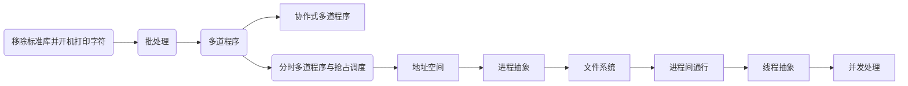
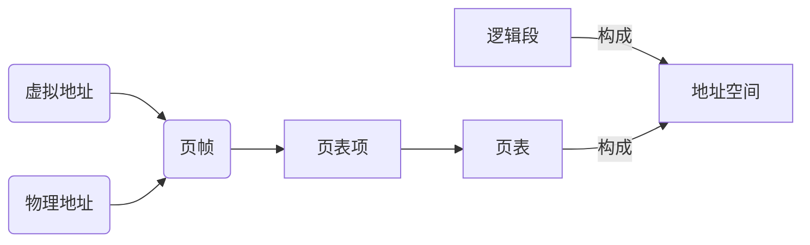

# 第一阶段总结报告

<!-- more -->

在学习`rust`的部分，基础的知识已经有所了解，因此做题的目的主要在于巩固和回顾。rustlings中包含了rust的大部分基础内容，包括

- 基础语法
- 函数
- 类型系统
- 宏
- 错误处理
- 线程
- trait
- 所有权模型与生命周期
- 各种常用集合

在这些知识中，理解较为困难的应该是生命周期部分以及各种trait对象和宏，因此后续对rust的学习可以更多关注这方面的知识。

通过第一阶段对`rCore`的学习，对操作系统整个结构和实现有了更深入的了解。整个学习的思路如下:



可以看到，整个过程是循序渐进。逐步完善的，与在操作系统课上学习的方法不同，课堂上学习OS上来就开始说进程是程序的一次执行过程，在当时学的时候可谓是一脸懵，直到把所有的知识都学习了才能大概领会到进程到底是一个什么东西，并且对计算机发展早期出现的批处理系统以及多道程序这种简单的系统了解甚少，而`rCore`从操作系统的发展来进行组织实验，对于学习来说心智负担会更小，因为是一步步进行推进，每一个实验都是前一个实验的改进和升级，直到最后成为一个和现代操作系统结构相同的系统，所以学习起来要较直接学习linux或者windows等要直观简单的多。

在第一章中，主要目标就是类似于我们平时开机一样，看到屏幕上出现了字符。而要完成这个目标就需要许多知识。

- 学习应用程序执行环境 --> 了解平时写应用程序时底层的系统到底做了什么
- 学习目标平台三元组 --> 了解编程语言对各种架构的处理器支持，在其它平台上可能会比riscv有额外步骤
- 学习RustSBI的作用 --> 了解bootloader的功能，了解riscv机器模式下做的工作
- 学习串口知识 --> 打印字符到屏幕上

第二章的目标是最原始的批处理操作系统，出现了应用程序，需要将所有的应用程序一次性加载到内存中，在操作系统的调度下逐个完成任务。

- 学习特权级机制 --> 了解M/S/U模式的区别以及内核和应用程序所处的模式
- 学习应用程序的编写 -->需要关注Rust的链接过程
- 学习二进制ABI --> 熟悉riscv的传参/如何进行系统调用
- 学习Trap上下文 --> 应用程序在用户态和内核态的运行机制不同，因此当应用程序陷入内核态后，需要保存当前应用程序的运行环境，并切换到内核态，在完成相关的处理后回到用户态
- 学习各个CSR --> 硬件在应用程序进行特权级切换时发生相应的变化，需要通过这些寄存器恢复执行状态

批处理系统中，应用程序是需要逐个加载到指定位置进行运行的。

第三章的主要目标是分时多任务，引入了时钟中断，多道程序和协作式多道程序都不能很好的支持应用程序的切换，而时钟中断的出现，可以让各个应用程序分时地共享处理器资源，带来了更好的公平性。

- 学习任务上下文 --> 了解任务上下文和Trap上下文的差别，任务上下文的切换并不会涉及特权级的变换，因此需要保存的内容要会大大减少，这里就要查看编程语言的支持以及架构手册，查找需要保存的内容
- 学习时钟中断 --> 了解中断的屏蔽机制，硬件的计数器，进行时钟中断的处理


第四章开始系统将会逐渐变得复杂，并会引入操作系统的各个主要构成部分，这一章带来地址空间的抽象，和内存管理。这章并未介绍详细的内存管理算法，提供了一个实现好的``buddy_system_allocator `使用。对于地址空间则做了详细的介绍。此后应用程序的编写就不会再受较大的限制

- 学习地址空间的出现原因 --> 在之前的系统中，应用程序是直接访问物理内存的，而这可能会导致内核代码被应用程序代码破坏，为了解决这些问题计算机硬件引入了各种内存保护/映射/地址转换硬件机制， CPU 访问数据和指令的内存地址是虚地址，通过硬件机制（比如 MMU +页表查询）进行地址转换，找到对应的物理地址
- 学习各种内存管理方式 --> 包括分段、分页、段页式管理以及他们的缺点和优点，主要内容有外碎片与内碎片。
- 学习RISC-V 64 架构提供的 SV39 分页硬件机制 --> 熟悉CSR satp的构成，MMU通过三级页表进行地址的转换
- 学习地址空间的抽象 



- 学习内核与应用程序的内存布局 -->  这里要注意内核栈与用户栈的位置，以及恒等映射机制保证了内核代码的虚拟地址与物理地址系统
- 学习跳板页的设计 --> 由于trap上下文的保存单靠`sscratch`寄存器已经无法保证不修改相关的寄存器，因此引入了跳板页设计


第五章引入了进程的抽象，在这个抽象下，应用程序不再全部加载到对应位置，而是按需加载，再一次提高了内存的有效使用，而且将相关的资源整合起来构成了`TaskControlBlock `。

- 学习进程的抽象 -->  进程是在操作系统管理下的程序的一次执行过程,其需要操作系统为之提供必要的资源并在运行时占有CPU资源，而在进程结束后，操作系统需要回收分配的资源并给下一个进程使用
- 学习fork、exec、waitpid实现

第六章引入了文件系统，将应用程序的加载再一次进行了改进，从这开始应用程序不再会被提前加载到内存中，而是根据应用名称从磁盘文件中加载。

- 学习文件系统的抽象

```
磁盘块设备接口层：读写磁盘块设备的trait接口
块缓存层：位于内存的磁盘块数据缓存
磁盘数据结构层：表示磁盘文件系统的数据结构
磁盘块管理器层：实现对磁盘文件系统的管理
索引节点层：实现文件创建/文件打开/文件读写等操作
```

第七章延续了第六章一切皆文件的思想，了解了管道和信号机制在操作系统的应用

- 学习管道的原理 --> 一次申请管道需要创建两个文件描述符，而想要实现进程通行，则需要将管道的读端和写端进行关闭，从而得到一个文件读端打开，一个文件写端打开的状态。
- 学习I/O重定向 --> 巧妙地进行文件描述符替换从而可以将内容输出到不同的文件中
- 学习信号机制 -->  在进程间进行异步通知

第八章进行了线程抽象和并发处理，引入了锁、信号量和条件变量机制。由于进程切换会带来较大的开销，并且并发粒度较大，因此出现了线程这种粒度更小的抽象。在线程出现后进程就是系统进行资源调度和分配的的基本单位，而线程则成为CPU调度和分派的基本单位。在`rCore`中线程的定义与原来的进程定义是相同的，包括线程的Trap上下文和任务上下文，因此可能还没有带来那么明显的性能提升。

- 学习用户态线程 --> 用户态线程需要人工干预线程的暂停和切换，如果线程不主动退出可能会造成调度失败
- 内核态线程 --> 需要修改线程和进程的定义，原来对进程分配资源的工作此时会对线程进行，而回收资源的工作也做了较大的改变
- 学习锁、信号量、条件变量机制
