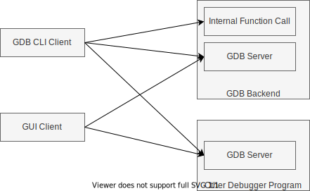
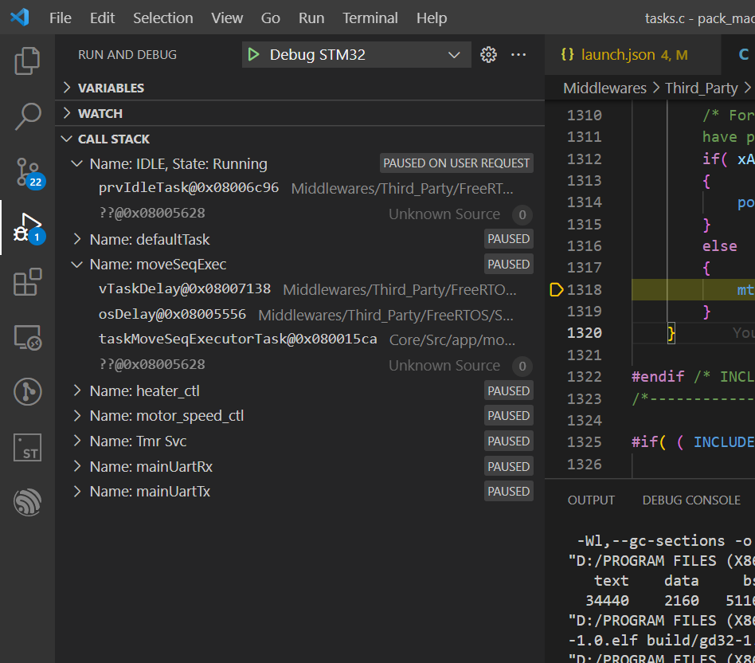
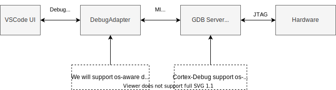

## 选题背景

第二阶段我的主要工作是参与完善陈志扬同学的操作系统调试器。之所以选择这个题目，是因为在日常工作中，工具对于提升开发人员的效率是有非常大作用的。通常大家都是使用已有的工具，而作为一个工具的开发人员，往往需要了解到比一般用户更加底层，更加细致。

<!-- more -->

## 前期准备工作

在展开具体的工作之前，花费了比较多的时间来了解IDE中调试功能的实现框架，感觉涉及到的知识点比较多，所以在这里简单总结一下，如果后续有同学想进行相关的开发，可以快速上手。

### 深入了解GDB本身及其生态

在查找各种资料，以及阅读一些开源调试器插件源码对GDB的使用之后，我得到了如下一些认知：

* GDB可以算是调试器圈子里的鼻祖，所以GDB影响着各种调试工具生态圈的发展，很多后来的可视化调试工具都是依赖GDB的，而诸如Debug Adapter Protocol这样的协议，也基本是围绕GDB所具有的功能开发的。可以说GDB基本上定义了调试工具的能力边界。
* 因此，如果你想开发一个功能，首先要去看一下Debug Adapt Protocol里面有没有对应的支持，如果已经有了，那么最好直接复用DAP协议，这样你就很容易和市面上主流的IDE进行集成，直接使用IDE内置的一些UI界面。
* GDB虽然是一个命令行工具，但其内部其实可以分为前端和后端两个大部分，前端是用于和外界交互的，后端是真正用于实现调试器功能的。这里前端的和外界的交互，不仅仅指的是命令行工具里输入的GDB命令，我们日常使用GDB输入命令的方式只是GDB支持的诸多前端的一种，还有一些方式是以RPC接口的形式存在的，这样就允许我们通过其他的程序来进行调试步骤的控制。
* 通常我们在命令行中用GDB进行本地单机调试时，GDB的前后端都在一个进程里，我们感觉不出来二者的独立存在。但是每当我们用到IDE提供的GUI界面进行调试的时候，我们其实就是抛弃了命令行形式的GDB前端，IDE的调试界面变成了GDB的前端，同时我们仅仅使用了GDB的后端部分来实现真正的调试功能。
* GDB前端和后端之间可以通过Socket等方式进行连接，这样就可以方便的实现远程调试。
* 当我们仅仅使用GDB作为后端时，我们又可以把此时的GDB后端称作GDB Server，因为这个GDB后端在等待着某一个前端交互工具连接上来。
* GDB后端和前端之间的通信协议已经是一个事实上的规范了，几乎所有主流的IDE都支持把GDB作为自己的调试后端，因此，也就有了很多其他调试器程序，他们内部也实现了GDB所使用的协议。这样，这些调试工具也就可以和这些IDE进行无缝衔接了。当然，这些调试器通常不会100%和GDB兼容，可能支持的只是GDB的一个子集，或者有一些功能是GDB的超集。
* QEMU在启动时如果加上了-S的选项，那么QEMU就会成为一个GDB Server。同样的道理，对于真实硬件调试时用到的OpenOCD、PyOCD等工具，它们实际上也是伪装成一个GDB Server的形式存在的。

### VSCode调试器插件的整体架构

VSCode的调试功能是由VSCode本身的UI、DebugAdapter、Debugger这三部分组成的，其关系图如下所示：

DebugAdapter和Debugger通常是成对出现的。由于不同的语言通常有自己专用的调试器，因此市面上Debugger的种类是非常多的(前面提到的实现了GDB Server的调试器可以认为是一大类，但是也有很多调试器没有实现GDB Server)，不同的Debugger所支持的操作也各不相同。特别是很多语言的调试器在VSCode、IDEA等IDE出现之前就已经存在了。如果想在一个IDE环境中适配多种不同语言的调试器，工作量将会很大。因此，这里引入了一个中间层用于屏蔽差异，可以通过插件的形式为每一个Debugger开发对应的DebugAdapter，这样，IDE只需要通过标准的协议和不同的Adapter通信即可，由对应的Adapter将指令翻译为某个具体Debugger能懂的指令。

在实际实施中，上述三个组件在运行时分别处于3个不同的进程，因此，三个组件之间需要使用某种RPC协议才可以进行通信。其中的UI和DebugAdapter之间使用的是一个标准的名为DebugAdapterProtocol(DAP)的协议，他的实质是一个Json-RPC协议。Adapter和Debugger之间的协议则根据不同的Debugger来决定的，以我们最常用的GDB为例，其使用了一种名为Machine Interface（MI）的协议来进行通信。

在上述3个进程中，UI和Adapter是我们需要开发编码的地方，在一个VSCode的插件中，同时会包含运行在UI进程中的代码，以及运行在Adapter进程中的代码，而且通常这两部分代码都是用的TypeScript语言编写的，所以在开发时必须搞清楚哪些代码运行在哪个进程中，以及各自代码主要负责的内容是什么。同时，在我们的插件本身的开发调试过程中，也需要分别启动两个调试器来分别调试UI进程和Adapter进程，这一段我在开始的时候也费了不少时间去找资料，所以在这里简单总结介绍一下：

* 项目代码中位于`src/frontend/extension.ts`的文件，是UI进程的入口
  * 与VSCode UI 直接交互的操作都要在这个进程中完成，例如弹出消息框、响应用户的输入命令等。
* 项目代码中位于`src/gdb.ts`的文件，是Adapter进程的入口
  * 主要负责DAP协议和调试器私有协议之间的数据翻译、数据变换工作

## 我的工作

### 1. 移除硬编码路径，可动态配置的qemu启动参数
在`launch.json`文件中支持配置`qemuPath`和`qemuArgs`两个参数，分别用于配置qemu可执行文件的路径，以及qemu的启动参数，这样，就可以在配置文件中动态调整rcore项目代码的位置，挂载的磁盘镜像等诸多参数。

### 2. 调试器插件启动入口交互的优化
最初的启动方式是首先通过按`Ctrl + P`快捷键打开命令列表弹窗，然后再命令列表中选择对应的启动命令才可以启动调试。这个流程违反了按`F5`启动调试的通用模式，交互体验并不好，用户可能会区分不清楚通过`Ctrl + P`方式启动的调试和按`F5`启动的调试有什么差别。经过修改以后，目前调试插件只能通过按F5的方式来启动，符合了绝大多数人的操作习惯。

### 3. 内存地址查看、修改功能
原有的内存查看功能只能查看固定的内存地址，并且通过一个自定义的WebView页面来显示结果，只能查看不能编辑，基本上没有实用价值，仅仅作为功能验证而存在。经过修改后的版本，可以通过输入框由用户自行填写需要查看内存地址，且借助GDB本身的符号解析能力，所填写的地址既可以是一个地址的绝对值，也可以是GDB所能够识别的symbol。此外，在显示方面，打通了DAP协议中的ReadMemory和WriteMemory两个请求类型，这样，就可以复用VSCode本身已经具有的内存调试能力，配合HexEdit插件，实现内存的读取、展示、以及在线修改。

### 4. 无关代码的移除
原有调试器项目是从另一个开源项目Fork而来的，具有很丰富但是在我们的项目中并不需要的功能。这些代码糅杂在调试器的代码中，产生了很大的噪音，对于后续一些希望介入开发的同学来说，会增大他们熟悉项目代码的难度。因此，在开发过程中，删除掉了很多无关代码，精简了项目结构。

### 5. 调整attach模式为launch模式
在原有项目中，使用本调试器时需要将`launch.json`文件中的`request`字段设置成`attach`，而实际调试器插件的行为是在调试开始时，自动启动一个新的qemu进程，并连接上去。因此从用户的角度来看，这个行为应该是`launch`，因此对相关代码进行了调整。目前调试器仅支持`launch`模式，对于`attach`模式的讨论，见*后续工作*章节。

另一方面，QEMU进程的启动，改为使用DAP协议中的runInTerminalRequest，由Adapter进程向UI进程发送runInTerminalRequest消息，然后VSCode的UI进程在收到这个消息之后会自动打开一个新的Terminal窗口并运行应用。这样的启动方式更加符合现有规范，而不是自己造轮子。

## 后续工作

此处列出了一些我本人已经规划好要做，但因为时间有限而无法完成的内容。如果有同学对相关工作感兴趣，也可以按着这个思路，认领一个功能点来继续开发。

### 多操作系统的支持
对多操作系统的支持，最简单的实现就是针对不同的操作系统，设定不同的内核边界断点。这个可以通过在`launch.json`中增加一个配置项来实现。在另一个调试器插件`Cortex-Debug`中，有一个名为`rtos`的配置字段，其实现方式可以作为参考。
引入该配置的另一个重要意义在于，后续对内核数据结构解析相关的功能，也可以通过这个配置项来决定如何解析内存数据。

### 自动定位内核边界
目前在内核边界处的断点是以源文件名和行号的形式来定位的。这也就意味着如果对应的文件发生了变化，将直接导致调试器不可用，也就是说这是另一个硬编码的问题。

解决这个问题有两种思路，一种是将内核边界断点的行号做成可配置的，用户可以在`launch.json`中指定出入口断点所在的源码文件及行号。这样做的方式是简单快捷可以实现功能，但是对用户来说并不是很友好。

另一种思路是，可以通过解析被调试的ELF文件，依据其中的调试信息，以及反汇编代码，自动定位到内核的出入口。例如可以把与`satp`有关的操作作为识别特征，用于辅助定位出入点地址。结合上述多操作系统支持部分提到的配置，可以根据用户设置的不同目标OS，使用不同的定位策略。

在最终的实现上，可以将第二种思路作为首选，同时提供第一种思路的相关配置用于备选。

### 自动跳过内核边界断点
目前由于需要在内核态和用户态切换的过程中，使用断点的形式来通知调试器地址空间发生变化，每次到达内核边界时都会导致IDE直接进入到暂停状态，比较影响用户体验。一个解决思路是在`launch.json`中增加一个名为`auto_skip_inout_point`的配置项，当其值为true时，如果发现当前暂停的位置是断点所在位置，那么Adapter可以把这个消息吞掉，并且通知GDB直接继续运行，这样VSCode本身就会认为没有发生过断点命中，调试体验会有较大提升。

### 内存数据解析
前面说了很多已经做的和可以做的，但大部分都是在外围兜兜转转，主要是一些交互、UI上的改进，和操作系统这个核心话题其实有点远了，这个内存数据解析其实才是最压轴的功能点。

目前有一个可供大家参考的调试器插件叫做`Cortex-Debug`,一个用来调试ARM处理器的调试器插件，里面集成了对rtos操作系统的支持，可以将不同线程的调用栈、线程的名称等，都列出来，如下图所示：

经过阅读它的源代码，以及周边资料的查询，有了这样的一些认知：
  * openocd、Jlink等调试器，他们本身都具备对rtos内数据结构进行解析的能力，这样，他们就可以表现为一个支持多线程调试的GDB Server。通常的IDE里都会有对多线程调试的支持（例如显示所有线程的列表、显示不同线程的调用栈等能力），如果openocd、JLink这些程序能够支持标准的GDB里面关于线程的协议，那么IDE的UI就可以毫无压力的去展示RTOS内部的线程情况。
  * cortex-debug这个插件本身貌似并没有对内核的数据进行过多的解析，实际的解析工作是通过openocd来实现的。

因此，cortex-debug这个插件的实现方式对我们来说可能没有太多的借鉴意义。（虽然这里也给出了一个方向，即把对rcore、zcore的支持放入openocd甚至qemu中，这样不需要我们对调试器插件做什么开发，就可以直接让主流的IDE支持对他们的多线程调试。）

另一个思路就是在DebugAdapter的这个层面入手，GDB Server只负责读取目标的内存即可，对内存的数据解析工作交给Adapter去操作。因为当今主流的IDE所支持的调试功能，都不会直接和背后的GDB Server对话，而是通过中间的Adapter来传递消息。因此，只要在Adapter这一层进行数据的伪造，从IDE的角度来看，就和后端调试器本身支持多线程调试时一样的。

而拦截这个消息也很简单，在DAP协议中，有`ThreadsRequest`这个请求，只要Adapter可以拦截这个请求消息，然后读取目标内存进行解析，再将解析后的线程信息返回，就可以直接让大多数IDE调试界面支持查看操作系统的进程列表了。也就是上面图片里Cortex-Debug插件实现的效果。

但是，这样做也有一些不足的地方，即DAP协议中的现成信息都是一些最基础的信息，例如线程的名字、运行状态等，但是对于某一个具体的操作系统的TCB、PCB这些数据结构，因为不同的操作系统千差万别，并没有什么标准的UI可以展示这些数据，因此仅依靠IDE自身的内置UI界面不能实现对具体数据结构的解析。这一部分，还需要在插件的UI进程里进项相关的逻辑开发，定制插件自己独有的UI显示界面。

### 支持真实硬件
为了支持真实硬件的调试，需要在Adapter进程启动后做出判断，是否需要启动qemu，还是直接连接到一个GDBServer上。 目前的实现中，只要Adapter启动，那么就一定会运行qemu。这个行为也和目前支持的`launch`调试启动求有关系。可以借助`launch.json`中的`request`字段来进行判断，当其值为`launch`时，就运行qemu，如果是`attach`,则配合其他参数链接到已有的GDB Server