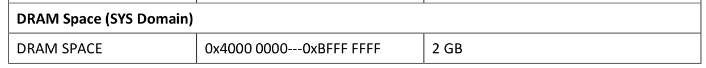

# 2022 开源操作系统训练营第二阶段总结
*2022.09 唐洪雨 RFreeRTOS*

经过2022年开源系统系统训练营的第一阶段学习，在第二阶段中我选择的课题是基于Rust语言的嵌入式实时操作系统RFreeRTOS，这是市场主流RTOS——FreeRTOS 的Rust语言实现。我的主要工作是复现已有的实验结果，进一步完善测例，并能移植到CH32V307芯片。

<!-- more -->

## 第二阶段学习内容
以下内容都是基于 Rust 语言的开发：
1. 沁恒 CH32V307 芯片的裸机开发
2. 全志 D1 芯片的 Qemu 编译、下载、运行
3. 基于 D1 的哪吒开发板的编译、下载、运行
4. RFreeRTOS 学习

## 沁恒 CH32V307 介绍
CH32V307系列是基于32位RISC-V设计的互联型微控制器，配备了硬件堆栈区、快速中断入口，在标准RISC-V基础上大大提高了中断响应速度。加入单精度浮点指令集，扩充堆栈区，具有更高的运算性能。扩展串口UART数量到8组，电机定时器到4组。提供USB2.0高速接口（480Mbps）并内置了PHY收发器，以太网MAC升级到千兆并集成了10M-PHY模块。

### 系统框图


> 类似于STM32F407，但具有更多的存储资源、外设接口，尤其是自带8路串口和10M-PHY模块，天生就为了串口服务器而生。

### MCU 裸机开发
Rust的四个核心业务场景：命令行、WebAssembly、网络、嵌入式，社区为嵌入式专门设立一个团队，为嵌入式开发做了很多约定、标准，给整个生态打下了良好的基础。

并不针对这一种芯片，而是使用 Rust 开发 RISCV MCU（单片机）的一些心得：

0. 安装交叉编译工具， `rustup target add xxx`；
1. 很多内核，嵌入式团队已经做好了基础工程，如 risv 类的就有 [riscv-rust-quickstart](https://github.com/riscv-rust/riscv-rust-quickstart)，在这类工程上进行自己使用芯片的功能添加；

2. PAC库和HAL库，前者外设访问库是裸机开发必要库，不同于C语言开发时使用的厂家SDK，PAC库利用一个工具（svd2rust）将芯片的寄存器描述svd文件转换得到，内容精准、详尽，且可以做到多家芯片代码风格统一。HAL是硬件抽象库，网友或者厂家基于PAC库实现，质量参差不齐；

3. 修改内存链接文件。根据芯片的内存布局，编写自己的链接文件；

接下来就可以编译下载了。得益于社区嵌入式团队前期设定的标准，使得不同厂家、不同平台的芯片，在开发流程上能够高度统一。

> 详细内容[单独写了一个章节](rust-based-os-comp2022-Phase2-toolchain.md)进行记录

## 全志 D1 介绍
D1-H哪吒开发板基于全志D1-H芯片设计，集成阿里平头哥RISC-V C906 CPU，主频1GHz，支持标准Linux内核，最大支持2G DDR3、258MB spi-nand、WiFi/蓝牙连接，具有丰富的音视频接口可强大的音视频编解码能力，可连接各种外设，集成了MIPI-DSI+TP接口、SD卡接口、LEDC灯、HDMI接口、麦克风子板接口、3.5mm耳机接口、千兆以太网接口、USB HOST、Type-C接口、UART Debug接口、40pins插针阵列等，可以满足日常科研教学、产品项目预研、开发爱好者DIY的需求。

### 系统框图


更适合做一些视频相关的商用嵌入式产品。

### Qemu 模拟开发环境搭建
在高性能芯片上做开发时，为了方便测试、验证，往往需要先在 Qemu 模拟环境下跑通编译、运行，再做进一步适配，然后下载到实体开发板中测试、验证。RFreeRTOS 项目同样如此，支持 Qemu 内运行。

* 工具链安装。主要是 `nightly` 版本，RFreeRTOS 使用到的部分 crate 还未完全稳定，为了方便将 `nightly` 设为默认编译环境。另外，RFreeRTOS 支持 RV32 和 RV64，分别安装各自的 none-elf 交叉编译工具。

* 编译、运行、调试。在 `./makefile` 已经写好了相关命令，`build`对应编译、`run32`、`run64`对应直接启动运行，`debug`对应编译并以调试模式启动qemu，`remote`对应挂载gdb调试客户端。

* 运行结果。通过查看 `main.rs` 内容，可以看到共创建了两个任务，优先级分别为 `3` 和 `2`，两个任务都会有运行日志输出，高优先级内有 100ms 延时函数，观察运行结果，符合预期：
``` bash
...
low priority task running 
low priority task running 
after delay:pxPreviousWakeTime=42400
high priority task running 
low priority task running
...
low priority task running 
after delay:pxPreviousWakeTime=42500
high priority task running 
low priority task running
...
```

### Nezha 物理开发环境搭建
* 编译工具。从芯片官网 [occ.t-head.cn](https://occ.t-head.cn/community/download) 下载工具链 `Xuantie-900-gcc-elf-newlib-x86_64-V2.6.0-20220715.tar.gz`，解压后将 `bin` 目录添加到环境变量；

* 下载工具：xfel。全志的芯片大多支持fel模式，普通的 `fel` 工具不支持 riscv 芯片，需要使用新版本 [`xfel`](https://github.com/xboot/xfel)，按照 [文档说明](https://github.com/xboot/xfel/tree/master/docs/zh-cn#%E7%BC%96%E8%AF%91%E5%AE%89%E8%A3%85) 进行安装；

#### 编译、运行、调试
* 执行 `make build` 进行编译，得到 `RFreeRTOS_Image` 固件；
* 按住开发板上 `fel` 按键上电，是芯片进入 `fel` 模式；
* 执行以下命令完成下载并执行：
``` bash
sudo xfel ddr d1
sudo xfel write 0x40000000 RFreeRTOS_Image
sudo xfel exec 0x40000000
```

> 关于下载地址 `0x4000_0000` 后续会有详细说明。

#### 运行结果
原代码的输出结果较混乱，这是简单修改后的结果：


## RFreeRTOS 介绍
FreeRTOS 是一款嵌入式实时操作系统，主要用于微控制器和小型微处理器，是工业上使用最广泛的实时操作系统。RFreeRTOS 是其 Rust 实现。

| 核心函数 | 作用 |
| --- | --- |
|vTaskEnterCritical()|进入临界区|
|vTaskExitCritical()|退出临界区|
|vTaskStartScheduler()|启动调度器|
|xTaskCreate()|创建任务|
|xTaskCreateStatic()|静态创建任务|
|vTaskSwitchContext()|切换上下文|

* 进入临界区的简单处理就是关中断并记录进入次数，退出临界区时检查次数，0时打开中断

现阶段实现的组件有：内存分配、事件组、队列。

### 启动流程
通过查看用户手册，D1支持的启动方式有：On-chip Memory、SD card、eMMC、SPI NOR Flash、SPI NAND Flash，但这些方式本项目中暂时都用不到。通过查看用户手册，DRAM 映射在 `0x4000_0000` 地址：


编写链接脚本，将所有段都输出到此地址，然后在`fel`模式中通过`xfel`工具将固件加载到此地址，再从此地址执行。

查看启动文件，程序的启动流程为：


### 任务切换
一个任务即一个函数，每个任务都有自己的栈空间和内核寄存器的备份，需要运行哪个任务，只需要将当前的内核寄存器保存下来，并更新成新任务的内核寄存器，这就是运行时上下文切换，即可完成任务切换。

内核寄存器除了通用寄存器，还有 `mstatus` 和 `mepc` 寄存器，其中 `mstatus` 中含有中断使能控制位，而 `mepc` 为M模式下异常程序指针寄存器，其值会更新给 `PC` 寄存器，不像ARM架构中 `PC` 寄存器暴露在通用寄存器中可以直接操作，RISCV 正是通过设置 `mepc` 寄存器的值来控制程序运行的切换。

任务切换主要在 `vTaskSwitchContext()` 中完成，内部工作是：
* 从就绪队列中选择优先级最高的任务
* 将其TCB赋给全局TCB变量
* 将全局TCB内容更新至内核寄存器
* 更新 `sp`、`mepc` 实现新任务运行

#### 任务列表
- READY_TASK_LISTS
- DELAYED_TASK_LIST
- OVERFLOW_DELAYED_TASK_LIST
- SUSPENDED_TASK_LIST
- PENDING_READY_LIST

#### 任务控制块
``` rust
pub struct tskTaskControlBlock {
    ///Stack top pointer
    pub pxTopOfStack: StackType_t_link,
    ///Stack bottom pointer
    pxStack: StackType_t_link,
    ///Task name
    pcTaskName: String,
    ///Task status list pointer
    pub xStateListItem: ListItemLink,
    ///Task evnet list pointer
    pub xEventListItem: ListItemLink,
    ///
    pub uxCriticalNesting: UBaseType_t,
    /// Task priority
    pub uxPriority: UBaseType,
    pub uxMutexesHeld: UBaseType,
    pub uxBasePriority: UBaseType,
    /// mark for ffi
    pub build_from_c: bool,
}
```

### FFI 接口
FFI 即 Foreign Function Interface 是一种机制：用一种编程语言写的程序能调用另一种编程语言写的函数。

FFI 有两种内函：一种是在当前正在使用的语言（Host）中，调用由其它语言（Guest）提供的函数；另一种是则相反，当前语言（Host）写的函数，供其它语言（Guest）调用。支持后者的语言很少，本项目使用的 Rust 和 C 属于两种都支持的语言。

在刚开始时，我以为本项目属于后者，由 Rust 编写的内核函数，供 C 语言写的测例调用，直到最近在进一步了解项目后才知道恰恰相反，原作者因为一些问题未能实现，还是由 Rust 语言调用 C 语言的测例。

项目中有大量 `pub extern "C" fn main_rust() -> ! {}` 和 `extern "C" {}` 这样的代码，给代码的阅读和修改带来一定的麻烦，我也正是卡在这里很久，还需要时间来理解。


## 个人感想
这个月过的意外的充实，从各个方面：生活、工作、个人发展上来讲都是一段难忘的经历。参加此次训练营活动，主要的目的是看好Rust这门语言，想要进一步练习、掌握，以及对操作系统的强烈兴趣，想要深入学习各中意义上的操作系统。

虽然第二阶段的内容完成度不高，但就Rust和操作系统上的收获还是巨大的，另外，利用碎片时间将《Rust 实战》一书阅读了70%左右，rCore Tutorial 文档前4章结合代码重新温习了一遍，还冲了一块 VisionFive 星光2代板。可以说对 Rust、RISCV、OS，始终保持高度热情，活动虽然结束，但学习的节奏不停！
