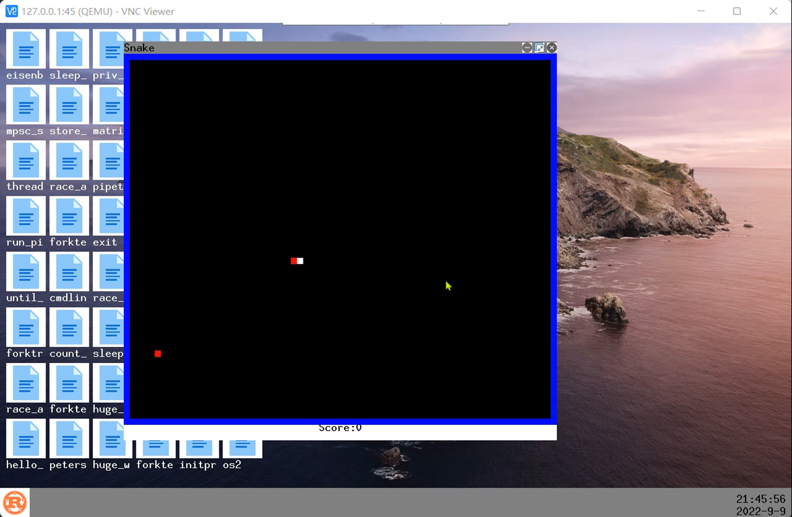
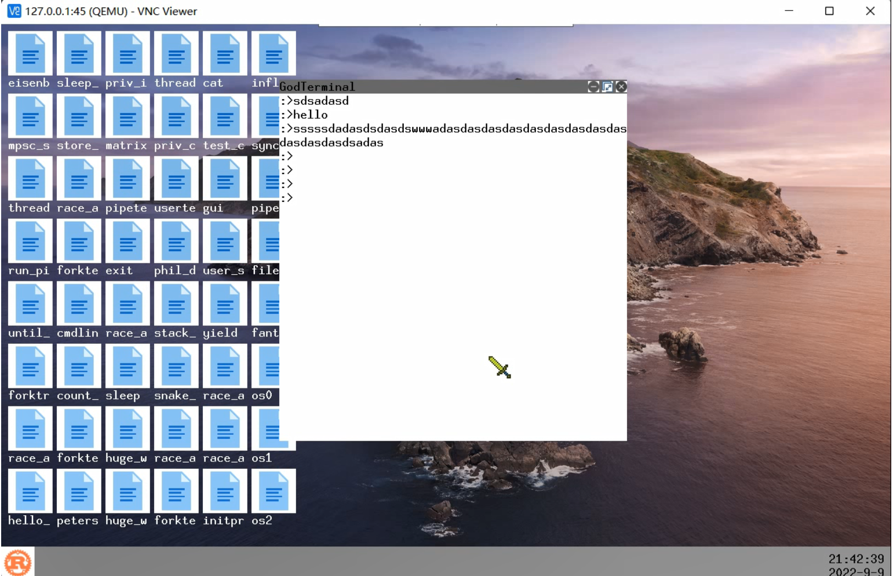

[repo](https://github.com/Godones/rCoreloongArch)

​		在第二阶段的活动中，我选择的是rCore的进一步扩展，因为时间与rCore移植比赛的重合性，我选择了在完善移植工作并结束比赛后才进一步做扩展相关的工作，因此可能对于扩展部分的改进不是很多。

<!-- more -->

# rCoreloongArch

### 项目介绍

- 操作系统比赛功能赛道题目之一

- 目标平台: loongArch64

- 项目内容: 移植教学操作系统到目标平台上

- 发起者: 龙芯中科公司

### 项目难点

- loongArch平台在2021年推出

- 缺乏相关资料

- Rust对其支持还不够完善

​		loongArch是第一个国产自主指令集架构，有龙芯中科公司在2021年推出，其属于RISC指令集，因此在指令结构和功能上与MIPS、RISC-V等类似，但其也具有一些特殊的地方。在移植一个操作系统到一个新的平台上时，需要综合考虑是否具有完整的工具链，是否有详细的架构说明，是否有模拟的平台或者真实的硬件平台，对于loongArch来说，尽管不是所有的条件都非常完备，但工具齐全，因此移植工作是可行的。

​	对于移植工作，整体的过程与rCore中每一章节相同，其终极目标就是使得rCore的每一章代码都可以在loongArch平台上成功运行。其主要的节点如下

- 编译环境配置
  - loongArch64的Rust交叉编译工具链
  - loongArch64的gcc交叉编译工具
- 裸机启动
  - 熟悉loongArch平台的启动流程 RISC-V: RustSBI – loongArch:UEFI
  - 启用UART串口打印字符在终端上
- 特权级架构(涉及到大量CSR寄存器)
  - 划分用户态与内核态
  - 中断异常处理
  - 应用程序二进制接口ABI
  - 任务切换需要使用的被调用者保存寄存器
- 地址空间
  - loongArch的存储管理
    - 物理地址空间与虚拟地址空间
    - 地址翻译模式
      - 直接地址翻译(未启用页表之前使用，VA=PA)
      - 直接映射地址翻译(内核代码所处的区间使用，VA=PA,但用户程序无法访问)
      - 页表映射地址翻译(用户程序使用)
  - 三级页表实现
    - loongArch软件填页表,RISC-V硬件填页表
    - 修改rCore中地址空间的实现
    - 完成关于页表异常的处理(主要是重填异常/页修改异常)
- 进程/线程
  - 由于地址空间的差异性导致的内核栈与用户栈的差异
  - 跳板页的移除和特权级切换的简化
- 外部设备
  - PCI总线设备探测
  - SATA设备读写硬盘
  - 键盘与鼠标中断/loongArch外中断系统
- 其它
  - 内核栈回溯工具（loongArch+risc-v版本）
  - VBE简单图形显示(目前把rcore中第九章的gui也加入了)
  - 指导手册

## 关于loongArch的未来工作

​		虽然目前rcore的九章代码几乎可以在loongArch上运行，但关于loongArch的外中断系统仍然需要改进，由于缺乏资料支撑，这方面可能会存在错误，这是改进之一，对于Rust来说，loongArch相关的库仍然几乎没有，如果想要开发者使用rust在loongArch上开发，可能需要进一步提供更多支持。因此在后续对loongArch的工作可能会包含下列事项:

- [ ] 将loongArch手册转换为rust库，包括指令集手册、3A5000手册、7A1000桥片手册(正在进行)
- [ ] 外中断系统的完整使用规范

# rCore中的一点学习和改进

​	在完成上述所说的rCore龙芯平台移植后，就进入到了rCore的进一步扩展中，由于时间仓促，完成的工作不是很多。主要完成的工作如下:

- 内核支持读取设备树
  - 将设备信息保存下来
  - 自主选择设备的初始化
- 外部设备
  - 添加了RTC实时时钟支持
- GUI
  - 丰富组件，更正错误
  - 图标正确显示
  - 添加任务栏
  - 以window建立窗口
  - 新的Terminal
  - 贪吃蛇小游戏

# 总结

​		参加此次训练营，一方面可以帮助我完成rCore的移植工作，一方面也可以学习其他人非常不错的想法，虽然没有在GUI的工作上做到更好，但好歹完成了移植工作。在接触了这么多有关操作系统相关的东西后，也更加坚定了以后走操作系统这条路的决心。

​		
