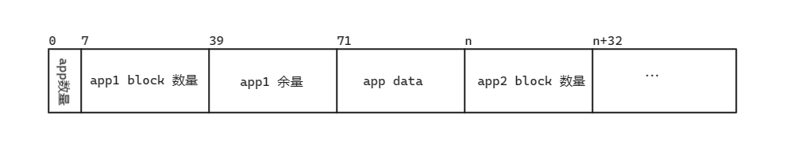

# 2023秋冬季开源操作系统训练营第三阶段总结报告

## 练习一、二

### 练习要求

练习 1：    
main 函数中，固定设置 app_size = 32，这个显然是不合理甚至危险的。    
请为 image 设计一个头结构，包含应用的长度信息，loader 在加载应用时获取它的实际大小。    
执行通过。        
练习 2：    
在练习 1 的基础上，扩展 image 头结构，让 image 可以包含两个应用。    
第二个应用包含唯一的汇编代码是 ebreak 。     
如实验 1 的方式，打印出每一个应用的二进制代码。    

### 实现过程
根据练习一、二的要求设计 image 结构如下图所示。



image 文件中的首 0-7 的字节用于存放 'app 数量'，用以告诉加载器整个 image 中包含有多少个 app。后续的内容以 'app 数量' 个的 app 结构块组成，每个 app 结构块 的首个 32 字节存放当前 app 的块数量，第二个 32 字节存放不满足块大小的 '余量'。    
'app 块大小' 默认定义为 1024 ，即一个块大小为 1024 字节。app 的 '块数量' 则为 'app 二进制文件大小除以 app 块大小'。'余量'定义为不满足一个块大小的剩余长度，表示为 'app 二进制文件大小除以 app 块大小的余数'。
跟据上述的定义，将 app 二进制文件修改为以 '.app' 后缀结尾的文件，依托于 rust 的构建脚本 build.rs 查找指定目录下的 app 文件，生成上述格式的 image 文件，同时使用 dd 命令完成文件合并，需要保证 * pflash 文件必须为 32MB 大小*。  
后续在 loader 中完成对 image 的解析，并在 app 需要执行时将 app 字节码内容拷贝到指定地址后，跳转到相应地址执行 app 内容。 app 结构定义 如下：
```rust
struct App<'a> {
    size: u32,	    size: usize,
    code: &'a [u8],	    code: &'a [u8],
}
```

## 练习三

### 练习要求

练习 3：    
批处理方式执行两个单行代码应用，第一个应用的单行代码是 nop，第二个的是 wfi。

### 实现过程
根据上一节的练习添加第二个应用，在第一个应用执行完成后并没有返回到 loader 执行下一个下一个应用，根据调试分析，在第一个应用中并没有返回到 loader 的相关代码，需要添加添加相关代码才能返回到 loader 执行下一个 app。在每个 app 的代码中添加 'ret' 指令，并删除 'options(noreturn)' 以及函数的 '永不返回' 标识 '!'，以完成在 app 执行结束后跳转回 loader。同时在构建 image 的时候需要注意 app 的顺序。

```rust
#![no_std]
#![no_main]

use core::panic::PanicInfo;

#[no_mangle]
unsafe extern "C" fn _start() {
    core::arch::asm!(
        "
        nop
        ret
        "
    )
}

#[panic_handler]
fn panic(_info: &PanicInfo) -> ! {
    loop {}
}
```

## 练习四

### 练习要求

练习 4：    
本实验已经实现了1 号调用 - SYS_HELLO，2 号调用 - SYS_PUTCHAR，请实现 3 号调用 - SYS_TERMINATE 功能调用，作用是让 ArceOS 退出，相当于 OS 关机。

### 实现过程
仿照 SYS_PUTCHAR 的实现，调用 axhstd 提供的 exit 函数完成相关功能个即可。

## 练习五

### 练习要求

练习 5：    
按照如下要求改造应用 hello_app：

1.把三个功能调用的汇编实现封装为函数，以普通函数方式调用。例如，SYS_PUTCHAR 封装为 fn putchar(c: char)。   
2.基于打印字符函数 putchar 实现一个高级函数 fn puts(s: &str)，可以支持输出字符串。      
3.应用 hello_app 的执行顺序是：Hello 功能、打印字符串功能、退出功能。

### 实现过程
根据实验文档，ABI_TABLE 的基地址保存在 a7 寄存器中，在进入 app 时将 a7 寄存器的内容保。同时将 ABI 函数的调用逻辑封装为函数 'abi_call'，需要注意使用 'clobber_abi("C")' 完成对寄存器的保存，同时指定 app 的 链接文件，以指定字符串存放位置。

```rust
/// abi 调用函数
unsafe fn abi_call(addr: usize, abi_num: usize, arg0: usize) {
    core::arch::asm!("
        mv      a7, {abi_addr}
        mv      t0, {abi_num}
        slli    t0, t0, 3
        add     t1, a7, t0
        ld      t1, (t1)
        jalr    t1",
    abi_addr = in(reg) addr,
    abi_num = in(reg) abi_num,
    in("a0") arg0,
    clobber_abi("C")
    )
}
```

## 练习六

### 练习要求
练习 6：    
1.仿照 hello_app 再实现一个应用，唯一功能是打印字符 'D'         
2.现在有两个应用，让它们分别有自己的地址空间。      
3.让 loader 顺序加载、执行这两个应用。这里有个问题，第一个应用打印后，不能进行无限循环之类的阻塞，想办法让控制权回到 loader，再由 loader 执行下一个应用。   

### 实现过程
在练习五的基础上，仿照 'hell_app' 实现另一个 app，同时需要避免 app 中的 'wif' 和无限循环等阻塞操作，避免不能返回 'loader' 执行下一个 app。


## 总结
本次实验和练习加深了我对操作系统的理解，同时也学习了组件化操作系统 unikernel 的相关知识、对 qemu 的使用更加熟练的同时也学习了 pflash 相关的知识。对 rust 的嵌入式汇编及相关知识的掌握更加深入。同时也感谢各位老师的对本次课程的知识讲解，也感谢各位同学在群里提出的的问题以及解决方案。


