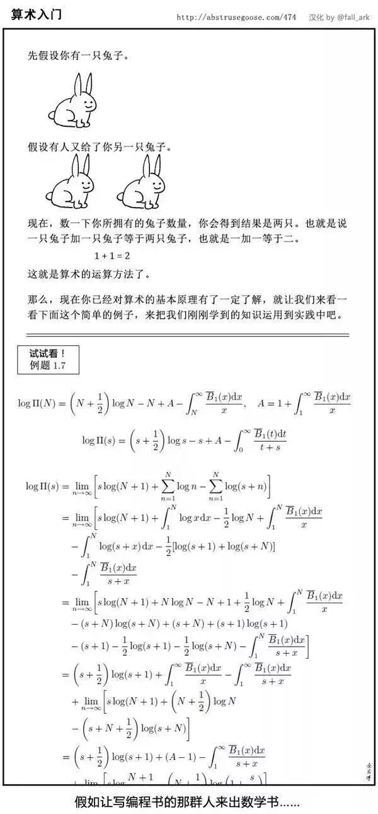

# 2023秋冬季开源操作系统训练营总结
## 一些碎碎念
我是一个普通的大三学生，目前就读于厦门大学计算机科学与技术系。不得不吐槽一下学校的课程设置，从本学期（也就是大三秋季学期）开始才开设计算机组成原理、计算机网络、汇编语言等计算机专业课程，至于操作系统、编译原理、计算机系统结构等等直到下个学期才会开设。当然也许学校的课程安排也有他的道理，现在慢慢意识到以前觉得又难又没有意义的课，比如说模拟电子技术、数字电子技术、计算方法等，这些课在现在的学习中或多或少都有涉及到，然后学起来甚至有点亲切感（）。
## 前言  
言归正传，相比于计算机专业的其他课程，我最感兴趣的应该就是操作系统了。虽然说也说不出来原因，也许是因为**操作系统**四个字看起来比较高级（？），在平常没事做的时候就自学了一遍学校的课程，通读过**操作系统导论**和**现代操作系统**两本书，但是一切都仅局限于理论层次上，一直真正实际动手设计一个操作系统。这里不得不提到MIT的6s081,曾经试着做了一点点lab，但是因为各种原因，只开了个头就弃坑了。一次偶然的机会了解到了清华大学开源操作系统训练营，遂欣然报名。
## 一阶段
一阶段的任务主要是熟悉一下Rust的语法，通过rustling对Rust有了个初步的认识。（虽然于我个人来说好像并没有多大作用...该看不懂的还是看不懂...） 也算蛮顺利地完成了，为之后的学习增加了很多的信心。
## 二阶段
二阶段相当的煎熬。

>你已经熟悉了Rust的基本语法啦，现在请你动手用Rust搓一个OS出来。

对，差不多就是这种感觉。

整个的学习过程就差不多是，道理都明白，但是无从下手。比如说这个函数要加在哪个文件里，这里要干什么，unwrap是什么,..........，rust-analyzer真是帮了很大的忙就是说。   
然后不出意料地卡关了，而且还适逢期中考试周，研究了两三天没什么成果后就弃坑去复习期中考试的内容了。考试结束后又重新捡起来看，发现之前悟到的那一点点东西也差不多全忘了。。。

在群里潜水看大佬们的讨论，才发现原来有 [rCore-Tutorial-Guide-2023A](https://learningos.cn/rCore-Tutorial-Guide-2023A/) 这个详细的指导书存在... 整个知识结构比适用于本次训练营的精简版清晰了不要太多。于是从头把到第五章为止的指导书阅读了一遍，感觉之前很多疑惑的问题在心里都有了答案（虽然也理解的不是很透彻）。  
至于编程题的代码，啊作为Rust的初学者真是相当的头疼...于是到处借鉴了大佬们的代码，在大佬们的大框架下结合自己的想法进行修改，感受就是：哦原来这个在rust里应该这样写。

勉勉强强算是把二阶段完成了，回头思考二阶段的三个lab真是有轻舟已过万重山的感觉，一切都显得那么合理，但是让我从零开始写真是相当困难的一件事。也许原因是对Rust还不够熟悉吧，下一阶段的学习目标是把Rust系统的学习一遍。
## 三阶段
个人觉得达不到二阶段的考核要求，因此对于三阶段不抱什么希望，而且就算是参加了感觉也够呛能完成...  

## 总结
感谢清华大学提供的这样一个学习机会，相比于我本科学校的纯理论教学，rCore和uCore属于是降维打击了，本次训练营的学习开拓了我的视野。有机会的话我会继续参加明年的训练营，希望在明年的时候能够以一个强大的自己来完成训练营的训练项目。