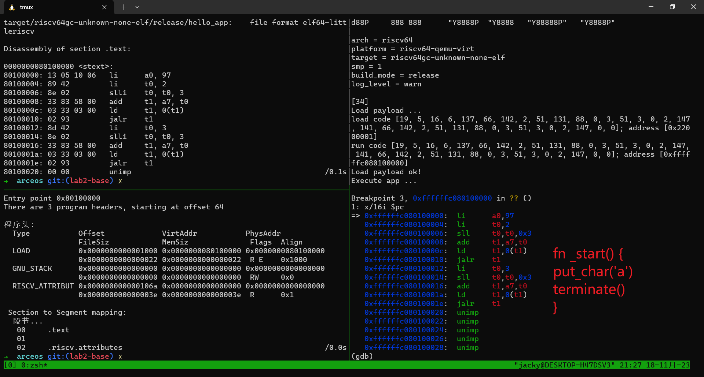
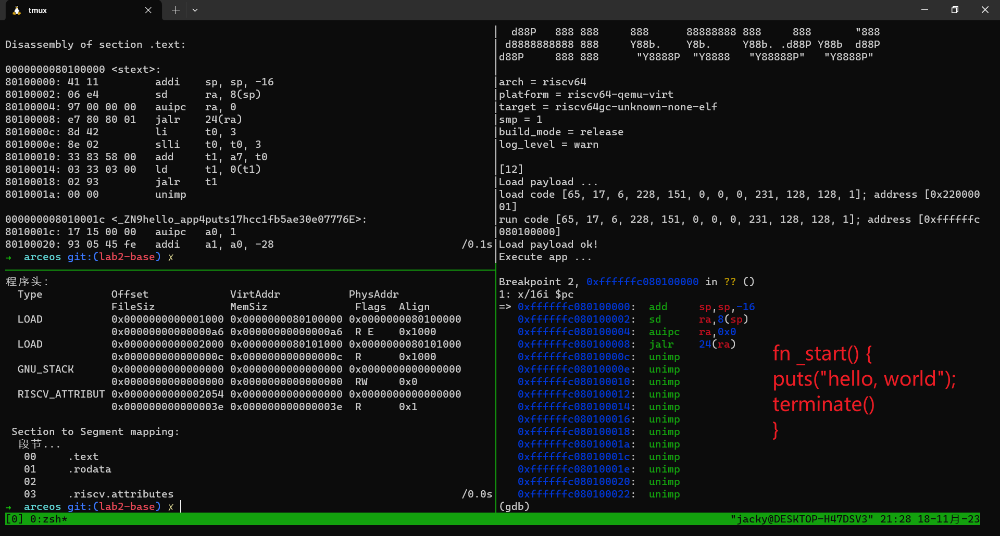

# 总结报告

## 逐练习报告

### 练习1：获取镜像大小，使loader能够根据对应信息能够自动识别文件大小

> main 函数中，固定设置 app_size = 32，这个显然是不合理甚至危险的。
请为 image 设计一个头结构，包含应用的长度信息，loader 在加载应用时获取它的实际大小。

一开始想要尝试类似于rcore中在链接脚本的特定位置保存数据并且通过build.rs脚本获取对应镜像大小然后再写入到链接文件中去的方法。

后面想到这个方法会因为相互依赖问题而不容易解决，最原初的设想在于类似rCore的处理方案，在原初的链接脚本中保存一个位置用于存储应用程序大小，后面在loader中对于这个段的数据进行获取，但是这部操作实际上是需要在链接的时候完成的，即我还不知道最终生成的二进制文件的大小就要将其写入进去。（后面想了下可能还可以在外面手动修改这个段，但是有点麻烦了就没有使用）。

在与邝劲强同学进行沟通的时候，发现其实可以用相对来说更加简单的方法来实现这个效果，即通过一个脚本实现了对于镜像文件大小的获取以及自动将代表对应文件大小的bin文件加载到对应的位置。这个地方特别感谢邝劲强同学分享的有关 `dd` 会相互覆盖，可以使用 `seek` 跳过一段的信息。

```bash
APP_BIN_SIZE=$(stat -c%s "./hello_app.bin")
echo $APP_BIN_SIZE
printf "%04x" $APP_BIN_SIZE | xxd -r -p > ./size.bin

# Using Zero to fill the block to 32M(32Times, one times for 1M)
dd if=/dev/zero of=./apps.bin bs=1M count=32
# Add origin app into the end of the file (not cover)
dd if=./size.bin of=./apps.bin conv=notrunc       bs=1B seek=2
dd if=./hello_app.bin of=./apps.bin conv=notrunc  bs=1B seek=4
mv $BASE_DIR/hello_app/apps.bin "$BASE_DIR/apps.bin"
```

### 练习2： 拓展`image`头结构，使之可包含两个应用。

通过对于 `hello_app` 的简单拷贝，可以实现第二个应用，这一步主要是在一开始的基础上拓展了头结构，但是由于这里没有提供对于更多应用程序的支持以及通过函数返回了文件大小埋了个坑（后面会提到）。

```bash
# Input: The Name of Directory
# Output: The size of the binary image
function generateBinrary() {
  # Create Binrary
  echo $1
  cd "$BASE_DIR/$1"
  echo `pwd`
  cargo build --target riscv64gc-unknown-none-elf --release
  # remove symbol information
  rust-objcopy --binary-architecture=riscv64 --strip-all -O binary ../../target/riscv64gc-unknown-none-elf/release/$1 ./$1.bin

  # return size
  return $(stat -c%s "./$1.bin")
}

cd $BASE_DIR
hex1=$(printf "%02x" $hello_app_size)
hex2=$(printf "%02x" $hello_ebreak_size)
hex="$hex1$hex2"
echo -n $hex | xxd -r -p > size.bin
```

### 练习3：批处理形式运行两个单行代码应用 `nop` 和 `wfi`

这里有个小问题就是需要修改原始代码中给出的 `-> !` 和 `options(noreturn)` 标志，以避免出现没有办法返回的情况。

这个地方实际上实现的批处理并不是真正意义上的批处理，我在复用之前代码的时候出错了，这个问题在 [lab2.5-commit](https://github.com/jackyliu16/arceos/commit/5d04c0dc33070d22fbbf08346e902bb04c562af4) 中得到了修复。

以下是当时提交的实现，基本上就是对之前的代码的直接复用。
```rust
let apps_start = PLASH_START as *const u8;
let byte = unsafe {
  core::slice::from_raw_parts(apps_start, size_of::<u16>())
};
let app_size_1 = u8::from_be_bytes([byte[0]]);
let app_size_2 = u8::from_be_bytes([byte[1]]);
println!("size 1: {app_size_1}, size 2: {app_size_2}");

println!("Load payload ...");

println!("sizeByte: {byte:?}");

let read_only_app1 = unsafe {
  core::slice::from_raw_parts(apps_start.offset(size_of::<u16>() as isize),
  app_size_1 as usize
)};
let read_only_app2 = unsafe {
  core::slice::from_raw_parts(apps_start.offset((size_of::<u16>() + app_size_1 as usize) as isize),
  app_size_2 as usize
)};

// println!("content: {:?}: ", code);
println!("Load payload ok!");

println!("Copy app ...");
let load_start = LOAD_START as *const u8;

// load app 1
let load_app_1 = unsafe {
  core::slice::from_raw_parts_mut(load_start as *mut u8, app_size_1 as usize)
};
let load_app_2 = unsafe {
  core::slice::from_raw_parts_mut(
    load_start.offset(app_size_1 as isize) as *mut u8, 
    app_size_2 as usize)
};

// Copy App Data From ReadOnly Areas
load_app_1.copy_from_slice(read_only_app1);
load_app_2.copy_from_slice(read_only_app2);
```

### 练习4：实现 `SYS_TERMINATE` 

这个练习没什么好说的，直接添加 `arceos_api` 然后再加到符号表里面实现一下功能就可以了

```rust
fn abi_terminate() -> ! {
    println!("[ABI:TERMINATE]: Shutting Down !!!");
    arceos_api::sys::ax_terminate();
}
```

### 练习5：改造应用 `hello_app`

在完成实验五的时候主要出现了几个超出意料而且有点摸不着头脑的情况，包括但不限于`a7`寄存器被修改，莫名其妙的镜像文件截断，主要的修复细节可以参考 [批处理修复](https://github.com/jackyliu16/arceos/commit/5d04c0dc33070d22fbbf08346e902bb04c562af4)，[多道程序支持](https://github.com/jackyliu16/arceos/commit/724adc85d0d928c3c5660fd4531fcf8ab3fbff7d)，[返回值错误修复](https://github.com/jackyliu16/arceos/commit/d22cd5eb32497326a197e7d4a8279a1cfb74358e)，[拷贝错误修复](https://github.com/jackyliu16/arceos/commit/4809df00a75668b51f058438f8f5d2f1b2ce506e)，[寄存器错误修复](https://github.com/jackyliu16/arceos/commit/c2ecc350cd360186c623a7338497fb72e4f3ff39) 等具体 `commit`。

本任务的主体部分实际上与之前的`exec2.4`没有什么特别的差异，主要的难点在于`puts`的实现实际上调用了迭代器的功能，同时这还牵涉到由于字符串实现中&str的链接问题。

1.由于在操作中使用了字符串，但是字符串被放置在`rodata`段，在默认链接情况下`rodata`段实际上位于`.text`段前面，这会违背我们以装载地址作为应用的起始运行地址的想法（jalr LOAD_ADDRESS）【在起始部分有一大串0】

因此，需要手动实现一个类似的链接脚本（本处直接采用了rCore之前使用的链接脚本进行替代），添加`build.rs`编译脚本，给cargo添加了rust-args参数以选择我们自己做的链接脚本对于`hello_app`包进行链接。此处特别鸣谢赫森同学在群里分享的有关信息。

2.在修改了链接脚本之后仍然会出现神奇的报错信息，经过修改 `MakeFile` 运行 `debug` 之后发生产生这个情况的原因在于程序的二进制文件被异常截断了，同时出现很神奇的文件大小不增反减的情况（如下图）。






这跟我之前exec2.2实现的那个函数有直接的关联，或者说主要的问题就处在我使用的这个函数这里。

```bash
# exec 2.2 实现的函数
function generateBinrary() {
  # Create Binrary
  echo $1
  cd "$BASE_DIR/$1"
  cargo build --target riscv64gc-unknown-none-elf --release
  rust-objcopy --binary-architecture=riscv64 --strip-all -O binary ../../target/riscv64gc-unknown-none-elf/release/$1 ./$1.bin

  # return size
  return $(stat -c%s "./$1.bin")
}
```

王瑞康同学指出我的脚本代码中实际存在缺陷，问题主要出在我这个地方是通过bash函数的返回值来实现对于镜像文件大小的获取，但是实际上这个地方由于bash函数返回值限制在0~255位， 当添加了&str之后的镜像文件大小实际上达到了将近4110，则会面临取模截断的情况，在这样情况下4110 % 256 = 13 最终导致了实际上只有13个字节的数据被成功加载到内存中来，最终导致了代码出现异常的截断情况。

针对于这个情况，主要修复的方案在于通过echo + result=${}，外加事先转换成为十六进制。

```bash
# Input: The Name of Directory
# Output: Hex Size of Binary 
function generateBinary() {
  # echo "====================" $1 "===================="
  # Create Binrary
  cd "$BASE_DIR/$1"
  cargo build --target riscv64gc-unknown-none-elf --release
  # remove symbol information
  rust-objcopy --binary-architecture=riscv64 --strip-all -O binary ../../target/riscv64gc-unknown-none-elf/release/$1 ./$1.bin

  echo "$(stat -c%s "./$1.bin" | xargs printf "%04x")"
}
```

3. 在调试完成上述问题之后发现，在当前情况下仍然出现了 `panic`，经过调试之后发现，主要问题出现在 `a7` 寄存器被擦写。

针对于这个问题，在之前的练习四多次调用同一个函数的时候也回出现类似的错误，当时进行修复的主要是在函数调用末尾添加了`unsafe { core::arch::asm!("ld    a7, {}), sym ABI_TABLE}`，在每一个可能使用到 `a7` 寄存器的地方手动添加一次寄存器，但是在使用迭代器的情况下，这种简单的处理方法并不奏效。根据群里面王瑞康同学分享的`clobber_abi("C")`，在应用程序调用`asm`的时候添加了这个操作就可以保持寄存器不变。

### 练习5：代码重构

练习五的时候由于接受了赫森和邝劲强同学有关于当前脚本不能很好的适应多道程序加载的建议（裱糊匠操作太多），对于原先的脚本进行了重构，重构后仅需要以字符串形式在脚本中添加对应的应用名称，就可以自动将应用生成二进制文件放到一起。
```
// 注：这个地方实际上搞错了PFLASH的具体位置，但是懒得改了
# PFLASH 32M ]
# PFLASH 32M ] [ NUM_OF_IMAGE ]
# PFLASH 32M ] [    u16:2B    ] [ BYTE_LIST:4B*NUM_OF_IMAGE ] 
# PFLASH 32M ] [     2B + 4B * NUM_OF_IMAGE                 ] [  ] [  ] [  ] 
```

这段主要实现的交过类似于前文中所实现的，具体包括生成应用程序脚本并且通过objcopy去除其中非必要的信息，通过echo的方式传递对应的数据。
用下文中的for循环包裹上面的这个函数，实现了将对应的app_name, app_size等数据保存在bash一维数组中的效果（方便后文调用）
```bash
for name in "${app_names[@]}"; do
  echo name: $name
  app_size=$(generateBinary $name)
  app_sizes["$name"]=$app_size
  link+=${app_size}
  NUM_OF_IMAGE=$(expr $NUM_OF_IMAGE + 1)
done
```

根据上面获取到的对应size信息，自动生成有关于num和size的数据，并且分别生成十六进制二进制文件合并到原先的PFALSH空间中。

```bash
cd $BASE_DIR
printf "%02x" $NUM_OF_IMAGE | xxd -r -p >num.bin # NOTE: not allow app > 255
echo -n "${app_sizes[@]}" | xxd -r -p > size.bin
echo "size.bin size: $(stat -c%s "./size.bin")"

dd if=/dev/zero   of=./apps.bin              bs=1M count=32
dd if=./num.bin   of=./apps.bin conv=notrunc 
dd if=./size.bin  of=./apps.bin conv=notrunc bs=1B seek=2
```
然后，根据上文中保存的对应数据，自动生成其他的，涵盖包信息的二进制文件，并且逐个合并到前面的空间中。

```bash
start_offset=$((2 + 4 * $NUM_OF_IMAGE)) # NUM_OF_IMAGE:2B + IMAGE_SIZE:4B * NUM_OF_IMAGE
echo "start_offset" $start_offset
for ((i=0; i<${#app_names[@]}; i++)); do
  app_name=${app_names[i]}
  app_size=${app_sizes[i]}
  dd if="$BASE_DIR/$app_name/$app_name.bin" of=./apps.bin conv=notrunc bs=1B seek=$start_offset
  start_offset=$((start_offset + app_size))
done
```

在loader中，主要做出了如下改变：

首先，根据当前的二进制布局，获取app_num作为总应用程序数量研判标准，获取对应各个应用程序sizes的区域

let byte_num = unsafe { core::slice::from_raw_parts(apps_start, size_of::<u8>()) };
let app_num = u8::from_be_bytes([byte_num[0]]);

保存操作如下：

<del>其中需要特别注意到的是由于rust中的自动union操作（忘记叫啥名了，就是自动对齐），会对于u8,u16连续的情况下在u8之后补零</del>

```rust
// Gain Each App Size
let mut apps: [APP; MAX_APP_NUM] = [APP::empty(); MAX_APP_NUM];
let byte_apps_sizes = unsafe {
    // NOTE: BC Rust Internal structure autocomplete will fill vacancy, thus u16 rather than u8
    core::slice::from_raw_parts(
        apps_start.offset(size_of::<u16>() as isize),
        app_num as usize * size_of::<u16>(),
    )
};

let mut head_offset = size_of::<u16>() + app_num as usize * size_of::<u32>();
for i in 0..app_num {
    let i = i as usize;
    apps[i] = unsafe {
        APP::new(
            apps_start.offset(head_offset as isize),
            u16::from_be_bytes([byte_apps_sizes[i * 2], byte_apps_sizes[i * 2 + 1]]) as usize,
        )
    };
    head_offset += apps[i].size;
}
```

并且将其存储到结构体数组中：
结构体实现如下：

```rust
#[derive(Clone, Copy)]
struct APP {
    pub start_addr: *const u8,
    pub size: usize,
}

impl APP {
    pub fn new(start_addr: *const u8, size: usize) -> Self {
        Self { start_addr, size }
    }
    pub fn empty() -> Self {
        Self {
            start_addr: 0xdead as *const u8,
            size: 0,
        }
    }
}

impl core::fmt::Debug for APP {
    fn fmt(&self, f: &mut core::fmt::Formatter<'_>) -> core::fmt::Result {
        if self.size == 0 {
            return Ok(());
        }

        f.debug_struct("APP")
            .field("start_addr", &self.start_addr)
            .field("size", &self.size)
            .finish()
    }
}
```

最后通过一个for循环实现重复装载应用程序到指定地址

```rust
// LOAD APPLICATION
for i in 0..app_num {
    println!("====================");
    println!("= START OF APP {i} =");
    println!("====================");
    let i = i as usize;
    let read_only_app =
        unsafe { core::slice::from_raw_parts(apps[i].start_addr, apps[i].size) };
    let load_app =
        unsafe { core::slice::from_raw_parts_mut(load_start as *mut u8, apps[i].size) };
    println!(
        "Copy App {i} data from {:x} into {:x}",
        apps[i].start_addr as usize, LOAD_START
    );

    load_app.copy_from_slice(read_only_app);

    trace!("Original App: ");
    trace!("{i}: {read_only_app:?}");

    trace!("Load App:");
    trace!("{i}: {load_app:?}");

    register_abi(SYS_HELLO, abi_hello as usize);
    register_abi(SYS_PUTCHAR, abi_putchar as usize);
    register_abi(SYS_TERMINATE, abi_terminate as usize);

    println!("Executing App {i}");
    let arg0 = b'c';
    unsafe {
        core::arch::asm!("
        la      a7, {abi_table}
        li      t2, {run_start}
        jalr    t2",
            clobber_abi("C"),
            run_start = const LOAD_START,
            abi_table = sym ABI_TABLE,
        )
    }

    println!("APP {i} FINISH !!!")
}```

### 练习6：应用虚拟空间

基本上没什么好说的，对于`base2.5`的代码进行简单复用就可以实现。