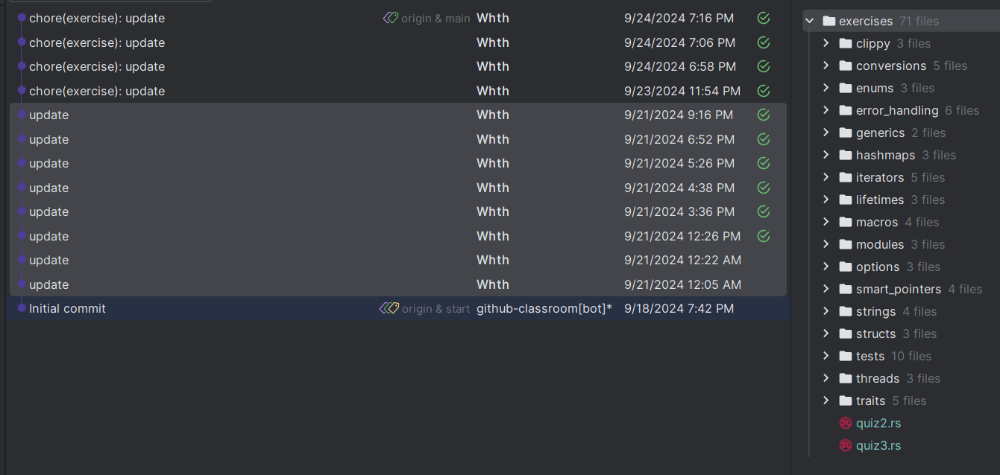
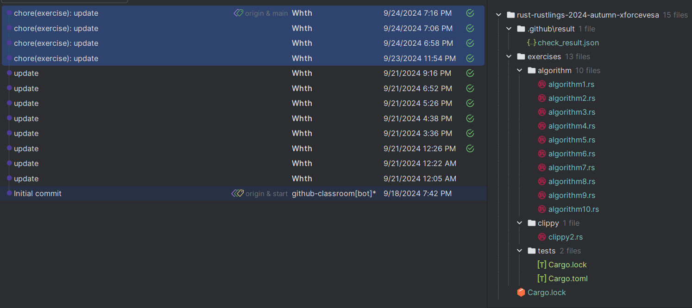
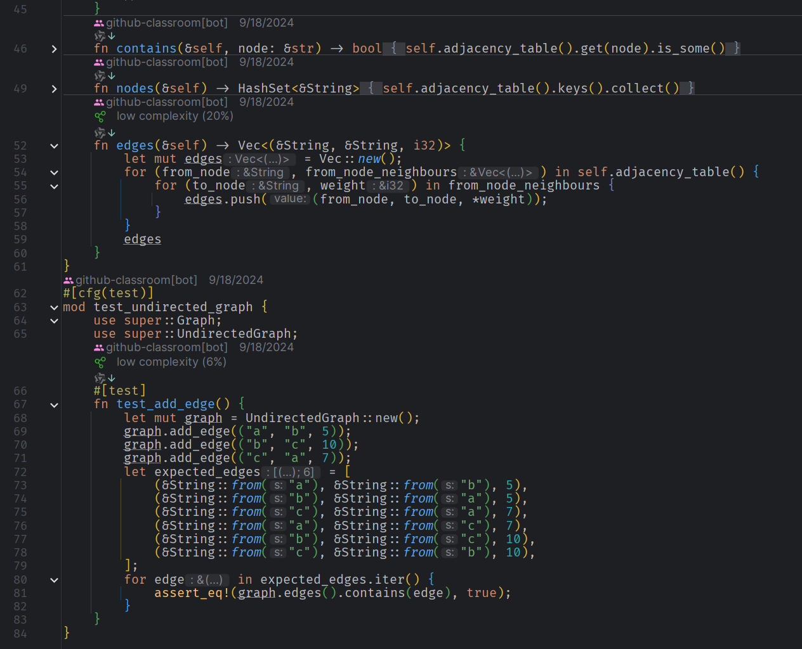
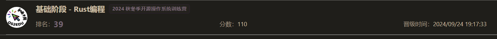

# 引言

----

9月的时候在`Rust语言中文社区`的微信公众号了解到了这个训练营,
当时想想正好可以获取一些操作系统的设计与实践的经验和感受感受`Rust`编程的实际运用,所以就报名了.

# 第一阶段概述

---
## 个人情况
    
- 非科班
- 大四备战考研ing
- 有过一些`C++`和`Python`的编程基础
- 系统学习过linux的架构和原理
- 了解过`Rust`的编程范式和语言特性(不过没怎么实际用过,只是简单的配过环境搓过些小玩意儿)

## Rustling

说是100道题,不过实际上是80道题.
其中70道语言特性和语法相关的基础题目,而剩下的10道题都是算法相关的.

因为`Rustling`没啥平台依赖所有就直接在win本把仓库克隆下来然后`cargo install&&rustling watch`开干

语法基础题花了一个下午给整完,中途卡了两天然后又花了两天把剩下的这10道题也做了.不过有一说一最后几个算法题确实有那么点上强度的感觉了Xb

## 总结

唉唉,给我的感觉两类题目的难度曲线会稍微有点陡峭了,简单和困难的过渡不太平缓,中途如果没有`Jetbrain RustRover`的built-in linter(好用,推荐😋)可能还得多花些时间

个人感觉最难的几个部分有生命周期,借用和作用域

1. **生命周期（Lifetimes）**：确保引用在其所指向的数据有效期内始终有效，防止悬空指针。虽说如此,但是实际上没有了`'a`和IDE的检查马上就歇菜了Xb.
2. **借用（Borrowing）**：允许临时使用数据而不转移所有权，提高代码的灵活性和安全性。这个借用和cpp的借用机制类似,不过在rust中 borrowing 的时候会自动释放,不用像cpp那样手动释放,挺好.
3. **作用域（Scopes）**：定义变量和引用的可见性和生命周期，确保资源在不再需要时被及时释放。最后我的理解感觉实际上也就是`{}`的范围.

不过难归难,实际上rust里面挺多编程范式确实体验蛮不错的,我挺喜欢模式匹配,建造者模式,鼓励链式调用(手动点赞).

最后在榜上捞了个Rank 39.

# 推荐阅读

1. [Rust官方文档](https://doc.rust-lang.org/book/title-page.html) - Rust的官方文档是最权威的学习资源之一，提供了详尽的语言特性和标准库介绍，适合所有级别的学习者。

2. [Rust精选](https://rustcc.cn/) - 提供了一系列聚焦于学习Rust的网络资源，包括但不限于使用Rust处理信号的文章，这些资源对于希望深入了解特定主题的学习者非常有帮助。

3. [《Rust 程序设计》](https://kaisery.github.io/trpl-zh-cn/) - 一本全面介绍Rust编程的书籍，适合希望系统学习Rust的新手。

4. [《Rust 权威指南》](https://rust-book.cs.dbappsecurity.com/) - 这本书深入讲解了Rust的核心概念和高级特性，适合已经有一定Rust基础的学习者。

5. [《Rust 实战》](https://rust-lang-nursery.github.io/rust-cookbook/intro.html) - 通过实战项目帮助读者掌握Rust编程的实际应用，适合希望通过实践加深理解的学习者。

6. [《深入理解 rust 并发编程》](https://rust-lang-nursery.github.io/rust-cookbook/concurrency.html) - 针对Rust的并发编程特性进行了详细的讲解，适合对并发编程感兴趣的开发者。

7. [《Command-Line Rust》](https://rust-cli.github.io/book/) - 专注于使用Rust开发命令行应用程序，适合对此类应用感兴趣的学习者。

8. [《Rust Atomics and Locks》](https://docs.rs/crossbeam/latest/crossbeam/atomic/index.html) - 深入讲解了Rust中的原子操作和锁机制，适合希望深入了解并发控制的学习者。

9. [《System Programing with Rust》](https://azerupi.github.io/mdBook/rust-system-programming/) - 介绍了如何使用Rust进行系统级编程，适合希望探索这一领域的开发者。

10. [《Rust 编程之道》](https://rustwiki.org/zh-CN/rust-by-example/) - 通过具体的例子和最佳实践，帮助读者更好地掌握Rust编程。

