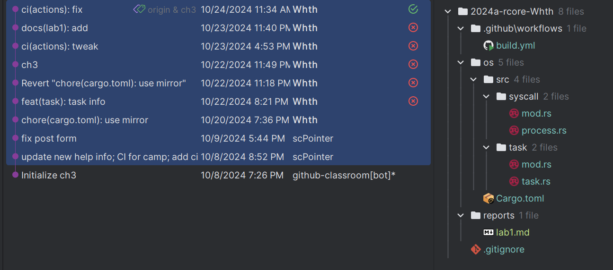
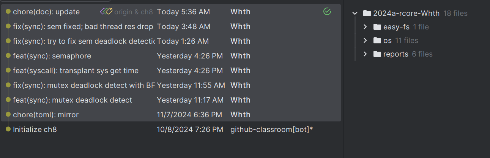

<!-- TOC -->
* [引言](#引言)
* [在此之前](#在此之前)
* [第二阶段概述](#第二阶段概述)
  * [环境配置](#环境配置)
  * [战斗开始](#战斗开始)
    * [ch1](#ch1)
      * [问题与对应解决操作如下：](#问题与对应解决操作如下)
      * [练习解题思路](#练习解题思路)
    * [ch2](#ch2-)
      * [问题与对应解决操作如下：](#问题与对应解决操作如下-1)
      * [练习解题思路](#练习解题思路-1)
    * [ch3](#ch3)
      * [问题与对应解决操作如下：](#问题与对应解决操作如下-2)
      * [练习解题思路](#练习解题思路-2)
    * [ch4](#ch4)
      * [问题与对应解决操作如下：](#问题与对应解决操作如下-3)
      * [练习解题思路](#练习解题思路-3)
    * [ch5](#ch5)
      * [问题与对应解决操作如下：](#问题与对应解决操作如下-4)
      * [练习解题思路](#练习解题思路-4)
    * [ch6](#ch6)
      * [问题与对应解决操作如下：](#问题与对应解决操作如下-5)
      * [练习解题思路](#练习解题思路-5)
    * [ch7](#ch7)
      * [问题与对应解决操作如下：](#问题与对应解决操作如下-6)
      * [练习解题思路](#练习解题思路-6)
    * [ch8](#ch8)
      * [问题与对应解决操作如下：](#问题与对应解决操作如下-7)
      * [练习解题思路](#练习解题思路-7)
* [总结](#总结)
<!-- TOC -->


----

# 引言

到了第二阶段,强度又上了一个等级,这次直接开始学习手搓操作系统了,中途也算是被折磨了不少,但是也收获良多.

切实的把学到的理论知识给使出来了,也提升了一些语言能力.


----

# 在此之前
- 读`Rcore-book`的时候切记不要一开始就直接先按着它给全部啃完,然后再写代码,最好是代码和文档一起走,看着文档的内容介绍,然后再根据它来分析具体的实现.
- 多打`trace`|`log`|`assert`来调试,不要直接panic, 用`gdb`+`tmux`着实有点麻烦.


----

# 第二阶段概述

## 环境配置

文档里面指定了使用`Ubuntu 22`作为开发环境,而我的宿主机是`Windows 11`,所以最后就用`WSL2`了,装了一个轻量点的`Debian for WSL`

使用字节跳动的 `rsproxy` 安装`rustup`

```fish
# 修改配置 ~/.config/fish/config.fish

echo "export RUSTUP_DIST_SERVER "https://rsproxy.cn"" >> ~/.config/fish/config.fish
echo "export RUSTUP_UPDATE_ROOT "https://rsproxy.cn/rustup"" >> ~/.config/fish/config.fish

```

安装 `rustup`
```fish
curl --proto '=https' --tlsv1.2 -sSf https://rsproxy.cn/rustup-init.sh | sh

```

修改 `~/.cargo/config.toml` 文件,配置`rsproxy`为默认源
```
[source.crates-io]
replace-with = 'rsproxy-sparse'
[source.rsproxy]
registry = "https://rsproxy.cn/crates.io-index"
[source.rsproxy-sparse]
registry = "sparse+https://rsproxy.cn/index/"
[registries.rsproxy]
index = "https://rsproxy.cn/crates.io-index"
[net]
git-fetch-with-cli = true
```

安装 `qemu-system-riscv64` 和 `qemu-riscv`

```fish
# 安装依赖
sudo apt install autoconf automake autotools-dev curl libmpc-dev libmpfr-dev libgmp-dev \
              gawk build-essential bison flex texinfo gperf libtool patchutils bc \
              zlib1g-dev libexpat-dev pkg-config  libglib2.0-dev libpixman-1-dev git tmux python3
# 下载并编译安装 qemu            
wget https://download.qemu.org/qemu-7.0.0.tar.xz &&\
tar xf qemu-7.0.0.tar.xz &&\
cd qemu-7.0.0 &&\
./configure --target-list=riscv64-softmmu,riscv64-linux-user && \
make -j$(nproc) && sudo make install

```

克隆`rcore-os`仓库,并且克隆测试用例仓库
```fish
git clone https://github.com/LearningOS/2024a-rcore-Whth.git && \
cd 2024a-rcore-Whth && \
git clone https://github.com/LearningOS/rCore-Tutorial-Test-2024A user --depth 1 &&\
git clone https://github.com/LearningOS/rCore-Tutorial-Checker-2024A.git ci-user --depth 1 &&\
cp -r user ci-user/user
```


运行第一个例子
```fish
git checkout ch1 &&\
cd os &&\
make run 
```

Success!
```fish
[rustsbi] RustSBI version 0.3.0-alpha.4, adapting to RISC-V SBI v1.0.0
.______       __    __      _______.___________.  _______..______   __
|   _  \     |  |  |  |    /       |           | /       ||   _  \ |  |
|  |_)  |    |  |  |  |   |   (----`---|  |----`|   (----`|  |_)  ||  |
|      /     |  |  |  |    \   \       |  |      \   \    |   _  < |  |
|  |\  \----.|  `--'  |.----)   |      |  |  .----)   |   |  |_)  ||  |
| _| `._____| \______/ |_______/       |__|  |_______/    |______/ |__|
[rustsbi] Implementation     : RustSBI-QEMU Version 0.2.0-alpha.2
[rustsbi] Platform Name      : riscv-virtio,qemu
[rustsbi] Platform SMP       : 1
[rustsbi] Platform Memory    : 0x80000000..0x88000000
[rustsbi] Boot HART          : 0
[rustsbi] Device Tree Region : 0x87000000..0x87000ef2
[rustsbi] Firmware Address   : 0x80000000
[rustsbi] Supervisor Address : 0x80200000
[rustsbi] pmp01: 0x00000000..0x80000000 (-wr)
[rustsbi] pmp02: 0x80000000..0x80200000 (---)
[rustsbi] pmp03: 0x80200000..0x88000000 (xwr)
[rustsbi] pmp04: 0x88000000..0x00000000 (-wr)
[kernel] Hello, world!
```

## 战斗开始

> 注: 为了快速了解主要功能,使用了LLM来提取要点,仅作为参考, 不保证100%正确

### ch1

>本章主要内容是构建一个用户态和裸机的最小执行环境，包括理解执行环境、修改目标平台、移除标准库依赖、实现基本功能（如输出字符串和关机），并正确配置内存布局和栈空间，最终实现一个能够运行简单应用程序的环境。

#### 问题与对应解决操作如下：


| 问题                                                  | 原因                                                                    | 解决方案                                               | 最终效果                     |
|-----------------------------------------------------|-----------------------------------------------------------------------|----------------------------------------------------|--------------------------|
| 无法成功将`Hello World!` 移植到`riscv64gc-unknown-none-elf` | 报错的原因是目标平台上确实没有 Rust 标准库 std，也不存在任何受 OS 支持的系统调用,也就是裸机平台 (bare-metal)。 | 将标准库 `std` 替换为无平台依赖的核心库 `core`，以满足裸机平台的编译需求。       | 可以通过编译啦!                 |
| 通过编译后的程序是空程序,怎么让它变得可以执行用户代码?                        | 没有定义入口函数                                                              | 添加`_start`作为入口函数                                   | 可以编译并且可以执行空的`loop`       |
| `_start`编译得到的程序并不能正常退出,报段错误了,为什么?                   | U模式下尝试越权执行S指令导致的                                                      | 根据`riscv`的指令标准,使用ecall完成权限的正常跳转,添加一个`syscall_exit` | 可以编译并且正常退出啦!             |                        
| 没有显示很不好调试啊,怎么加一个?                                   | `core`库里面并没有实现`println!`                                              | 添加一个`syscall_write`和`stdout`用作实现`println!`         | 可以正常显示输出啦!               |                                                        |                                              |                    |
| 现在的程序仍然是在用户态上运行的，而操作系统需要在内核态上运行,怎么解决?               | 程序默认在用户态运行，没有切换到内核态。                                                  | 修改程序入口点和初始化代码，确保程序在内核态运行。                          | 程序在内核态运行，能够访问内核态资源。      |
| 内存布局不符合预期,直接退出了,怎么办?                                | 缺少或错误的链接脚本配置。                                                         | 使用链接脚本 (Linker Script) 调整内存布局，使入口地址为 0x80200000。   | 内存布局符合预期，程序能够在指定地址开始执行。  |
| 未正确设置栈空间                                            | 没有为操作系统预留足够的栈空间，或者没有正确初始化栈指针。                                         | 在汇编文件中预留栈空间，并在启动时设置栈指针。                            | 栈空间正确设置，程序可以安全地使用栈。      |
| .bss 段未清零                                           | .bss 段没有被初始化为零，可能导致未定义行为。                                             | 在 `rust_main` 函数中调用 `clear_bss` 函数清零 .bss 段。       | .bss 段被正确清零，避免了潜在的未定义行为。 |
| 缺少打印功能                                              | 没有实现或适配内核态的打印功能。                                                      | 修改用户态的 `println` 宏，实现内核态的打印功能。                     | 可以在内核态打印信息，便于调试。         |
| 异常处理时未打印错误位置                                        | 异常处理函数 `panic` 没有实现打印错误位置的功能。                                         | 重写 `panic` 函数，使其在异常时打印错误发生的位置。                     | 异常时能够打印错误位置，方便定位问题。      |
| 日志功能缺失                                              | 没有集成日志库，或日志库未正确配置。                                                    | 在项目中引入日志库 `log` 并实现日志模块。                           | 可以记录不同级别的日志信息，增强调试能力。    |

至此，我们完成了一个可以执行用户态代码的裸机程序😋。
```fish
>>> cd os&&make run LOG=DEBUG

[rustsbi] RustSBI version 0.3.0-alpha.4, adapting to RISC-V SBI v1.0.0
.______       __    __      _______.___________.  _______..______   __
|   _  \     |  |  |  |    /       |           | /       ||   _  \ |  |
|  |_)  |    |  |  |  |   |   (----`---|  |----`|   (----`|  |_)  ||  |
|      /     |  |  |  |    \   \       |  |      \   \    |   _  < |  |
|  |\  \----.|  `--'  |.----)   |      |  |  .----)   |   |  |_)  ||  |
| _| `._____| \______/ |_______/       |__|  |_______/    |______/ |__|
[rustsbi] Implementation     : RustSBI-QEMU Version 0.2.0-alpha.2
[rustsbi] Platform Name      : riscv-virtio,qemu
[rustsbi] Platform SMP       : 1
[rustsbi] Platform Memory    : 0x80000000..0x88000000
[rustsbi] Boot HART          : 0
[rustsbi] Device Tree Region : 0x87000000..0x87000ef2
[rustsbi] Firmware Address   : 0x80000000
[rustsbi] Supervisor Address : 0x80200000
[rustsbi] pmp01: 0x00000000..0x80000000 (-wr)
[rustsbi] pmp02: 0x80000000..0x80200000 (---)
[rustsbi] pmp03: 0x80200000..0x88000000 (xwr)
[rustsbi] pmp04: 0x88000000..0x00000000 (-wr)
[kernel] Hello, world!
[DEBUG] [kernel] .rodata [0x80202000, 0x80203000)
[ INFO] [kernel] .data [0x80203000, 0x80204000)
[ WARN] [kernel] boot_stack top=bottom=0x80214000, lower_bound=0x80204000
[ERROR] [kernel] .bss [0x80214000, 0x80215000)
```


#### 练习解题思路
- undefined

----

### ch2 

>本章主要内容是实现一个简单的批处理系统，包括设计和实现应用程序、管理内存布局、实现系统调用、编译生成应用程序二进制码、将应用程序链接到内核、实现特权级切换和 Trap 管理，最终实现内核加载并执行用户态应用程序的功能。


#### 问题与对应解决操作如下：


| 问题                   | 原因                                      | 解决方案                                                                | 最终效果                             |
|----------------------|-----------------------------------------|---------------------------------------------------------------------|----------------------------------|
| 应用程序设计看起来好复杂啊！       | 用户库预留了很多未来才会用到的系统调用接口，还有一些高级功能。         | 只关注本节提到的部分，忽略那些未来的神秘东西。                                             | 简化了开发过程，让你能快速上手。                 |
| 找不到 main 函数，编译器报错了！  | 默认情况下，Rust 程序需要一个 main 函数作为入口。          | 移除 main 函数，使用自定义的 _start 函数。                                        | 程序不再依赖标准库的 main 函数，自由度更高。        |
| 怎么输出个字符串这么难？         | 标准库的 println! 宏依赖于标准 I/O，裸机环境下没有这些支持。   | 自己实现一个输出字符串的函数。                                                     | 可以在裸机环境下愉快地打印字符串了！               |
| 程序跑起来，但是一直不退出，卡在那里了！ | 缺少一个优雅的退出机制。                            | 实现一个关机功能，让程序能够正常退出。                                                 | 程序运行完后，QEMU 会优雅地退出，不再卡在那里。       |
| 内存布局怎么这么乱？           | 缺少或错误的链接脚本配置。                           | 使用链接脚本 (Linker Script) 调整内存布局。                                      | 内存布局变得整洁有序，程序在指定地址开始执行。          |
| 栈空间怎么总是出问题？          | 没有为操作系统预留足够的栈空间，或者没有正确初始化栈指针。           | 在汇编文件中预留栈空间，并在启动时设置栈指针。                                             | 栈空间正确设置，程序可以安全地使用栈。              |
| .bss 段里的垃圾数据怎么清理？    | .bss 段没有被初始化为零，可能导致未定义行为。               | 在 `rust_main` 函数中调用 `clear_bss` 函数清零 .bss 段。                        | .bss 段被正确清零，避免了潜在的未定义行为。         |
| 怎么和内核通信？             | 应用程序需要调用内核提供的系统调用。                      | 实现系统调用接口，使用 ecall 指令。                                               | 应用程序可以通过系统调用与内核通信，完成各种任务。        |
| 怎么编译生成应用程序二进制码？      | 缺少编译和链接的步骤。                             | 使用 Cargo 和 objcopy 工具编译生成二进制文件。                                     | 生成了可以在裸机上运行的应用程序二进制文件。           |
| 怎么把应用程序链接到内核？        | 应用程序的二进制镜像文件需要作为数据段链接到内核里，内核需要知道它们的位置。  | 使用汇编文件 `link_app.S` 将应用程序的二进制镜像链接到内核。                               | 应用程序的二进制镜像被正确链接到内核中。             |
| 找不到应用程序的起始和结束位置？     | 内核需要知道应用程序的数量和它们的起始和结束位置。               | 在 `link_app.S` 中定义全局符号，记录应用程序的数量和位置。                                | 内核能够准确找到每个应用程序的起始和结束位置。          |
| 如何初始化应用管理器？          | 需要一个全局的应用管理器来管理应用程序的加载和运行。              | 使用 `lazy_static!` 宏创建全局的 `AppManager` 实例。                           | 应用管理器在第一次使用时自动初始化。               |
| 如何加载应用程序？            | 需要将应用程序的二进制镜像加载到指定的内存地址。                | 实现 `load_app` 方法，将应用程序加载到 0x80400000 起始的内存地址。                       | 应用程序被正确加载到内存中，准备运行。              |
| i-cache 不一致怎么办？      | 修改内存中的代码段时，i-cache 中的内容可能与内存不一致。        | 在加载应用程序前，使用 `fence.i` 指令清空 i-cache。                                 | 保证程序执行的正确性，避免 i-cache 与内存不一致的问题。 |
| 怎么管理多个应用程序？          | 需要一个机制来管理多个应用程序的加载和运行。                  | 在 `AppManager` 中维护应用程序的数量和当前运行的应用程序索引。                              | 能够按顺序加载和运行多个应用程序。                |
| 如何实现批处理操作系统的接口？      | 需要提供接口来初始化和运行下一个应用程序。                   | 实现 `init` 和 `run_next_app` 方法，分别用于初始化和运行下一个应用程序。                    | 批处理操作系统能够初始化并按顺序运行多个应用程序。        |
| 怎么实现特权级切换？           | 批处理操作系统需要在用户态和内核态之间切换，以便初始化、监控和处理应用程序。  | 使用 RISC-V 的特权级切换机制，通过控制状态寄存器（CSR）和硬件支持。                             | 实现了用户态和内核态之间的平滑切换。               |
| 特权级切换的起因是什么？         | 需要在启动应用程序、处理系统调用、处理错误和应用程序结束时进行特权级切换。   | 确保在这些关键时刻能够正确切换特权级。                                                 | 确保了批处理操作系统的稳定性和安全性。              |
| 特权级切换涉及哪些控制状态寄存器？    | 需要管理特权级切换时的各种状态信息。                      | 使用 sstatus、sepc、scause、stval 和 stvec 等 CSR。                         | 确保了 Trap 处理的正确性和可靠性。             |
| 如何处理 Trap 进入 S 特权级？  | CPU 需要从用户态切换到内核态处理 Trap。                | 硬件自动修改 sstatus、sepc、scause 和 stval 寄存器，并跳转到 stvec 指定的入口地址。          | 确保了 Trap 处理的高效性和准确性。             |
| 如何处理 Trap 返回用户态？     | Trap 处理完成后需要返回用户态继续执行。                  | 使用 sret 指令恢复 sstatus 和 sepc 寄存器，并跳转回用户态。                            | 确保了 Trap 处理后的正确返回。               |
| 用户栈和内核栈有什么区别？        | Trap 发生时需要切换栈，以保存和恢复寄存器状态。              | 定义了 `KernelStack` 和 `UserStack` 类型，并实现 `get_sp` 方法获取栈顶地址。           | 确保了 Trap 处理时栈的正确管理和切换。           |
| 如何保存和恢复 Trap 上下文？    | Trap 发生时需要保存当前的寄存器状态，Trap 处理后需要恢复这些状态。  | 定义 `TrapContext` 结构体，包含所有通用寄存器和必要的 CSR。                             | 确保了 Trap 处理前后寄存器状态的一致性。          |
| 具体如何保存 Trap 上下文？     | Trap 发生时需要保存当前的寄存器状态，以便 Trap 处理后恢复。     | 在 `__alltraps` 汇编函数中保存所有通用寄存器和必要的 CSR。                              | 确保了 Trap 处理前寄存器状态的正确保存。          |
| 具体如何设置 Trap 处理入口？    | 需要指定 Trap 处理的入口地址。                      | 在 `trap::init` 中设置 `stvec` 寄存器指向 `__alltraps`。                      | 确保了 Trap 处理的入口地址正确设置。            |
| 具体如何恢复 Trap 上下文？     | Trap 处理完成后需要恢复寄存器状态，继续执行应用程序。           | 在 `__restore` 汇编函数中恢复所有通用寄存器和必要的 CSR。                               | 确保了 Trap 处理后寄存器状态的正确恢复。          |
| 如何处理系统调用？            | 应用程序通过 ecall 指令触发系统调用，需要在内核态处理。         | 在 `trap_handler` 中识别 ecall 并调用 `syscall` 函数。                        | 正确处理了系统调用请求。                     |
| 如何处理访存错误和非法指令？       | 应用程序可能出现访存错误或非法指令，需要妥善处理。               | 在 `trap_handler` 中捕获并处理这些错误，调用 `run_next_app`。                      | 确保了应用程序出错时能够正确处理并切换到下一个应用程序。     |
| 如何实现具体的系统调用？         | 需要根据 syscall ID 调用相应的处理函数。              | 在 `syscall` 模块中实现 `sys_write` 和 `sys_exit`。                         | 提供了基本的系统调用功能。                    |
| 如何打印系统调用的结果？         | 需要将系统调用的结果输出到控制台。                       | 在 `sys_write` 中将缓冲区内容转换为字符串并打印。                                     | 确保了系统调用结果的正确输出。                  |
| 如何处理应用程序退出？          | 应用程序退出时需要通知内核并切换到下一个应用程序。               | 在 `sys_exit` 中打印退出信息并调用 `run_next_app`。                             | 确保了应用程序退出后的正确处理和切换。              |
| 如何执行下一个应用程序？         | 当批处理操作系统初始化完成或某个应用程序运行结束时，需要切换到下一个应用程序。 | 在 `run_next_app` 函数中加载并运行下一个应用程序。                                   | 确保了应用程序的连续运行。                    |
| 如何跳转到应用程序入口点？        | 需要将 CPU 的执行跳转到应用程序的入口点 0x80400000。      | 在 `TrapContext::app_init_context` 中设置 `sepc` 为 0x80400000。          | 确保了 CPU 跳转到应用程序的入口点。             |
| 如何切换到用户栈？            | 需要将使用的栈从内核栈切换到用户栈。                      | 在 `TrapContext::app_init_context` 中设置 `sp` 为用户栈的栈顶地址。               | 确保了 CPU 使用用户栈。                   |
| 如何设置 sscratch 指向内核栈？ | 在 Trap 处理时需要确保 sscratch 指向内核栈。          | 在 `__restore` 函数中设置 `sscratch` 为内核栈的栈顶地址。                           | 确保了 sscratch 指向内核栈。              |
| 如何从 S 特权级切换到 U 特权级？  | 需要从 S 特权级切换到 U 特权级以运行应用程序。              | 在 `TrapContext::app_init_context` 中设置 `sstatus` 的 `SPP` 字段为 `User`。 | 确保了特权级从 S 切换到 U。                 |
| 如何复用 __restore 代码？   | 需要复用 `__restore` 代码来简化启动应用程序的过程。        | 在 `run_next_app` 中调用 `__restore` 并传递一个特殊构造的 Trap 上下文。               | 确保了启动应用程序的简洁性和一致性。               |

至此我们的OS可以承载多个用户态程序，并且可以切换用户态程序，并且可以返回用户态程序。

#### 练习解题思路
- undefined
- 
----

### ch3

>主要介绍了多道程序与分时多任务的概念，包括多道程序的放置与加载、任务切换的实现、任务管理机制、系统调用如yield和exit的实现、以及在RISC-V架构下处理嵌套中断和实现抢占式调度的方法。


#### 问题与对应解决操作如下：

| 问题                          | 原因                                 | 解决方案                                                             | 最终效果                     |
|-----------------------------|------------------------------------|------------------------------------------------------------------|--------------------------|
| 如何放置多个应用程序？                 | 内核需要让每个应用程序加载到不同的内存地址，以支持多道程序。     | 为每个应用程序指定不同的起始地址。                                                | 确保了多个应用程序可以同时驻留在内存中。     |
| 如何为每个应用程序指定不同的起始地址？         | 每个应用程序需要有自己的起始地址，以避免冲突。            | 使用 `user/build.py` 脚本为每个应用程序指定起始地址。                              | 确保了每个应用程序的起始地址不同。        |
| 如何加载多个应用程序？                 | 需要在内核初始化时将所有应用程序加载到内存中。            | 在 `loader` 模块的 `load_apps` 函数中加载所有应用程序。                          | 确保了所有应用程序在内核初始化时被加载到内存中。 |
| 如何清空应用程序区域？                 | 在加载新应用程序之前，需要清空内存区域以避免残留数据。        | 在 `load_apps` 函数中清空内存区域。                                         | 确保了内存区域在加载新应用程序前被清空。     |
| 如何加载应用程序到指定地址？              | 需要将应用程序的二进制数据加载到指定的内存地址。           | 在 `load_apps` 函数中将应用程序数据复制到指定地址。                                 | 确保了应用程序被正确加载到指定的内存地址。    |
| 如何计算应用程序的基地址？               | 需要为每个应用程序计算一个唯一的基地址。               | 在 `get_base_i` 函数中计算应用程序的基地址。                                    | 确保了每个应用程序的基地址唯一。         |
| 如何实现任务切换？                   | 任务切换是操作系统的核心机制，需要在应用运行中交出 CPU 使用权。 | 设计和实现任务切换机制，包括保存和恢复任务上下文。                                        | 确保了多个任务之间的平滑切换。          |
| 任务切换与 Trap 切换有何不同？          | 任务切换和 Trap 切换在某些方面有相似之处，但也有一些关键差异。 | 任务切换不涉及特权级切换，部分由编译器完成。                                           | 确保了任务切换的高效性和透明性。         |
| 如何保存任务上下文？                  | 任务切换时需要保存当前任务的寄存器状态。               | 在 `__switch` 汇编函数中保存 `ra`、`sp` 和 `s0~s11`。                       | 确保了任务上下文的正确保存。           |
| 如何恢复任务上下文？                  | 任务切换时需要恢复目标任务的寄存器状态。               | 在 `__switch` 汇编函数中恢复 `ra`、`sp` 和 `s0~s11`。                       | 确保了任务上下文的正确恢复。           |
| 如何实现 `__switch` 函数？         | 需要一个函数来完成任务上下文的保存和恢复。              | 在 `switch.S` 中实现 `__switch` 汇编函数。                                | 确保了任务切换的高效性和可靠性。         |
| 如何定义 `TaskContext` 结构体？     | 需要一个结构体来存储任务上下文。                   | 在 `task/context.rs` 中定义 `TaskContext` 结构体。                       | 确保了任务上下文的正确表示。           |
| 如何在 Rust 中调用 `__switch` 函数？ | 需要在 Rust 代码中调用 `__switch` 函数。      | 在 `task/switch.rs` 中声明 `__switch` 外部函数。                          | 确保了 `__switch` 函数的正确调用。  |
| 如何管理任务？                     | 内核需要管理多个任务，包括任务的状态和上下文。            | 维护任务控制块和任务管理器。                                                   | 确保了任务的有效管理和调度。           |
| 任务运行状态有哪些？                  | 任务需要有不同的运行状态来管理其生命周期。              | 定义 `TaskStatus` 枚举，包括 `UnInit`、`Ready`、`Running` 和 `Exited`。     | 确保了任务状态的清晰表示。            |
| 任务控制块包含哪些信息？                | 任务控制块需要存储任务的状态和上下文。                | 在 `TaskControlBlock` 结构体中包含 `task_status` 和 `task_cx`。           | 确保了任务控制块的完整性和一致性。        |
| 如何实现任务管理器？                  | 需要一个全局的任务管理器来管理任务控制块。              | 创建 `TaskManager` 结构体，包含任务控制块数组和当前任务索引。                           | 确保了任务管理器的全局可见性和管理能力。     |
| 如何初始化任务管理器？                 | 任务管理器需要在内核初始化时进行初始化。               | 在 `TASK_MANAGER` 的 `lazy_static!` 块中初始化任务管理器。                    | 确保了任务管理器的正确初始化。          |
| 如何实现 `sys_yield` 系统调用？      | 应用需要主动交出 CPU 使用权。                  | 实现 `sys_yield` 函数，调用 `suspend_current_and_run_next`。             | 确保了应用可以主动交出 CPU 使用权。     |
| 如何实现 `sys_exit` 系统调用？       | 应用需要主动退出。                          | 实现 `sys_exit` 函数，调用 `exit_current_and_run_next`。                 | 确保了应用可以主动退出。             |
| 如何实现任务切换？                   | 任务切换需要保存和恢复任务上下文。                  | 实现 `__switch` 汇编函数，保存和恢复 `ra`、`sp` 和 `s0~s11`。                   | 确保了任务切换的高效性和可靠性。         |
| 如何初始化任务上下文？                 | 任务控制块需要初始化任务上下文。                   | 在 `init_app_cx` 中初始化 Trap 上下文，并在 `goto_restore` 中设置 `ra` 和 `sp`。 | 确保了任务上下文的正确初始化。          |
| 如何执行第一个任务？                  | 需要从任务管理器中选择并执行第一个任务。               | 在 `run_first_task` 中调用 `__switch` 切换到第一个任务的上下文。                  | 确保了第一个任务的正确执行。           |
| 如何实现分时多任务系统？                | 现代任务调度算法需要抢占式调度，每个应用只能连续执行一段时间。    | 使用时间片轮转算法 (RR) 对应用进行调度。                                          | 确保了任务的公平调度。              |
| 如何实现时钟中断与计时器？               | 实现调度算法需要计时。                        | 使用 RISC-V 的 mtime 和 mtimecmp 寄存器。                                | 确保了精确的计时和时钟中断。           |
| 如何获取当前时间？                   | 应用需要获取当前时间。                        | 实现 `get_time` 和 `get_time_us` 函数。                                | 确保了应用可以获取当前时间。           |
| 如何设置时钟中断？                   | 需要设置时钟中断来触发任务调度。                   | 实现 `set_timer` 和 `set_next_trigger` 函数。                          | 确保了时钟中断的正确设置。            |
| 如何处理时钟中断？                   | 时钟中断触发时需要进行任务切换。                   | 在 `trap_handler` 中处理 S 特权级时钟中断。                                  | 确保了时钟中断触发后的任务切换。         |
| 如何启用时钟中断？                   | 需要启用 S 特权级时钟中断以避免被屏蔽。              | 在 `rust_main` 中调用 `enable_timer_interrupt`。                      | 确保了 S 特权级时钟中断的启用。        |


至此，我们完成了一个简单的内核，它已经并行执行了多个应用

#### 练习解题思路

- 直接为每一个task打上数据标签保存所有的`taskinfo` 相关信息.
- 额外的为了正常统计syscall计数需要为syscall添加一个 `hook`用作每次`syscall`被调用时可以更新当前`TaskControlBlock`的syscall计数
- 最后实现 `syscall_get_task_info`函数本体,从`TaskControlBlock`哪里取出数据返回即可.

----

### ch4

>本章深入探讨了RISC-V架构下的SV39多级页表机制的实现，包括虚拟地址和物理地址的管理、内存控制相关的CSR寄存器、地址格式与组成等，并详细介绍了如何实现地址空间抽象、内核与应用的地址空间管理以及基于地址空间的分时多任务处理。


#### 问题与对应解决操作如下：

| 问题                                    | 原因                                                        | 解决方案                                                                                                                                   | 最终效果                                                |
|---------------------------------------|-----------------------------------------------------------|----------------------------------------------------------------------------------------------------------------------------------------|-----------------------------------------------------|
| 如何实现 SV39 多级页表机制？                     | 就像给房子建楼层一样，我们需要在内核中搭建 RV64 架构的 SV39 分页系统。                 | 分步骤来，先打地基（准备环境），再一层一层往上建。                                                                                                              | 我们就有了一个稳固的多层建筑，即实现了 SV39 分页机制。                      |
| 虚拟地址和物理地址的区别是什么？                      | 访问内存时，就像找人，得知道是在虚拟世界还是现实世界找。                              | 修改 satp 这个特殊的开关，告诉系统我们要在哪个世界里玩。                                                                                                        | 系统就能正确地把虚拟世界的地址翻译成现实世界的地址了。                         |
| 如何启用分页模式？                             | 默认情况下，MMU（内存管理单元）这个大管家没上班，我们需要叫它起来工作。                     | 把 satp 的 MODE 字段设置为 8，就像是给大管家发了个开工通知。                                                                                                  | 这样，大管家就正式上岗，开始处理分页事务了。                              |
| 如何定义地址和页号的类型？                         | 在编程的世界里，给东西起名字很重要，尤其是地址和页号这种关键角色。                         | 用 Rust 语言定义 `PhysAddr`、`VirtAddr`、`PhysPageNum` 和 `VirtPageNum` 四个小伙伴。                                                                 | 这样每个小伙伴都有了自己的身份证明，方便管理。                             |
| 如何实现地址和页号之间的转换？                       | 地址和页号之间需要相互认识，好比是不同语言的人交流。                                | 为它们实现 `From` 和 `Into` 特性，还有 `floor` 和 `ceil` 方法，就像教它们一门通用语言。                                                                           | 这样，地址和页号就可以无障碍沟通了。                                  |
| 如何定义页表项的数据结构？                         | 页表项是页表里的小兵，要有自己的样子。                                       | 使用 `bitflags` 工具箱来定义 `PTEFlags` 和 `PageTableEntry`，给小兵们穿上制服。                                                                           | 这样，每个小兵都有了独特的身份标识。                                  |
| 如何生成页表项？                              | 小兵们需要有出生证，证明它们是合法的。                                       | 为 `PageTableEntry` 添加 `new` 和 `empty` 方法，就像是给小兵们颁发出生证。                                                                                 | 这样，小兵们就有了合法的身份。                                     |
| 如何检查页表项的标志位？                          | 小兵们的任务和能力需要定期检查。                                          | 为 `PageTableEntry` 添加 `is_valid` 方法，就像是对小兵们的能力进行审查。                                                                                    | 这样，我们就能确保每个小兵都在正确地执行任务。                             |
| 如何管理物理页帧？                             | 物理页帧就像是仓库里的货物，需要有人管理。                                     | 实现 `StackFrameAllocator`，就像请了一个仓库管理员。                                                                                                  | 这样，货物的进出就有条不紊了。                                     |
| 如何确定可用物理内存范围？                         | 仓库有多大，哪些地方可以存放货物，这些都是需要事先规划好的。                            | 在链接脚本 `os/src/linker.ld` 里用 `ekernel` 符号标出内核数据的终点。                                                                                     | 这样，我们就明确了哪些地方是可以用来存放货物的。                            |
| 如何定义物理页帧管理器的 Trait？                   | 为了规范仓库管理员的行为，需要有一套标准。                                     | 定义 `FrameAllocator` Trait，就像是制定了仓库管理的标准流程。                                                                                             | 这样，不管谁来当仓库管理员，都能按规矩办事。                              |
| 如何实现 `StackFrameAllocator`？           | 有了标准，还需要有一个具体的实施者。                                        | 实现 `StackFrameAllocator` 结构体及相关方法，就像是选定了一个具体的仓库管理员。                                                                                    | 这样，货物的管理就有了实际的操作者。                                  |
| 如何初始化 `StackFrameAllocator`？          | 仓库管理员上任前，需要了解仓库的情况。                                       | 为 `StackFrameAllocator` 实现 `new` 和 `init` 方法，就像是管理员做入职培训。                                                                              | 这样，管理员就能快速进入状态，开始工作。                                |
| 如何实现物理页帧的分配？                          | 仓库管理员要懂得如何合理分配货物。                                         | 为 `StackFrameAllocator` 实现 `alloc` 方法，就像是训练管理员如何发放货物。                                                                                  | 这样，货物的分配就更加合理有效了。                                   |
| 如何实现物理页帧的回收？                          | 当货物不再需要时，要能够及时回收，以便再次利用。                                  | 为 `StackFrameAllocator` 实现 `dealloc` 方法，就像是教管理员如何回收货物。                                                                                 | 这样，仓库的空间利用率就提高了。                                    |
| 如何创建物理页帧的全局实例？                        | 仓库需要有一个总管，随时调用资源。                                         | 创建 `FRAME_ALLOCATOR` 全局实例，并完成初始化。                                                                                                      | 这样，任何地方都可以调用总管来获取或归还资源了。                            |
| 如何实现物理页帧分配/回收的接口？                     | 总管需要提供简单直接的服务窗口。                                          | 实现 `frame_alloc` 和 `frame_dealloc` 函数，就像是开设了服务窗口。                                                                                      | 这样，用户就能很方便地请求或归还资源了。                                |
| 如何实现 `FrameTracker`？                  | 为了确保货物的安全，需要有个追踪系统。                                       | 实现 `FrameTracker` 结构体及相关方法，就像是建立了一套货物追踪系统。                                                                                             | 这样，货物的状态就能实时监控了。                                    |
| 如何实现 `FrameTracker` 的自动回收？            | 当货物不再使用时，应该能够自动归还仓库。                                      | 为 `FrameTracker` 实现 `Drop` 特性，就像是给货物装上了自动归还装置。                                                                                         | 这样，货物就能自动回到仓库，减少了人为操作。                              |
| 如何实现多级页表的基本数据结构？                      | 多级页表就像是一栋多层楼的大厦，需要设计好每一层的布局。                              | 定义 `PageTable` 结构体及相关方法，就像是设计好了大厦的蓝图。                                                                                                  | 这样，大厦的建设就有了依据。                                      |
| 如何初始化多级页表？                            | 大厦建设前，需要打好地基。                                             | 为 `PageTable` 实现 `new` 方法，就像是为大厦打好地基。                                                                                                  | 这样，大厦的建设就有了坚实的基础。                                   |
| 如何实现多级页表的映射和解除映射？                     | 大厦里的房间需要能够灵活地分配和收回。                                       | 为 `PageTable` 实现 `map` 和 `unmap` 方法，就像是制定了房间分配和收回的规则。                                                                                  | 这样，房间的管理就更加灵活高效了。                                   |
| 如何在多级页表中查找页表项？                        | 在多层楼的大厦里找到特定的房间，需要有一张详细的楼层图。                              | 为 `PageTable` 实现 `find_pte_create` 方法，就像是制作了一份详细的楼层指南。                                                                                 | 这样，就能快速准确地找到目标房间了。                                  |
| 如何访问物理页帧？                             | 要想进入仓库取货，需要有专门的通道。                                        | 为 `PhysPageNum` 实现 `get_pte_array`、`get_bytes_array` 和 `get_mut` 方法，就像是设置了专用的取货通道。                                                     | 这样，取货就更加便捷了。                                        |
| 如何实现恒等映射？                             | 有时候，最简单的办法就是最好的。                                          | 使用恒等映射，就像是让虚拟页号和物理页号一一对应。                                                                                                              | 这样，系统就能以最简单的方式工作了。                                  |
| 如何实现手动查页表的方法？                         | 有时候，我们需要绕过系统，直接从底层获取信息。                                   | 为 `PageTable` 实现 `from_token`、`find_pte` 和 `translate` 方法，就像是掌握了直达底层的密道。                                                               | 这样，即使没有系统的帮助，也能快速获取所需的信息。                           |
| 如何实现地址空间的抽象？                          | 地址空间就像是一个大容器，里面装着很多小容器。                                   | 定义 `MapArea` 和 `MemorySet` 结构体及方法，就像是设计了一个可以装很多小容器的大箱子。                                                                                | 这样，地址空间的管理就更加有序了。                                   |
| 如何描述逻辑段？                              | 每个小容器都有自己的用途，需要清楚地标记出来。                                   | 定义 `MapArea` 结构体，就像是给每个小容器贴上了标签。                                                                                                       | 这样，每个小容器的用途就一目了然了。                                  |
| 如何实现逻辑段的映射方式？                         | 不同的小容器可能有不同的打开方式。                                         | 定义 `MapType` 枚举，就像是给每种小容器设定了打开方式。                                                                                                      | 这样，无论哪种小容器，都能轻松打开。                                  |
| 如何实现逻辑段的权限控制？                         | 每个小容器都有自己的门锁，需要控制谁能开锁。                                    | 定义 `MapPermission` 结构体，就像是给每个小容器安装了智能门锁。                                                                                               | 这样，只有被授权的人才能打开小容器。                                  |
| 如何实现地址空间的管理？                          | 管理一个大容器，需要有一个好的计划。                                        | 定义 `MemorySet` 结构体及其方法，就像是制定了一份管理大容器的计划书。                                                                                              | 这样，大容器内的所有小容器就能得到有效的管理了。                            |
| 如何初始化地址空间？                            | 需要初始化地址空间。                                                | 实现 `MemorySet::new_bare` 方法。                                                                                                           | 确保了地址空间的正确初始化。                                      |
| 如何在地址空间中插入逻辑段？                        | 需要在地址空间中插入新的逻辑段。                                          | 实现 `MemorySet::push` 方法。                                                                                                               | 确保了逻辑段的正确插入。                                        |
| 如何插入 Framed 方式的逻辑段？                   | 需要在地址空间中插入 Framed 方式的逻辑段。                                 | 实现 `MemorySet::insert_framed_area` 方法。                                                                                                 | 确保了 Framed 方式逻辑段的正确插入。                              |
| 如何生成内核的地址空间？                          | 需要生成内核的地址空间。                                              | 实现 `MemorySet::new_kernel` 方法。                                                                                                         | 确保了内核地址空间的生成。                                       |
| 如何从 ELF 文件生成应用的地址空间？                  | 需要从 ELF 文件生成应用的地址空间。                                      | 实现 `MemorySet::from_elf` 方法。                                                                                                           | 确保了应用地址空间的生成。                                       |
| 如何实现逻辑段的映射？                           | 需要实现逻辑段的映射。                                               | 实现 `MapArea::map` 方法。                                                                                                                  | 确保了逻辑段的正确映射。                                        |
| 如何实现逻辑段的解映射？                          | 需要实现逻辑段的解映射。                                              | 实现 `MapArea::unmap` 方法。                                                                                                                | 确保了逻辑段的正确解映射。                                       |
| 如何实现逻辑段的数据拷贝？                         | 需要实现逻辑段的数据拷贝。                                             | 实现 `MapArea::copy_data` 方法。                                                                                                            | 确保了逻辑段的数据拷贝。                                        |
| 如何实现单个虚拟页面的映射？                        | 需要实现单个虚拟页面的映射。                                            | 实现 `MapArea::map_one` 方法。                                                                                                              | 确保了单个虚拟页面的正确映射。                                     |
| 如何实现单个虚拟页面的解映射？                       | 需要实现单个虚拟页面的解映射。                                           | 实现 `MapArea::unmap_one` 方法。                                                                                                            | 确保了单个虚拟页面的正确解映射。                                    |
| 如何实现内核地址空间？                           | 需要实现内核地址空间。                                               | 定义 `MemorySet::new_kernel` 方法。                                                                                                         | 确保了内核地址空间的创建。                                       |
| 如何映射内核的跳板？                            | 需要映射内核的跳板。                                                | 实现 `MemorySet::map_trampoline` 方法。                                                                                                     | 确保了跳板的正确映射。                                         |
| 如何映射内核的各个逻辑段？                         | 需要映射内核的各个逻辑段。                                             | 在 `MemorySet::new_kernel` 方法中调用 `push` 方法。                                                                                             | 确保了各个逻辑段的正确映射。                                      |
| 如何处理内核栈？                              | 需要处理内核栈。                                                  | 在 `MemorySet::new_kernel` 方法中设置内核栈。                                                                                                    | 确保了内核栈的正确设置。                                        |
| 如何设置保护页面？                             | 需要设置保护页面。                                                 | 在内核栈之间预留一个保护页面。                                                                                                                        | 确保了内核栈的安全性。                                         |
| 如何实现恒等映射？                             | 需要实现恒等映射。                                                 | 使用 `MapType::Identical` 映射方式。                                                                                                          | 确保了内核数据段的正确访问。                                      |
| 如何设置逻辑段的权限？                           | 需要设置逻辑段的权限。                                               | 使用 `MapPermission` 设置权限。                                                                                                               | 确保了逻辑段的权限控制。                                        |
| 如何创建应用地址空间？                           | 需要创建应用地址空间。                                               | 实现 `MemorySet::from_elf` 方法。                                                                                                           | 确保了应用地址空间的创建。                                       |
| 如何解析 ELF 格式数据？                        | 需要解析 ELF 格式数据。                                            | 使用 `xmas_elf` crate 解析 ELF 数据。                                                                                                         | 确保了 ELF 数据的正确解析。                                    |
| 如何映射跳板？                               | 需要映射跳板。                                                   | 在 `MemorySet::from_elf` 方法中调用 `map_trampoline` 方法。                                                                                     | 确保了跳板的正确映射。                                         |
| 如何映射应用的各个逻辑段？                         | 需要映射应用的各个逻辑段。                                             | 在 `MemorySet::from_elf` 方法中调用 `push` 方法。                                                                                               | 确保了各个逻辑段的正确映射。                                      |
| 如何处理用户栈？                              | 需要处理用户栈。                                                  | 在 `MemorySet::from_elf` 方法中设置用户栈。                                                                                                      | 确保了用户栈的正确设置。                                        |
| 如何设置保护页面？                             | 需要设置保护页面。                                                 | 在用户栈下方预留一个保护页面。                                                                                                                        | 确保了用户栈的安全性。                                         |
| 如何映射 Trap 上下文？                        | 需要映射 Trap 上下文。                                            | 在 `MemorySet::from_elf` 方法中映射 Trap 上下文。                                                                                                | 确保了 Trap 上下文的正确映射。                                  |
| 如何返回用户栈顶地址和入口点地址？                     | 需要返回用户栈顶地址和入口点地址。                                         | 在 `MemorySet::from_elf` 方法中返回这些地址。                                                                                                     | 确保了这些地址的正确返回。                                       |
| 如何平滑地从物理地址直接访问过渡到分页模式下的虚拟地址访问         | 在开启分页模式后，CPU 访问内存的方式发生了变化，需要确保切换前后地址空间的连续性                | 在切换satp的指令附近保持地址空间映射的连续性，如保持恒等映射                                                                                                       | 成功实现了从物理地址直接访问到虚拟地址访问的平滑过渡，确保了CPU指令的连续执行不受影响        |
| 如何处理多级页表带来的性能下降问题                     | 多级页表增加了MMU的访存次数，加大了多级缓存的压力，导致性能开销增大                       | 引入快表(TLB)存储虚拟页号到页表项的映射，减少MMU的访存次数；在切换地址空间时清空快表以保证映射关系的正确性                                                                              | 有效缓解了多级页表带来的性能问题，提高了系统的整体效率                         |
| 在启用分页机制后，如何高效地在Trap处理时完成地址空间的切换       | 启用分页机制后，Trap处理不仅需要切换栈，还需要切换地址空间，这增加了操作的复杂性                | 使用跳板机制，将应用的Trap上下文存放在应用地址空间的次高页面，避免了在保存Trap上下文前切换到内核地址空间                                                                               | 实现了Trap处理时地址空间的高效切换，简化了操作步骤，同时保证了地址空间的安全隔离          |
| 如何解决每个应用地址空间都映射内核段带来的内存占用和安全问题        | 每个应用地址空间都映射内核段会导致额外的内存占用，并且存在安全风险，如熔断漏洞                   | 采用内核与应用地址空间隔离的设计，每个应用有自己的地址空间，内核有独立的地址空间                                                                                               | 显著减少了内存占用，提升了系统的安全性，同时也能更好地支持任务的并发执行                |
| 如何高效地在 Trap 处理时保存和恢复上下文               | Trap 处理不仅需要保存和恢复寄存器状态，还需要切换地址空间，传统的 Trap 处理方法在启用分页机制后变得复杂 | 在 Trap 上下文中增加额外的信息：`kernel_satp`（内核地址空间的 token）、`kernel_sp`（应用内核栈顶的虚拟地址）、`trap_handler`（trap handler 入口点的虚拟地址）。这些信息在应用初始化时由内核写入，之后不再修改 | 提高了 Trap 处理的效率，简化了地址空间切换的过程，确保了系统的稳定性和安全性           |
| 如何确保 Trap 处理时能够平滑地切换地址空间              | 在 Trap 处理过程中，需要从用户地址空间切换到内核地址空间，确保指令能够连续执行                | 使用跳板页面（Trampoline Page），将汇编代码放置在 `.text.trampoline` 段，并对齐到代码段的一个页面中。跳板页面在内核和应用地址空间中均映射到同一物理页帧                                          | 实现了平滑的地址空间切换，确保了 Trap 处理时指令的连续执行，提高了系统的整体性能         |
| 为什么在 __alltraps 中需要使用 `jr` 而不是 `call` | 在内存布局中，跳转指令和 trap_handler 都在代码段内，但实际执行时的虚拟地址与编译时设置的地址不同   | 使用 `jr` 指令通过寄存器跳转到 trap_handler 入口点，避免了地址偏移量计算错误的问题                                                                                    | 确保了跳转指令的正确性，避免了因地址偏移量计算错误导致的程序崩溃                    |
| 如何管理任务以确保应用的安全隔离                      | 为了使应用在运行时有一个安全隔离且符合编译器给应用设定的地址空间布局，操作系统需要对任务进行更多的管理       | 扩展任务控制块（Task Control Block），包含应用的地址空间 `memory_set`、Trap 上下文的物理页号 `trap_cx_ppn` 和应用数据的大小 `base_size`                                    | 提高了任务管理的灵活性和安全性，确保了应用在运行时的安全隔离，支持了更多复杂的应用场景         |
| 应用程序的地址空间与内核地址空间分离，导致 Trap 处理变得复杂     | 内核和应用程序运行在不同的地址空间中，这使得 Trap 上下文的处理需要特别的机制来确保正确性           | 通过在 `task_control_block` 中为每个应用分配独立的内核栈，并在 `trap_handler` 中动态获取当前应用的 Trap 上下文                                                          | 实现了更灵活的任务管理和更安全的 Trap 处理机制，每个应用都能在自己的地址空间中独立运行      |
| 应用程序的 Trap 上下文不在内核地址空间中，无法直接访问        | 应用程序的 Trap 上下文存储在用户空间，而 Trap 处理发生在内核空间                    | 使用 `current_trap_cx` 函数获取当前应用的 Trap 上下文的可变引用                                                                                           | 保证了 Trap 处理的高效性和安全性，同时简化了代码逻辑                       |
| 从 S 模式到 S 模式的 Trap 没有合适的处理方式          | 当前系统设计主要关注 U 模式到 S 模式的 Trap，对于 S 模式到 S 模式的 Trap 缺乏考虑      | 在 `trap_handler` 开头调用 `set_kernel_trap_entry` 函数，将 `stvec` 设置为 `trap_from_kernel` 的地址                                                  | 对于 S 模式到 S 模式的 Trap，采取直接 panic 的策略，避免了复杂的上下文保存和恢复过程 |
| 应用程序在从 Trap 返回用户态时需要正确设置 `stvec`      | 为了确保应用程序能够正确地 Trap 回到内核，需要在返回用户态前设置正确的 `stvec` 值          | 在 `trap_return` 函数中调用 `set_user_trap_entry` 函数，将 `stvec` 设置为 `TRAMPOLINE` 地址                                                           | 保证了应用程序能够通过 `__alltraps` 正确地 Trap 回到内核，提高了系统的健壮性    |
| 指令缓存可能包含已过时的代码或数据，影响应用程序的正确执行         | 内核中的一些操作可能导致物理页帧内容的变化，而指令缓存在这些变化后可能仍然保留旧的快照               | 在 `trap_return` 函数中使用 `fence.i` 指令清空指令缓存                                                                                               | 确保了每次从 Trap 返回用户态时，应用程序能够基于最新的代码和数据执行，增强了系统的稳定性和可靠性 |
| 内核无法直接访问应用空间的数据                       | 内核与应用地址空间隔离导致直接访问失败                                       | 使用 `translated_byte_buffer` 函数将应用空间的缓冲区转换为内核可直接访问的形式                                                                                   | 实现了安全有效的数据访问，避免了内存访问违规                              |
| `sys_write` 需要支持不同文件描述符               | 当前实现仅支持标准输出，限制了功能扩展性                                      | 在 `sys_write` 中增加对其他文件描述符的支持，例如通过查找文件描述符对应的文件对象来确定写入目标                                                                                 | 扩展了系统调用的功能，使其能适应更多使用场景，如文件写入等                       |
| 字节数组切片转字符串可能失败                        | 非UTF-8编码的字节序列可能导致转换错误                                     | 使用 `.unwrap()` 强制转换（虽然不推荐，但在本例中假设输入总是合法的），或更安全地处理转换错误                                                                                  | 确保了输出的正确性和程序的健壮性，即使遇到非UTF-8编码的数据也能优雅地处理             |


#### 练习解题思路
- 实现 `mmap`
    -  根据文档可以描述应用态的虚拟内存管理主要是由 `memory_set`来完成
    - 由此可以直接将在 `TaskControlBlock` 中保存的 `memory_set` 对象进行修改,添加一个 `TaskControlBlock::mmap` 方法
    - 注意需要检查对齐到页,权限校验,与冲突校验
- 实现 `munmap`
    - 和`mmap`类似实现类似,只需要修改 `TaskControlBlock` 中的 `memory_set`对象
    - 注意清除前需要检查虚拟页是否有效
- 迁移 `sys_get_time`
    - 在之前 `sys_get_time` 在用户态和内核态都在同一个大栈内,得到结果后可以直接写入用户传递进来的指针哪里
    - 而现在由于内核和用户的地址空间被用跳板分离，并且每一个应用都使用虚拟内存,传入函数的也是虚拟内存地址,因此需要将虚拟地址转换为物理地址,再写入用户空间
    - 使用 `translated_byte_buffer` 实现一个 `copy_to_user` 函数用作用户态和内核态的转换
- 迁移 `sys_get_task_info`
    - 和`sys_get_time`一样,需要将虚拟地址转换为物理地址,再写入用户空间 

----

### ch5


#### 问题与对应解决操作如下：

>本章深入探讨了操作系统中进程及进程管理的核心概念，包括关键系统调用（如fork, exec, waitpid）、进程管理的数据结构、进程调度机制以及进程资源回收等，并通过编程作业加深理解。


| 问题                               | 原因                                             | 解决方案                                                                                | 最终效果                                               |
|----------------------------------|------------------------------------------------|-------------------------------------------------------------------------------------|----------------------------------------------------|
| 子进程如何知道自己是新创建的？                  | 当使用 `fork()` 系统调用创建子进程时，子进程需要知道自己的身份以便执行相应的操作。 | `fork()` 在子进程中返回 0，而在父进程中返回子进程的 PID。                                                | 子进程可以根据返回值 0 来识别自己是新创建的，而父进程可以使用返回的 PID 来跟踪和管理子进程。 |
| 如何让子进程执行新的程序？                    | 子进程创建后，默认只是父进程的一个副本，可能需要执行完全不同的程序。             | 使用 `exec()` 系统调用，它可以替换当前进程的地址空间，加载并运行指定的新程序。                                        | 子进程能够执行全新的程序，实现了进程间的程序切换。                          |
| 父进程如何得知子进程的状态变化？                 | 父进程需要知道子进程何时结束或停止，以便进行资源回收或采取其他行动。             | 通过 `waitpid()` 系统调用，父进程可以等待某个特定的子进程或任何子进程结束，并获取其退出状态。                               | 父进程能够有效地管理子进程的生命周期，确保系统资源得到合理利用。                   |
| 用户如何与 shell 交互输入命令？              | Shell 程序需要能够接收用户的键盘输入，以解析和执行命令。                | 使用 `sys_read()` 系统调用来从标准输入读取用户输入，通常通过封装函数如 `getchar()` 来简化操作。                       | 用户可以通过键盘与 shell 交互，输入命令来启动程序或执行其他操作。               |
| 如何优雅地处理用户输入的退格和删除操作？             | 用户在输入命令时可能会犯错，需要能够方便地修改已输入的内容。                 | Shell 程序检测到退格或删除键时，清除屏幕上的最后一个字符，并从内存中的输入缓存中移除该字符。                                   | 提供了更好的用户体验，让用户能够更加灵活地编辑他们的命令行输入。                   |
| 应用程序只能通过编号加载                     | 开发者希望根据应用名称而不是编号来加载应用程序，以提高灵活性和用户体验            | 在链接器脚本中添加应用名称，并在加载器中实现通过名称查找ELF数据的功能                                                | 用户可以通过应用名称启动应用，提高了系统的易用性和灵活性                       |
| 进程标识符分配不高效                       | 随着系统中进程数量的增加，简单的线性分配方式可能导致PID耗尽或浪费             | 引入了PidAllocator类，采用栈式分配策略，支持PID的回收和重用                                               | 系统能够更高效地管理和复用进程标识符，避免了资源浪费                         |
| 内核栈管理缺乏自动化机制                     | 手动管理内核栈容易出错，且增加了内核开发的复杂度                       | 使用RAII模式，通过Drop特性自动管理内核栈的生命周期                                                       | 内核栈的管理变得更加安全可靠，减少了开发者的工作负担                         |
| 任务控制块的设计不满足多任务管理的需求              | 原有的任务控制块设计过于简单，无法支持复杂的进程管理功能                   | 扩展任务控制块，引入父子进程关系管理，增强进程间通信能力                                                        | 系统能够更好地支持多任务处理，增强了进程间的交互性和稳定性                      |
| 任务管理器职责过重                        | 任务管理器不仅负责任务调度，还承担了CPU状态的监控，导致模块间耦合度过高          | 将CPU监控功能分离至Processor结构中，专注于任务队列的管理                                                  | 任务管理器变得更加轻量化，模块间的职责划分更加清晰，提高了系统的可维护性和扩展性           |
| 无法准确追踪当前执行的任务                    | 在多任务环境中，内核需要随时知道当前哪个任务正在执行，以便进行有效的调度和管理        | 引入 `Processor` 结构，包含 `current` 字段来跟踪当前执行的任务                                         | 内核能够实时了解当前执行的任务，提高了任务调度的效率和准确性                     |
| 缺乏有效的任务切换机制                      | 当前任务需要交出CPU使用权时，缺少一种平滑过渡到下一个任务的方法              | 实现 `schedule` 函数，通过 `__switch` 进行任务上下文切换，确保任务间的平滑过渡                                 | 任务切换更加流畅，减少了上下文切换带来的性能损失                           |
| 缺少空闲控制流来处理无任务执行的情况               | 当所有任务都处于阻塞状态时，CPU需要有一个默认的行为来避免空转               | 在 `Processor` 中引入 `idle_task_cx`，并在 `run_tasks` 中实现空闲控制流                            | CPU在无任务执行时不会空转，提高了系统的整体效率和稳定性                      |
| 初始进程无法启动                         | 没有正确的进程控制块                                     | 使用 `lazy_static` 在运行时动态创建 `INITPROC` 控制块，并通过 `add_task` 将其加入任务管理器                   | 成功创建并启动了第一个进程，为后续进程管理打下了基础                         |
| 进程调度不准确                          | 缺少有效的调度机制                                      | 实现 `suspend_current_and_run_next` 函数，用于暂停当前任务并选择下一个任务执行                             | 系统能够根据需要合理地调度进程，提高了系统的响应性和效率                       |
| 子进程地址空间与父进程不同步                   | 直接复制父进程的地址空间可能导致数据不一致                          | 使用 `MemorySet::from_existed_user` 方法深拷贝父进程的地址空间，确保子进程拥有独立但相同的数据副本                   | 子进程能够拥有与父进程相同的应用环境，支持真正的 fork 功能                   |
| 父子进程无法正确区分                       | 系统调用返回值相同导致混淆                                  | 修改子进程的 `trap_cx.x[10]` 为 0，表示子进程的 PID，而父进程则返回新创建的子进程的 PID                           | 确保每次调用 `sys_fork` 时，父进程和子进程都能正确识别自己的身份             |
| 进程退出后资源未回收                       | 系统未能及时回收已退出进程的资源                               | 实现 `sys_exit` 和 `sys_waitpid` 系统调用，允许父进程等待并收集子进程的退出信息                               | 系统资源得到有效管理和利用，避免了僵尸进程的产生                           |
| 用户程序如何执行新的程序？                    | 用户程序想要执行另一个程序时，需要一个方法来加载新程序并开始执行。              | 通过 `sys_exec` 系统调用，内核接收新程序的路径，加载相应的 ELF 文件，创建新的内存布局，并更新 Trap 上下文以指向新程序的入口点。         | 用户程序能够无缝地加载并执行新程序，就像从未离开过一样。                       |
| 如何处理 `sys_exec` 调用后 Trap 上下文的变化？ | 在 `sys_exec` 调用后，由于地址空间的变化，原有的 Trap 上下文不再有效。   | 在 `trap_handler` 中，在处理完 `sys_exec` 系统调用后再次调用 `current_trap_cx()` 来获取最新的 Trap 上下文。   | 确保 Trap 上下文始终是最新的，从而保证系统调用的正确执行。                   |
| 应用程序如何从标准输入读取数据？                 | 应用程序需要一种方式来读取用户通过键盘输入的数据。                      | 实现 `sys_read` 系统调用，使用 SBI 接口 `console_getchar` 读取单个字符，并将其写入用户提供的缓冲区中。               | 应用程序现在可以接收来自用户的直接输入，增强了交互性。                        |
| 当应用程序退出或崩溃时，如何妥善处理？              | 应用程序可能会主动退出或因错误而崩溃，需要一个机制来清理资源并确保系统的稳定性。       | 在 `sys_exit` 和 `trap_handler` 中调用 `exit_current_and_run_next` 函数，将进程状态设置为僵尸，并清理其资源。 | 退出的应用程序不会留下未清理的资源，系统保持稳定，资源得到有效管理。                 |
| 父进程如何回收已退出子进程的资源？                | 父进程可能希望知道其子进程何时退出，并回收子进程的资源。                   | 实现 `sys_waitpid` 系统调用，允许父进程检查子进程的状态，并在子进程成为僵尸时回收其资源。                                | 父进程可以有效地管理其子进程的生命周期，确保资源及时回收，提高系统效率。               |


至此，我们实现了一个基本的进程调度系统，能够支持进程的创建、调度、销毁等基本功能。

#### 练习解题思路
- 实现 `sys_spawn` 
  1. **获取 ELF 文件数据**：
     - 从系统调用参数中获取 ELF 文件的数据。这通常是一个指向 ELF 文件数据的指针和数据的长度。

  2. **创建新的内存集**：
      - 使用 `MemorySet::from_elf` 方法从 ELF 文件数据创建一个新的内存集。这将解析 ELF 文件并设置相应的内存段。

  3. **分配 PID 和内核栈**：
      - 为新进程分配一个新的 PID。
      - 分配一个新的内核栈，并获取其顶部地址。

  4. **初始化任务控制块 (TCB)**：
      - 创建一个新的 `TaskControlBlock` 结构体，初始化其各个字段，包括内存集、陷阱上下文、任务上下文等。
      - 设置陷阱上下文的内核栈指针和用户栈指针。
      - 设置新进程的入口点。

  5. **添加子进程到父进程的子进程列表**：
      - 将新创建的子进程添加到父进程的子进程列表中。

  6. **返回子进程的 PID**：
      - 返回新创建的子进程的 PID 给调用者。


- 实现 `sys_set_priority` 并且实现一个优先级调度算法,例如 `Stride` 调度算法
    - 实现 `sys_set_priority`

      1. **系统调用接口**：
          - 定义 `sys_set_priority` 系统调用，接收两个参数：进程的 PID 和新的优先级值。

      2. **查找目标进程**：
          - 根据传入的 PID 查找对应的 `TaskControlBlock`（TCB）实例。

      3. **更新优先级**：
          - 更新找到的 TCB 实例中的优先级字段。

      4. **更新 Stride 值**：
          - 调用 `update_stride` 方法更新该 TCB 的 Stride 值，以反映新的优先级。

      5. **返回结果**：
          - 如果成功更新优先级，返回 0；否则返回错误码。

    - 实现 `Stride` 调度算法

      1. **定义 Stride 结构**：
          - 使用 `Stride` 结构体来表示每个进程的 Stride 值，包含一个 `u64` 类型的字段。

      2. **更新 Stride 值**：
          - 在 `TaskControlBlock` 中定义 `update_stride` 方法，用于更新 Stride 值。该方法使用公式 `(self.stride.0 + INIT_STRIDE * self.priority as u64) % (BIG_STRIDE + 1)` 来计算新的 Stride 值，防止溢出。

      3. **实现比较器**：
          - 为 `Stride` 结构体实现 `Ord`、`Eq`、`PartialOrd` 和 `PartialEq` trait，以便在调度器中进行排序和比较。
          - 比较器的逻辑是：计算两个 Stride 值的差值，并根据差值的大小决定顺序。这样可以确保 Stride 值在循环范围内正确比较。

      4. **任务管理器**：
          - 在任务管理器中维护一个优先级队列（如 `BinaryHeap`），用于存储所有就绪态的 TCB。
          - 每次调度时，从优先级队列中取出 Stride 值最小的 TCB 进行执行。
          - 执行完后，更新该 TCB 的 Stride 值，并重新插入优先级队列。

- 迁移 `mmap`, `munmap`, `sys_get_time`, `sys_get_task_info`
    - 基本都可以无损实现迁移

----

### ch6

>本章深入探讨了文件系统与I/O重定向的概念，通过介绍文件描述符、文件I/O操作、简易文件系统easy-fs的设计与实现，以及文件系统在内核中的集成，旨在加深读者对操作系统文件处理机制的理解。

#### 问题与对应解决操作如下：


| 问题                                 | 原因                                                  | 解决方案                                                                                   | 最终效果                                             |
|------------------------------------|-----------------------------------------------------|----------------------------------------------------------------------------------------|--------------------------------------------------|
| 标准输入输出接口不够通用                       | 初始实现仅针对标准输入输出，限制了程序的灵活性                             | 为标准输入输出实现 `File` Trait，使它们能够像普通文件一样被处理                                                 | 程序可以更灵活地处理各种输入输出流，不再局限于标准输入输出                    |
| 文件描述符表固定大小限制了文件数量                  | 使用固定大小的文件描述符表，无法适应进程需求的变化                           | 引入动态长度的 `Vec` 来存储文件描述符，移除了文件数量的硬性限制                                                    | 进程可以根据实际需要打开任意数量的文件，提升了系统的灵活性和可扩展性               |
| 文件描述符状态管理复杂                        | 每个文件描述符都需要单独管理其打开和关闭状态，增加了系统负担                      | 使用 `Option` 包装文件描述符，通过 `None` 和 `Some` 区分空闲和占用状态                                       | 简化了文件描述符的状态管理，降低了实现复杂度，提高了代码的可维护性                |
| 文件共享困难                             | 不同进程间难以共享同一文件，限制了多进程协作                              | 使用 `Arc` 实现文件的共享引用，允许多个进程同时读写同一文件                                                      | 提升了多进程间文件共享的能力，促进了进程间的协作，增强了系统的交互性               |
| 系统调用仅限于标准输入输出                      | 早期的 `sys_read` 和 `sys_write` 系统调用只能用于标准输入输出，限制了功能   | 重构系统调用，使其能够根据文件描述符调用相应的 `File` Trait 方法                                                | 系统调用变得更加通用，可以应用于任何实现了 `File` Trait 的文件对象         |
| 文件打开失败                             | 尝试打开的文件不存在或路径错误                                     | 使用 `CREATE` 标志尝试打开文件，若文件不存在则创建之                                                        | 成功打开或创建了文件，程序继续执行                                |
| 写入数据失败                             | 文件描述符无效或磁盘空间不足                                      | 检查文件描述符是否正确，确保有足够的磁盘空间                                                                 | 数据成功写入文件，文件内容更新                                  |
| 读取数据失败                             | 文件为空或读取操作超出文件末尾                                     | 确认文件中有数据，检查读取长度是否正确                                                                    | 正确读取到了文件中的数据，内容显示无误                              |
| 关闭文件失败                             | 文件描述符已关闭或从未打开                                       | 在每次操作文件前后检查文件描述符状态                                                                     | 文件被正确关闭，资源得以释放                                   |
| 多次读取时未能正确读取所有数据                    | 缓冲区大小不足以一次性读取全部数据，或读取逻辑有误                           | 实现循环读取机制，直到读取到文件末尾                                                                     | 所有数据都被完整地读取出来，没有遗漏                               |
| 文件系统与内核紧密耦合                        | 随着内核功能增加，代码量增大，导致文件系统与内核之间的耦合度越来越高，难以单独开发和测试        | 将 easy-fs 分离成独立的 crate，并且通过抽象接口 BlockDevice 连接底层设备驱动                                   | 实现了文件系统的模块化，提高了代码的可维护性和可测试性                      |
| 磁盘IO操作频繁导致性能下降                     | 每次读写文件都需要访问磁盘，增加了系统的I/O开销，影响了整体性能                   | 引入块缓存层，利用内存作为磁盘的缓存，减少直接磁盘访问                                                            | 显著提高了文件系统的响应速度和整体效率                              |
| 缓存替换策略不合理可能导致常用数据被误删               | 当内存中的缓存满了，如果替换策略不当，可能会把频繁使用的数据替换出去，影响性能             | 使用类FIFO的缓存替换算法，优先替换掉最少使用的数据                                                            | 优化了缓存机制，确保了常用数据能够留在内存中，进一步提升了性能                  |
| 并发访问同一块缓存可能导致数据不一致                 | 在多线程环境中，多个线程同时访问同一块缓存，如果没有适当的同步机制，会导致数据不一致          | 采用 Arc<Mutex<BlockCache>> 结构，提供了共享引用和互斥访问的能力                                           | 有效防止了并发访问带来的数据竞争问题，保证了数据的一致性和安全性                 |
| 缓存数据未及时同步到磁盘可能导致数据丢失               | 如果缓存中的数据被修改后没有及时写回到磁盘，一旦系统崩溃，可能会导致数据丢失              | 在 BlockCache 的 Drop 实现中检查 modified 标记，必要时将数据写回磁盘                                       | 确保了即使在系统异常退出的情况下，也能尽量减少数据丢失的风险                   |
| 文件系统启动时找不到超级块                      | 超级块是文件系统的重要组成部分，如果找不到或者损坏了，整个文件系统就无法正常工作            | 设计了一个超级块 `SuperBlock`，包含魔数 `magic` 用于验证文件系统的合法性                                        | 确保了文件系统启动时可以快速准确地定位超级块，增强了系统的健壮性                 |
| 无法高效地管理大量的索引节点和数据块                 | 随着文件数量的增加，索引节点和数据块的数量也随之增加，传统的线性查找方式效率低下            | 引入了位图 `Bitmap`，通过位图管理索引节点和数据块的分配状态                                                     | 大幅提升了文件系统管理大量索引节点和数据块的效率，减少了查找时间                 |
| 数据块分配过程中可能出现浪费                     | 在分配数据块时，如果每次只分配一个块，可能会导致大量的小块分散在磁盘上，造成空间浪费          | 位图 `Bitmap` 通过逐块扫描和按组分配的方式，确保了高效利用磁盘空间                                                 | 减少了磁盘碎片，提高了磁盘空间利用率，使得文件系统更加紧凑                    |
| 并发情况下位图操作可能导致数据不一致                 | 在多线程或多进程环境下，多个进程同时操作位图可能会导致数据不一致，例如同一个数据块被多次分配      | 使用 `Arc<Mutex<BlockCache>>` 结构，确保了位图操作的原子性和一致性                                         | 有效防止了并发操作带来的数据竞争问题，保证了文件系统的稳定性和可靠性               |
| 文件读取超出范围时返回0                       | 当尝试从文件的某个偏移位置读取数据时，如果该位置已经超过了文件的实际大小，函数将无法读取到任何数据   | 在`read_at`方法中加入边界检查逻辑，确保读取操作不会超出文件的实际大小                                                | 用户尝试读取不存在的数据时，程序能优雅地处理这种情况，避免了潜在的错误              |
| 目录项名称长度限制                          | 为了保证目录项的紧凑性和高效性，每个目录项的文件名长度被限制在27个字符以内              | 通过定义`NAME_LENGTH_LIMIT`常量来控制文件名的最大长度，并在创建目录项时进行长度校验                                    | 保证了文件系统的稳定性和效率，同时也能适应大多数文件命名的需求                  |
| 文件扩容时需要额外分配数据块                     | 当文件需要增长时，可能需要额外的数据块来存储新增加的内容                        | 实现`increase_size`方法，根据新旧文件大小计算所需的额外数据块数量，并分配这些块                                        | 文件可以动态增长，用户不必担心文件大小的限制，提高了用户体验                   |
| 清空文件时需要回收所有数据块                     | 当用户删除文件或清空文件内容时，为了释放磁盘空间，需要回收所有与该文件关联的数据块           | 实现`clear_size`方法，该方法负责追踪并回收所有相关的数据块                                                    | 有效管理了磁盘空间，防止了空间浪费，保持了文件系统的健康状态                   |
| 目录项转换为字节序列                         | 为了使用`read_at`和`write_at`方法处理目录项，需要将目录项对象转换为字节序列     | 为`DirEntry`结构体实现了`as_bytes`和`as_bytes_mut`方法，允许对象与字节序列之间的转换                            | 使得目录项可以方便地被读写，简化了目录操作的实现                         |
| 创建 easy-fs 文件系统时，如何确保所有磁盘块都被正确初始化？ | 初始状态下，磁盘可能含有旧数据或随机值，这可能导致新创建的文件系统不稳定。               | 在 `create` 方法中，遍历所有磁盘块，并将它们清零。                                                         | 新创建的 easy-fs 文件系统在磁盘上拥有干净的状态，没有残留数据干扰。           |
| 如何从已存在的块设备上加载 easy-fs 文件系统？        | 直接读取块设备上的数据无法保证读到的是有效的 easy-fs 文件系统，可能会遇到损坏或不兼容的情况。 | 使用 `open` 方法读取超级块（SuperBlock），验证其有效性后，根据超级块信息构造 EasyFileSystem 实例。                     | 成功加载并验证了文件系统，用户可以安全地与之交互。                        |
| 如何确定一个 inode 在磁盘上的确切位置？            | 文件系统需要快速准确地定位到特定的 inode，以便进行读写等操作。                  | 通过 `get_disk_inode_pos` 方法，基于 inode 编号计算出其所在的磁盘块编号及块内的偏移量。                             | 提供了一种高效的方法来定位磁盘上的 inode，加速了文件操作。                 |
| 文件系统如何管理数据块的分配与回收？                 | 数据块的有效管理是文件系统性能的关键，错误的分配或未能及时回收会导致空间浪费或文件损坏。        | 实现了 `alloc_data` 和 `dealloc_data` 方法，前者用于分配新的数据块，后者则负责回收不再使用的数据块。                      | 确保了数据块资源的合理利用，提高了文件系统的稳定性和效率。                    |
| 如何获取根目录的 Inode？                    | 根目录是文件系统中所有其他文件和目录的起点，获取其 Inode 是进行任何文件操作的前提。       | 通过 `root_inode` 方法，根据已知的根目录 inode 编号（总是0）来创建对应的 Inode 结构。                              | 用户能够顺利地从根目录开始浏览和操作文件系统。                          |
| 文件索引查找效率低下                         | 因为所有的文件都在根目录下，所以在查找文件时需要遍历整个根目录的目录项，导致效率不高          | 实现了一个 `find` 方法，该方法直接在根目录的 `DiskInode` 中根据文件名查找对应的 `inode` 编号，并利用该编号生成新的 `Inode` 对象    | 提高了文件索引的查找速度，用户可以更快地访问到所需文件                      |
| 多核环境下文件系统操作冲突                      | 当多个核心同时访问文件系统时，可能会出现数据竞争或不一致的问题                     | 在所有暴露给用户的文件系统操作中加入了对 `EasyFileSystem` 的互斥锁，确保同一时间只有一个核心可以进行文件系统操作                      | 保证了文件系统在多核环境下的稳定性和数据一致性                          |
| 文件创建时重复文件检测不足                      | 在创建新文件前，如果没有正确检查文件是否已经存在，可能导致重复文件的创建                | 在 `create` 方法中添加了检查逻辑，通过调用 `find_inode_id` 来判断文件是否已存在，如果存在则返回 `None`                   | 避免了重复文件的创建，提高了文件系统的可靠性                           |
| 文件清空时资源回收不彻底                       | 清空文件时如果只删除了文件的 `inode` 信息而没有释放其占用的数据块，会导致磁盘空间的浪费    | 在 `clear` 方法中，不仅清除了 `inode` 的大小信息，还回收了之前分配给该文件的所有数据块                                   | 优化了磁盘空间的使用，避免了不必要的资源浪费                           |
| 应用程序打包至文件系统时路径处理不当                 | 在将应用程序从主机文件系统复制到 `easy-fs` 时，如果路径处理不当，可能导致文件复制失败或错误 | 使用 `clap` crate 解析命令行参数，明确指定了源文件夹和目标文件夹路径，并在复制文件时进行了正确的路径拼接                            | 成功将应用程序打包到 `easy-fs` 中，为后续的应用程序执行提供了便利           |
| 内核如何与块设备通信？                        | 在操作系统中，直接与硬件通信通常需要特殊的接口，对于块设备也是如此。                  | 使用 `virtio-drivers` crate 并在内核中创建一个全局的 `BLOCK_DEVICE` 实例，通过 VirtIO 协议与 QEMU 虚拟化的块设备通信。 | 内核能够高效地读取和写入虚拟硬盘，就像操作真实硬件一样。                     |
| 如何在 QEMU 中添加虚拟硬盘？                  | 默认情况下，QEMU 虚拟机没有附加任何存储设备，需要手动配置。                    | 在启动 QEMU 时，通过命令行参数 `-drive` 和 `-device` 添加一个 VirtIO 块设备，并指定其镜像文件和总线连接方式。               | 成功为虚拟机添加了一个可读写的虚拟硬盘，可以用于存放文件系统。                  |
| 文件系统如何初始化？                         | 文件系统需要知道从哪里开始读取数据，以及如何管理文件和目录。                      | 在内核启动时，通过 `EasyFileSystem::open` 从块设备打开文件系统，并获取根目录的 `inode`。                           | 文件系统准备就绪，可以进行文件的查找、读取和写入等操作。                     |
| 如何实现文件的打开功能？                       | 文件的打开涉及到权限检查、文件是否存在以及是否需要创建新文件等逻辑。                  | 定义 `OpenFlags` 枚举来表示不同的打开模式，并实现 `open_file` 函数处理各种情况。                                  | 用户程序可以通过系统调用 `sys_open` 以不同的模式打开文件，满足多样化的文件操作需求。 |
| 应用程序如何加载和执行？                       | 程序需要从磁盘加载到内存中，并正确设置进程环境才能执行。                        | 修改 `sys_exec` 系统调用，使其从文件系统中读取应用程序的 ELF 数据，并将其加载到新的任务控制块中。                              | 应用程序可以从文件系统中加载并成功执行，为用户提供了丰富的应用程序运行环境。           |


至此，我们实现了一个简单的文件系统，能够支持文件创建、删除、打开、读取、写入等基本操作。


#### 练习解题思路


- 实现 `linkat`
    -  本章中`OsInode`用作权限管理,`Inode`用作操作控制, `DiskInode`则可视为作为内存中的文件镜像,与`BlockCache`一起可以根据需求来选择同步读或者写策略
    - 对于硬链接需要维护一个引用计数,才能决定是否需要删除文件,方便起见直接把引用计数放在`DiskInode`中
    - 此外拥有了引用计数还不足以实现硬链接,因为`DiskInode`中并没有用作身份表示的数据段,所以用户是无法直接分辨引用的哪一个`DiskInode`
    - 作为唯一标识符 `inode_id` 在 `Inode` 中被维护,而 `Inode` 会创建 `DiskInode` 所以可以在`DiskInode`的创建阶段中添加一个 `inode_id` 字段,来标识身份
    - 由此便可以实现 `linkat`了,首先获取目标`Inode`,然后将目标`DiskInode`的引用计数加一,同时创建一个指向目标`DiskInode`的 `DirEntry`
- 实现 `unlinkat`
    - 获取待删除的`Inode`,将其引用计数减一,若为0则删除,并且同时移除 `DirEntry`
- 实现 `fstat`
    - 获取直接对应的`Inode`,返回其元数据 
- 迁移 `Stride`&&`sys_set_priority`, `sys_spawn` , `mmap`, `munmap`, `sys_get_time`, `sys_get_task_info`
    - 基本无损迁移 

----

### ch7

>本章详细介绍了进程间通信的基本概念、管道的使用方法及其系统调用、命令行参数处理以及标准I/O重定向等核心内容。


#### 问题与对应解决操作如下：


| 问题                 | 原因                                                | 解决方案                                                                                                    | 最终效果                                    |
|--------------------|---------------------------------------------------|---------------------------------------------------------------------------------------------------------|-----------------------------------------|
| 如何创建管道？            | 需要在进程间建立一种简单的单向通信机制，以传递数据。                        | 使用 `sys_pipe` 系统调用，为当前进程创建一个管道，其中包括一个只读文件描述符和一个只写文件描述符。                                                 | 成功创建了管道，为进程间的通信提供了基础。                   |
| 管道如何处理读写操作？        | 当数据从一个进程写入管道后，另一个进程需要能够正确读取这些数据，且读写操作不应导致数据丢失或混乱。 | 通过实现 `File` Trait 的 `read` 和 `write` 方法，确保管道能够安全地进行读写操作，同时利用循环队列管理数据流，保证数据的完整性和顺序。                      | 管道实现了可靠的进程间数据传输，避免了数据乱序或丢失。             |
| 如何关闭管道？            | 当不再需要管道时，应当释放相关资源，避免内存泄漏。                         | 使用 `sys_close` 系统调用关闭不再使用的管道端口。当一个管道的所有读端或写端都被关闭后，管道会自动回收资源。                                            | 管道资源得到了有效管理，避免了不必要的资源浪费。                |
| 如何检测管道的写端是否全部关闭？   | 在读取管道时，如果所有写端都已经关闭，应该能够立即得知，而不是无限期等待。             | 在 `PipeRingBuffer` 中实现 `all_write_ends_closed` 方法，通过检查写端的弱引用计数是否能升级为强引用计数来判断所有写端是否已关闭。                  | 读端可以及时了解写端的状态，避免无效等待，提高了程序的响应性。         |
| 如何处理管道中的阻塞读取？      | 读取管道时，如果当前没有数据可读，读操作可能会阻塞，直到有新的数据写入。              | 在 `Pipe` 的 `read` 方法中，如果当前管道中没有可读数据且所有写端未关闭，则通过 `suspend_current_and_run_next` 暂停当前任务，等待其他任务写入数据后再继续读取。 | 读操作能够正确地等待新数据的到来，而不会浪费CPU资源，提高了系统的整体效率。 |
| 命令行参数无法正确传递给应用     | 在早期版本中，`sys_exec` 系统调用仅接受路径参数，缺少传递命令行参数的机制        | 修改 `sys_exec` 接口，增加一个 `args` 参数来传递命令行参数数组                                                               | 开发者可以轻松地在自己的应用中利用命令行参数，增强了应用的灵活性        |
| 用户栈上的命令行参数格式不正确    | 当命令行参数被压入用户栈时，没有正确处理字符串的终止符 `\0`                  | 在压入每个命令行参数时，确保在其末尾添加 `\0` 符号                                                                            | 应用在启动时能够正确解析命令行参数，避免了因字符串未正确终止导致的问题     |
| 标准输入输出重定向功能缺失      | 应用默认使用标准输入输出，缺乏对文件重定向的支持                          | 引入 `sys_dup` 系统调用，允许文件描述符的复制与替换；在 shell 程序中处理 `<` 和 `>` 符号，实现输入输出重定向                                    | 用户可以通过简单的命令行语法，灵活地将文件作为应用的输入或输出，提升了用户体验 |
| 输入输出重定向时文件描述符管理不当  | 在执行输入输出重定向时，直接关闭标准输入输出文件描述符，可能导致资源泄露              | 使用 `close` 关闭不再需要的文件描述符，使用 `dup` 进行文件描述符的复制，确保资源正确回收                                                    | 文件描述符得到有效管理，避免了资源泄露，提高了系统的稳定性和安全性       |
| 命令行参数在用户态应用中无法正确恢复 | 应用在启动时接收到了命令行参数的个数和指针数组的基地址，但没有有效的方法将其转换为可使用的格式   | 在用户态应用的 `_start` 函数中，根据命令行参数的个数和指针数组的基地址，逐个恢复命令行参数为 `&str` 类型                                           | 应用开发者可以方便地在主函数中直接使用命令行参数，提高了开发效率        |

#### 练习解题思路
- undefined

----


### ch8

>主要探讨了并发程序设计，包括线程的概念、管理、同步互斥机制（如锁、信号量和条件变量），以及相关系统调用的实现，旨在通过理论与实践结合的方式，帮助读者深入理解并掌握多线程编程及其在操作系统层面的支持。


#### 问题与对应解决操作如下：

| 问题                      | 原因                                                                      | 解决方案                                                                                       | 最终效果                                                         |
|-------------------------|-------------------------------------------------------------------------|--------------------------------------------------------------------------------------------|--------------------------------------------------------------|
| 线程创建后的等待机制不够高效          | 当主线程调用 `sys_waittid` 检查子线程是否已经退出时，如果子线程还没有退出，主线程就会不断地尝试检查，这会导致CPU资源的浪费。 | 引入 `yield_()` 函数，在检测到目标线程未退出时让出CPU使用权，等到下一次调度时再进行检查。                                       | 这样做不仅节省了CPU资源，还提高了系统的整体效率，就像学会了“休息也是战斗力”的道理一样。               |
| 线程与进程的数据结构分离导致的复杂性增加    | 随着线程概念的引入，原本属于进程的一些属性需要被独立出来，形成新的线程控制块，这增加了系统的复杂度。                      | 将线程特有的信息封装进 `TaskControlBlock` 结构中，并在 `ProcessControlBlock` 中添加了一个线程控制块向量，用于管理同一个进程下的多个线程。 | 通过这种巧妙的设计，不仅解决了线程管理的问题，还保持了系统的清晰和模块化，就像给混乱的书架找到了整理的方法。       |
| 多线程程序中线程退出后的清理工作        | 在多线程环境中，当某个线程完成任务并退出后，需要有一个机制来清理该线程占用的资源，确保不会造成内存泄漏。                    | 在线程控制块中加入了 `exit_code` 字段来记录线程退出的状态，并且在主线程中通过 `waittid` 来回收已退出线程的资源。                       | 这个解决方案保证了资源的有效管理和回收，就像给花园定期除草一样，让系统环境更加健康。                   |
| 线程调度的公平性和效率             | 在多线程环境下，如何确保各个线程能够公平地获得CPU时间片，同时又不失调度的效率，是一个重要的问题。                      | 利用 `Processor` 结构来管理线程的调度，通过合理的算法确保每个线程都有机会执行，同时也考虑到了高优先级线程的需求。                            | 这样的调度策略既保证了公平性，也提高了系统的响应速度和吞吐量，就像是找到了团队合作的最佳模式，每个人都能发挥自己的长处。 |
| 如何创建一个新线程？              | 需要扩展进程的能力，使其能够同时执行多个任务。                                                 | 使用 `sys_thread_create` 系统调用，创建新的 `TaskControlBlock`，并将其添加到调度队列中。                           | 成功地在现有进程中启动了一个新线程，增加了系统的并发处理能力。                              |
| 线程退出时如何不影响其他线程？         | 非主线程退出时，不应该影响到同一进程内的其他线程。                                               | 实现 `sys_exit` 系统调用，只回收当前线程的资源，不影响其他线程。如果退出的是主线程，则整个进程及所有线程一起退出。                            | 保证了线程间相互独立，提高了系统的稳定性和灵活性。                                    |
| 如何优雅地等待线程结束？            | 主线程可能需要等待某个子线程完成特定的任务。                                                  | 提供 `sys_waittid` 系统调用，允许主线程检查子线程是否已退出，并获取其退出状态。                                            | 使主线程能够有效地管理子线程，确保任务按预期顺序完成。                                  |
| 线程之间的资源如何有效管理？          | 创建和销毁线程时，需要确保资源的合理分配和回收。                                                | 在创建线程时分配必要的资源（如栈空间），在线程退出时回收这些资源。                                                          | 资源得到了高效利用，减少了内存泄漏的风险。                                        |
| 如何实现线程间的特权级切换？          | 线程在执行过程中可能需要从用户态切换到内核态，以执行某些特权操作。                                       | 利用硬件支持的特权级机制，以及在创建线程时准备好的跳板页，确保线程可以安全地进行用户态与内核态的切换。                                        | 保障了系统的安全性，同时实现了高效的线程执行。                                      |
| 多线程同时访问共享数据会导致错误结果      | 操作系统在调度时可能会在关键操作中途切换线程，导致数据状态不一致。                                       | 引入锁机制，确保同一时间只有一个线程可以访问共享数据。                                                                | 保证了共享数据的一致性和完整性，避免了竞态条件。                                     |
| 线程在执行临界区代码时被中断          | 线程在执行多条汇编指令时，可能被操作系统中断，导致数据不一致。                                         | 使用锁来保护临界区代码，确保线程在执行完所有相关指令前不会被中断。                                                          | 确保了临界区代码的原子性，避免了数据竞争。                                        |
| 如何选择合适的锁机制              | 忙等锁和睡眠锁各有优缺点，选择不当会影响性能或公平性。                                             | 根据应用场景选择合适的锁机制，例如使用睡眠锁减少CPU浪费。                                                             | 提高了系统的整体性能和响应速度，同时保证了公平性。                                    |
| 如何实现可睡眠锁                | 需要操作系统支持，让等待锁的线程睡眠，释放锁的线程唤醒等待的线程。                                       | 使用 `mutex_lock` 和 `mutex_unlock` 系统调用来管理锁的状态和等待队列。                                         | 实现了高效的锁管理，减少了不必要的CPU消耗。                                      |
| 如何处理多个线程竞争锁的情况          | 当多个线程同时竞争同一个锁时，需要确保公平性和性能。                                              | 使用等待队列来管理等待锁的线程，确保公平性，并在释放锁时唤醒最早等待的线程。                                                     | 保证了锁的竞争公平性，提高了系统的并发处理能力。                                     |
| 互斥锁不能处理多个线程同时访问资源的问题    | 互斥锁只能让一个线程独占资源，无法满足多线程并发的需求                                             | 引入信号量机制，允许设定最大并发线程数N                                                                       | 实现了更加灵活的资源访问控制，提高了并发效率                                       |
| 信号量操作需要保证原子性以防止竞态条件     | 在进行信号量的增减操作时，如果不保证操作的原子性，可能会导致数据不一致                                     | 使用原子指令或互斥锁保护信号量的读写操作                                                                       | 确保了信号量操作的安全性，避免了竞态条件的发生                                      |
| 信号量的初始值设置不当可能导致死锁       | 如果信号量的初始值设得过小，可能会导致线程因为无法获得资源而长时间等待                                     | 根据实际情况合理设置信号量的初始值                                                                          | 避免了不必要的线程等待，减少了死锁的风险                                         |
| 信号量用于同步时，线程唤醒顺序不确定      | 在多个线程等待同一信号量时，V操作可能随机唤醒其中一个线程，导致执行顺序混乱                                  | 通过FIFO或其他策略管理等待队列，确保按顺序唤醒线程                                                                | 保证了线程间的有序执行，增强了程序的可预测性和稳定性                                   |
| 信号量资源未及时释放可能引起资源泄露      | 如果线程在完成任务后忘记释放持有的信号量，会导致其他线程永远无法获取到资源                                   | 在线程退出前确保调用V操作释放信号量                                                                         | 防止了资源泄露，保证了系统资源的有效利用                                         |
| 线程 second 会忙等检查，浪费处理器时间 | 使用互斥锁和简单的循环检查条件会导致 CPU 时间浪费                                             | 引入条件变量，让线程 second 在条件不满足时休眠                                                                | 提高了 CPU 利用率，减少了不必要的等待                                        |
| 线程 second 休眠时持有互斥锁，导致死锁 | 线程 second 在等待条件时没有释放互斥锁，使得其他线程无法获得锁来改变条件                                | 在条件变量的 wait 操作中先释放互斥锁，再将线程挂起                                                               | 避免了死锁的发生，确保了线程间正确的同步                                         |
| 线程之间的唤醒和等待缺乏有效的通信机制     | 单纯的互斥锁和信号量不足以表达复杂的线程间通信需求                                               | 实现条件变量的 wait 和 signal 操作，提供线程间等待和唤醒的机制                                                     | 增强了线程间的协作能力，使并发编程更加灵活                                        |
| 条件变量的唤醒操作可能没有线程在等待      | 有时唤醒操作发生在没有线程等待的情况下，这会导致资源浪费                                            | 优化条件变量的实现，确保只有在有线程等待时才执行唤醒操作                                                               | 提升了系统的响应性和资源利用率                                              |
| 不同的唤醒行为语义可能导致程序行为不一致    | Hoare、Hansen 和 Mesa 三种语义的选择会影响线程的唤醒和执行顺序                                | 选择合适的语义（例如 Mesa 语义）并明确文档化，确保开发者理解行为                                                        | 减少了由于语义不清导致的编程错误，提高了代码的可维护性                                  |


至此,我们又有了一些并发支持


#### 练习解题思路

- 实现 `sys_enable_deadlock_detect`
    - 检测`Mutex`死锁
        - 死锁发生是由于存在等待环,可以通过检测是否存在等待环来确定是否会发生死锁
        - 而检测环的时候,如果 `Mutex` 为一个节点,那么我们就需要知道它的入读和出度,由此可向 `Mutex` 额外添加`wait_queue`表示入度,`holder`表示出度
        - 如果存在环,那么就存在死锁
    - 检测Semaphore死锁
        - 类似于`Mutex`,同样可以检测是否存在等待环,不过这里`holders`表示出度
- 无迁移要求XD


----

# 总结

断断续续写了一个月,途中可谓受尽苦难,最后才把所有东西都提交上去,希望自己能坚持下去,不过收获良多,这里感谢提供这么棒的平台,也感谢老师!

ch3的题目



ch8的题目

