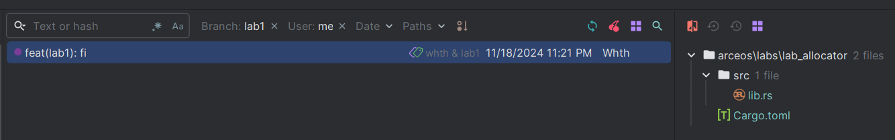

# 操作系统秋季训练营第三阶段学习总结博客

大家好，我是参加这次操作系统秋季训练营的一名学员。最近我们刚刚结束了第三阶段的学习，这个阶段主要围绕组件化内核设计与实践展开，包括了从Unikernel到宏内核的过渡，以及Hypervisor扩展等内容。
虽然由于时间关系我没能亲自动手完成所有的实验，但通过PPT和一些额外的挑战任务，我还是学到了不少东西。下面我就来分享一下这段时间的学习体会。

## 一、课程概述

### 组件化内核的概念与意义
> “If you don't need it, you don't pay for it”

组件化内核是这次训练营的核心思想，它强调的是将内核的功能分解成一系列独立的组件，这些组件可以灵活地组合起来形成不同规模和功能的内核。这种构建方式不仅提高了开发效率，还降低了维护难度，使得团队成员能够更有效地协作。
相比传统的内核设计，组件化方法允许开发者根据具体需求定制内核，从而更好地满足应用场景的需求。

### 主流内核模式对比
在训练营中，我们讨论了几种主流的内核模式，比如Unikernel和宏内核等。Unikernel是一种非常轻量级的内核形式，它将应用程序和内核紧密结合在一起，
共享同一地址空间，并且运行在同一个特权级别上。这使得Unikernel非常适合于需要高性能和低资源消耗的应用场景。而宏内核则提供了更加丰富的功能，支持多用户态进程，
每个进程都有自己的地址空间，这增强了系统的安全性和稳定性。但是，宏内核也因此变得更加复杂，对资源的需求也更高。

## 二、学习内容回顾

### Unikernel模式
第一周我们从最基础的Unikernel模式开始，逐步了解了如何通过增加或替换组件来构建出一个简单的内核。
例如，在U.1 Hello实验中，我们通过axruntime和axhal组件实现了向屏幕输出信息的基本功能；
而在U.3 ReadPFlash实验里，则引入了pagetable组件以支持地址空间重映射，从而实现对PFlash设备的读取。
这些实验帮助我理解了如何利用组件化的方法快速搭建起一个基本的内核环境。

### 宏内核扩展
第二周的内容转向了宏内核的设计，这是从Unikernel到更加复杂的操作系统的桥梁。
在M.1 UserPrivilege实验中，我们探索了如何让应用程序在较低的用户特权级别下运行，同时保持内核的安全性。这一转变意味着我们需要管理更多的地址空间，
并处理由此带来的复杂性问题。通过这样的练习，我对Unix操作系统中的用户空间与内核空间分离有了更深的理解——这种方式虽然增加了系统设计的难度，
但却极大地提高了系统的灵活性和安全性。

### Hypervisor扩展
最后一周专注于Hypervisor技术，这也是当前云计算领域的一个热点话题。
通过对H.1 VirtualMode等实验的学习，我了解到Hypervisor是如何模拟出多个虚拟机环境，让它们各自拥有独立的操作系统和硬件资源。
与KVM相比，本课程中的Hypervisor实现以简化模型为tradeoff，通过直接绑定vCPU、忽略多任务并发以及省略复杂的设备模拟等方式，降低了实现复杂度，
但牺牲了一定的灵活性和性能效率。

## 三、字节分配器设计挑战

尽管大部分时间都在理论学习上度过，我还是尝试着完成了11.15发布的字节分配器设计挑战。虽然最终并没有完全按照题目要求找到一种理想的字节分配算法实现，
却意外发现了测试用例中存在的一个小漏洞。这对我来说也是一个不小的收获，至少证明了自己具备一定的调试能力和批判性思维Xb。
此外，这个过程也加深了我对内存管理机制的理解，尤其是对于像TLSF这样复杂的分配策略有了初步的认识。

## 四、个人感悟

整个训练营期间，我深刻体会到组件化设计给操作系统开发带来的巨大便利。它可以让我们专注于特定领域的功能实现，而不必担心与其他部分的耦合度太高。然而，这也要求开发者具备较强的整体规划能力，否则很容易导致系统结构混乱。相比之下，传统Unix风格的操作系统就在某些方面可能显得不够灵活，唉唉，历史包袱。

总之，这次训练营给了我一次宝贵的机会去深入了解现代操作系统的设计理念和技术细节。虽然还有很多知识需要进一步消化吸收，但我相信这段经历将对我未来的职业发展产生积极影响。希望以后还能有机会参与更多类似的活动，继续充实自己的技术栈！

## 五、最后

十分感谢所有的讲师和同学的付出，让我有机会接触到如此优秀的技术，也给我带来了非常丰富的学习资源。