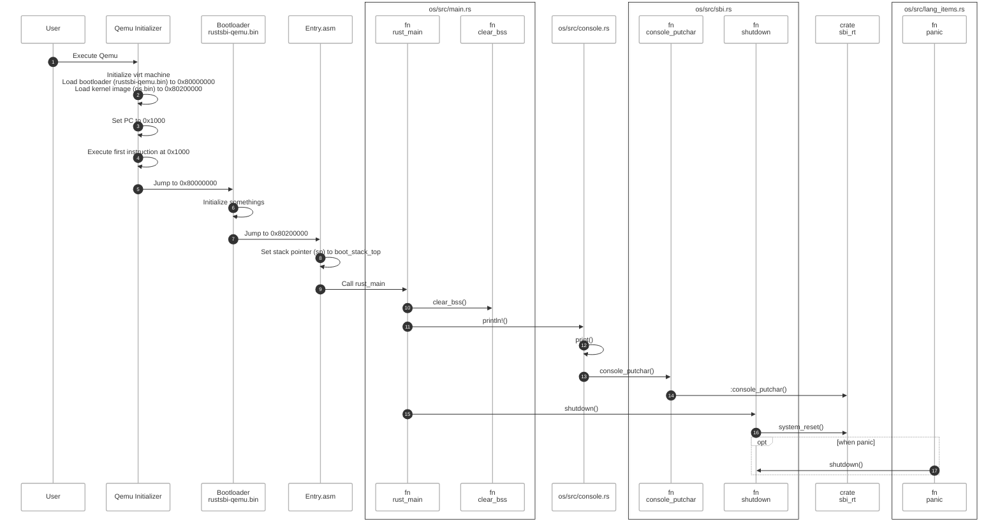
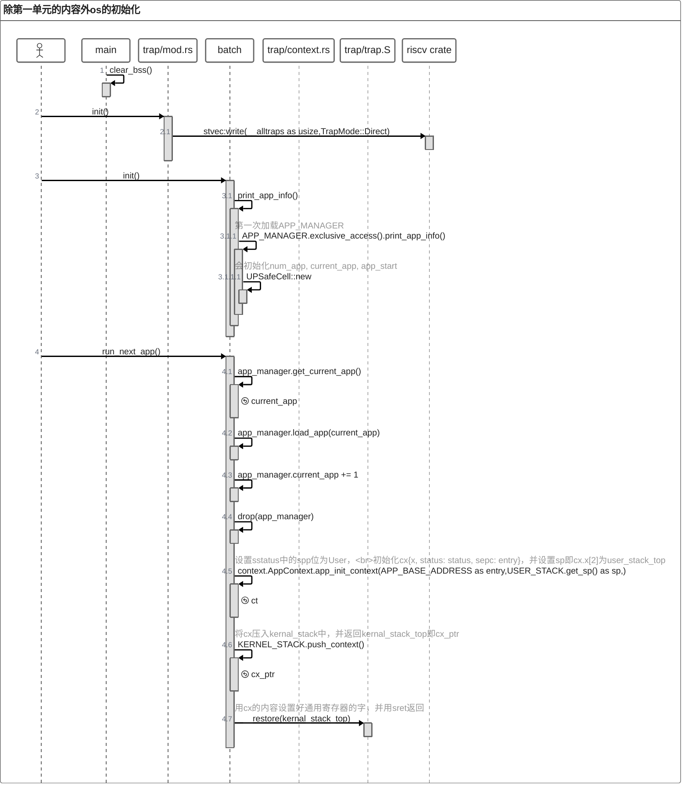
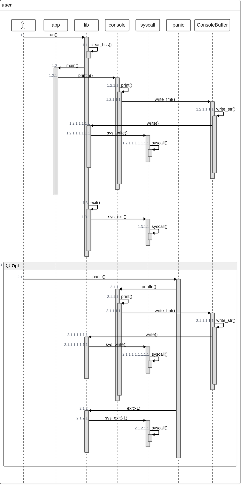
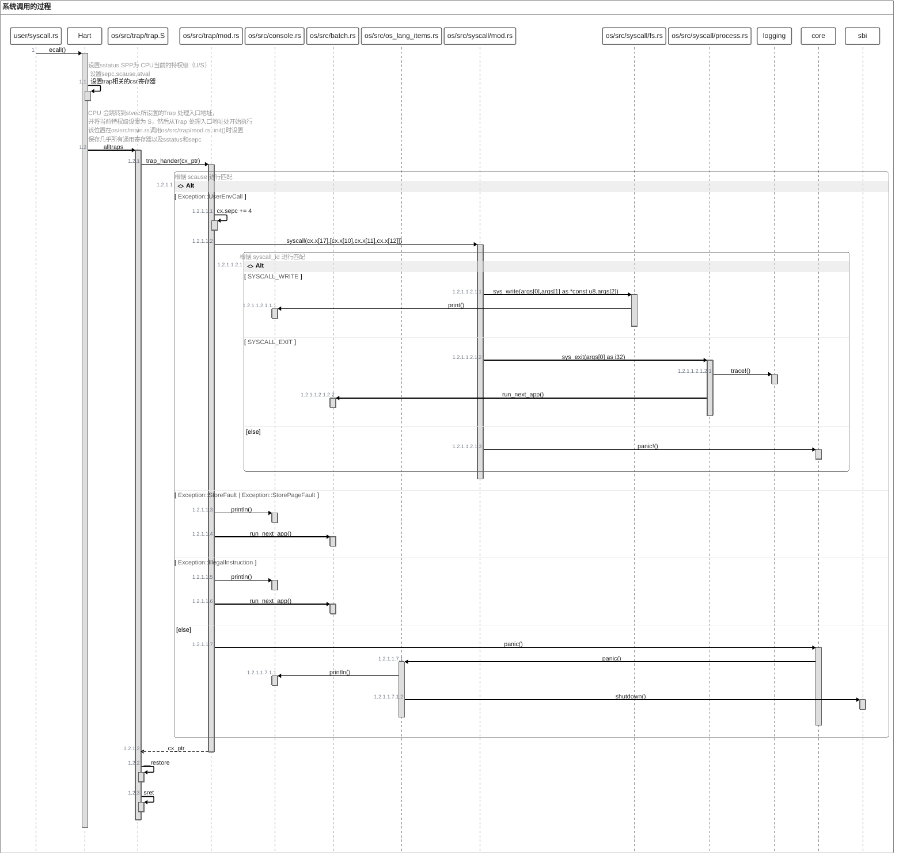
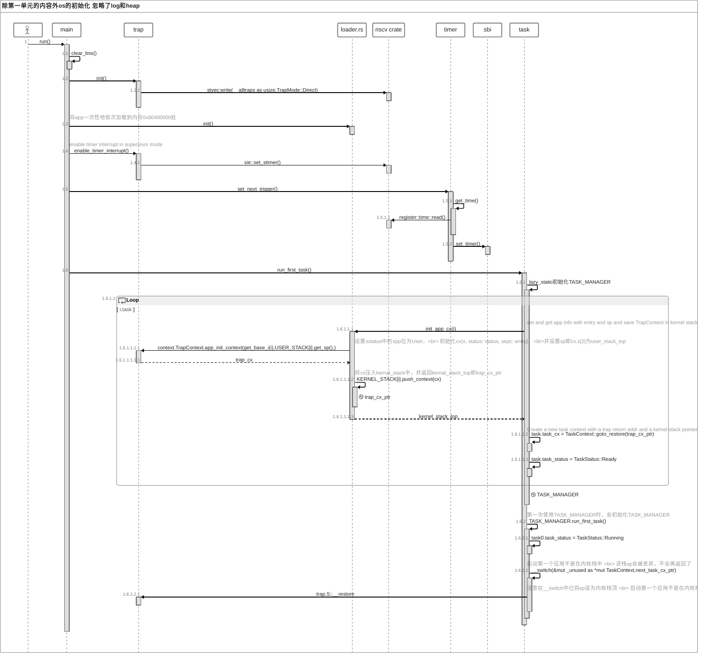
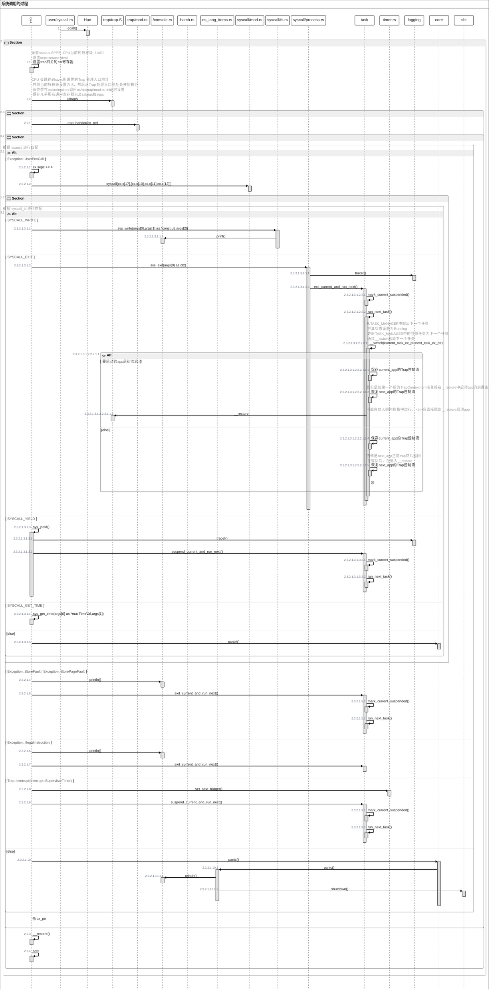
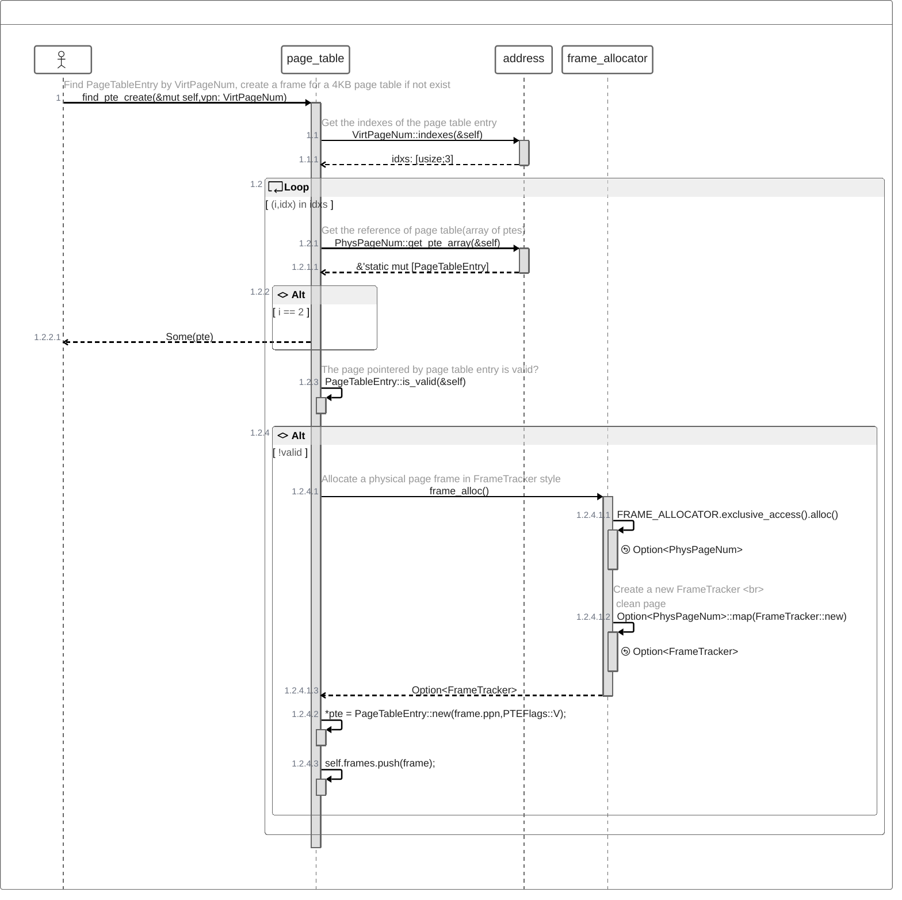

# 2024二阶段总结

在这一阶段，我对我的学习可以划分两个比较明显的时期，一个是前期比较懵懂地入门，一个是中后期的速通。
<!-- more -->
## 入门

刚刚接触时我是懵逼的、接触了几天后我是迷茫的，看了前两章后，有不少地方还是不太明白，我意识到我对一些相关知识的掌握是非常欠缺的。所以我暂停了一下。

在暂停后，我找了一些相关的资料（如riscv reader即riscv开放架构之道、riscv体系结构与实践，看了一些相关的视频（如plct lab放在B站上的[循序渐进，学习开发一个 RISC-V 上的操作系统](https://gitee.com/unicornx/riscv-operating-system-mooc)mooc，mooc看完了，书没有看完。

在对一些相关的知识有了一些了解。然后我又回到了rCore上，我重新审视了前两章，学习了第三章，并在前三章分别画了一些序列图、c4图、类图等十几张图，帮助我梳理与理解，为后面的学习打下了基础。

## 速通

接着，经过前面的时间消耗，所剩时间已经不多了，而且新知识可能忘的会比较快，所以在我看来已经堪堪入门后，就开始了速通（当然，这里的速通是相对于前三章而言的，不是各位大佬眼里的速通，是入门改）。

rCore每一章都是循序渐进的，我在每一章中花的时间主要是在文档的阅读和对系统架构、代码的理解上，花在lab上的时间反而并不多，仅有的在lab上卡住的几次，也大多由于看错题、粗心漏掉一些东西。

这一时期基本上就是看文档、做lab、看文档、做lab，如此循环，两点一线 -- 学习的乏味。

## 一些图

这些图有的可能有点不太对，但应该也差不了多少。

### 第一章
    
```plantuml
!include https://raw.githubusercontent.com/plantuml-stdlib/C4-PlantUML/master/C4_Component.puml

Container(os, "os", "crate", "kernel")
' Container(sbi, "sbi.rs", "crate", "封装 RustSBI")
Container(rustsbi, "rustsbi", "bin", "")
Container(log, "log", "crate", "日志库")
Container(hart, "hart", "hardware thread", "qemu模拟的硬件线程")

' Rel(os, app, "启动app")
' Rel(os, riscv, "管理csr寄存器")
' Rel(os, lazy_static, "静态变量初始化")
' Rel(os, sbi, "")
Rel(os, log, "日志输出")
Rel(os, rustsbi, "调用 RustSBI")
Rel(os, hart, "trap")
Rel(hart, rustsbi, "中断处理")

```
```plantuml
!include https://raw.githubusercontent.com/plantuml-stdlib/C4-PlantUML/master/C4_Component.puml

Container_Boundary(os, "os", "kernel"){
    Component(main, "os/src/main.rs", "mod", "操作系统主入口，负责初始化（清理 BSS 段）和启动各个组件") 
    Component(lang_items, "os/src/lang_items.rs", "mod", "Rust 语言项")
    Component(console, "os/src/console.rs", "mod", "负责输出信息")
    Component(logging, "os/src/logging.rs", "mod", "日志库封装")
    Component(sbi, "os/src/sbi.rs", "mod", "封装 sbi_rs")
}
Lay_L(console, lang_items)
Lay_L(lang_items , logging)

Container(app, "app", "crate", "应用程序")
Container(sbi_rs, "sbi_rs", "crate", "封装 RustSBI")
Container(rustsbi, "rustsbi", "bin", "RustSBI 的实现")
Container(log, "log", "crate", "日志库")

BiRel(app, os, "系统调用 \n 启动app")
Rel_D(main, console, "println!()")
Rel_D(main, logging, "init()")
Rel(main, log, "log相关函数")
Rel(console, sbi, "console_putchar() \n console_getchar() \n system_reset()")
Rel(log, console, "println!()")
Rel(sbi, sbi_rs, "调用 RustSBI 的封装")
Rel(sbi_rs, rustsbi, "调用 RustSBI")
Rel(lang_items, sbi, "发生 panic 时调用shutdown()")

```


### 第二章



```plantuml
!include https://raw.githubusercontent.com/plantuml-stdlib/C4-PlantUML/master/C4_Component.puml
' !include <C4/C4_Container>


Container(os, "os", "crate", "kernel")
Container(app, "app", "crate", "应用程序")
Container(riscv, "riscv", "crate", "Low level access to RISC-V processors")
Container(lazy_static, "lazy_static", "crate", "A macro for declaring lazily evaluated statics")
Container(rustsbi, "rustsbi", "bin", "")
Container(log, "log", "crate", "日志库")
Container(hart, "hart", "hardware thread", "qemu模拟的硬件线程")

Rel(os, app, "启动app")
Rel(os, riscv, "操作csr寄存器")
Rel(os, lazy_static, "静态变量初始化")
Rel(os, log, "日志输出")
Rel(os, hart, "trap")
Rel(hart, rustsbi, "中断处理")
Rel(app, hart, "trap")
Rel(hart, os, "中断处理 by trap.S::__alltraps")
```

```plantuml
!include https://raw.githubusercontent.com/plantuml-stdlib/C4-PlantUML/master/C4_Component.puml

Container_Boundary(user, "user", "应用程序"){
    Component(app, "app", "应用程序")
    Component(lib, "lib", "", "app入口和库")
    Component(console, "console",  "", "负责格式化输出")
    Component(syscall, "syscall", "", "系统调用")
    Component(lang_item, "lang_item", "", "处理panic")
}

Container(os, "os", "crate", "kernel")
' Container(app, "app", "crate", "应用程序")
Container(riscv, "riscv", "crate", "Low level access to RISC-V processors")
Container(lazy_static, "lazy_static", "crate", "A macro for declaring lazily evaluated statics")
Container(rustsbi, "rustsbi", "bin", "")
Container(log, "log", "crate", "日志库")
Container(hart, "hart", "hardware thread", "qemu模拟的硬件线程")

Rel(os, lib, "由__restore启动")
Rel(lib, app, "启动main()")
Rel(app, console, "调用println!()")
Rel(console, lib, "调用write()")
Rel(lib, syscall, "调用sys_write(), sys_exit()")
Rel(syscall, hart, "ecall")
Rel(lang_item, console, "当user panic时调用")
Rel(lang_item, lib, "当user panic时调用\n exit()")

' Rel(os, app, "启动app")
Rel(os, riscv, "操作csr寄存器")
Rel(os, lazy_static, "静态变量初始化")
Rel(os, hart, "ecall")
Rel(os, log, "日志输出")
' Rel(app, hart, "trap")
Rel(hart, rustsbi, "Trap处理")
Rel(hart, os, "Trap处理 by trap.S::__alltraps")

```

```plantuml
!include https://raw.githubusercontent.com/plantuml-stdlib/C4-PlantUML/master/C4_Component.puml
' !include <C4/C4_Container>

Container_Boundary(os, "os", "kernel"){
    Component(main, "os/src/main.rs", "mod", "初始化 Trap处理并加载和执行应用") 
    Component(lang_items, "os/src/lang_items.rs", "mod", "实现panic_handler")
    Component(console, "os/src/console.rs", "mod", "将打印字符的 SBI 接口封装实现格式化输出")
    Component(logging, "os/src/logging.rs", "mod", "日志库封装")
    Component(sbi, "os/src/sbi.rs", "mod", "封装 sbi")
    Component(batch, "os/src/batch.rs", "mod", "user_app批处理")
    Component(trap, "os/src/trap/", "mod", "Trap处理")
    Component(syscall, "os/src/syscall/", "mod", "系统调用")
    Component(sync, "os/src/sync/", "mod", "包装了Refcell，")
}
' Lay_L(console, lang_items)
' Lay_L(lang_items , logging)


Container(user, "user", "crate", "应用程序")
Container(rustsbi, "rustsbi", "bin", "")
Container(log, "log", "crate", "日志库")
Container(riscv, "riscv", "crate", "Low level access to RISC-V processors")
Container(lazy_static, "lazy_static", "crate", "A macro for declaring lazily evaluated statics")
Container(hart, "hart", "Hardware Thread", "qemu模拟的硬件线程")

Rel_D(main, console, "")
Rel_D(main, logging, "init()")
Rel(logging, log, "impl Log")
Rel_L(main, log, "log相关函数")
Rel(main, batch, "init() \n run_next_app()")
Rel(main, trap, "init()")
Rel(trap, console, "")
Rel(trap, riscv, "csr寄存器操作")
Rel(trap, syscall, "处理syscall")
Rel(trap, user, "通过trap.S::__restore\n 启动user")
Rel(batch, sync, "UPSafeCell")
Rel(batch, lazy_static, "延迟初始化user_MANAGER")
BiRel(batch, trap, "run_next_app()\n context相关操作 trap.S::__restore")
Rel(syscall, batch, "run_next_app()")
Rel(console, sbi, "console_putchar()")
Rel(log, console, "")
Rel(sbi, hart, "ecall")
Rel(hart, sbi, "中断处理")
Rel(user, hart, "trap")
Rel(hart, trap, "中断处理\n by trap.S::__alltraps")
Rel(lang_items, console, "发生 os panic 时\n调用println!()")
Rel(lang_items, sbi, "发生 os panic 时\n调用shutdown()")
```







### 第三章

```plantuml
!include https://raw.githubusercontent.com/plantuml-stdlib/C4-PlantUML/master/C4_Component.puml

Container(os, "os", "crate", "kernel")
Container(app, "app", "crate", "应用程序")
Container(riscv, "riscv", "crate", "Low level access to RISC-V processors")
Container(lazy_static, "lazy_static", "crate", "A macro for declaring lazily evaluated statics")
Container(rustsbi, "rustsbi", "bin", "")
Container(log, "log", "crate", "日志库")
Container(hart, "hart", "hardware thread", "qemu模拟的硬件线程")

Rel(os, app, "启动app")
Rel(os, riscv, "操作csr寄存器")
Rel(os, lazy_static, "静态变量初始化")
Rel(os, log, "日志输出")
Rel(os, hart, "trap")
Rel(hart, rustsbi, "中断处理")
Rel(app, hart, "trap")
Rel(hart, os, "中断处理 by trap.S::__alltraps")

```

```plantuml
!include https://raw.githubusercontent.com/plantuml-stdlib/C4-PlantUML/master/C4_Component.puml

Container_Boundary(os, "os", "kernel"){
    Component(main, "os/src/main.rs", "mod", "初始化 Trap 处理并加载和执行应用") 
    Component(lang_items, "os/src/lang_items.rs", "mod", "实现 panic_handler")
    Component(console, "os/src/console.rs", "mod", "将打印字符的 SBI 接口封装实现格式化输出")
    Component(sbi, "os/src/sbi.rs", "mod", "封装 SBI")
    Component(trap, "os/src/trap/", "mod", "Trap 处理")
    Component(syscall, "os/src/syscall/", "mod", "系统调用")
    Component(loader, "os/src/loader.rs", "mod", "将应用加载到内存并进行管理")
    Component(sync, "os/src/sync/", "mod", "包装了 RefCell，实现内核内部的可变性")
    Component(task, "os/src/task/", "mod", "任务管理")
    Component(timer, "os/src/timer.rs", "mod", "RISC-V timer-related functionality")
}

Container(user, "user", "crate", "应用程序")
Container(rustsbi, "rustsbi", "bin", "SBI 实现")
Container(riscv, "riscv", "crate", "低级别访问 RISC-V 处理器")
Container(lazy_static, "lazy_static", "crate", "延迟初始化的静态变量宏")
Container(hart, "hart", "Hardware Thread", "QEMU 模拟的硬件线程")

Rel(main, console, "")
Rel(main, trap, "初始化 Trap 处理\n 启用supervisor timer interrupt")
Rel(main, loader, "加载应用到内存")
Rel(main, timer, "Set the next timer interrupt")
Rel(main, task, "初始化任务管理\n并运行第一个任务")
Rel(trap, riscv, "操作 CSR 寄存器")
Rel(trap, syscall, "处理系统调用")
Rel(trap, hart, "通过 trap.S::__restore 启动用户态应用")
Rel(task, sync, "使用 RefCell 包装TaskManager内部的可变部分")
Rel(task, lazy_static, "使用 lazy_static! 定义TASK_MANAGER")
Rel(task, loader, "init_app_cx")
Rel(syscall, console, "处理 sys_write")
Rel(syscall, task, "退出或挂起当前任务，\n并运行下一个")
Rel(syscall, timer, "get_time_us()")
Rel(console, sbi, "使用 console_putchar 通过 SBI 输出字符")
Rel(sbi, hart, "通过 `ecall` 与硬件线程交互")
Rel(user, hart, "用户态应用通过 `ecall` 发起系统调用")
Rel(hart, trap, "处理中断和系统调用，由 trap.S::__alltraps进入")
Rel(hart, rustsbi, "处理 SBI 调用")
Rel(lang_items, console, "发生 OS panic 时调用 println!()")
Rel(lang_items, sbi, "发生 OS panic 时调用 shutdown()")

```

```plantuml
!include https://raw.githubusercontent.com/plantuml-stdlib/C4-PlantUML/master/C4_Component.puml

Container_Boundary(user, "user", "应用程序"){
    Component(app, "app", "应用程序")
    Component(lib, "lib", "", "app入口和库")
    Component(console, "console",  "", "负责格式化输出")
    Component(syscall, "syscall", "", "系统调用")
    Component(lang_item, "lang_item", "", "处理panic")
}

Container(os, "os", "crate", "kernel")
' Container(app, "app", "crate", "应用程序")
Container(riscv, "riscv", "crate", "Low level access to RISC-V processors")
Container(lazy_static, "lazy_static", "crate", "A macro for declaring lazily evaluated statics")
Container(rustsbi, "rustsbi", "bin", "")
Container(log, "log", "crate", "日志库")
Container(hart, "hart", "hardware thread", "qemu模拟的硬件线程")

Rel(os, lib, "由__restore启动")
Rel(lib, app, "启动main()")
Rel(app, console, "调用println!()")
Rel(console, lib, "调用write()")
Rel(lib, syscall, "调用sys_write(), sys_exit()")
Rel(syscall, hart, "ecall")
Rel(lang_item, console, "当user panic时调用")
Rel(lang_item, lib, "当user panic时调用\n exit()")

' Rel(os, app, "启动app")
Rel(os, riscv, "操作csr寄存器")
Rel(os, lazy_static, "静态变量初始化")
Rel(os, hart, "ecall")
Rel(os, log, "日志输出")
' Rel(app, hart, "trap")
Rel(hart, rustsbi, "Trap处理")
Rel(hart, os, "Trap处理 by trap.S::__alltraps")

```






### 第四章

```plantuml
package mm {

class address {
}

struct PhysAddr {
    +0: usize
    +floor() -> PhysPageNum
    +ceil() -> PhysPageNum
    +page_offset() -> usize
    +aligned() -> bool
    +get_mut<T>() -> &'static mut T
}

struct VirtAddr {
    +0: usize
    +floor() -> VirtPageNum
    +ceil() -> VirtPageNum
    +page_offset() -> usize
    +aligned() -> bool
}

struct PhysPageNum {
    +0: usize
    +get_pte_array() -> &'static mut [PageTableEntry]
    +get_bytes_array() -> &'static mut [u8]
    +get_mut<T>() -> &'static mut T
}

struct VirtPageNum {
    +0: usize
    +indexes() -> [usize; 3]
}

struct SimpleRange<T> {
    l: T
    r: T
    +new(start: T, end: T) -> Self
    +get_start() -> T
    +get_end() -> T
}

struct SimpleRangeIterator<T> {
    current: T
    end: T
    +new(l: T, r: T) -> Self
    +next() -> Option<Self::Item>
}

class StepByOne {
    +step()
}

address o-- PhysAddr : 定义
address o-- VirtAddr : 定义
address o-- PhysPageNum : 定义
address o-- VirtPageNum : 定义
address o-- SimpleRange : 定义
address o-- SimpleRangeIterator : 定义
address *-- StepByOne : 实现

PhysAddr *-- PhysPageNum
VirtAddr *-- VirtPageNum
SimpleRange *-- SimpleRangeIterator : 迭代器

class frame_allocator {
    init_frame_allocator()
    frame_alloc() -> Option<FrameTracker>
    frame_dealloc(ppn: PhysPageNum)
}

struct FrameTracker {
    +ppn: PhysPageNum
    +new(ppn: PhysPageNum) -> Self
}

struct StackFrameAllocator {
    current: usize
    end: usize
    recycled: Vec<usize>
    +new() -> Self
    +init(l: PhysPageNum, r: PhysPageNum)
    +alloc() -> Option<PhysPageNum>
    +dealloc(ppn: PhysPageNum)
}

class FrameAllocator {
    +new() -> Self
    +alloc() -> Option<PhysPageNum>
    +dealloc(ppn: PhysPageNum)
}

frame_allocator o-- FrameTracker : 定义
frame_allocator o-- StackFrameAllocator : 定义
frame_allocator *-- FrameAllocator : 实现

StackFrameAllocator *-- FrameAllocator : 实现

class heap_allocator {
    init_heap()
    heap_test()
}

heap_allocator o-- LockedHeap : 使用

class memory_set {
    kernel_stack_position(app_id: usize) -> (usize, usize)
    remap_test()
}

struct MemorySet {
    page_table: PageTable
    areas: Vec<MapArea>
    +new_bare() -> Self
    +token() -> usize
    +insert_framed_area(...)
    +push(...)
    +map_trampoline()
    +new_kernel() -> Self
    +from_elf(elf_data: &[u8]) -> (Self, usize, usize)
    +activate()
    +translate(vpn: VirtPageNum) -> Option<PageTableEntry>
    +shrink_to(...)
    +append_to(...)
}

struct MapArea {
    vpn_range: VPNRange
    data_frames: BTreeMap<VirtPageNum, FrameTracker>
    map_type: MapType
    map_perm: MapPermission
    +new(...)
    +map_one(...)
    +unmap_one(...)
    +map(page_table: &mut PageTable)
    +unmap(page_table: &mut PageTable)
    +shrink_to(...)
    +append_to(...)
    +copy_data(...)
}

enum MapType {
    Identical
    Framed
}

class MapPermission {
    +R
    +W
    +X
    +U
}

memory_set o-- MemorySet : 定义
memory_set o-- MapArea : 定义
memory_set o-- MapType : 定义
memory_set o-- MapPermission : 定义


class page_table {
    translated_byte_buffer(token: usize, ptr: *const u8, len: usize) -> Vec<&'static mut [u8]>
}

class PTEFlags {
    +V
    +R
    +W
    +X
    +U
    +G
    +A
    +D
}

struct PageTableEntry {
    +bits: usize
    +new(ppn: PhysPageNum, flags: PTEFlags) -> Self
    +empty() -> Self
    +ppn() -> PhysPageNum
    +flags() -> PTEFlags
    +is_valid() -> bool
    +readable() -> bool
    +writable() -> bool
    +executable() -> bool
}

struct PageTable {
    root_ppn: PhysPageNum
    frames: Vec<FrameTracker>
    +new() -> Self
    +from_token(satp: usize) -> Self
    +find_pte_create(...)
    +find_pte(...)
    +map(vpn: VirtPageNum, ppn: PhysPageNum, flags: PTEFlags)
    +unmap(vpn: VirtPageNum)
    +translate(vpn: VirtPageNum) -> Option<PageTableEntry>
    +token() -> usize
}

page_table o-- PTEFlags : 定义
page_table o-- PageTableEntry : 定义
page_table o-- PageTable : 定义

PageTable *-- PageTableEntry
PageTableEntry *-- PTEFlags
PageTable *-- FrameTracker


MemorySet *-- PageTable
MemorySet *-- MapArea
MapArea *-- VPNRange
MapArea *-- FrameTracker
MapArea *-- MapType
MapArea *-- MapPermission
}
```


