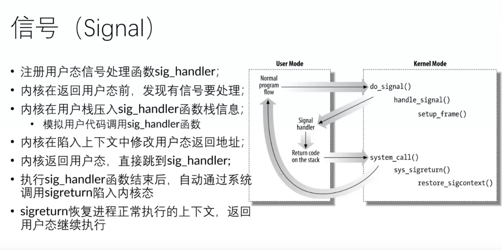

# Rustlings

关于第一阶段的Rustlings，还是花了很多时间去学习Rust。一开始是直接去看《Rust程序设计语言》，看了大概大半个月吧，把一些较为简单的概念和程序过了一遍。也是第一次接触这类内存安全类语言，第一次看到所有权，引用的时候还有点畏惧，对于没怎么深入学习过C++的人来说学起来还是有些吃力的。后面又去看了《Rust圣经》，发现有趣多了，提供了很多代码案例，很有意思。最后也跟着写了一个rust小项目minigrep。rustlings也是边学边查文档边做，做起来很有意思很有成就感。


# rcore实验

## rcore批处理系统编译逻辑

- link.ld链接脚本将程序分成.text、.rodata、.data、.bss。
- build.py会将app目录下的bin文件进行编译，将程序的text段加载到以0x8040000开始的用来存放app代码的内存空间，且规定每块app空间为0x2000。
- build.rs会遍历user目录下的build文件夹中刚才通过objcopy生成的bin文件，然后生成对应的link_app.S。其实就是将app下的bin文件进行装载，在每个app的内存空间开始和结尾设置标号，并暴露给os以供调用。


## 页表机制

单页表：**一块地址空间分为用户虚拟地址和内核虚拟地址，内核虚拟地址映射到内核物理地址**


**单页表会出现熔断漏洞**

比如在用户虚拟空间中有一段代码需要访问内核数据空间的页面，因为cpu流水线机制，数据可能已经被放在cache中。但如果这时候我们取值失败了但是由于已经把数据放在了cache中。下一次我们从用户态直接访问这几个页面的时候，总有那么一个页面访问的速度远比其他的页面快。


双页表：**分为用户地址空间和内核地址空间，用户地址空间又分内核态代码和用户态代码。**

那么当我们在用户态访问内核数据时，其实是不知道数据放在哪的，这样就可以避免熔断漏洞。


## exec

```rust
/// Load a new elf to replace the original application address space and start execution
    pub fn exec(&self, elf_data: &[u8]) {
        // memory_set with elf program headers/trampoline/trap context/user stack
        let (memory_set, user_sp, entry_point) = MemorySet::from_elf(elf_data);
        let trap_cx_ppn = memory_set
            .translate(VirtAddr::from(TRAP_CONTEXT_BASE).into())
            .unwrap()
            .ppn();

        // **** access current TCB exclusively
        let mut inner = self.inner_exclusive_access();
        // substitute memory_set
        inner.memory_set = memory_set;
        // update trap_cx ppn
        inner.trap_cx_ppn = trap_cx_ppn;
        // initialize base_size
        inner.base_size = user_sp;
        // initialize trap_cx
        let trap_cx = inner.get_trap_cx();
        *trap_cx = TrapContext::app_init_context(
            entry_point,
            user_sp,
            KERNEL_SPACE.exclusive_access().token(),
            self.kernel_stack.get_top(),
            trap_handler as usize,
        );
        // **** release inner automatically
    }
```


### 步骤 1：创建新的 `MemorySet`

```
let (memory_set, user_sp, entry_point) = MemorySet::from_elf(elf_data);
```

- 调用 `MemorySet::from_elf` 解析传入的 ELF 数据，并创建一个新的 `MemorySet`，即新的地址空间。
- 该函数返回以下三个值：
  - `memory_set`：表示该进程的新内存映射集合，包含代码段、数据段、用户栈等信息。
  - `user_sp`：新用户栈的栈顶地址。
  - `entry_point`：新程序的入口地址，表示从此处开始执行新的 ELF 程序。

### 步骤 2：获取新的 `trap_cx_ppn`

```
let trap_cx_ppn = memory_set
    .translate(VirtAddr::from(TRAP_CONTEXT_BASE).into())
    .unwrap()
    .ppn();
```

- 通过 `translate` 方法，将 `TRAP_CONTEXT_BASE` 这个虚拟地址转换为物理页号（`trap_cx_ppn`）。
- `trap_cx_ppn` 表示陷入上下文（`TrapContext`）所在的物理页号，用于进程的系统调用或异常处理。

### 步骤 3：独占访问当前进程控制块（TCB）

```
let mut inner = self.inner_exclusive_access();
```

- 通过 `inner_exclusive_access` 方法独占访问当前进程的 `TaskControlBlockInner` 结构体，确保在以下步骤中可以对进程的内部状态进行修改。

### 步骤 4：替换 `MemorySet`

```
inner.memory_set = memory_set;
```

- 将当前进程的 `memory_set` 替换为新创建的 `memory_set`，这样新加载的 ELF 程序就成为该进程的地址空间。
- 这一步实现了对原应用程序地址空间的替换。

### 步骤 5：更新 `trap_cx_ppn`

```
inner.trap_cx_ppn = trap_cx_ppn;
```

- 更新 `trap_cx_ppn` 字段，设置新的 `trap_cx_ppn`，确保进程的陷入上下文指针正确指向新的物理页。

### 步骤 6：初始化 `base_size`

```
inner.base_size = user_sp;
```

- 更新 `base_size` 字段为新的用户栈顶地址 `user_sp`。
- `base_size` 用于保存用户栈的初始栈顶，便于栈空间管理。

### 步骤 7：初始化 `trap_cx`

```
let trap_cx = inner.get_trap_cx();
*trap_cx = TrapContext::app_init_context(
    entry_point,
    user_sp,
    KERNEL_SPACE.exclusive_access().token(),
    self.kernel_stack.get_top(),
    trap_handler as usize,
);
```

- 调用 `get_trap_cx` 获取当前进程的陷入上下文指针。

- 使用 

  ```
  TrapContext::app_init_context
  ```

   函数重新初始化陷入上下文，设置新程序的执行信息：

  - `entry_point`：新程序的入口地址。
  - `user_sp`：用户栈顶地址。
  - `KERNEL_SPACE.exclusive_access().token()`：内核空间的访问令牌，确保正确的权限。
  - `self.kernel_stack.get_top()`：内核栈的栈顶地址，用于中断或系统调用时的上下文切换。
  - `trap_handler as usize`：陷入处理函数的地址，用于异常处理。

### 结尾：释放 `inner` 锁

在 `inner` 独占访问结束时，`inner_exclusive_access()` 产生的独占访问会自动释放，允许其他任务对该进程进行访问。

### 总结

该 `exec` 方法执行以下步骤来加载和执行一个新的 ELF 程序：

1. 从 ELF 数据中构建新的 `MemorySet`、用户栈顶地址、程序入口点。
2. 获取并设置新的陷入上下文物理页号 `trap_cx_ppn`。
3. 独占访问当前进程控制块，并逐步替换内存集、更新陷入上下文等信息。
4. 重新初始化陷入上下文，确保该进程从新的程序入口执行。


## rcore调度策略

TaskManager任务管理器管理着一个任务就绪队列（先进先出策略），os初始化过后会在`run_tasks`中无限循环，取出任务及任务保存的寄存器`task_cx`，然后通过`__switch`切换`idle_task`到`next_task`(实际就是task_cx中寄存器的切换)，如果没有任务或当前任务释放控制权则会调用`schedule`切换到`idle_task`


## 进程间通信

### 管道（Pipe）

可表示为两个文件描述符加一段**内核空间**中的内存

```
// 传入数组，转换成管道的读写端的文件描叙符
int pipe(int pipefd[2]);
```

通过操作文件描述符来分别操作读写端进行进程间通信


- 如何实现shell中管道符“|”功能

可以fork两个子进程，pid1的执行流可以使用dup2函数将stdout重定向到pipefd[1] （写端），并关闭管道的读写端，执行第一条命令

pid2的执行流使用dup2函数将stdin重定向到pipefd[0] （读端），关闭管道的读写端，执行第二条命令

最后父进程关闭读写端并wait两个子进程


**匿名管道**：只能是**具有血缘关系**的进程之间通信；它只能实现一个进程写另一个进程读，而如果需要两者同时进行时，就得重新打开一个管道。

为了使任意两个进程之间能够通信，就提出了**命名管道**（named pipe 或 FIFO）。
1、与管道的区别：提供了**一个路径名与之关联**，以FIFO文件的形式存储于文件系统中，能够**实现任何两个进程之间通信**。而匿名管道对于文件系统是不可见的，它仅限于在父子进程之间的通信。
2、FIFO是一个设备文件，在文件系统中以文件名的形式存在，因此即使进程与创建FIFO的进程不存在血缘关系也依然可以通信，前提是可以访问该路径。
3、FIFO(first input first output)总是遵循先进先出的原则，即第一个进来的数据会第一个被读走。


### 消息队列


### 信号（Signal）




在rCore中，当trap发生进入`trap_handler`函数，其中会调用`handle_signals`，循环调用`check_pending_signals`检测进程结构体中的成员来判断是否有`signal`到来，如果是内核信号，则在内核执行处理函数`call_kernel_signal_handler(signal)`，如果是用户信号则需要返回用户态执行处理函数`call_user_signal_handler(sig, signal)`


