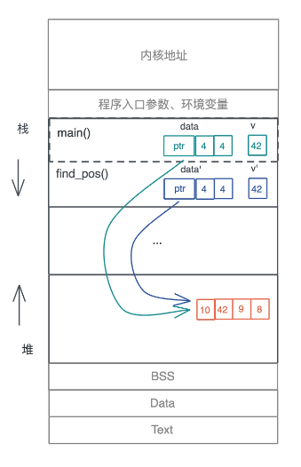

# 2024春夏季开源操作系统训练营Blog-第一阶段-罗健峰

> 一些学习链接：
> - [ Rust 程序设计语言(The Rust Programming Language) ](https://doc.rust-lang.org/book/)
> - [ Rust语言圣经(Rust Course) ](https://course.rs)
> - [ Rust语言小抄(Rust Language Cheat Sheet) ](https://cheats.rs)

## 前言

在21年下半年的时候，当时想着给前端的某个项目赋能，由于前端项目过于臃肿、代码质量不高，导致了不单单是开发还是维护都提出了巨大的工程量，提升前端的编译速度和开发效率的情况迫在眉睫，无意中发现Rust在webassembly领域是有一地之席的、在前端基建方面具有与生俱来的优势。

所以很单纯的目的就是想利用Rust这门高性能、安全性的语言来提升前端打包的效率。

目前Rust社区里已经有使用Rust为基础开发的前端打包工具**Turbopack**。

非常自然的我进入到了Rust这门语言的学习。

## 第一阶段总结

由于Rust，我是有基础的。所以在第一阶段我可能更加注重的是Rust基础的巩固，同时加深使用Rust语言的算法描述。

学一门语言，除了学习各类语言相同的编程概念外，其中，学习该语言自身的特性和适用场景也是非常重要的。

Rust作为一门系统级编程语言，采百家之长，自身形成一些Rust语言所特有的语言特性，其中变量的所有权和生命周期就是Rust自身语言特性中最璀璨的一块。

👇👇👇现在给大家总结和分享一下我在开源操作系统训练营第一阶段的总结。👇👇👇

1. 思维转换
2. 所有权和生命周期

### 一、思维转换

**在学习Rust的过程中，如果你想从其他语言迁移到Rust，必须要经过一段时期的思维转换（Paradigm Shift）**

从命令式（imperative）编程语言转换到函数式（functional）编程语言、从变量的可变性（mutable）迁移到不可变性（immutable）、从弱类型语言迁移到强类型语言，以及从手工或者自动内存管理到通过生命周期来管理内存，难度是多重叠加。

而 Rust 中最大的思维转换就是变量的所有权和生命周期，这是几乎所有编程语言都未曾涉及的领域。

### 二、掌握Rust基本概念

只列出我认为学习Rust这门语言的内容和我入手其他语言的经验之谈。

**先把握大体后追踪语言细节**。

1. 数据类型
    - 基本类型、复合类型
    - [数据类型在内存中的布局](https://cheats.rs/#memory-layout)
2. 所有权和借用
3. 流程控制
4. 模式匹配
5. 函数
    - 泛型
    - 特征
6. 包和模块、注释等
7. cargo及常用库（tokio、serde等）
8. rust项目的工程化（代码规范化、commit规则等）

### 三、所有权和生命周期

Rust这门语言最耀眼的设计就在于变量的所有权机制和生命周期，这也是Rust这门语言我认为最具代表性的特征。

它带给了Rust语言最本质或者说最核心的点、就是内存的管理。致使使用这门语言的人要有强烈的内存分布和管理内存的能力，**所有权和生命周期是 Rust 和其它编程语言的主要区别，也是 Rust 其它知识点的基础。**


#### 本质上来说所有权和生命周期

```rust

fn main() {
    let data = vec![10, 42, 9, 8];
    let v = 42;
    if let Some(pos) = find_pos(data, v) {
        println!("Found {} at {}", v, pos);
    }
}

fn find_pos(data: Vec<u32>, v: u32) -> Option<usize> {
    for (pos, item) in data.iter().enumerate() {
        if *item == v {
            return Some(pos);
        }
    }
    
    None
}

```
动态数组因为大小在编译期无法确定，所以放在堆上，并且在栈上有一个包含了长度和容量的胖指针指向堆上的内存。

在调用 find_pos() 时，main() 函数中的局部变量 data 和 v 作为参数传递给了 find_pos()，所以它们会被放在 find_pos() 的参数区。

<center>
    <br/>
    <span>图1</span>
</center>

按照大多数编程语言的做法，现在堆上的内存就有了两个引用。不光如此，我们每把 data 作为参数传递一次，堆上的内存就会多一次引用。

但是，这些引用究竟会做什么操作，我们不得而知，也无从限制；而且堆上的内存究竟什么时候能释放，尤其在多个调用栈引用时，很难厘清，取决于最后一个引用什么时候结束。所以，这样一个看似简单的函数调用，给内存管理带来了极大麻烦。

对于堆内存多次引用的问题，我们先来看大多数语言的方案：
1. **C/C++要求开发者手工处理**：非常不便。这需要我们在写代码时高度自律，按照前人总结的最佳实践来操作。但人必然会犯错，一个不慎就会导致内存安全问题，要么内存泄露，要么使用已释放内存，导致程序崩溃。
   
2. **Java等语言使用追踪式GC**：通过定期扫描堆上数据还有没有人引用，来替开发者管理堆内存，不失为一种解决之道，但 GC 带来的 STW 问题让语言的使用场景受限，性能损耗也不小。

3. **ObjC/Swift使用自动引用计数（ARC）**：在编译时自动添加维护引用计数的代码，减轻开发者维护堆内存的负担。但同样地，它也会有不小的运行时性能损耗。

现存方案都是从管理引用的角度思考的，有各自的弊端。我们回顾刚才梳理的函数调用过程，从源头上看，本质问题是堆上内存会被随意引用，那么换个角度，我们是不是可以限制引用行为本身呢？

这个想法打开了新的大门，Rust 就是这样另辟蹊径的。

所以所有权机制规定了以下3点来限制引用。

- **一个值只能被一个变量所拥有，这个变量被称为所有者（Each value in Rust has a variable that’s called its owner）。**
- **一个值同一时刻只能有一个所有者**（There can only be one owner at a time），也就是说不能有两个变量拥有相同的值。所以对应刚才说的变量赋值、参数传递、函数返回等行为，旧的所有者会把值的所有权转移给新的所有者，以便保证单一所有者的约束。
- **当所有者离开作用域，其拥有的值被丢弃**（When the owner goes out of scope, the value will be dropped），内存得到释放。

在这三条所有权规则的约束下，我们看开头的引用问题是如何解决的：

<center>
    <br/>
    <span>图2</span>
</center>

原先 main() 函数中的 data，被移动到 find_pos() 后，就失效了，编译器会保证 main() 函数随后的代码无法访问这个变量，这样，就确保了堆上的内存依旧只有唯一的引用。

本质上来讲这就是所有权机制所保证的

其中又牵扯出了**移动（Move）和借用（borrow）、引用（Reference）的规则**

##### 移动

变量data的所有权被移动给另一个data1了、后续data1的所有权移动到了sum函数中、导致了变量data和data1
都被移动、无法使用。

可以看到，所有权规则，解决了谁真正拥有数据的生杀大权问题，让堆上数据的多重引用不复存在，这是它最大的优势。

```rust
fn main() {
    let data = vec![1, 2, 3, 4];
    let data1 = data;
    println!("sum of data1: {}", sum(data1));
    println!("data1: {:?}", data1); // error1
    println!("sum of data: {}", sum(data)); // error2
}

fn sum(data: Vec<u32>) -> u32 {
    data.iter().fold(0, |acc, x| acc + x)
}
```

但是，这也会让代码变复杂，尤其是一些只存储在栈上的简单数据，如果要避免所有权转移之后不能访问的情况，我们就需要手动复制，会非常麻烦，效率也不高。

Rust 考虑到了这一点，提供了两种方案：

1. 如果你不希望值的所有权被转移，在 Move 语义外，Rust 提供了 Copy 语义。如果一个数据结构实现了 Copy trait，那么它就会使用 Copy 语义。这样，在你赋值或者传参时，值会自动按位拷贝（浅拷贝）。

2. 如果你不希望值的所有权被转移，又无法使用 Copy 语义，那你可以“借用”数据。

##### 借用和引用

其实，在 Rust 中，“借用”和“引用”是一个概念，只不过在其他语言中引用的意义和 Rust 不同，所以 Rust 提出了新概念“借用”，便于区分。

本质上来将就是不希望所有权被转移、又无法使用 Copy 语义。

#### 总结

打个比方：我拥有一本书，会有以下情况

我把这本书送给了朋友、那我就丧失了这本书的拥有权(所有权)。

我把这本书借给了朋友、朋友不拥有这本书、但有借用，可以修改内容（可变的引用），当然我也可以提醒他不要在我的书上做标记（不可变的引用）。

其中实现Copy trait的语义的意思就是、朋友将这本书拿去复印了、他拥有了复印这本书的所有权、所以我们俩都拥有了不同的所有权。


当然也会有不同的情况发生，比如说这本书是我们俩一起出钱买的，我们俩都应该拥有这本书的所有权。进而Rust引入Rc、Arc、Cell、RefCell等智能指针来实现一个变量会产生多所有权的情况。


## 个人总结

第一阶段的基础还是蛮重要、一些使用Rust语言描述的语言细节还是需要多多关注，为我们后面的内容打好基础。

进一步感谢开源操作系统社区的老师和技术人员，感谢你们辛苦的付出🌾🌾🌾。

期待第二阶段的学习、展开新的篇章。