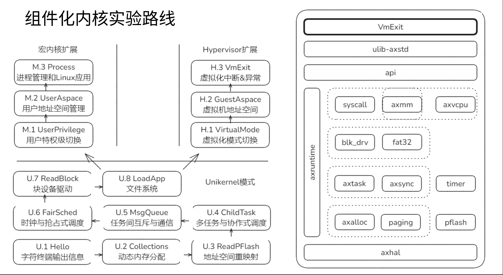
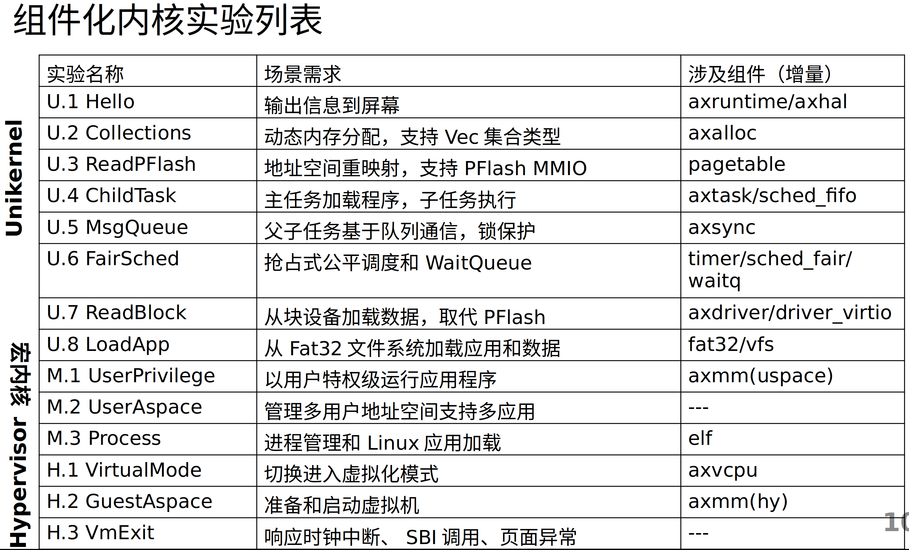
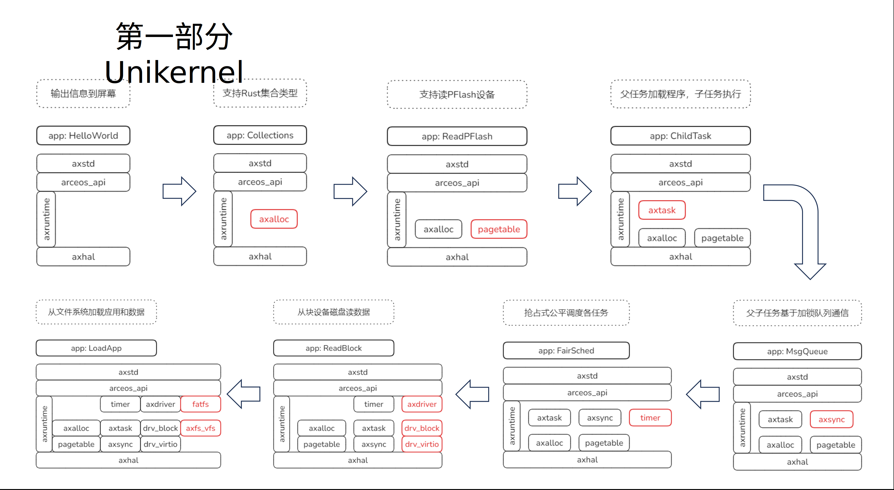
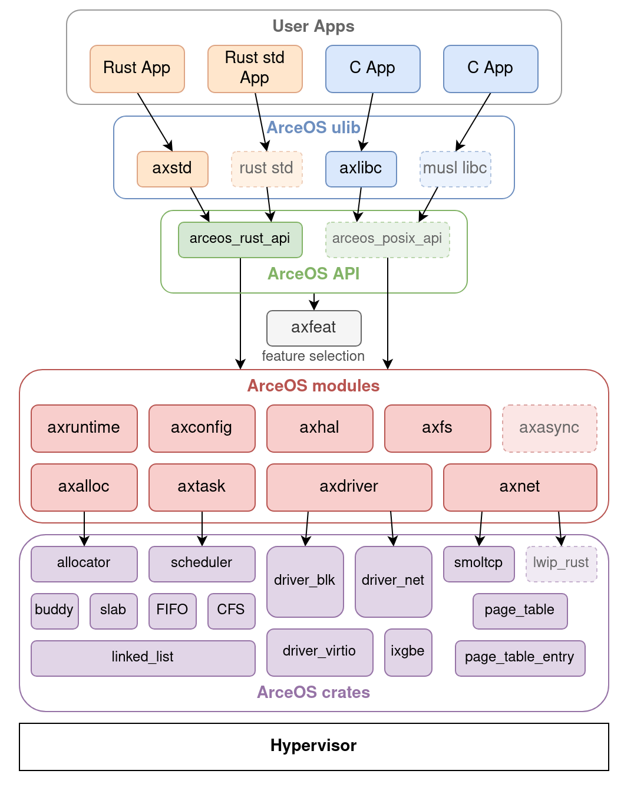
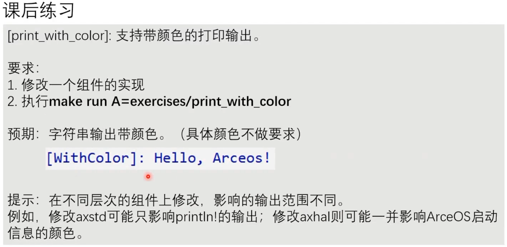
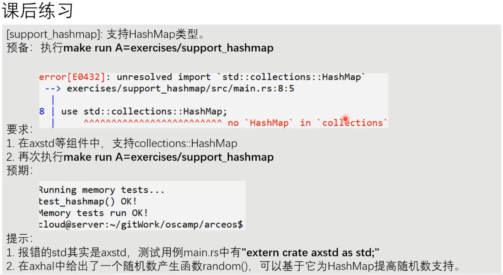

# 记得恢复package.json

# 主要内容
## 组件化内核实验路线
* 第一周 组件化内核基础和Unikernel模式（以下4部分压缩合并到3次课）
内核组件化基本概念、思路和框架 (U.1)
内存管理 - 分页、地址空间(U.3)和动态内存分配(U.2)
任务调度 - 任务与运行队列(U.4)、协作式调度(U.5) 、 抢占式调度(U.6)
块设备驱动(U.7)和文件系统(U.8)
* 第二周 宏内核扩展（其中第3次课由郑友捷老师讲，内容待定）
从Unikernel到宏内核的扩展 (M.1)
用户地址空间管理和页面异常(M.2)
进程和Linux应用支持(M.3)
* 第三周 Hypervisor扩展
从Unikernel到宏内核的扩展 (H.1)
Guest地址空间管理(H.2)
VMExit各类情况处理与设备管理 (H.3)



## ArceOS框架
除了运行需要的基本工具外，其他所有东西都可以以组件的形式添加到内核中，通过rust提供的feature，能够自行选择需要的组件，实现内核最小化运行。
axfeat是一个空的feature，用来汇聚所有的feature。




## 作业
### 
在println!宏定义处添加颜色输出控制信息。
### 
hashbrown有在no_std模式下使用的hashmap，在axstd文件夹下进行修改。
Cargo.toml中添加依赖`hashbrown = "0.15"`
axstd/src/lib.rs 将原来的 alloc::collections删除
添加 mod collections
在src下创建文件夹collections，在mod.rs中添加如下代码，
```
#[cfg(feature = "alloc")]
#[doc(hidden)]
pub use hashbrown::HashMap as HashMap;
```
需要为hashmap添加全局分配器，所以要引入alloc，否则会报出如下错误
```
error: no global memory allocator found but one is required; link to std or add `#[global_allocator]` to a static item that implements the GlobalAlloc trait
```