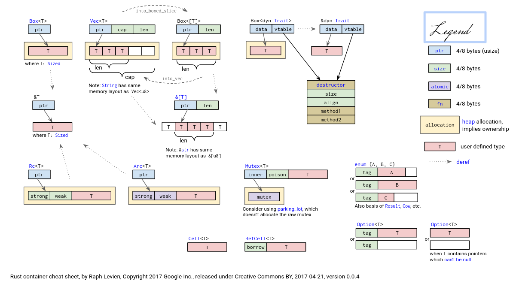

# rCore

## Chapter 1

**目标三元组**

目标三元组 (Target Triplet) 描述了目标平台的 CPU 指令集、操作系统类型和标准运行时库。

- `x86_64-unknown-linux-gnu`：CPU 架构是 x86_64，CPU 厂商是 unknown，操作系统是 linux，运行时库是 gnu libc。
- `riscv64gc-unknown-none-elf`：CPU 架构是 riscv64gc，厂商是 unknown，无操作系统， elf 表示没有标准的运行时库。没有任何系统调用的封装支持，但可以生成 ELF 格式的执行程序。

通过cargo配置文件指定目标平台。

```Rust
# os/.cargo/config
[build]
target = "riscv64gc-unknown-none-elf"
```

**移除std依赖**

RUST默认使用了标准库std，std提供了许多高级功能，如文件系统访问、线程、网络等，这些功能依赖于操作系统的支持。因此，std只能在支持这些功能的平台上使用。对于不支持操作系统功能的平台（如裸机编程或嵌入式系统），需要显式指定使用core。core是std的一个子集，不依赖于操作系统，提供了Rust语言的核心功能。

- `#![no_std]`：告诉 Rust 编译器不使用 Rust 标准库 std。
- `#![no_main]`：告诉编译器我们没有一般意义上的 main 函数， 并将原来的 main 函数删除。这样编译器也就不需要考虑初始化工作了。

**panic_handler**

Rust编译器在编译程序时，处于安全性考虑，要求有 panic! 宏的具体实现。

`#[panic_handler]` 是一种编译指导属性，用于标记核心库core中的 panic! 宏要对接的函数（该函数实现对致命错误的具体处理）。该编译指导属性所标记的函数需要具有 `fn(&PanicInfo) -> !` 函数签名，函数可通过 PanicInfo 数据结构获取致命错误的相关信息。

```Rust
#[panic_handler]
fn panic(_info: &PanicInfo) -> ! {
    loop {}
}
```

**结合汇编代码**

在裸机编程或嵌入式系统开发中，通常需要定义一个自定义的入口点函数。在Rust中，这个入口点函数通常被命名为_start。

在 fn 关键字之前增加 extern 关键字可以用来导入外部符号。
#[no_mangle] 注解来告诉 Rust 编译器不要 mangle 此函数的名称。Mangling 发生于当编译器将我们指定的函数名修改为不同的名称时，这会增加用于其他编译过程的额外信息，不过会使其名称更难以阅读。每一个编程语言的编译器都会以稍微不同的方式 mangle 函数名，所以为了使 Rust 函数能在汇编代码中使用，必须禁用 Rust 编译器的 name mangling。

**Qemu启动流程**

1. 将必要文件载入Qemu模拟的物理内存后，PC被初始化为0x1000。然后执行一段指令后跳转到0x80000000。
2. 运行位于0x80000000的bootloader（这里使用的是rustsbi-qemu.bin），RustSBI将下一阶段的入口地址设置为0x80200000。
3. 运行0x80200000开始的程序。

**调整内核的内存布局**

链接器默认的内存布局并不能符合我们的要求，为了实现与 Qemu 正确对接，我们可以通过链接脚本(Linker Script)调整链接器的行为。

首先通过cargo配置文件指定链接脚本：

```toml
// os/.cargo/config
...
[target.riscv64gc-unknown-none-elf]
rustflags = [
    "-Clink-arg=-Tsrc/linker.ld", "-Cforce-frame-pointers=yes"
    # 强制打开 fp 选项，避免 fp 相关指令被编译器优化掉
]
```

在链接脚本中指定起始地址为0x80200000，：

```linker
OUTPUT_ARCH(riscv)
ENTRY(_start)
BASE_ADDRESS = 0x80200000;
SECTIONS
{
    . = BASE_ADDRESS;
    ...
}
```

elf文件中除了实际会被用到的代码和数据段之外还有一些多余的元数据，这些元数据无法被 Qemu 在加载文件时利用，且会使代码和数据段被加载到错误的位置。需要通过`rust-objcopy --strip-all`丢弃这些元数据。

**函数调用栈**


## Chapter 2

配置环境一章给了 GDB 预编译二进制的下载链接，但版本不支持Python脚本。为了提高调试效率，需要自己编译新版本的 GDB。

查看汇编代码发现在rust_main函数中找不到对trap::init函数的调用，初始化CSR stvec的代码被直接内联汇编到了rust_main中。（相比与C语言，要将RUST源码与对应的汇编代码对应起来的难度明显更大，也可能是因为目前对RUST的机制还不太熟悉）

`#[link_section = ".text.entry"]`宏将编译后的汇编代码放在名为 .text.entry 的代码段中， 供链接脚本使用。

`#![feature(linkage)]`启用弱链接特性

`#[linkage = "weak"]`在有多个同名符号时优先使用其他符号

**将应用程序链接到内核**

在本章中，通过`global_asm!(include_str!("link_app.S"));`将应用程序的二进制镜像文件作为内核的数据段链接到内核里面。

**UPSafeCell**

有一些变量（例如本章中的APP_MANAGER）需要作为全局变量使用，但有需要在运行时修改部分成员变量。我们为这些变量将RefCell封装成了UPSafeCell，并为UPSafeCell添加了Sync标记，从而允许我们在***单核***上安全使用可变全局变量。

```Rust
// os/src/sync/up.rs
pub struct UPSafeCell<T> {
    inner: RefCell<T>,
}
unsafe impl<T> Sync for UPSafeCell<T> {}
```

**lazy_static!**

```Rust
// os/src/batch.rs
lazy_static! {
    static ref APP_MANAGER: UPSafeCell<AppManager> = unsafe { UPSafeCell::new({
        ...
    })};
}
```

手动实现全局变量初始化有诸多不便之处，比如需要把这种全局变量声明为 `static mut` 并衍生出很多 unsafe 代码。在这里借助lazy_static!宏来简化代码。

**刷新指令缓存（i-cache）**

 OS 在加载完应用代码后必须使用取指屏障指令 `fence.i` ，它的功能是保证 **在它之后的取指过程必须能够看到在它之前的所有对于取指内存区域的修改** ，这样才能保证 CPU 访问的应用代码是最新的而不是 i-cache 中过时的内容。

**特权级切换**

RISC-V 提供了新的机器指令：执行环境调用指令（Execution Environment Call，简称 `ecall` ）和一类执行环境返回（Execution Environment Return，简称 `eret` ）指令。其中：

- `ecall` 具有**用户态到内核态**的执行环境切换能力的函数调用指令；
- `sret` ：具有**内核态到用户态**（从Superivisor模式返回）的执行环境切换能力的函数返回指令。

操作系统需要负责特权级切换时的上下文保存和恢复。

相关的控制状态寄存器：

- sstatus：`SPP`等字段给出切换前的特权级等信息
- sepc：当Trap是异常时，记录Trap发生前的最后一条指令地址
- scause：Trap原因
- stval：Tral附加信息
- stvec：Trap处理代码的入口地址

当 CPU 执行完一条指令并准备从用户特权级 陷入（ Trap ）到 S 特权级的时候，硬件会自动完成如下这些事情：

- sstatus 的 SPP 字段会被修改为 CPU 当前的特权级（U/S）。
- sepc 会被修改为Trap发生前的最后一条指令地址
- scause/stval 分别会被修改成这次 Trap 的原因以及相关的附加信息。
- CPU 会跳转到 stvec 所设置的 Trap 处理入口地址，并将当前特权级设置为 S ，然后从Trap 处理入口地址处开始执行。

**Trap上下文**

与函数调用类似，在处理Trap之前，需要在某些地方（由操作系统决定）保存必要的寄存器，并在Trap处理结束后恢复这些寄存器。

Trap发生时需要保存的内容：

- 32个通用寄存器的值（部分寄存器如x0可以不作保存，预留空间主要是为了方便后续编码）
- sstatus
- sepc
	scause/stval 的情况是：它总是在 Trap 处理的第一时间就被使用或者是在其他地方保存下来了，因此它没有被修改并造成不良影响的风险。

**Trap处理流程**

1. 通过__alltraps保存Trap上下文到内核栈上
2. 跳转到trap_handler处理Trap
3. 通过__restore恢复上下文
4. sret返回

思考：sscratch 是何时被设置为内核栈顶的？
在第一次执行__restore时，通过a0传入的参数实际是`(KERNEL_STACK.get_sp() - core::mem::size_of::<TrapContext>()) as *mut TrapContext;`，并将a0的值赋给了sp。在__restore返回之前，先将sp+34*8即TrapContext的大小，然后交换sp和sscratch，从而设置为内核栈顶。

KERNEL_STACK栈顶的TrapContext中，x\[1](ra)存储了第一个程序的入口地址,x\[2](sp)存储了用户栈顶地址，在__restore执行过程中分别被加载到ra和sp寄存器中，因此当sret返回时就会进入用户态执行第一个程序。

## Chapter 3


把应用程序的一次执行过程（也是一段控制流）称为一个 **任务** ，把应用执行过程中的一个时间片段上的执行片段或空闲片段称为 “ **计算任务片** ” 或“ **空闲任务片** ” 。当应用程序的所有任务片都完成后，应用程序的一次任务也就完成了。从一个程序的任务切换到另外一个程序的任务称为 **任务切换** 。

Task切换与Trap切换主要有以下异同：

- 与 Trap 切换不同，它不涉及特权级切换；
- 与 Trap 切换不同，它的**一部分是由编译器完成**的（可以看作编译时插入额外的汇编代码）；
- 与 Trap 切换相同，它对应用是透明的。

**Task上下文**

Task切换时需要手动保存的内容：

- s0~s11
- ra
- sp

**Task处理流程**

1. 保存当前Task上下文
2. 加载下一个Task上下文
3. ret返回

每个任务的TaskContext中，保存的ra初始值都是`__restore`，因此在第一次通过`__switch`切换到该任务时，都会跳转到`__restore`，然后从该任务对应的初始TrapContext中读取程序入口(载入spec寄存器)，从而开始运行。

相比于Chapter 2，这里的`__restore`中不需要`mv sp, a0`，因为在`__switch`之后，CPU从TaskContext中读取对应内核栈的栈顶地址，并加载到了sp寄存器。

```Rust
// os/src/task/mod.rs
impl TaskManager {
    fn run_next_task(&self) {
        if let Some(next) = self.find_next_task() {
            let mut inner = self.inner.exclusive_access();
            let current = inner.current_task;
            inner.tasks[next].task_status = TaskStatus::Running;
            inner.current_task = next;
            let current_task_cx_ptr = &mut inner.tasks[current].task_cx as *mut TaskContext;
            let next_task_cx_ptr = &inner.tasks[next].task_cx as *const TaskContext;
            drop(inner);
            // before this, we should drop local variables that must be dropped manually
            unsafe {
                __switch(
                    current_task_cx_ptr,
                    next_task_cx_ptr,
                );
            }
            // go back to user mode
        } else {
            panic!("All applications completed!");
        }
    }
}
```


在run_netx_task中，需要手动在`__switch`前drop获取的TaskManagerInner实例（实际上是通过RefCell的borrow_mut方法获取的TASK_MANAGER.inner的可变借用）。

因为编译器帮我们自动插入的drop会位于作用域的尾部，而在此之前我们就通过`__switch`切换到了其他任务的执行流中，而在处理其他任务时也可能需要获取TASK_MANAGER.inner的可变借用，因此需要提前调用drop。

**中断**

当中断产生并进入某个特权级之后，在中断处理的过程中**同特权级的中断都会被屏蔽。**

## Chapter 4

**资源获取即初始化** (RAII, Resource Acquisition Is Initialization，指将一个使用前必须获取的资源的生命周期绑定到一个变量上，变量释放时，对应的资源也一并释放。) 



`alloc` 库需要提供给它一个 `全局的动态内存分配器` 来管理堆空间，从而使得与堆相关的智能指针或容器数据结构可以正常工作。动态内存分配器需要实现它提供的 `GlobalAlloc` Trait，这个 Trait 有两个必须实现的抽象接口：

```Rust
// alloc::alloc::GlobalAlloc
pub unsafe fn alloc(&self, layout: Layout) -> *mut u8;
pub unsafe fn dealloc(&self, ptr: *mut u8, layout: Layout);
```

然后只需将我们的动态内存分配器类型**实例化为一个全局变量**，并使用 `#[global_allocator]` 语义项标记即可。由于该分配器的实现比较复杂，我们这里直接使用一个已有的伙伴分配器(buddy_system_allocator)实现。`#[alloc_error_handler]`标识内存分配失败时的处理函数。

**分页内存管理**

- 可用的物理内存被分为若干个（物理）**页帧（Frame）**，用**物理页号 (PPN, Physical Page Number)**标识
- 每个应用的地址空间可以被分成若干个（虚拟） **页面 (Page)** ，用 **虚拟页号 (VPN, Virtual Page Number)** 标识
- 根据VPN可以在**页表（Page Table）**中查询到**页表项 (PTE, Page Table Entry)**，satp寄存器记录了当前所用的一级页表的物理页
- PTE记录了对应的PPN和相关的控制信息
- 手动修改PTE后，需要使用 sfence.vma 指令刷新整个 TLB。注：可以在 sfence.vma 指令后面加上一个虚拟地址，这样 sfence.vma 只会刷新TLB中关于这个虚拟地址的单个映射项。

**物理页帧管理**

栈式物理页帧管理策略

```Rust
// os/src/mm/frame_allocator.rs
pub struct StackFrameAllocator {
    current: usize,  //空闲内存的起始物理页号
    end: usize,      //空闲内存的结束物理页号
    recycled: Vec<usize>,
}
```

物理页帧的生命周期绑定的一个`FrameTracker`实例上

```Rust
// os/src/mm/frame_allocator.rs
pub struct FrameTracker {
    pub ppn: PhysPageNum,
}

impl Drop for FrameTracker {
    fn drop(&mut self) {
        frame_dealloc(self.ppn);
    }
}
```

这些 `FrameTracker` 的生命周期进一步绑定到 `PageTable` 下面。当 `PageTable` 生命周期结束后，向量 `frames` 里面的那些 `FrameTracker` 也会被回收，也就意味着存放多级页表节点的那些物理页帧被回收了。

```Rust
// os/src/mm/page_table.rs
pub struct PageTable {
    root_ppn: PhysPageNum,
    frames: Vec<FrameTracker>,
}
```

PageTable提供了`from_token` 方法可以临时创建一个专用来手动查页表的 `PageTable` ，它仅有一个从传入的 `satp` token 中得到的多级页表根节点的物理页号，它的 `frames` 字段为空，也即不实际控制任何资源。from_token创建的PageTable**不能用来修改地址映射**。

**地址空间**

 `PageTable` 下挂着所有多级页表的节点所在的物理页帧，而每个 `MapArea` 下则挂着对应逻辑段中的数据所在的物理页帧，这两部分合在一起构成了一个地址空间所需的所有物理页帧。这同样是一种 RAII 风格，当一个地址空间 `MemorySet` 生命周期结束后，这些物理页帧都会被回收。

Frame->FrameTracker->PageTable/MapArea->MemorySet

应用地址空间：


跳板（**Trapmpoline**）和TrapContext位于用户栈栈顶，但是并不包含U标志位，只在地址空间切换时才会用到。因为有了分支机制，在Trap上下文保存和恢复时需要同时完成**换栈和换页表**。

在内核代码和应用代码看来，trap.S中的汇编代码都放在最高虚拟页面中（也就是Trapmpoline中），因此进入trap处理流程时CPU指令能够连续执行。

## Chapter 5

**fork**

实现fork时，需要复制父进程的当前状态创建新的TaskControlBlock，主要是复制进程空间、栈和寄存器数据。

**exec**

实现exec时，直接在当前进程的TaskControlBlock上进行修改。对于系统调用 sys_exec 来说，一旦调用它之后， trap_handler 原来上下文中的 cx 失效了——因为它是用来访问之前地址空间中 Trap 上下文被保存在的那个物理页帧的，而现在它已经被回收掉了。

**spawn**

实现spawn时，与fork类似的是创建了新的TaskControlBlock，但没有复制父进程的当前状态，而是类似exec从elf文件中读取信息来创建地址空间。

## Chapter 6

**块与扇区**

扇区 (Sector) 是块设备随机读写的数据单位，通常每个扇区为 512 字节。而块是文件系统存储文件时的数据单位，每个块的大小等同于一个或多个扇区。Linux的Ext4文件系统的单个块大小默认为 4096 字节。在 easy-fs 实现中一个块和一个扇区同为 512 字节。

**块缓存**

- 位于内存中的缓冲区
- 内存中同时只能驻留有限个磁盘块的映射
- 需要写回磁盘才能真正修改持久性存储的数据

**easy-fs磁盘布局**


- 超级块 (Super Block)在内存中对应数据结构SuperBlock，SuperBlock与磁盘上的数据结构一致，没有额外的元数据。

	```Rust
	// easy-fs/src/layout.rs
	#[repr(C)]
	pub struct SuperBlock {
	    magic: u32,
	    // 文件系统的总块数，包括非数据块
	    pub total_blocks: u32,
	    // 索引节点位图区域占据的块数
	    pub inode_bitmap_blocks: u32,
	    pub inode_area_blocks: u32,
	    pub data_bitmap_blocks: u32,
	    pub data_area_blocks: u32,
	}
	```

- 索引节点位图和数据块位图在内存中对应数据结构Bitmap，但Bitmap本是只存储了相关的元数据，即位图的**起始块编号**以及**占据的块数**。实际磁盘上的数据载入到内存中的BitmapBlock实例中。

	```Rust
	// easy-fs/src/bitmap.rs
	pub struct Bitmap {
	    start_block_id: usize,
	    blocks: usize,
	}
	type BitmapBlock = [u64; 64];
	```

- 索引节点在内存中对应数据结构DiskInode，SuperBlock与磁盘上的数据结构一致，没有额外的元数据。索引节点本身存储的是对应文件/目录的元数据，即大小、数据块索引、类型。DiskInode大小为128字节。

	```rust
	// easy-fs/src/layout.rs
	#[repr(C)]
	pub struct DiskInode {
	    pub size: u32,
	    pub direct: [u32; INODE_DIRECT_COUNT],
	    pub indirect1: u32,
	    pub indirect2: u32,
	    type_: DiskInodeType,
	}
	```

- 数据块在内存中对应DataBlock，DataBlock与磁盘上的数据结构一致，没有额外的元数据。数据块中可能是文件的数据，也可能是目录项DirEntry。

	```rust
	// easy-fs/src/layout.rs
	type DataBlock = [u8; BLOCK_SZ];
	#[repr(C)]
	pub struct DirEntry {
	    name: [u8; NAME_LENGTH_LIMIT + 1],
	    inode_number: u32,
	}
	```

	Inode 是放在内存中的记录文件索引节点信息的数据结构。block_id 和 block_offset 记录该 Inode 对应的 DiskInode 保存在磁盘上的具体位置方便我们后续对它进行访问。

```Rust
// easy-fs/src/vfs.rs
pub struct Inode {
    block_id: usize,
    // 偏移量单位是字节
    block_offset: usize,
    fs: Arc<Mutex<EasyFileSystem>>,
    block_device: Arc<dyn BlockDevice>,
}
```

**文件描述符**

文件描述符表 (File Descriptor Table) ，其中的每个 文件描述符 (File Descriptor) 代表了一个特定读写属性的I/O资源。

为简化操作系统设计实现，可以让每个进程都带有一个线性的 文件描述符表 ，记录该进程请求内核打开并读写的那些文件集合。而 文件描述符 (File Descriptor) 则是一个非负整数，表示文件描述符表中一个打开的 文件描述符 所处的位置（可理解为数组下标）。

## Chapter 8


## Appendix

### RISC-V Notes

#### 寄存器

RISC-V 的寄存器集由 32 个通用寄存器和一些特殊寄存器组成。

**通用寄存器**

| 寄存器 | 名称  | 用途                  |
| ------ | ----- | --------------------- |
| x0     | zero  | 常数 0                |
| x1     | ra    | 返回地址寄存器        |
| x2     | sp    | 栈指针                |
| x3     | gp    | 全局指针              |
| x4     | tp    | 线程指针              |
| x5     | t0    | 临时寄存器 0          |
| x6     | t1    | 临时寄存器 1          |
| x7     | t2    | 临时寄存器 2          |
| x8     | s0/fp | 保存寄存器 0 / 帧指针 |
| x9     | s1    | 保存寄存器 1          |
| x10    | a0    | 函数参数 / 返回值 0   |
| x11    | a1    | 函数参数 / 返回值 1   |
| x12    | a2    | 函数参数 2            |
| x13    | a3    | 函数参数 3            |
| x14    | a4    | 函数参数 4            |
| x15    | a5    | 函数参数 5            |
| x16    | a6    | 函数参数 6            |
| x17    | a7    | 函数参数 7            |
| x18    | s2    | 保存寄存器 2          |
| x19    | s3    | 保存寄存器 3          |
| x20    | s4    | 保存寄存器 4          |
| x21    | s5    | 保存寄存器 5          |
| x22    | s6    | 保存寄存器 6          |
| x23    | s7    | 保存寄存器 7          |
| x24    | s8    | 保存寄存器 8          |
| x25    | s9    | 保存寄存器 9          |
| x26    | s10   | 保存寄存器 10         |
| x27    | s11   | 保存寄存器 11         |
| x28    | t3    | 临时寄存器 3          |
| x29    | t4    | 临时寄存器 4          |
| x30    | t5    | 临时寄存器 5          |
| x31    | t6    | 临时寄存器 6          |

**特殊寄存器**

- PC（程序计数器）：保存当前执行指令的地址。
- CSR（控制和状态寄存器）：用于存储控制和状态信息，如异常处理、性能计数等。

**寄存器分类**

- 零寄存器（x0）：始终为零。
- 返回地址寄存器（ra）：用于保存函数返回地址。
- 栈指针寄存器（sp）：指向当前栈顶。
- 全局指针寄存器（gp）：指向全局变量区域。
- 线程指针寄存器（tp）：指向线程本地存储。
- 临时寄存器（t0-t6）：用于临时数据存储，不需要在函数调用间保存。
- 保存寄存器（s0-s11）：需要在函数调用间保存的数据。
- 函数参数寄存器（a0-a7）：用于传递函数参数和返回值。

**C语言调用规范**

- a0~a7（ x10~x17 ）调用者保存，用来传递输入参数。其中的 a0 和 a1 还用来保存返回值。
- t0~t6( x5~x7,x28~x31 )调用者保存，作为临时寄存器使用，在被调函数中可以随意使用无需保存。
- s0~s11( x8~x9,x18~x27 )被调用者保存，作为临时寄存器使用，被调函数保存后才能在被调函数中使用。
- ra( x1 ) 是被调用者保存的。
- sp( x2 ) 是被调用者保存的。这个是之后就会提到的栈指针 (Stack Pointer) 寄存器，它指向下一个将要被存储的栈顶位置。
- fp( s0 )，它既可作为s0临时寄存器，也可作为栈帧指针（Frame Pointer）寄存器，表示当前栈帧的起始位置，是一个被调用者保存寄存器。fp 指向的栈帧起始位置 和 sp 指向的栈帧的当前栈顶位置形成了所对应函数栈帧的空间范围。
- gp( x3 ) 和 tp( x4 ) 在一个程序运行期间都不会变化，因此不必放在函数调用上下文中。

#### 指令

- Load Immediate: li x16, 0
- Load Address: la rd, symbol
- Store Word: sw value, dst_addr
- Wait For Interrupt: wfi   
- Add Upper Immediate to PC: auipc rd, imm
- Jump And Link Register： jalr rd, (imm[11:0])rs

### Rust Notes

**胖指针(Fat Pointer)**

`sys_write` 使用了一个 `&[u8]` 切片类型来描述缓冲区，这是一个 **胖指针** (Fat Pointer)，里面既包含缓冲区的起始地址，还包含缓冲区的长度。可以分别通过 `as_ptr` 和 `len` 方法取出它们并独立地作为实际的系统调用参数。

**#[derive]**

通过 `#[derive(...)]` 可以让编译器为自定义类型提供一些 Trait 的默认实现。

- 实现了 `Clone` Trait 之后就可以调用 `clone` 函数完成拷贝；
- 实现了 `PartialEq` Trait 之后就可以使用 `==` 运算符比较该类型的两个实例。
- `Copy` 是一个**标记 Trait**，决定该类型在按值传参/赋值的时候采用移动语义还是复制语义。