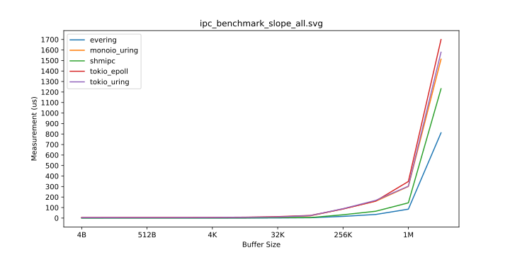
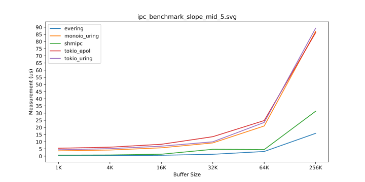
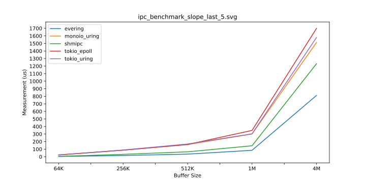
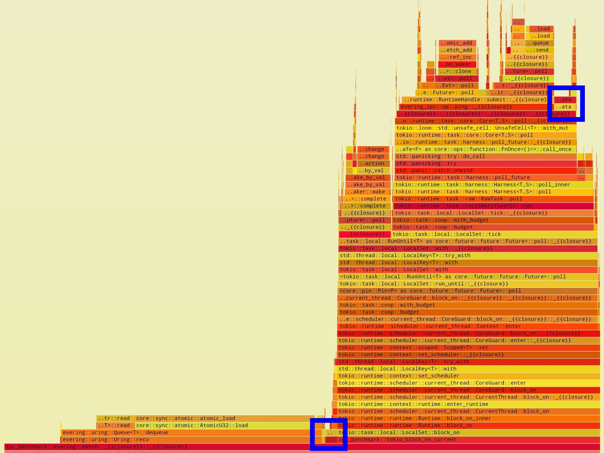
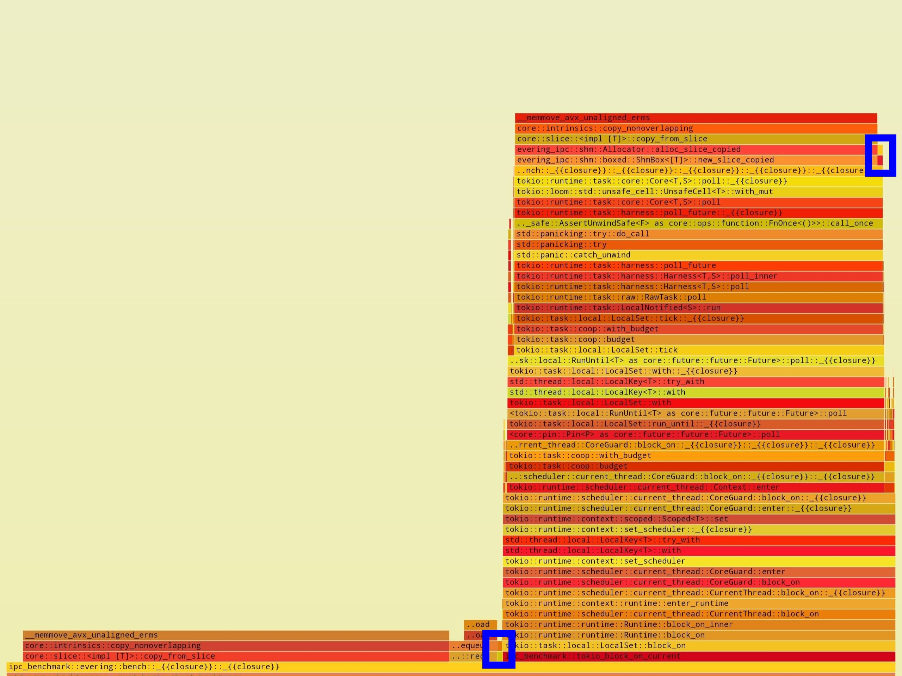

# 基于 uring 的异步 IPC

## 异步通信框架: evering

[evering](https://loichyan.github.io/openoscamp-2025s/evering) 是受 [io_uring](https://en.wikipedia.org/wiki/Io_uring) 启发的的异步通信框架，作为本文实现异步 IPC 的基石，它

- 🦀 基于 Rust 异步模型
- 🐧 基于共享内存
- 📡 提供双向 SPSC 消息队列
- 🎬 提供灵活的资源管理机制

evering 使用两个单生产者单消费者（SPSC）并发队列进行通信，

```text
       Client                                     Server
         |                                           |
.------->|                                           |<---------.
|        |               Request Queue               |          |
|   (Send Request)   -->-(3)->-(2)->-(1)->-- (Receive Response) |
|        |                                           |          |
|        |                                           |          |
| (Receive Response) --<-(1)-<-(2)-<-(3)-<--   (Send Request)   |
|        |               Response Queue              |          |
'--------'                                           '----------'
```

受限于 SPSC 通信，目前 evering 只能遵循 thread-per-core 模型，不同于 tokio、async-std 等使用 work-stealing 的运行时．在基于 thread-per-core 的异步模型中，每个线程有一个局部的运行时，不同线程之间保持最小的通信，甚至完全独立．而基于 work-stealing 的异步模型中，任何异步任务都可能由于运行时的调度而被“偷”到其他线程上运行．二者相比有以下异同：

- 在 thread-per-core 模型中，异步任务不必担心同步问题，即在 Rust 中不需要使用诸如 `impl Send + Future` 的类型，这可以大大简化异步编码体验．而在 work-stealing 模型中，几乎所有的异步任务都需要注意线程之间的同步，这样难免会带来一些额外的开销，也使得异步编码更为繁琐[^1]．
- 正如 work-stealing 这名称所示，在此类模型中，运行时会根据程序实时状态对不同线程上的异步任务进行负载均衡，使得每个线程都不会陷入长时间的忙碌或空间．而对于 thread-per-core 模型，由于异步任务不能在多线程之间共享，当处理某个 CPU 密集型任务时，很可能因为长时间阻塞而导致该线程上的其他任务迟迟得不到处理，最终出现较高的响应延迟．因此 thread-per-core 不适合 I/O 密集混合 CPU 密集的场景．

## 实验性异步 IPC 模型: evering-ipc

[evering-ipc](https://github.com/loichyan/openoscamp-2025s/tree/final/examples/evering-ipc) 在 evering 的基础上，同时利用 Linux 的共享内存机制实现了异步 IPC．具体而言，要通信的两个进程使用以下所示的共享内存区进行同步：

```text
.-----------------------------------------------------------------------------.
|                   |               |                   |                     |
| [1] uring offsets | [2] allocator | [3] uring buffers | [4] free memory ... |
| ^                 |               |                   |                   ^ |
'-|-------------------------------------------------------------------------|-'
  '-- start of the shared memory (page aligned)                             |
                                                 end of the shared memory --'
```

- *[1]* 是整个共享内存区的起始，通过 mmap(2) 映射到地址空间中，因此是页对齐的．
- *[1]* 中包含 evering 的两个通信队列的偏移量，基于这个偏移量配合 evering 提供的构造队列的接口，可以确保两个进程看到的状态是相同的．
- *[2]* 中包含一个单线程的内存分配器，这个分配器通常由客户端使用．
- *[3]* 是通信队列的实际所在位置．
- *[4]* 是其余全部的空闲内存，这些内存由 *[2]* 中的分配器管理．

在 evering-ipc 中，uring 仅用于传递静态类型且通常仅有十几到几十个字节的*消息*．而对于更大的以及编译期间无法确定大小的*数据*，它利用共享的空闲内存来传递．具体而言，

1. 客户端获取内存分配器，从中分配合适的内存块，并写入*请求体*作为待传递*数据*．
2. 客户端将该内存块指针以及其他信息构造成*请求头*作为*消息*写入请求队列．
3. 服务端接收并解析请求，得到*请求头*和*请求体*．
4. 服务端处理请求，将处理结果构造*响应头*作为*消息*写入响应队列．
5. 客户端收到响应，检查结果并执行后续流程．

当服务端同样也需要传*响应体*作为*数据*时，有多种思路可以实现：

1. 将分配器加锁使它能同时在服务端和客户端使用．对于请求频率特别高的场景，锁可能会降低整体性能．
2. 增加一个分配器供服务端使用．对于空闲内存分配比例的设定可能不容易权衡．
3. 结合前两个思路，使用两个分配器，但空闲内存加锁，根据程序运行状况动态调整分配给两方的空闲内存．
4. 空闲内存完全由客户端管理，在请求时，客户端分配合适大小的内存块供服务端写入*响应体*．实际中，客户端可能需要预请求一次来确定*响应体*的大小．

evering-ipc 目前采用第 4 种思路．此外，不难发现，在 evering-ipc 中，数据都是通过指针进行传递的．而在程序运行时，共享内存通常被映射到不同的地址，因此实际传递的是数据块在共享内存中的偏移量．同时，共享内存区的起始地址都是页对齐的，这保证了所有基于相对偏移量得到的地址，即使在两个进程间不同，对齐也是一致的，从而满足 Rust 对不同类型内存布局的要求．

## 多种 IPC 方案的性能测试: ipc-benchmark

[ipc-benchmark](https://github.com/loichyan/openoscamp-2025s/tree/final/examples/ipc-benchmark) 针对多种 IPC 方案进行了关于通信延迟的性能测试，这些方案包括：

- 基于 evering + memfd 的 IPC
- 基于 shmipc + memfd 的 IPC
- 基于 tokio + epoll + UDS 的 IPC
- 基于 tokio + io_uring + UDS 的 IPC
- 基于 monoio + io_uring + UDS 的 IPC

其中，

- memfd 是 create_memfd(2) 创建的匿名内存．
- UDS 是指 Unix Domain Socket．
- [shmipc](https://github.com/cloudwego/shmipc-rs) 是基于共享内存的高性能 IPC 框架．
- [tokio](https://tokio.rs/) 是基于 epoll(7) 和 work-stealing 模型的异步 I/O 运行时．
- [tokio-uring](https://github.com/tokio-rs/tokio-uring) 为 tokio 提供了基于 io_uring 的异步 I/O 实现．
- [monoio](https://github.com/bytedance/monoio) 是基于 io_uring 和 thread-per-core 模型的异步 I/O 运行时．

对于每个框架我们采用如下测试方案：

1. 启动两个线程作为客户端和服务端．
2. 客户端写入 `i32` 的请求头以及大小为 `buf_size` 的请求体．
3. 服务端接收并校验请求头和请求体，随后同样写入 `i32` 的响应头和 `buf_size` 大小的响应体．
4. 客户端接收并校验响应头和响应体．

其中，`buf_size` 以字节为单位，由 4B 逐渐增长到 4M．

### 结果对比

详细的性能测试的结果见 <https://github.com/loichyan/openoscamp-2025s/tree/ipc-benchmark>，下面我们将对该结果进行简略的分析．



此图对比了完整的测试结果，其中 $x$ 轴是上述的 `buf_size`，而 $y$ 轴则是完成一次测试所需的平均时间．可以看到，随着数据大小的增长 evering 和 shmipc 明显优于其他三者，并且相对于表现最差的 tokio_epoll，二者分别有接近 50% 和 30% 的性能提升．


此图对比了前五个测试的结果，此时数据并不算大，都在通常范围之内．这里能发现相对于另外三者，evering 和 shmipc 都有超过 80% 的性能提升．



此图对比了中间五轮测试的结果，此时数据大小开始逐渐出现大幅度的增长．可以看到，除了 evering 和 shmipc 外的三者针对大块数据的传输并无明显差异．



此图对比了最后五轮测试的结果，此时数据大小已接近极端情况．这里能观察到与第一个对比图同样的结果．

### 测试结论

单从性能的角度来看，对于上述五种 IPC 方案，`evering > shmipc >> monoio > tokio_uring > tokio_epoll`．

对比前两者，shmipc 支持 MPSC（多生产者多消费者）的通信方式，而本测试中仅使用 SPSC 的模型进行测试，因此无法发挥其完整的优势．另外，对共享内存处理的方式不同也可能导致了一些性能差异．而对于另外三者，由于使用 UDS 需要将数据在用户空间和内核空间来回拷贝，在面对大块数据时，这将大大降低整体性能．而对于极小的数据块，又由于系统调用等带来的开销，最终需要接近 10 倍的额外时间来完成测试．这一点可以在火焰图[^2]中体现：

| evering (buf_size=4B)                    | tokio-epoll (buf_size=4B)                    |
| :--------------------------------------: | :------------------------------------------: |
|  |  |

此图中展示了在 4B 数据下，性能测试主体函数中各子过程的占比．其中，蓝色高亮部分是校验数据过程，用作参照．不难发现，evering 中主要时间都消耗在传递消息所需的多线程同步上了．而在 tokio-epoll 中则是多个与内核交互的函数调用占用主要时间．在后几轮测试中，当数据变得非常大时，这些消耗则变得无关紧要，此时的性能热点是数据传递引起的内存拷贝．下面的火焰图可以佐证：

| evering (buf_size=4M)                    | tokio-epoll (buf_size=4M)                    |
| :--------------------------------------: | :------------------------------------------: |
|  |  |

此图与上面两个图相同，不过这里的数据大小是 4M．很明显，当数据非常大时，evering 中绝大部分时间用来初始化需要传递的数据，但传递的过程几乎不占用太多时间．而 tokio-epoll 中的情况更加复杂，除了拷贝数据以外，还花费了相当一大部分时间执行内存分配，这些内存用于放置从内核空间传递来的数据．

至于后三者的性能差别，我们猜测主要是由于：

1. 设计架构不同，monoio 是单线程的 thread-per-core 模型，因此与我们的测试相性更好．
2. 基于 io_uring 实现的异步 I/O 相对于基于 epoll 的，理论上会花费更少的时间在与内核交互上．并且测试中我们利用 io_uring_register(2) 做了进一步的优化，减少了传递小数据时内核处理的开销．

## 未完成的任务

### 让 evering 支持 MPSC

正如开头所述，evering 目前只实现了 SPSC 队列，受限于此，不能很好的处理复杂的应用场景．而实现 MPSC 队列之后，客户端就能更好的与 tokio 等运行时协同工作．要实现这个目标，主要是对 evering 的队列结构 `RawUring` 和操作驱动结构 `Driver` 进行多线程改造，并且尽可能要实现无锁的数据结构．对于 `RawUring` 的改造可以参考现有的并发队列实现．而 `Driver` 底层依赖于 [`slab::Slab`](https://docs.rs/slab/latest/slab/) 结构体，因此改造难度稍高．不过，目前 evering 已经支持使用固定大小的 `Slab`，基于这一点可以大幅降低多线程化的难度．

### 基于 evering 实现系统调用

evering-ipc 只适用于用户进程之间的通信，而本项目最初的目标是实现用户进程和内核的通信．对于这个目标，除了处理共享内存以外，可能还会遇到页表隔离的问题，以及用户进程意外退出后，对应内核异步任务的清理问题．更长远来看，当实现异步系统调用之后，那么可以将用户进程转彻底换成类似 Rust 中 `Future` 的无栈协程，从而将开销进一步降低．此外，迁移到异步系统调用时，不可避免的会破坏与现有同步代码的兼容性．因此，实现基于有栈绿色线程的异步系统调用也是一个值得尝试的目标．

[^1]: <https://maciej.codes/2022-06-09-local-async.html>
[^2]: <https://github.com/flamegraph-rs/flamegraph>
