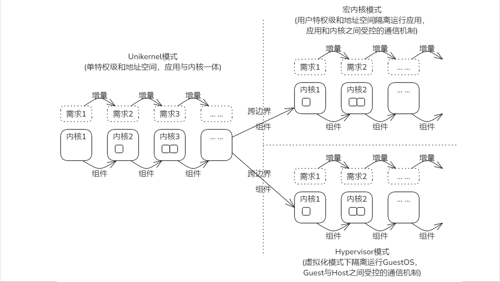
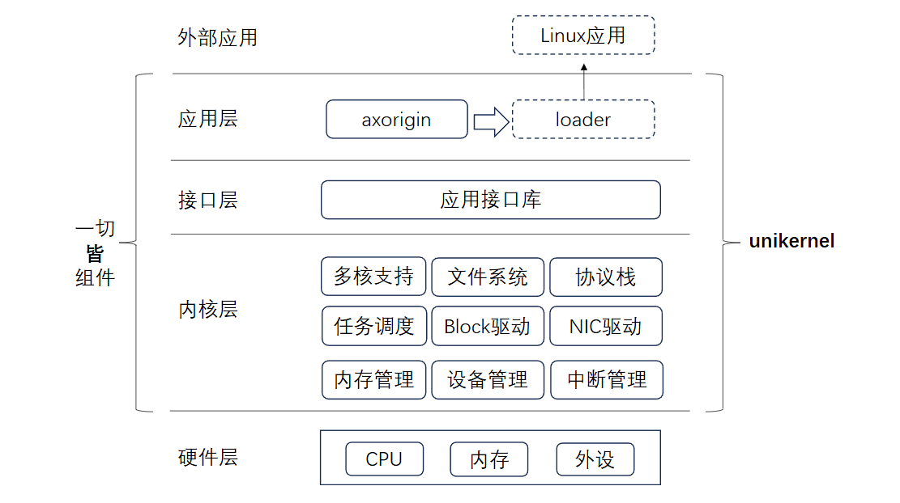

## 第一阶段

使用官方的 Rust 文档，跟着 rustlings 的评测机一道一道的解决，学会了点 Rust 基础基础知识。

## 第二阶段

这个阶段主要是通过一些基础的实验，去对用 Rust 语言写一个基于 RISC-V 架构的类 Unix 内核 rcore 进行了了解。在这过程中主要是参考官网提供的 rcore 文档对系统的各个重要组成部分进行了解，加上实验的辅助，对 rcore 的整体代码框架有了一定的掌握。实验难度不高，之前做过 xv6 的实验，对这类操作系统有一定的了解，在这过程中主要是一开始对代码框架不够熟悉，会有一困难。

## 第三阶段

这个阶段五一整个假期的时间完成了，时间长度不长，但是没有多余的事打扰，进度也是飞快。

本阶段开始对组件化内核的学习，刚接触，对内核了解不够深，一段时间后，组件化操作系统给我的感觉是一种体系结构清晰、明了，比之 rcore 这类宏内核，组件化由它名字一般，模块之间分隔明显，内部功能耦合度低，在实验中能快速的定位问题。

初始阶段的 Unikernel 内核，是组件化的基础，他与我们之前认识的宏内核有着很大的区别。

- 应用和内核处于同一特权级，也就是没有用户态和内核态之分
- 应用和内核共享同一地址空间，相互可见
- 编译形成一个Image而后一体运行，Unikernel既是应用又是内核，是二者合体

这样的设计，应用和内核之间没有分割和切换，运行就变得简单高效，但缺点也很明显，安全的不到保障。

不过，作为基础阶段，简单是必须的，通过我们对模块的添加,内核会逐渐复杂。

根据我们不同的需求，开发对应的组件，我们的内核便可以跨越界限，实现不同的内核模式（如宏内核模式、Hypervisor模式）

组件是一个个可以复用、封装好的独立实体，内部功能对外部是不见得，但内核实现了对外部开放的API接口，通过这些公开的接口与外界通信。

这是实验完成后形成的组件化操作系统的结构：

