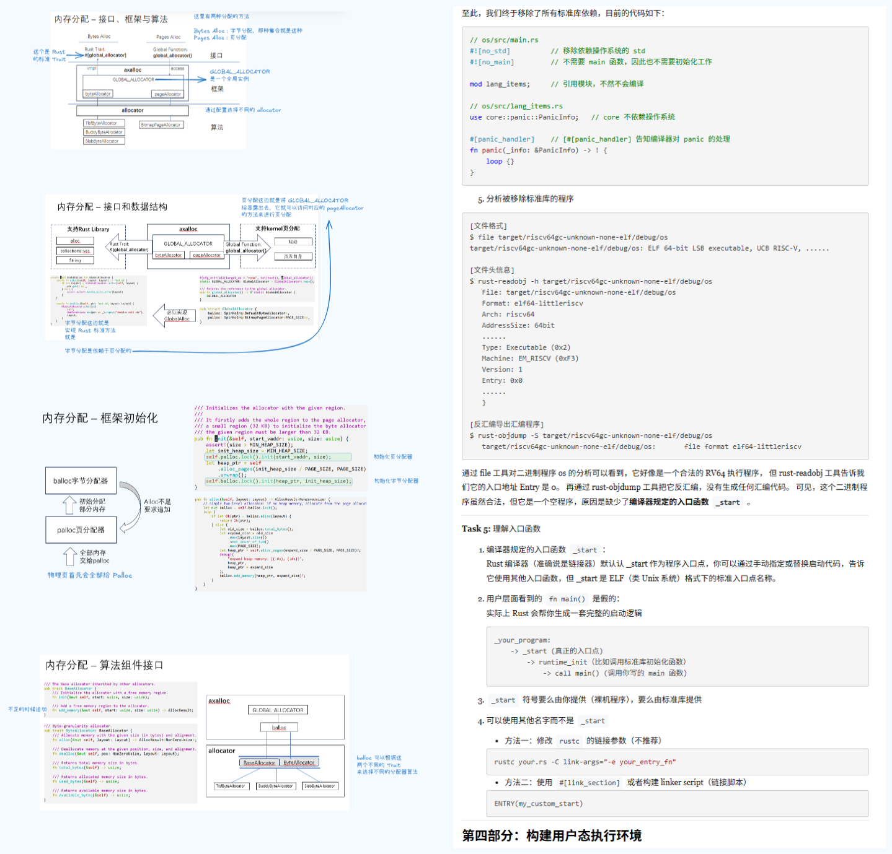
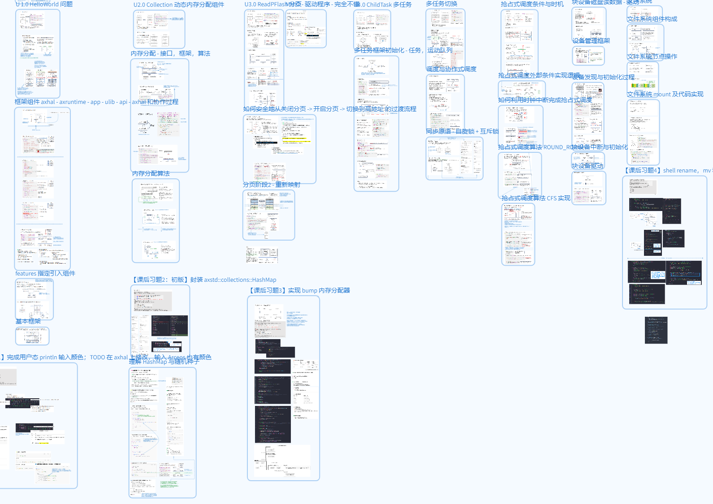
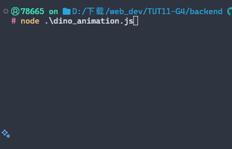

## 基础阶段 - Rust编程

第一阶段是 Rust 编程，让我印象深刻的是 rustling 中链表的习题，那一刻我深深地怀疑为什么要使用 Rust，在之后的阶段中也多次因为对 Rust 语法的不熟悉而头脑混乱，所以在基础阶段确实要好好利用时间认真地学习 Rust 基础，我现在都还在在过 Rust 圣经...

## 专业阶段 - OS设计实现

这一阶段就开始对 OS 部分进行学习，二阶段我觉得整个文档都写得非常清晰，整个学习中虽然实验是从第三章开始的，但是或许是因为我之前只是看了操作系统导论，实际上我在第一章节和第二章节的学习上花费了更多的时间，我觉得这个视角就开始切换了，从一开始写应用程序我们进行系统调用和到开发内核的视角，链接脚本，汇编语言，SBI 等等，我觉得理解内核的执行环境也是一个很重要的点

**第三章** 是对应特权级切换的，学习特权级切换的硬件控制机制，初始化 Trap 处理点 __alltraps() , trap_handler() 实现 Trap 的分发和处理，到 __restroe() 对 Trap 上下文切换的恢复，很有意思的一章

  + lab 3: 简单的使用一个数组记录每一个系统调用的次数，比较要注意的是，这里是分时系统，不同程序的系统调用次数要隔离开，一开始我实现的是在每一次加载新的任务的时候对系统调用次数进行重置，但那是在批处理的情况下，批处理是一个一个任务进行的，但是 lab 3 是分时系统，所以存放的位置应该是和任务有关系的.       


**第四章** 是对应地址空间，这里我觉得主要讲解了
1. 在分页机制下，为什么要将 Trap 上下文保存在应用地址空间而不是将其直接放在应用的内核栈，对应理解跳板
2. 然后就是对 __alltraps 和 __restore 下是如何保存和恢复 Tarp 上下文时切换地址地址空间的代码部分的修改
3. 然后就是系统调用后，用户传的地址不要直接解用户地址访问，那是用户空间的虚拟地址

   + lab 4: 主要就是地址空间的转换，对系统调用，如果用户传的是指针的话，都要通过手动查表的方式将地址映射成为内核可以访问的地址, 对 mmap 和 munmap 映射部分，在实现 munmap 过程中，有遇见一个问题，在检查 munmap 是否可以 unmap 的时候，必须要保证每个页都是被 map 过的，并且需要是同一个 MapArea，不然如果分开来，可能会说可能其他逻辑段映射了，但是不是同一个逻辑段，这样是不对的，然后不要忘记在进行 map 的时候要补上 Valid 标志 !

**第五章** 是进程相关的，内核栈，进程控制块，任务管理器，处理器，进程的调度机制

  + lab 5: 内部首先通过 get_app_data_by_name 获得对应 app 的 elf_data, 然后创建对应的 task_control_block, 要注意的是，一开始直接使用 new() 方法，但 new()　只有在创建初始进程的时候才可以，对应的实现从　fork 和 new，exec 方法中可以借鉴，同样要维护对应的父子关系

**第六章** 文件系统

  + lab 6: 这里也是有一个问题，就是引入文件系统后，测试就是之前的测试没有过，在群中找才知道 sprawn 要对对应的标准输出输入和错误的文件描述符进行初始化，所以真的，积极地交流是很重要的，虽然我确实太菜了，很多时候连问题都提不出来,,,不过这也算是一个努力的点吧，都只能一点一点来

**第八章** 内核态操作系统方法实现锁

  + lab 8: 完成死锁检测，主要是对 need 的维护，再检测到安全之后，need 不能直接就恢复，这个恢复need的话，那有可能检测不出来啊，比如说线程1获得1，线程2获得2，然后线程一想要获得2，他去进行检测，然后他不会检测到有问题啊，因为这个时候线程2的need他会以为是0，好他就会认为2会释放啊，然后线程一就会得到这次的sem_down的允许，然后之后线程2想要获得1，如果说线程一的need就恢复了，线程2也会以为线程1是可以释放的，因为此时线程一的need被恢复了，就是原本的0，然后线程2这次的也被允许了，那就死锁了呗
  + 然后在对应的 sem_deadlock_2.rs 中，对应的 semaphore.up, 这里的，不能直接就只是 available + 1， 然后对应的 allocation - 1，这样是不可以的，程序会检测到死锁，但实际上没有死锁，在检测的时候，要先看是否是 need，如果有 need 就只是对 need 进行修改，而不是直接改 available 和 allocation，但是理解为什么还比较模糊

## 项目基础阶段 - 组件化操作系统

在这里我比较印象深刻是文件系统这一部分的实现，一开始我执行 shell 是觉得这部分测试是可以的，在最后提交的时候才发现原来我竟然是使用的标准库的而没有使用 axstd，然后之后再去实现 armf 中的 rename 方法，在同一个文件夹下 rename 的逻辑，而没有 move 的实现逻辑，但是测试的时候依然报错，而且利用输出给我的感觉是整个代码 都没有运行到我的 axfs_ramfs中，实在想不出原因在角落群中才看见 ”rename实现为了启用本地的 axfs_ramfs要在根目录下的 patch 添加本地的 ramfs“，感谢，，，以及被自己蠢哭。。。不过在这个过程中也是算是对整个文件结构有了一定的了解，是一种组件化的感觉

```txt
rceos
.
├── api
│   ├── arceos_api
│   ├── arceos_posix_api
│   └── axfeat
├── axfs_ramfs
│   ├── Cargo.toml
│   ├── Cargo.toml.orig
│   ├── README.md
│   └── src
├── modules
│   ├── alt_axalloc
│   ├── axalloc
│   ├── axconfig
│   ├── axdisplay
│   ├── axdma
│   ├── axdriver
│   ├── axfs
│   ├── axhal
│   ├── axlog
│   ├── axmm
│   ├── axnet
│   ├── axruntime
│   ├── axsync
│   ├── axtask
│   ├── bump_allocator
│   ├── elf
│   └── riscv_vcpu
├── ulib
│   ├── axlibc
│   └── axstd
```

## 总结

恩，其实诚实地说虽然做了实验，但是现在其实还是有一种脑袋空空的感觉，当然我觉得肯定是对这个有更直观的理解了，然后在知识上我觉得自己没有什么要说的，我觉得整个文档写得很好第三阶段石磊老师的课讲得也非常好，而且因为其实本身可能自己的吸收还是没有很系统，确实能力有限，就给一些我自己学习过程的建议吧

首先实验的完成部分很多都是借鉴相关的部分，我觉得在实验上就是要多看相关的代码，然后不断借鉴，也不要怕错，就只有胆大心细

然后就是在看文档知识的时候我比较推荐就是把它拆出来的感觉，然后放在一个类似 excalidraw 或者 draw.io 的看板上，也可以自己写一些批注，我也尝试就是写博客那种但是一整块流下来的感觉怎么说我自己就是看着很累，但是使用化肥然后拆出来我个人感觉是比较顺畅的，也经常在遇见问题之后没有想法的时候，就到处翻翻，或许就能找到答案，而且画图的这种给的笔记压力也比较小一些，但是不得不说在后面内容多之后确实会有点乱，这种情况下我觉得就是需要再梳理的，可能以另外一个形式或者是什么的，但是我觉得这样拆出来之后就算是复习我个人感觉会比较流畅，不会有太大的压力


这是我尝试的两种方法对比，左边是那种拆出来的，右边就是纯文字的博客，我个人是看左边更觉得看得下去一点...


然后这是我的一个粗略的笔记截图，我就是在这个图上找来找去看一下可能有关联的点...

这种方法是我自己学习下来觉得对我帮助比较大的，然后在之后的复习中没有给我太大压力的感觉，当然我认为每个人适合的方式是不同的，这也只是我自己的感受而已，反正客观地看吧


