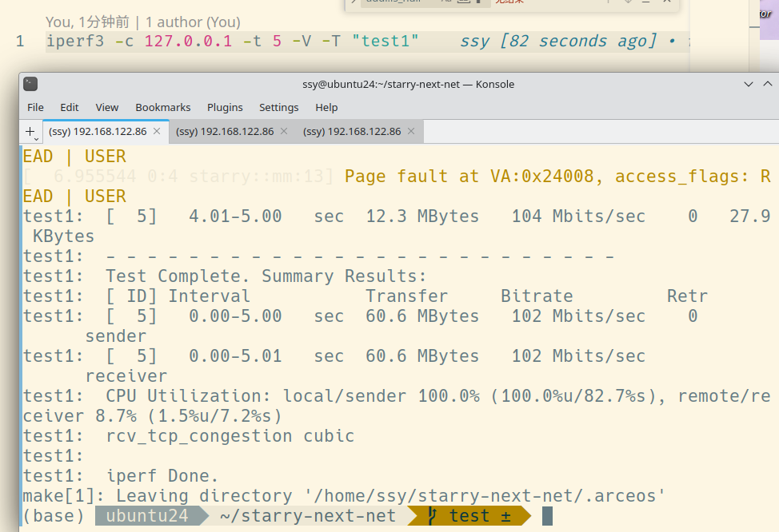
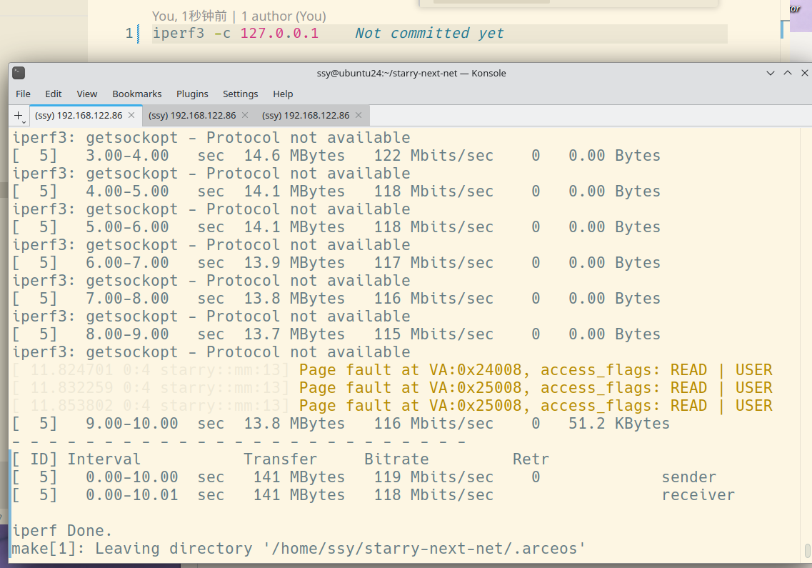

# 序言

非常高兴能参加开源操作系统训练营第四阶段的学习，并与大家共同进步。

在此，我首先要感谢陈渝老师，您在每周学习中给予的指导和鼓励，成为了我前进的坚实支柱。同时，我也非常感谢其他同学，在第四阶段的学习中，我从大家那里学到了很多，无论是便捷地获取学习资料和代码，还是在遇到疑惑时能找到理解并深入探讨技术的伙伴，都让我受益匪浅。

经历完这四个阶段，我取得了显著的收获：不仅深刻理解了操作系统内部的运行机制，更掌握了通过组件化管理实现现代化操作系统的方法。具体而言，我成功完成了`arceos-org/oscamp`的`aarch64`架构支持，并为`starry-next`适配了`iperf`的`TCP`部分。

# 任务1 完成`arceos-org/oscamp`对`aarch64`架构的支持

1. 使用`QEMU`的`monitor info mtree` 和`monitor info block` 找出`pflash`区域，并在[aarch64-qemu-virt.toml](https://github.com/879650736/oscamp/blob/main/arceos/platforms/aarch64-qemu-virt.toml)中增加正确的映射区域，在`tour`代码中写入正确的`PFLASH_START`

2. 增加了`aarch64`部分的[uspace](https://github.com/879650736/oscamp/blob/main/arceos/modules/axhal/src/arch/aarch64/context.rs)代码，进行适配

3. 对[makefile](https://github.com/879650736/oscamp/blob/main/arceos/Makefile)内的规则进行修改，修改[`payload`、`mk_pflash`](https://github.com/879650736/oscamp/blob/main/arceos/scripts/make/utils.mk)对其他架构进行适配

4. 增加[payload](https://github.com/879650736/oscamp/blob/main/arceos/payload/Makefile)(https://github.com/879650736/oscamp/blob/main/arceos/payload/hello_c/Makefile )(https://github.com/879650736/oscamp/blob/main/arceos/payload/origin/Makefile )内其他架构的编译规则，使`payload`对其他架构也能适配

5. 增加[aarch64](https://github.com/879650736/oscamp/blob/main/scripts/tour_test.sh)的CI测试,并测试通过

6. pr：https://github.com/arceos-org/oscamp/pull/9

7. fork仓库：https://github.com/879650736/oscamp

#  任务2 为`starry-next`适配`iperf`

1. 提交https://github.com/oscomp/starry-next/pull/56/files 。修复了`oscomp/starry-next`中的c中的`sockaddr`和`arceos/axnet`中的`SocketAddr`的类型转换问题，改为使用trait直接将`sockaddr` 转换为`SocketAddr`，而不需要加一个中间层`SockAddr`,并测试通过。已合并。

2. 提交https://github.com/oscomp/testsuits-for-oskernel/pull/52 。在为 `starry-next` 兼容 `iperf`的过程中，我发现一个段错误问题。具体来说，如果在` cJSON_New_Item` 函数中未对全局变量 `global_hooks`进行初始化，会导致空指针访问。然而，当我单独编译` cJSON `的相关代码时，并未复现此异常。我推测这可能是由于编译为 ELF 文件时，编译器进行了某种优化所致。将 `global_hooks `的初始化操作增加到`cJSON_New_Item `函数的起始位置后，该段错误便得以消除。

3. `musl`无`openssl`库，使用[build_riscv.sh](https://github.com/879650736/starry-next-net/blob/test/apps/iperf/build_riscv.sh), 进行openssl库的交叉编译

4. 创建[iperf_wrap](https://github.com/879650736/starry-next-net/blob/test/apps/iperf_wrap/Makefile)， 进行本地编译载入测试

5. 在`arceos/modules/axfs/src/mount.rs`中增加`/dev/urandom`的挂载,并增加了一个简单的[urandom](https://github.com/879650736/axfs_crates/blob/main/axfs_devfs/src/urandom.rs)的实现

6. 修改iperf中 `autoreconf`的[configure.ac](https://github.com/879650736/testsuits-for-oskernel/blob/pre-2025/iperf/configure.ac)，增加`--disable-xxxx`选项的支持

7. 实现可增加`--disable`参数去除部分 Linux 特有的选项如`SO_MAX_PACING_RATE`、`SO_BINDTODEVICE`、`IP_MTU_DISCOVER`等，为交叉编译提供支持，参考 [build.sh](https://github.com/879650736/testsuits-for-oskernel/blob/pre-2025/iperf/build.sh),宏定义生成结果可通过`src/iperf_config.h`查看，也为调试提供方便。

8.  允许用户在配置 `iperf3` 时，通过命令行参数禁用特定的功能或特性，特别是那些可能与特定操作系统（如 Linux）紧密相关的特性，以便于在其他平台或进行交叉编译时避免兼容性问题。
  - 在 `configure.ac` 文件中使用 `AC_ARG_ENABLE` 宏来定义新的配置选项。
  - 以 `--disable-have-dont-fragment` 为例
    ```bash
    # Check if Don't Fragment support should be disabled
    AC_ARG_ENABLE([have-dont-fragment],
        [AS_HELP_STRING([--disable-have-dont-fragment], [Disable Don't Fragment (DF) packet support])],
        [
            case "$enableval" in
            yes|"")
                disable_have_dont_fragment=false
                ;;
            no)
                disable_have_dont_fragment=true
                ;;
            *)
                AC_MSG_ERROR([Invalid --enable-have-dont-fragment value])
                ;;
            esac
        ],
        [disable_have_dont_fragment=false]
    )

    if test "x$disable_have_dont_fragment" = "xtrue"; then
        AC_MSG_WARN([Don't Fragment (DF) packet support disabled by user])
    else
        if test "x$iperf3_cv_header_dontfragment" = "xyes"; then
            AC_DEFINE([HAVE_DONT_FRAGMENT], [1], [Have IP_MTU_DISCOVER/IP_DONTFRAG/IP_DONTFRAGMENT sockopt.])
        fi
    fi
    ```
    `AC_ARG_ENABLE([have-dont-fragment], ...)` 定义了 `--disable-have-dont-fragment` 选项。
    如果用户指定了 `--disable-have-dont-fragment`，则 `disable_have_dont_fragment` 变量被设置为 `true`。
    如果 `disable_have_dont_fragment` 为 `true`，则会发出警告，并且不会定义 `HAVE_DONT_FRAGMENT` 宏。
    否则（用户未禁用），并且如果 `Autoconf` 之前的检查 (`iperf3_cv_header_dontfragment`) 确认系统支持 `IP_MTU_DISCOVER` 等选项，则会定义 `HAVE_DONT_FRAGMENT` 宏。
  - 针对 Linux 特有的套接字选项（如 `SO_MAX_PACING_RATE`、`SO_BINDTODEVICE、IP_MTU_DISCOVER`），提供 `--disable` 选项，以便在非 Linux 环境下（如交叉编译到嵌入式系统或其他操作系统）能够顺利编译，避免因缺少这些特性而导致的在其他环境下的运行错误。
    - 其通用模式
    ```bash
    # 定义一个名为 'have-feature-name' 的选项
    AC_ARG_ENABLE([have-feature-name],
        [AS_HELP_STRING([--disable-have-feature-name], [Disable support for Feature Name])],
        [
            case "$enableval" in
            yes|"")
                disable_feature_name=false
                ;;
            no)
                disable_feature_name=true
                ;;
            *)
                AC_MSG_ERROR([Invalid --enable-have-feature-name value])
                ;;
            esac
        ],
        [disable_feature_name=false] # 默认启用
    )

    # 根据用户选择和系统检测结果，决定是否定义宏
    if test "x$disable_feature_name" = "xtrue"; then
        AC_MSG_WARN([Feature Name support disabled by user])
    else
        # 这里可以添加额外的系统特性检测，例如检查头文件、函数或套接字选项
        # if test "x$ac_cv_header_some_header" = "xyes"; then
            AC_DEFINE([HAVE_FEATURE_NAME], [1], [Description of the feature macro.])
        # fi
    fi
    ```
  - 当修改了 `configure.ac` 文件后，仅仅保存文件是不够的。`configure.ac` 是 `Autoconf` 的输入文件，它需要被处理才能生成实际的 `configure` 脚本。这个处理过程就是通过运行 `autoreconf` 命令来完成的。
    - `autoreconf` 命令会执行一系列工具（如 `aclocal`, `autoconf`, `autoheader`, `automake` 等），它们会：

      1. 处理 `configure.ac`： 将 `configure.ac` 中的 `Autoconf` 宏转换为可执行的 `shell` 脚本代码，生成 `configure` 脚本。
      2. 生成 `config.h.in`： 如果你的 `configure.ac` 中使用了 `AC_CONFIG_HEADERS`，`autoheader` 会根据 `AC_DEFINE` 等宏生成 `config.h.in` 文件，这是一个模板文件，最终会被 `configure` 脚本处理成 `config.h`。
      3. 处理 `Makefile.am`： 如果项目使用了 `Automake`，`automake` 会处理 `Makefile.am` 文件，生成 `Makefile.in`。
      因此，每次修改 `configure.ac` 后，你都必须在项目根目录运行 `autoreconf -fi` 命令，以确保这些修改能够体现在新生成的 `configure` 脚本中。 否则，你新添加的 `--disable-xxxx` 选项将不会被识别。
  - 在 `build.sh` 脚本中，可以根据编译目标或环境变量来决定是否添加这些 `--disable` 参数。
    ``` bash
    ./configure --disable-have-dont-fragment --disable-openssl --disable-cpu-affinity  
    ........

    ```

9. 在`api/src/imp`中进行[syscall](https://github.com/879650736/starry-next-net/tree/test/api/src/imp)的适配

  - 新增调用列表

   - [`sys_getsockname`、`sys_getpeername`](https://github.com/879650736/starry-next-net/blob/test/api/src/imp/net/getsock.rs)

   - [`sys_poll`、`sys_ppoll`](https://github.com/879650736/starry-next-net/blob/test/api/src/imp/net/poll.rs)

   - [`sys_recvfrom`](https://github.com/879650736/starry-next-net/blob/test/api/src/imp/net/recv.rs)

   - [`sys_select`、`sys_pselect6`](https://github.com/879650736/starry-next-net/blob/test/api/src/imp/net/select.rs)

   - [`sys_sendto`](https://github.com/879650736/starry-next-net/blob/test/api/src/imp/net/send.rs)

   - [`sys_socket`、`sys_socketpair`、`sys_bind`、`sys_connect`、`sys_setsockopt`、`sys_getsockopt`](https://github.com/879650736/starry-next-net/blob/test/api/src/imp/net/socket.rs)

   - [`sys_fcntl`的`F_GETFL`](https://github.com/879650736/starry-next-net/blob/test/api/src/imp/fs/fd_ops.rs)

   - [`sys_ftruncate`](https://github.com/879650736/starry-next-net/blob/test/api/src/imp/fs/io.rs)

   - [`sys_getrusage`](https://github.com/879650736/starry-next-net/blob/test/api/src/imp/rusage.rs)

   - [`sys_clock_gettime`的`CLOCK_PROCESS_CPUTIME_ID`](https://github.com/879650736/starry-next-net/blob/test/api/src/imp/time.rs)

   - 全部通过[`libc`](https://github.com/879650736/starry-next-net/tree/test/apps/libc/c)测例测试，并测试通过

10. 对于跨平台elf调试，使用

   ```c
   int i = 1;
   assert(i == 0);
   ```
   进行手动打断点结合`printf`一步步调试，最终找到https://github.com/oscomp/testsuits-for-oskernel/pull/52 的段错误的具体问题。

11. `iperf3`测量原理

  - **基本工作流程：**
    1. **服务器端启动：** 一台机器作为服务器端，启动 `iperf3` 并监听特定端口，等待客户端连接。
    2. **客户端启动：** 另一台机器作为客户端，启动 `iperf3` 并指定服务器的IP地址和端口，发起连接请求。
    3. **数据传输：** 连接建立后，客户端或服务器（取决于测试模式）开始发送数据包。
    4. **性能测量：** 双方在数据传输过程中记录时间、传输数据量、丢包等信息。
    5. **结果报告：** 传输结束后，客户端和/或服务器会计算并报告测量的网络性能指标。

  - 在本机`apt install iperf3`后，自动安装并自启动了`/usr/lib/systemd/system/iperf3.service`

    ``` plain text 
      iperf3.service - iperf3 server
          Loaded: loaded (/usr/lib/systemd/system/iperf3.service; enabled; preset: enabled)
          Active: active (running) since Fri 2025-06-20 05:23:30 UTC; 7h ago
            Docs: man:iperf3(1)
        Main PID: 1326 (iperf3)
          Tasks: 1 (limit: 9434)
          Memory: 472.0K (peak: 5.4M swap: 440.0K swap peak: 440.0K)
            CPU: 30.580s
          CGroup: /system.slice/iperf3.service
                  └─1326 /usr/bin/iperf3 --server --interval 0
    ```

      每次开机后，`systemd` 会根据 `iperf3.service` 的定义，自动启动 `/usr/bin/iperf3 --server --interval 0` 命令，使其作为后台服务持续运行，等待客户端连接。
    
  - 当你在本机运行 `iperf3 -c 127.0.0.1` 时，这个命令会启动一个 `iperf3` 客户端进程。这个客户端进程会尝试连接到 `127.0.0.1`（即本机）上正在监听的 `iperf3` 服务器。`iperf3 -c 127.0.0.1` 会向服务器发送数据包，服务器接收这些包并进行统计。客户端也会统计发送的数据量和时间，最终报告发送端的吞吐量。

  - 客户端和服务器之间建立 TCP 连接（默认）。客户端以尽可能快的速度向服务器发送数据，服务器接收并记录数据量。双方都记录开始和结束时间。通过传输的数据量除以传输时间，即可计算出吞吐量。

  - 在`qemu`内运行的`starry-next`同理，因为`qemu`与主机是通过`NAT`。在 `qemu` 虚拟机内部运行的 `starry-next`（假设它也包含 `iperf3` 客户端或服务器）与主机之间的网络通信，会经过 `qemu` 的网络虚拟化层。

  - 当 `qemu` 使用 NAT（网络地址转换）模式时，虚拟机拥有一个私有 IP 地址，它通过主机的 IP 地址访问外部网络。对于虚拟机来说，主机看起来像一个路由器。

  - 场景 : `qemu` 内的 `iperf3` 客户端连接到主机上的 `iperf3` 服务器。

    - `qemu` 虚拟机内的 `iperf3 -c <主机IP地址>`。
    - 数据流：`qemu` 客户端 -> `qemu` 虚拟网卡 -> `qemu` NAT 转换 -> 主机物理网卡 -> 主机 `iperf3` 服务器。
    - 这种测试测量的是虚拟机到主机之间的网络性能，包括 `qemu` NAT 层的开销。
    
  - 无论哪种场景，`iperf3` 的基本客户端-服务器通信原理不变。`qemu` 的 NAT 模式只是在网络路径中增加了一个虚拟化的层，`iperf3` 测量的是经过这个虚拟化层后的实际吞吐量。 
  
  - 关键设计点：
  
    - ### 处理程序中断信号（如 `Ctrl+C`）的机制。它使用了 `signal` 和 `setjmp/longjmp` 组合来实现非局部跳转，以便在接收到中断信号时能够优雅地退出并报告结果。
  
    - `iperf_catch_sigend` 函数
    
      ``` c
      void
      iperf_catch_sigend(void (*handler)(int))
      {
      #ifdef SIGINT
          signal(SIGINT, handler);
      #endif
      #ifdef SIGTERM
          signal(SIGTERM, handler);
      #endif
      #ifdef SIGHUP
          signal(SIGHUP, handler);
      #endif
      }
      
      ```
    
      这段代码将 `sigend_handler` 函数注册为 `SIGINT`, `SIGTERM`, `SIGHUP` 这三个信号的处理函数。这意味着当程序接收到这些信号中的任何一个时，`sigend_handler` 函数就会被调用。
    
    - ### 信号处理的设置和跳转点
    
      ```c
      iperf_catch_sigend(sigend_handler); // 注册信号处理函数
      if (setjmp(sigend_jmp_buf)){ // 设置跳转点
          printf("caught SIGEND\n");
          iperf_got_sigend(test);
      }
      ```
      - `if (setjmp(sigend_jmp_buf))`： 这是 `setjmp/longjmp` 机制的关键。
      - `setjmp(sigend_jmp_buf)`：
        第一次调用时（正常执行流程）： 它会保存当前程序的执行上下文到` sigend_jmp_buf` 中，并返回 0。因此，`if (setjmp(...)) `条件为假，程序会继续执行 if 语句块后面的代码。
      - 当 `longjmp `被调用时（从信号处理函数中）：` longjmp` 会使用 `sigend_jmp_buf`中保存的上下文，使程序“跳回”到 `setjmp` 被调用的位置。此时，`setjmp` 会返回` longjmp` 传递的非零值（这里是 1）。因此，`if (setjmp(...)) `条件为真，if 语句块内的代码会被执行。
      
    - ### `sigend_handler` 函数
    
      ```c
      static jmp_buf sigend_jmp_buf; // 用于存储跳转上下文的缓冲区
      static void __attribute__ ((noreturn))
      sigend_handler(int sig)
      {
          longjmp(sigend_jmp_buf, 1);
      }
      
      ```
      
      - 这是实际的信号处理函数。
        `__attribute__ ((noreturn))`： 这是一个 GCC 扩展属性，告诉编译器这个函数不会返回（即它会通过 longjmp 跳转出去，而不是正常返回）。这有助于编译器进行优化，并避免一些警告。
        `longjmp(sigend_jmp_buf, 1);`： 这是核心操作。当` SIGINT`、`SIGTERM` 或 `SIGHUP` 信号被捕获时，这个函数会被调用，然后它会执行` longjmp`。
      - `longjmp` 会将程序的执行流从当前位置（信号处理函数内部）直接跳转到 `setjmp(sigend_jmp_buf) `所在的位置。
      
    - ### `iperf_got_sigend` 函数
    
      - 捕获到中断信号后，实际执行清理、报告和退出的函数
    
    - 这段代码实现了一个健壮的信号处理机制，确保 `iperf3` 在接收到中断信号（如 `Ctrl+C`）时，能够：
    
      1. 立即停止当前的数据传输。
      2. 收集并报告截至中断时的所有统计数据。
      3. 通过控制连接通知另一端的 iperf3 进程，以便对方也能感知到测试的结束并进行相应的处理。
      4. 最终优雅地退出程序。
  
## 适配成功：
  
  


