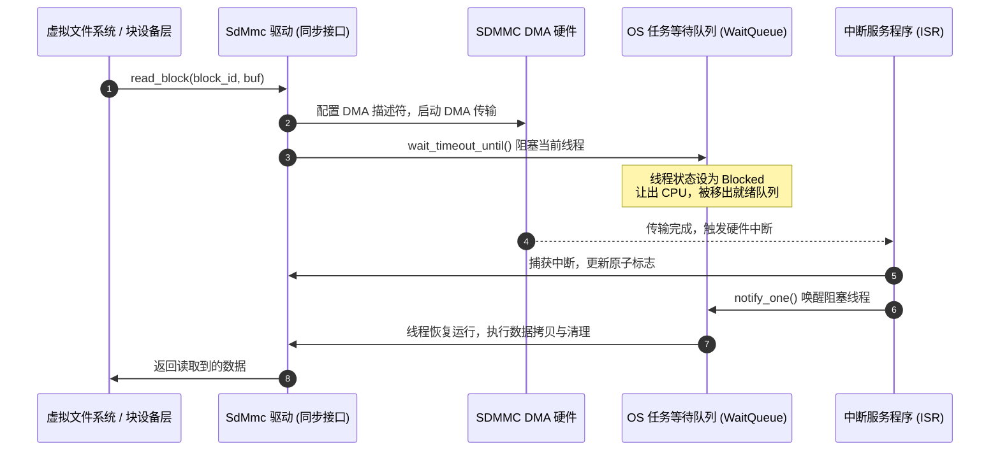
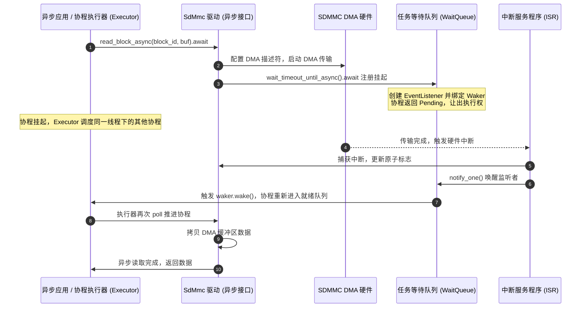
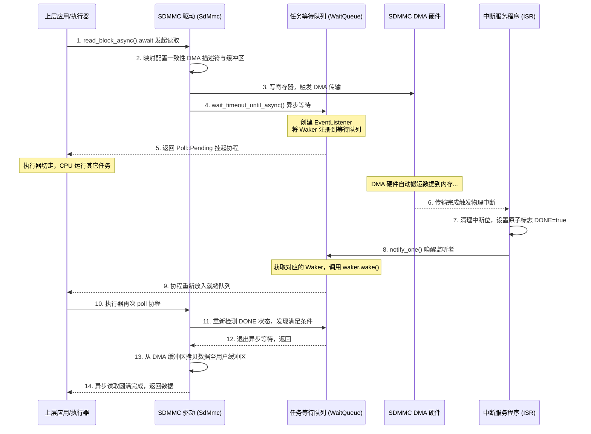

# SDMMC 驱动异步化技术总结

本报告主要记录了我在2026春夏季开源操作系统训练营在 StarryOS 上开发 SDMMC 块设备驱动以及实现异步读写的全过程，包括最终完整的调用链路、同步与异步双通道设计思路以及遇到的相关技术细节。

---

## 一、 项目当前整体内容及当前完整调用链路

### 1.1 项目当前整体内容
当前项目的开发分为两个流程,首先是原代码的复现工作,在复现过程中进行了部分的小段更改,其次是异步化改造工作,异步化改造主要对`axtask` 和 `simple-sdmmc`两个模块进行更改,同步的流程保持不变,异步的流程基于同步流程进行改造,最终改造后的调用链路如下:

### 1.2 驱动完整调用链路

支持两种调用链路，分别适配之前的同步调用与现代的异步协程调度：

#### 1.2.1 同步通道完整调用链路 (Synchronous Flow)
同步通道核心是通过阻塞当前 OS 线程来等待硬件中断。



**详细调用步骤分解：**
1. **入口发起**：上层文件系统/内核调用 `SdMmc::read_block(block_id, buf)` 或 `write_block`。
2. **DMA 缓冲区准备**：驱动配置传输大小，并获取物理上连续的一致性 DMA 缓存区。如果是写操作，将用户 `buf` 中的数据拷贝进 DMA 缓存。
3. **进入 `send_cmd_idmac`**：
   * **创建描述符**：分配一个 DMA 描述符 `IdmacDescriptor`，配置缓冲区物理地址与大小，并将描述符地址写入 `dbaddr` 寄存器。
   * **重置标志位**：将全局原子变量 `IDMAC_DONE_FLAG` 和 `IDMAC_ERROR_FLAG` 置为 `false`。
   * **启动硬件**：向 `cmdarg` 和 `cmd` 寄存器写入指令，并写入 `pldmnd` 寄存器，启动 SDMMC 硬件及内部 DMA 传输。
4. **线程阻塞等待**：
   * **驱动调用**：
     ```rust
     IDMAC_WAIT_QUEUE.wait_timeout_until(
         Duration::from_secs(1), 
         || IDMAC_DONE_FLAG.load(Ordering::Acquire) || IDMAC_ERROR_FLAG.load(Ordering::Acquire)
     )
     ```
   * **底层动作**：当前线程被放入等待队列，状态修改为 `Blocked`（阻塞态），当前 CPU 切换上下文去运行其他就绪线程。此时 CPU 没有任何忙等轮询。
5. **硬件中断触发与唤醒**：
   * 当 DMA 数据传输完毕，SD/MMC 控制器触发物理中断。
   * CPU 跳转至中断服务程序（ISR）：`SdMmc::handle_interrupt()`。
   * ISR 中更新状态：`IDMAC_DONE_FLAG.store(true)` 并调用 `IDMAC_WAIT_QUEUE.notify_one()`。
   * 调度器收到唤醒通知，将原阻塞线程放回就绪队列，并恢复其执行。
6. **收尾与返回**：
   * 线程恢复执行后，从 `wait_timeout_until` 返回，读取响应寄存器 `resp` 验证传输正确性。
   * 释放描述符内存，清理中断标志。
   * 如果是读操作，把数据从一致性 DMA 缓存拷贝回用户 `buf`，返回上层。

---

#### 1.2.2 异步通道完整调用链路 (Asynchronous Flow)
异步通道专门为协程并发设计，其核心是通过 Rust Future 挂起协程，释放 OS 线程去运行其他任务，等待硬件中断精准唤醒。



**详细调用步骤分解：**
1. **入口发起**：上层异步调用器 `.await` 执行 `SdMmc::read_block_async(block_id, buf)` 或 `write_block_async`。
2. **DMA 缓冲区准备**：与同步相同，配置大小，如果是写操作则将数据拷入 DMA 一致性内存中。
3. **调用并 `.await` 执行 `send_cmd_idmac_async`**：
   * **描述符配置**：构建 `IdmacDescriptor` 描述符，关联缓冲区物理地址并写入 `dbaddr`。
   * **重置原子标志**：重置 `IDMAC_DONE_FLAG` 与 `IDMAC_ERROR_FLAG`。
   * **启动硬件**：写入 `cmdarg` 和 `cmd` 寄存器启动命令，并写入 `pldmnd` 唤醒 DMA。
4. **协程挂起 (Yield)**：
   * **驱动执行到异步等待处**：
     ```rust
     IDMAC_WAIT_QUEUE.wait_timeout_until_async(
         Duration::from_secs(1), 
         || IDMAC_DONE_FLAG.load(Ordering::Acquire) || IDMAC_ERROR_FLAG.load(Ordering::Acquire)
     ).await
     ```
   * **底层动作**：
     * 该异步等待返回一个 Future 状态机。
     * 当执行器第一次 `poll` 该 Future 时，通过 `event-listener` 在栈上创建一个监听节点，将当前协程的 `Waker` 登记并挂载到 `IDMAC_WAIT_QUEUE` 中。
     * 检查条件不满足，返回 `Poll::Pending`。
     * 执行器（Executor）将此协程移出活跃调度链表，底层的 OS 线程立刻去执行其他协程。
5. **中断精准唤醒**：
   * 硬件传输完毕触发物理中断，CPU 进入 `SdMmc::handle_interrupt()`。
   * 中断程序将 `IDMAC_DONE_FLAG` 原子设为 `true`。
   * 调用 `IDMAC_WAIT_QUEUE.notify_one()` 找到链表里登记的协程 `Waker`，调用 `waker.wake()`。
   * 执行器把该协程重新放入就绪队列。
6. **协程恢复与完成**：
   * 执行器再次 `poll` 该协程，此时条件满足，`wait_timeout_until_async` 返回 `Poll::Ready`。
   * 协程退出 `.await`，读取并验证寄存器，释放描述符。
   * 读操作将数据从 DMA 缓冲搬运至用户 `buf`。异步读取结束。

---

## 二、 初次复现代码的具体改动

### 2.1 整体代码结构分析 (`src` 目录)

以下是原代码 `src` 目录下的核心文件职责与作用分工：

| 文件名称 | 核心职责 | 具体作用描述 |
| :--- | :--- | :--- |
| [lib.rs] | 驱动模块入口 | 统一导出子模块，向外部公开核心驱动结构体 `SdMmc`。 |
| [sdmmc.rs] | 传输与控制逻辑 | 实现 `SdMmc` 生命周期与初始化配置流程（时钟配置、卡检测、OCR 协商、CID/CSD 获取等）；提供块读写接口 `read_block` 和 `write_block`（支持自动判定 DMA/PIO 模式）；实现具体命令发送函数 `send_cmd` 与 `send_cmd_idmac`；提供硬件中断处理函数 `handle_interrupt` 用于接收控制器和内部 DMA 的状态并反馈给等待任务。 |
| [regs.rs] | 底类寄存器定义 | 映射并定义控制器的寄存器块（`RegisterBlock`）布局，并利用 `bitfield-struct` 宏安全地建模各个寄存器的位域字段（如 `Ctrl`、`BMod`、`IdIntEn`、`IdSts`、`RIntSts` 等），保证寄存器读写的类型安全。 |
| [cmd.rs] | 命令与数据传输构建 | 定义 SD/MMC 命令枚举 `Command`（如 `GoIdleState`、`AppCmd`、`ReadSingleBlock` 等），构建出寄存器所需的命令控制字和参数值，并定义数据传输方向结构 `DataXfer`。 |
| [dma.rs] | DMA 内存与描述符管理 | 定义符合 IDMAC 硬件接口要求的 DMA 描述符 `IdmacDescriptor` 结构；提供物理连续且对齐 of DMA 一致性内存的申请（`alloc_coherent`）与释放（`dealloc_coherent`）接口。 |
| [utils.rs] | 元数据解析辅助工具 | 定义并解析 CID（卡识别寄存器）与 CSD（卡特定数据寄存器），用于计算块设备的总容量、卡片块数量以及获取生产元数据。 |

---

---

### 2.3 复现代码的具体改动

通过对旧版本 (`root-simple-sdmmc-extended`) 与新版本 (`retry-simple-sdmmc-extended-dma`) 进行深度代码比对，新版本在保持与旧版本时序对齐的同时，在以下几个关键维度进行了深入的修复与改善：

> [!WARNING]
> #### 1. 内存泄漏与异常安全 (Critical)
> * **旧版本 (`root`)**：如果在“第二阶段（命令响应等待）”中发生了超时，函数会直接返回 `None` 退出，而**未能释放**通过 `alloc_coherent` 申请的 `dma_desc_info` 物理连续内存。这在硬件超时或出错时会导致严重的系统内存泄漏。
> * **新版本 (`retry`)**：在此类所有异常分支（如超时、命令错误）中均补齐了 `dealloc_coherent` 释放操作，彻底消除了内存泄漏隐患，保证了底层的异常安全。

> [!IMPORTANT]
> #### 2. PIO 模式下 FIFO 地址访问 Bug 修复 (Correctness)
> * **旧版本 (`root`)**：在数据传输循环中，使用 `fifo_base.byte_add(offset).read_volatile()`。这错误地将数据读写的字节偏移量（`offset`）加在了寄存器地址上。由于 FIFO 寄存器属于单一端口物理映射，偏移会导致读取非法的内存空间。
> * **新版本 (`retry`)**：完全修复了此 Bug。数据传输始终对固定的 `fifo_base` 地址执行 `read_volatile()`/`write_volatile()`，完全符合硬件规范。

> [!IMPORTANT]
> #### 3. 跨上下文错误传递机制 `IDMAC_ERROR_FLAG` (Robustness)
> * **旧版本 (`root`)**：未定义任何全局错误同步标志位。当中断服务程序（ISR）捕获了致命总线错误（`FBE`）、描述符不可用（`DU`）或卡错误（`CES`），也无法安全地向主线程传递该错误信号，导致主线程在发生硬件故障时只能“假死”直至超时。
> * **新版本 (`retry`)**：引入了全局原子变量 `pub static IDMAC_ERROR_FLAG: AtomicBool = AtomicBool::new(false);`。
>   * **职责**：在 `handle_interrupt` (中断侧) 捕获硬件异常后，通过 `store(true, Release)` 原子地设置标志。
>   * **优势**：在 `send_cmd_idmac` (主线程侧) 配合 `load(Acquire)` 进行检查。该机制利用底层 CPU 的缓存一致性协议，在无锁（Lock-free）且不引起死锁的前提下，将硬件级的故障快速、安全地通知给主线程，构成了驱动安全降级与错误恢复的通信基石。

> [!TIP]
> #### 4. 防御性状态轮询 (Efficiency)
> * **旧版本 (`root`)**：数据传输等待缺乏灵敏的中断级错误响应，在出错时只能依靠强行等待 5 秒超时来退出。
> * **新版本 (`retry`)**：在数据传输的第三阶段，引入了相较于初始基准状态的防御性错误校验（实时检测新发生的 `new_fbe`/`new_ces`/`new_du` 等），一旦检测到错误即刻跳出循环并释放资源，将故障恢复延迟缩短到微秒级。

#### 5. 数据结构与注释清理 (Code Health)
* **旧版本 (`root`)**：`SdMmc` 结构体内部保留了大量前期调试残留的、被注释掉的未实现字段（如 `support_dma_64bit_address`、`sg_cpu` 等），代码冗余严重。
* **新版本 (`retry`)**：彻底清理了这些冗余字段，使核心数据结构非常精简。同时，补充了详实的中文注释，解释了并发原子操作以及休眠唤醒逻辑。

#### 6. 调试日志降噪 (Code Health)
* **旧版本 (`root`)**：在卡片初始化和时钟配置阶段，大量使用 `warn!` 级别输出过程日志，在操作系统正常启动时会产生大量无用日志垃圾。
* **新版本 (`retry`)**：将正常的硬件状态快照和初始化过程日志降级为 `debug!` / `trace!`，仅在真正发生严重异常时才输出警告，使得内核终端输出更加整洁。

---

## 三、 完善异步机制的代码改动

我的这次改造涉及模块 `axtask` 和 `simple-sdmmc` 两个组件，采用了**同步与异步双独立通道**的设计模式：

### 3.1 具体的改造内容

#### 3.1.1 `axtask` 模块：WaitQueue 异步等待扩展
在 `wait_queue.rs` 中，为底层基于 `event-listener` 的挂起队列 `WaitQueue` 扩展了 4 个非阻塞的异步等待方法，允许协程进行 `.await` 挂起而不阻塞底层 OS 线程：
* `wait_async()`：异步等待事件通知。
* `wait_until_async(condition)`：异步等待直到满足特定条件。
* `wait_timeout_async(dur)`：异步等待带超时机制。
* `wait_timeout_until_async(dur, condition)`：异步等待直到满足条件或超时（本项目核心依赖项）。

#### 3.1.2 `simple-sdmmc` 驱动：非轮询化同步通道
在同步 DMA 发送接口 `send_cmd_idmac` 中，**彻底移除了原有的 CPU 忙轮询循环**（原循环通过不断调用 `axtask::yield_now()` 轮询原子标志，浪费大量 CPU 周期并且无法真正让线程进入 Blocked 状态）：

::: code-group
```rust [修改前：忙轮询 (CPU 忙等待)]
while !IDMAC_DONE_FLAG.load(Ordering::Acquire) {
    if axhal::time::wall_time() >= deadline { ... }
    axtask::yield_now(); // 忙等待，任务仍留在就绪队列
}
```

```rust [修改后：挂起阻塞 (让出 CPU)]
let dma_irq_timed_out = IDMAC_WAIT_QUEUE.wait_timeout_until(
    Duration::from_secs(1),
    || IDMAC_DONE_FLAG.load(Ordering::Acquire) || IDMAC_ERROR_FLAG.load(Ordering::Acquire),
); // 真正的线程阻塞，被移出就绪队列
```
:::

* **同步读写映射**：`read_block` 和 `write_block` 保持同步签名，并在内部直接调用该同步的 `send_cmd_idmac` 接口。当调用发生时，当前 OS 线程会被挂起进入睡眠状态，直到 DMA 中断到来触发 `IDMAC_WAIT_QUEUE.notify_one()` 或超时。

#### 3.1.3 `simple-sdmmc` 驱动：原生异步协程通道
在 [sdmmc.rs] 中全面引入了原生的异步协程读写逻辑：
* **`send_cmd_idmac_async` (异步 DMA 发送核心)**：新建异步 DMA 命令发送接口。在等待 DMA 中断时，调用 `.wait_timeout_until_async(...).await` 将当前协程注册挂起。此过程**完全不阻塞底层的 OS 线程**，线程可以立刻去运行同一个线程内的其他协程。
* **`read_block_async` 与 `write_block_async` (异步读写接口)**：新增两个公共异步方法。它们通过 `.await` 挂起等待 `send_cmd_idmac_async` 执行完成。一旦中断触发唤醒，协程继续在用户态被 poll 推进，完成后续 of DMA 缓冲区数据搬运工作。

---

### 3.2 架构模式对比与优劣分析

在开发过程中，我对两种主流的“同步/异步共存”设计模式进行了对比，最终选择了性能最优的**独立双通道设计**：

| 维度 | 方案 A：统一异步内核 + `block_on` 包装（已废弃） | 方案 B：独立双通道设计（当前采用） |
| :--- | :--- | :--- |
| **具体实现** | 同步的 `read_block` 内部直接调用 `block_on(read_block_async)`。 | 同步与异步各走一套底层的 `send_cmd_idmac` 接口。 |
| **代码复用性** | **高**。DMA 的设置和拷贝逻辑只写了一遍，没有冗余。 | **较低**。同步路径和异步路径 of DMA 配置结构存在重复。 |
| **同步路径性能**| **略低**。每次同步调用都需要额外付出创建协程 Waker、Pin 状态机以及运行 `block_on` 循环的 CPU 额外开销。 | **极致（最高）**。同步读写直接调用 `send_cmd_idmac`，为纯同步函数调用，没有任何运行时的额外损耗。 |
| **异步路径并发**| **高**。协程非阻塞挂起。 | **高**。协程非阻塞挂起。 |
| **错误调试难度**| **高**。同步调用栈中会混入异步状态机的匿名类型与 runtime 调用栈。 | **极低**。同步调用栈就是普通的底层寄存器和锁操作，易于定位。 |

**结论**：在操作系统内核和设备驱动开发中，**性能和低确定性延迟是第一优先级**。因此，方案 B 虽然带来了少量的 DMA 配置逻辑重复，但保证了同步路径的极限吞吐量，是更为妥当的系统级驱动重构设计。

---

## 四、 完整的异步读/写执行流

以异步读取 `read_block_async` 为例，下面详细展示其整体的事件传播与状态转换链路：

### 4.1 协程 Waker 唤醒机制与 `event_listener` 的绑定
当底层没有数据到来或 DMA 未完成时，协程必须挂起。唤醒机制的底层运转如下：
* **挂起与登记**：
  1. 协程在 `wait_timeout_until_async` 的 `.await` 处被执行器 `poll` 时，会在栈上构造一个 `EventListener`。
  2. `EventListener` 将自身以链表节点的形式注册到全局 `IDMAC_WAIT_QUEUE` 中。
  3. `event-listener` 会在 poll 过程中获取当前协程上下文的 `Waker`（由上层执行器传入），并将其克隆并绑定到该监听器节点上。
  4. 如果等待的条件（例如 `IDMAC_DONE_FLAG`）尚未满足，则 poll 返回 `Poll::Pending`。执行器接收到 `Pending` 后，会把当前协程移出活跃就绪链表，暂停对其调度。
* **中断精准唤醒**：
  1. DMA 数据传输完成，硬件触发物理中断，CPU 强行中断当前线程并跳转到 `SdMmc::handle_interrupt()` 中断服务程序（ISR）。
  2. ISR 中，驱动清除硬件中断状态并原子 store 将 `IDMAC_DONE_FLAG` 设为 `true`。
  3. 接着调用 `IDMAC_WAIT_QUEUE.notify_one(true)`。
  4. `notify_one` 会在等待队列链表中找到该协程对应的 `EventListener`，提取出其中的 `Waker`，并调用 `waker.wake()`。
  5. 此时，该协程状态被标记为就绪，重新放回执行器的就绪调度队列中。

### 4.2 原子变量的协作
在多核或中断可能抢占的环境下，使用原子变量来进行状态标志通信至关重要：
* **`IDMAC_DONE_FLAG: AtomicBool`**：标明 DMA 传输是否成功结束。在触发 DMA 传输前置为 `false`，在硬件中断成功接收到完成信号时置为 `true`。
* **`IDMAC_ERROR_FLAG: AtomicBool`**：标明硬件（如控制器或 DMA）是否发生了致命错误。在中断处理函数检测到错误位（如 FBE、DU、CES）时置为 `true`。
* **内存顺序（Ordering）**：使用 `Ordering::Acquire` and `Ordering::Release` 保证多核/中断上下文之间的数据可见性与指令重排安全。

### 4.3 完整的调用与运转链路 (Execution Flow)
以异步读取 `read_block_async` 为例，完整的调用与运转链路如下：



---

## 五、 当前存在的问题

由于我最终采用了物理隔离的同步和异步双通道设计（即独立的同步与异步底层接口），目前导致了以下两组函数在底层的 **DMA 物理缓冲区分配**、**IDMAC 描述符链装配**、以及**读写的前后置数据同步搬运**上存在约 **80%** 的代码逻辑重复：
* `send_cmd_idmac` (同步) 与 `send_cmd_idmac_async` (异步)
* `read_block` (同步) 与 `read_block_async` (异步)
* `write_block` (同步) 与 `write_block_async` (异步)

后续如果我要继续冗余代码的重构,大概就是把三个部分改造为辅助函数:

### DMA 配置助手化
将当前冗余的一致性内存分配、`IdmacDescriptor` 结构体物理填充（包含控制字、缓冲区大小、缓冲区地址配置等）抽离为独立的公共辅助函数，例如：
```rust
fn prepare_dma_desc(...) -> Result<DmaDescInfo, DmaError>
```

### 读写前后置操作抽象
将读操作的后置数据搬运拷贝（从物理连续的一致性 DMA 缓存拷贝至用户 buffer）、写操作的前置数据填充（从用户 buffer 拷贝至一致性 DMA 缓存）以及 DMA 一致性内存的释放生命周期管理，抽象出统一的辅助清理函数。

### 保持通道隔离并调用辅助函数
重构后，同步读写和异步读写只需在入口与出口分别调用上述公共抽象逻辑，而其核心等待与挂起机制（即同步直接阻塞 VS 异步协程挂起）依然维持完全隔离，在彻底消灭冗余代码的同时，完美保留同步路径的极限吞吐量性能。

---

相关的仓库地址

* [余泽铖原代码仓库](https://github.com/PassingThroughStarDust/starry-sdmmc-dma-temp/tree/main)
* [我初次复现的代码仓库](https://github.com/xianxw/SDMMC)
* [异步化完成后的代码仓库](https://github.com/xianxw/RETRY-SDMMC/tree/main)