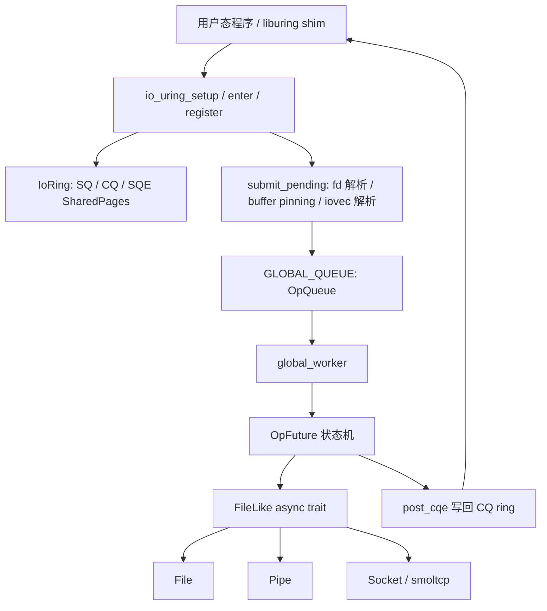

# **训练营学习总结报告：从并发模型理解到 StarryOS io_uring 异步 I/O 子系统实现**

# **摘要**

本报告总结我在训练营期间围绕并发执行流、异步 I/O、系统调用批处理和 StarryOS 内核机制展开的学习与开发工作。训练营前期，我通过爬虫并发实验、用户态线程/协程模型研究和 Priority Future Executor 实践，逐步建立了对进程、线程、协程、Future、Waker、Executor、Reactor 以及调度公平性的系统理解。训练营后期，我将这些理解落地到 StarryOS 内核中，重点完成了 io_uring 异步 I/O 子系统的设计、实现、测试与性能分析。

最终项目在 StarryOS `ax-pci` 分支上实现了较完整的 io_uring 原型：支持 `io_uring_setup`、`io_uring_enter`、`io_uring_register` 三个核心系统调用，实现 13 个 I/O opcode 和 7 个 register opcode，覆盖 NOP、READ/WRITE、READV/WRITEV、POLL_ADD/POLL_REMOVE、TIMEOUT、ACCEPT、SEND/RECV、固定缓冲区、注册文件表等功能。系统基于 `SharedPages` 构建用户态与内核态共享的 SQ/CQ ring，使用 `PinnedUserBuf` 解析并固定用户缓冲区，通过全局 worker 和手写 `OpFuture` 状态机在单核 StarryOS 环境下实现多路复用异步 I/O。

测试方面，最终实现通过自测 15/15、上游 tokio-rs io-uring-test 10/11、真实 liburing 核心测试 5/5，并在网络 echo 场景中展示出 io_uring 相比同步 fork-per-connection 和 epoll 模型的结构性优势。尤其在持续吞吐实验中，io_uring 在 N=10–50、R=100 轮的组合下保持 100% 可靠性，而 epoll 在 N≥30 时出现大量 RST。实验诊断表明，这一差异来自同步 `write` 在单核高并发下触发 TCP 流控超时，而 io_uring 的异步 SEND 路径能够通过 WouldBlock→park→窗口释放→retry 的背压机制天然规避该问题。

整个训练营的核心收获，是从“理解异步语法和并发模型”推进到“在操作系统内核中构建可运行的异步 I/O 子系统”。我不再只从接口层面理解 io_uring，而是具体理解了共享内存 ring、用户缓冲区 pinning、提交者上下文与 worker 上下文分离、Future 状态机、多路复用 worker、异步唤醒、背压、测试方法学和性能归因之间的关系。

**关键词**：StarryOS，io_uring，异步 I/O，Future，Waker，共享内存环，多路复用，系统调用批处理，Rust，RISC-V

---

## **一、训练营整体学习与开发脉络**

本次训练营的学习过程可以分为三个阶段。第一阶段主要是并发模型的基础实验，包括多进程、多线程和协程爬虫的性能对比。第二阶段转向用户态执行流机制，重点分析 Rust Future、无栈协程、有栈绿色线程和简化 Executor 的执行状态变化，并在此基础上实现优先级调度与 aging 防饥饿机制。第三阶段则进入内核实践，在 StarryOS 中从零构建 io_uring 异步 I/O 子系统，把前两个阶段中对异步调度、唤醒机制和并发资源管理的理解落实到系统调用与内核 I/O 路径中。

这个过程不是简单地完成几个相互独立的任务，而是形成了一条逐步递进的技术路线。爬虫实验让我直观看到进程、线程和协程在高并发 I/O 场景下的资源曲线差异；Future Executor 实验让我理解 `poll -> Pending -> register waker -> wake -> re-poll -> Ready` 的事件驱动闭环；Priority Executor 实践让我意识到调度策略必须贯穿任务创建、挂起、唤醒和重新入队的完整路径；最终的 io_uring 项目则要求我在内核中同时处理共享内存、系统调用 ABI、用户地址空间、文件描述符、socket 背压、worker 调度和测试归因等问题。

从学习目标上看，训练营前期更偏“理解机制”，后期更偏“构建系统”。最终我完成的不只是一个可跑通的接口原型，而是一个具备较完整功能覆盖、兼容性验证和性能诊断的异步 I/O 子系统。

---

## **二、阶段一：并发爬虫实验与并发模型理解**

训练营早期，我实现了顺序基线版爬虫，并进一步完成了基于多进程、多线程和协程的三种并发爬虫程序。这个任务的目标并不只是比较哪个程序更快，而是通过统一的实验框架理解三种并发模型在 Linux 操作系统层面的资源行为。

多进程模型中，每个任务拥有独立地址空间、页表、文件描述符表和运行时状态，因此隔离性强，但进程创建、销毁、调度和内存占用成本都很高。多线程模型共享进程地址空间，避免了进程级隔离带来的大量重复资源，但每个线程仍然对应内核调度实体和独立栈，线程数量过多时会引入调度队列膨胀、上下文切换和栈内存压力。协程模型则通过少量内核线程承载大量用户态 Future 状态机，在 I/O 密集型场景下能够显著减少内核调度实体数量。

在实验实现上，进程版采用父进程派生子进程的方式，并通过额外监控线程收集子进程输出和退出状态；线程版基于 Rayon 工作窃取线程池实现任务分发；协程版基于 Tokio，通过 `tokio::spawn` 和异步信号量控制并发水位，并使用无锁通道聚合遥测数据，避免高并发下的锁竞争。

性能数据呈现出非常清晰的结构性差异。在 Pure_IO 负载下，协程模型整体吞吐最高，并在高并发下保持最稳定的成功率。以 3000 并发为例，线程模型成功率下降到 40.49%，平均延迟达到 5000 ms，P95 延迟达到 6493 ms；协程模型仍保持 100% 成功率，平均延迟约 497 ms，P95 延迟约 759 ms。这个结果说明，在大量请求主要阻塞于网络 I/O 的场景下，将每个任务映射为一个内核线程并不是理想选择，协程的轻量状态机和事件驱动调度更适合承载高并发。

这个阶段给后续 io_uring 项目带来的直接启发是：高并发 I/O 的关键瓶颈往往不是单次读写逻辑，而是“每个并发请求对应多少内核调度实体、多少栈、多少上下文切换、多少系统调用”。这也正是 io_uring 想解决的问题：通过共享内存 ring 和批量提交减少系统调用开销，通过异步完成队列避免为每个 I/O 操作创建独立阻塞线程。

---

## **三、阶段二：用户态执行流、Future 与优先级调度研究**

在第二阶段，我围绕 Rust Future、无栈协程、有栈绿色线程和简化 Future Executor 进行了系统学习与动态跟踪。这个阶段的目标是回答三个问题：执行流暂停时状态保存在哪里，谁决定它何时恢复，以及恢复后由谁继续推动它执行。

在 100 行无栈协程实验中，任务的暂停和恢复由 Future 状态机完成。每个 `.await` 点本质上对应一次 `Poll::Pending` 返回，当前调用栈退出，执行状态保存在编译器生成的 Future 结构体字段中。下一次 Executor 调用 `poll()` 时，状态机从上一次暂停的位置继续执行。该实验中的调度策略非常简单，任务返回 `Pending` 后被放回 FIFO 队尾，因此多个任务以 round-robin 方式交错推进。

在 200 行 Future Executor 实验中，模型进一步引入 Reactor、Waker 和 Parker，形成更完整的事件驱动闭环。Executor 首次 poll Future，Future 注册 Waker 后返回 Pending，Executor park 当前线程；外部事件完成后，Reactor 调用 Waker，Waker 唤醒 Executor；Executor 再次 poll Future，最终得到 Ready。这个过程让我明确理解到：Waker 并不直接运行 Future，也不直接恢复 async block，它只是通知 Executor “这个任务可能可以继续执行”。真正推进 Future 的动作始终是下一次 `poll()`。

有栈绿色线程实验则展示了另一条路线。绿色线程拥有独立栈和寄存器上下文，yield 时不会像 Future 那样通过 return 退出当前调用栈，而是由 Runtime 保存栈指针和 callee-saved 寄存器，再切换到另一个任务的栈。它的优点是业务代码可以保持接近同步风格，缺点是需要独立栈、上下文切换汇编和更复杂的平台相关支持。

在此基础上，我进一步实现了 Priority Future Executor。原始简化 Executor 只能驱动单个顶层 Future，我将它扩展为支持 `spawn(priority, future)` 的多任务执行器，并维护 high、normal、low 三个 ready queue。任务首次创建时按照基础优先级入队，返回 Pending 后等待 Waker 唤醒，唤醒时也必须按照当前优先级重新入队。这个实践让我意识到，调度策略不能只作用于任务创建时，还必须覆盖异步唤醒路径，否则一旦任务经历 Pending→wake→re-enqueue，优先级信息就会丢失。

为了缓解严格优先级可能带来的低优先级任务饥饿，我还实现了 aging 机制。每个任务维护 base priority、current priority、wait ticks 和 scheduled count。等待时间超过阈值后，低优先级任务会被临时提升，获得运行机会；被 poll 后再恢复基础优先级。最终测试覆盖了高优先级先运行、同优先级 FIFO、wake 后保持优先级、Pending 到 Ready 状态转换、严格优先级饥饿和 aging 防饥饿等场景，17 项测试全部通过。

这个阶段对最终 io_uring 项目的帮助非常直接。StarryOS 的 io_uring worker 本质上也是一个事件驱动执行器：SQE 被提交后转化为 `OpFuture`，不可继续时返回 Pending，底层 I/O 资源通过 Waker 唤醒 worker，worker 再次 poll 对应操作直到 Ready，然后写回 CQE。也就是说，用户态 Future Executor 的机制，最终被迁移到了内核态 I/O 多路复用路径中。

---

## **四、阶段三：StarryOS io_uring 异步 I/O 子系统设计与实现**

### **4.1 项目背景与目标**

StarryOS 在原有 I/O 模型中以同步阻塞语义为主。`read()`、`write()`、`send()`、`recv()` 等接口在资源未就绪时会阻塞调用线程。高并发场景下，如果每个连接或每个请求都对应一个独立任务，就会带来 O(K) 的内核栈开销和调度压力。训练营前期爬虫实验已经说明：当并发数上升时，进程/线程模型的资源成本会迅速放大，而协程和事件驱动模型更适合 I/O 密集型负载。

io_uring 的核心思想是通过用户态与内核态共享 ring buffer，减少系统调用次数，并用提交队列 SQ 和完成队列 CQ 将 I/O 操作变成异步提交/异步完成模型。用户态将 SQE 写入共享内存，内核批量消费 SQE 并在完成后写回 CQE。相比传统同步系统调用，它的价值不仅是减少 syscall 数量，更重要的是提供统一的异步 I/O 提交与完成语义，使网络、文件、管道等不同 I/O 对象可以被同一套事件驱动 worker 多路复用。

本项目的目标是在 StarryOS 上从零实现一套可运行的 io_uring 子系统，并尽可能贴近 Linux 5.x ABI 语义，使上游 liburing 测试和 tokio-rs io-uring-test 能够在 StarryOS 上运行。

### **4.2 从 Phase 1 原型到最终系统**

在 6.14 阶段，我首先完成了 io_uring 的 Phase 1 原型。该阶段的重点是验证 StarryOS 架构下能否跑通基本的 SQ→worker→CQ 路径。当时实现了基础 ring buffer、`SharedPages` 映射、`PinnedUserBuf` 地址解析和全局 worker 模式，并支持 NOP、READ、WRITE、POLL_ADD 等基础操作码。测试上通过了 7 项基本功能测试，包括 NOP round-trip、管道读写、POLL 唤醒、文件读取、批量提交和基础规模测试。

不过，Phase 1 仍然非常粗糙。它的 opcode 覆盖不足，不支持 SEND/RECV、ACCEPT、READV/WRITEV 等网络和向量 I/O；环布局还没有完全对齐标准 liburing；CQ 溢出、错误码转换、权限检查、高级注册特性和 `IORING_ENTER_GETEVENTS` 等能力也不完整。更重要的是，当时的性能测试只证明了 batching 有效，但尚未形成可信的网络并发对照和结构性归因。

最终版本在 Phase 1 基础上做了系统性扩展。实现范围从“能跑通基础 round-trip”提升到“具备标准系统调用接口、共享内存 ring、用户缓冲区 pinning、多 opcode 支持、异步 worker、多路复用网络 I/O、上游测试兼容、liburing ABI 验证和性能诊断”的完整子系统。

### **4.3 功能覆盖**

最终实现包含三个核心系统调用：

| 系统调用            | 功能                                                    |
| ------------------- | ------------------------------------------------------- |
| `io_uring_setup`    | 创建 io_uring 实例，分配 SQ/CQ/SQE 共享页，返回 ring fd |
| `io_uring_enter`    | 提交 SQE、驱动 pending 操作、等待 CQE                   |
| `io_uring_register` | 注册缓冲区、注册文件表、查询支持 opcode 等              |

支持的 13 个主要 opcode 包括：

| 类别          | opcode                       | 作用                          |
| ------------- | ---------------------------- | ----------------------------- |
| 基础测试      | `NOP`                        | 验证 ring 往返路径            |
| 文件/管道 I/O | `READ` / `WRITE`             | 单缓冲读写                    |
| 向量 I/O      | `READV` / `WRITEV`           | 多段 iovec 读写               |
| 固定缓冲区    | `READ_FIXED` / `WRITE_FIXED` | 使用注册缓冲区读写            |
| 轮询          | `POLL_ADD` / `POLL_REMOVE`   | 等待或取消 fd 就绪事件        |
| 定时          | `TIMEOUT`                    | 相对超时，完成时返回 `-ETIME` |
| 网络          | `ACCEPT` / `SEND` / `RECV`   | TCP 接受连接、发送、接收      |

支持的 register opcode 包括 `REGISTER_BUFFERS`、`UNREGISTER_BUFFERS`、`REGISTER_FILES`、`REGISTER_PROBE`、`REGISTER_BUFFERS2`、`REGISTER_BUFFERS_UPDATE` 和 `REGISTER_FILES_UPDATE`。其中 `REGISTER_FILES` 与 `IOSQE_FIXED_FILE` 的实现使用户态可以预注册 fd 表，后续 SQE 中的 fd 字段可以解释为注册表索引，从而减少每次操作的 fd 查找成本。

此外，系统还实现了 `IORING_FEAT_NODROP`、`IORING_FEAT_RSRC_TAGS`、`IORING_FEAT_FAST_POLL` 声明、稀疏缓冲区表、缓冲区标签释放 CQE、`MSG_DONTWAIT` 非阻塞路径、`io_uring_sqe_set_data` / `io_uring_cqe_get_data` 兼容封装等能力。

---

## **五、io_uring 核心实现设计**

### **5.1 用户态与内核态共享内存环**

io_uring 的核心数据结构是共享内存 ring。最终实现使用三块 `SharedPages` 分别承载 SQ ring、CQ ring 和 SQE array。用户态通过 `mmap` 将这些物理页映射到自己的地址空间，随后可以直接写 SQE、更新 SQ tail，也可以直接读取 CQE、推进 CQ head。

SQ ring 中维护 head、tail、mask、entries、flags、dropped 和 SQE index array；CQ ring 中维护 head、tail、mask、entries、overflow、flags 和 CQE 数组；SQE array 则按 64 字节一个 SQE 的布局保存提交项。内核侧通过 `SqRing` 和 `CqRing` 结构保存对这些共享页字段的裸指针视图，并使用原子读写维护生产者-消费者关系。

这一设计的价值在于，用户态不需要为每个 I/O 操作都把参数复制进内核；内核完成操作后，也不需要通过额外系统调用返回结果。提交路径只需要用户态写 SQE、一次 `io_uring_enter` 批量提交；完成路径则可以通过 CQ ring 直接收割 CQE。在 StarryOS 当前尚未实现 SQPOLL 的情况下，提交侧仍然需要 `io_uring_enter`，但共享 ring 已经实现了批量提交和零拷贝完成通知的基础结构。

### **5.2 用户缓冲区 pinning 与零拷贝路径**

异步 I/O 最大的问题之一是：提交系统调用返回后，worker 可能在未来某个时刻才真正访问用户缓冲区。如果只保存用户虚拟地址，worker 运行时可能不再处于提交者地址空间中，地址解析和安全性都会出问题。

为解决这个问题，实现中引入了 `PinnedUserBuf`。提交者在 `io_uring_enter` 路径中仍处于正确用户地址空间，因此可以遍历页表，把用户虚拟地址解析成物理页，并将这些物理页信息保存下来。worker 后续不再依赖提交者虚拟地址空间，而是通过 `phys_to_virt` 访问已解析的物理页。

这种设计实现了提交者上下文和 worker 上下文之间的清晰分工：提交者负责所有依赖用户地址空间和 fd 表的解析工作，worker 只负责驱动已经解析好的 I/O 操作。整个 I/O 路径上的数据移动被压缩到应用 buffer 与底层文件、管道或 socket 驱动之间，避免了额外的中间拷贝。

### **5.3 提交者上下文与 worker 上下文分离**

最终实现中特别重要的一点，是明确区分哪些工作必须在提交者上下文完成，哪些工作可以交给全局 worker。

提交者上下文负责 fd 解析、用户缓冲区 pinning、iovec 解析、timeout 参数读取、固定缓冲区索引解析和 ACCEPT 新 fd 安装等操作。原因是这些操作依赖用户进程的地址空间、fd table 或系统调用现场。worker 是全局内核任务，不持有调用者的用户态上下文，因此不能随意访问提交者的 fd 表或用户虚拟地址。

worker 上下文则负责真正的异步 I/O 推进。提交者将解析完成的 `Op` 推入全局队列，worker 从队列中取出任务，转化为 `OpFuture`，通过 `poll()` 反复推进。操作完成后，worker 写回 CQE 并唤醒等待 CQE 的提交者。

这种设计避免了一个常见错误：把用户地址解析、fd 查找和异步执行混在 worker 中。最终系统中，worker 只处理已经“内核化”的操作描述，因而更稳定，也更符合异步 I/O 子系统的职责分离。

### **5.4 OpFuture：内核中的手写 Future 状态机**

`OpFuture` 是整个 io_uring worker 的核心。它不是用 `async fn` 自动生成，而是手写实现 `Future`。这样可以显式保存 opcode、user_data、文件对象、buffer 列表、poll 事件、msg flags、offset、timeout future、累计字节数和 iovec 恢复位置等状态。

不同 opcode 在 `poll()` 中走不同分支。NOP 直接 Ready；POLL_ADD 检查事件就绪，否则注册 waker 并 Pending；READ/RECV 走 `poll_read`；WRITE/SEND 走 `poll_write`；READV/WRITEV 则跨多个 iovec 分段推进；TIMEOUT 惰性创建 sleep future，到期后返回 `-ETIME`；固定缓冲区路径在提交阶段已经完成 buffer index 到 `PinnedUserBuf` 的解析。

其中最关键的是 `poll_rw`。它不是简单读写一次，而是支持跨 poll 恢复。对于 READV/WRITEV，一次操作可能包含多个 iovec，也可能因为底层 socket 暂时不可读或不可写而多次 Pending。`poll_rw` 会保存当前处理到哪个 iovec、已经累计了多少字节、是否遇到 WouldBlock，并在下一次 poll 时从中断位置继续。这一机制是 TCP 多段读写测试能够通过的关键。

### **5.5 FileLike 异步 trait 层**

为了让文件、管道和 socket 都能被同一个 io_uring worker 驱动，我在 `FileLike` trait 上扩展了 6 个异步相关方法：`poll_read`、`poll_write`、`poll_read_at`、`poll_write_at`、`try_read` 和 `try_write`。

这层抽象的意义在于，它把不同底层 I/O 对象统一成 worker 可以理解的 async 接口。普通文件通常永远 ready，可以直接返回 `Ready(read/write)`；管道可以使用自身的 `consume_once` / `produce_once` 实现非阻塞读写；socket 则通过 smoltcp 的非阻塞路径和 waker 注册参与事件驱动。

`try_read` 和 `try_write` 对应 `MSG_DONTWAIT` 语义，只尝试一次，不注册 waker；`poll_read` 和 `poll_write` 则在 WouldBlock 时注册 waker 并返回 Pending。这样 io_uring 能够精确表达“非阻塞立即返回”和“异步等待资源就绪”两类语义。

### **5.6 全局 worker 与 per-op 完成路由**

早期 worker 采用较直接的全表轮询方式：每次被唤醒后遍历所有 inflight 操作并逐个 poll。这在并发数较小时可以工作，但在 96 连接网络 echo 场景中出现了明显抖动。原因是任一 socket 就绪都会唤醒 worker，而 worker 每次都重新 poll 全部 inflight，单事件成本为 O(inflight)，在高并发下会挤压客户端获得 CPU 的机会，导致可靠性波动。

最终版本将 worker 重构为 per-op 完成路由。每个在途 op 拥有自己的 `OpWaker` 和单调递增 op id。底层 I/O 资源就绪时，只把对应 op id 推入 ready 队列，并唤醒 worker。worker 醒来后只 poll 新提交的 op 和 ready 队列中的 op，而不是广播式扫描所有 inflight。这样单事件成本从 O(inflight) 降到 O(ready)，通常接近 O(1)。

这一优化保持了 io_uring 原有的 O(1) 任务/栈开销，同时解决了高并发下 worker 轮询抖动问题。修复后，原先 96 连接 echo 的可靠性波动被消除，io_uring 能稳定完成 96/96。

---

## **六、io_uring 系统结构图**

整体结构可以概括为从用户态 liburing/shim，到系统调用层，再到 ring、op queue、worker、FileLike 异步驱动和底层设备的分层路径。

这张图反映了最终设计中最重要的分层原则：用户态只感知 io_uring ABI；系统调用层负责提交与注册；IoRing 管理共享内存和资源表；提交阶段完成用户上下文相关解析；worker 只处理已经解析好的异步操作；底层驱动通过统一的 FileLike async trait 接入；完成结果最终以 CQE 形式返回用户态。

---

## **七、测试验证与性能分析**

### **7.1 测试环境与测量方法**

最终测试运行在 RISC-V QEMU `virt` 环境，StarryOS 分支为 `ax-pci`，SMP=1。由于 QEMU TCG 单核环境并不能真实反映硬件系统调用 trap 成本，因此报告中特别区分了“功能正确性”“结构性指标”和“绝对吞吐数据”。绝对 req/s 或周期数不能直接外推到真实 RISC-V 硬件，但可靠性、是否 RST、是否通过上游测试、是否支持 ABI、是否发生 O(N) 抖动等结构性结论仍然具有较强参考价值。

测试分为三个层面。第一层是自建测试，覆盖 NOP、pipe、poll、file、timeout、accept、registered buffers、iodepth、echo 等场景。第二层是上游 tokio-rs io-uring-test，共 11 项，最终通过 10 项，1 项因上游 binary feature gate 跳过。第三层是真实 liburing 核心测试，使用上游 liburing 静态交叉编译，仅做 1 行 RISC-V 架构适配，最终核心测试 5/5 通过。

### **7.2 正确性与兼容性结果**

| 测试类别               |       结果 | 说明                                                         |
| ---------------------- | ---------: | ------------------------------------------------------------ |
| 自建 io_uring 测试     | 15/15 PASS | 覆盖基础功能、网络、poll、timeout、注册缓冲区等              |
| tokio-rs io-uring-test | 10/11 PASS | 第三方测试验证 NOP、batch、TCP、READV/WRITEV、register buffers 等 |
| 真实 liburing 核心测试 |   5/5 PASS | setup、enter、poll、fsync、poll-cancel 路径通过              |
| 社区 echo server ABI   |     可运行 | `queue_init_params`、`sqe_set_data`、`cqe_get_data` 路径工作 |

真实 liburing 测试中特别重要的是 `io_uring_setup` 和 `io_uring_enter`。前者验证 entries、NULL params、保留字段、非法 setup flags、ring fd read/write 拒绝等 ABI 行为；后者验证 ring 创建、4096 SQE 提交、文件 I/O、CQE 收割和无效 SQE index 丢弃计数等完整路径。这说明最终实现并不只是能跑自写测试，而是能够接受上游测试的约束。

未运行或无法完整运行的部分主要由 StarryOS 其他模块限制导致。例如部分 liburing 测试需要 `MAP_ANONYMOUS` 或 Unix domain socket，而当前 StarryOS 对应能力不足。这些限制不属于 io_uring 子系统本身的功能错误，但会影响更大范围的上游兼容性测试。

### **7.3 io_uring vs fork-per-connection**

为了验证事件驱动多路复用相对阻塞式并发模型的结构性优势，我实现了 io_uring echo server 与 fork-per-connection echo server 的对照。两者使用相同客户端、相同 payload 和相同 loopback 网络，区别只在服务端并发模型：io_uring 使用 1 个 worker 多路复用 K 个连接，fork 模型为每个连接创建独立 handler 子进程。

结果表明，在 K=64 时，io_uring 可靠性达到 64/64，而 fork-per-connection 只有 3/64；内存方面，io_uring 比 fork 模型少约 18 MB。这个结果符合前期并发模型实验的预期：在单核高并发场景下，为每个连接创建独立进程会引发调度和内存压力，而 io_uring 的单 worker 多路复用可以用更少的内核调度实体承载更多连接。

### **7.4 io_uring vs epoll：规模化单次 echo**

epoll 是比 fork-per-connection 更公平的对照，因为两者都属于单线程事件驱动模型。实验固定 payload=64B，只改变并发连接数 N，并使用同一套客户端进行逐字节 echo 验证。

| 并发连接 N | io_uring 结果 | epoll 结果 | 主要现象                      |
| ---------: | ------------: | ---------: | ----------------------------- |
|         24 |         24/24 |      24/24 | 两者均可稳定完成              |
|         48 |         48/48 |       3/48 | epoll 出现大量 RST            |
|         96 |         96/96 |       0/96 | io_uring 稳定，epoll 完全失效 |

最初看到这个结果时，很容易简单得出“io_uring 比 epoll 强”的结论。但进一步诊断发现，单次 echo 中 epoll 的大规模失败有一部分来自服务端 `read→write→close` 的关闭时序问题。由于 smoltcp 的发送需要后续 poll 推进，epoll 同步 write 后立即 close 可能导致 close 抢在数据真正发送前发生，客户端收到 RST。将 epoll 改为 graceful close 后，96 连接下 RST 从 72 降到 6，clients_ok 从 24 升到 90。

这说明单次 echo 中 epoll 的失败不能简单归因于 epoll 模型本身，而应归因于同步事件循环、smoltcp 惰性发送和关闭时序的组合。io_uring 的优势在于 SEND 操作由 worker 异步驱动，SEND 完成后才投递 CQE，提交者下一轮收割后才 close，因此完成与关闭之间天然有调度间隔，能规避这类时序竞态。

### **7.5 持续吞吐实验：异步背压的结构性优势**

为了进一步排除“单次 echo 关闭时序”对结论的影响，我设计了持续吞吐实验。该实验中 N 个客户端各执行 R=100 轮 echo，每轮执行 write→read→memcmp，并使用双边 graceful close。epoll 版本采用公平的 EPOLLIN-only + inline write，并在 EAGAIN 时短暂 sleep。

持续吞吐结果显示，io_uring 在 N=10–50 的所有组合中保持 100% 可靠性，RST=0；epoll 在 N≥30 后开始出现 RST，并在更高并发下全面恶化。

|    N |  len | io_uring req/s | io_uring ok | epoll req/s | epoll ok |
| ---: | ---: | -------------: | ----------: | ----------: | -------: |
|   10 |   64 |           1886 |       10/10 |         804 |    10/10 |
|   20 |   64 |           1252 |       20/20 |         950 |    20/20 |
|   30 |   64 |           1137 |       30/30 |         932 |    27/30 |
|   40 |   64 |            928 |       40/40 |         909 |     5/40 |

这个实验的核心结论不是简单的吞吐快慢，而是可靠性和背压机制差异。低并发下，io_uring 因 ring 批量提交减少 syscall 摊销成本，吞吐可以达到 epoll 的 1.2–2.5 倍。高并发下，两者都撞到单核 QEMU TCG 的 CPU 天花板，吞吐趋同在约 850–930 req/s 区间；但 io_uring 仍保持 100% 可靠性，而 epoll 出现大量 RST。

逐客户端 fail-mode 诊断显示，epoll 的失败不是数据错配、EOF 或 write fail，而是清一色 RST。机制链条是：大量客户端争夺单核 CPU，客户端来不及 read，TCP 接收缓冲被同步 write 快速填满，smoltcp 发出零窗口流控，零窗口持续太久后连接定时器触发 RST。io_uring 的 SEND 走异步 `poll_write`，遇到 WouldBlock 时 worker park，CPU 被让给客户端读取数据，窗口释放后再 retry，因此能够自然形成背压。

这也是最终报告中最重要的性能结论：io_uring 的优势不仅是减少系统调用次数，更是将同步 write 的“强推进”变成异步可挂起的“背压推进”。在单核高并发 TCP 场景下，这种背压机制直接转化为可靠性优势。

### **7.6 worker O(N) 轮询抖动修复**

在早期 96 连接测试中，io_uring 可靠性曾出现 74/96 到 96/96 的波动。排查后发现，旧 worker 在每次唤醒时都会 poll 全部 inflight 操作，导致单个 ready 事件触发 O(N) 扫描。并发数越高，worker 越容易占用过多 CPU，使客户端更难获得运行机会。

per-op 完成路由修复后，每个 op 拥有独立 `OpWaker`，底层事件只唤醒对应 op，worker 只 poll ready op 和新提交 op。这样单事件成本从 O(inflight) 下降为 O(ready)，解决了旧 worker 的广播式扫描问题。修复后，96 连接 echo 稳定达到 96/96。

这个过程也体现了训练营前期 Priority Executor 实践的重要性：异步系统的性能不只取决于 Future 本身，还取决于 wake 后如何重新入队、调度器如何选择任务、ready 集合是否精确。用户态 Executor 的调度思想最终在内核 io_uring worker 中得到了实际应用。

---

## **八、功能模块分层与实现思想**

最终 io_uring 子系统可以按照从上到下的路径理解。

最上层是用户态应用和 liburing shim。用户态通过 `io_uring_queue_init`、`io_uring_get_sqe`、`io_uring_submit_and_wait` 等接口操作 ring。它直接 mmap SQ/CQ/SQE，共享内存使它可以写入 SQE、读取 CQE，而不需要每次都复制参数。

系统调用层负责创建 ring、提交 SQE、等待 CQE 和处理 register 请求。`io_uring_setup` 初始化 ring fd 和共享页；`io_uring_enter` 消费 SQE 并把操作提交到 worker；`io_uring_register` 管理缓冲区表、文件表和 probe 查询。

IoRing 层负责维护 SQ/CQ 视图、注册缓冲区、注册文件表、CQ 溢出重放缓冲和等待队列。这里是 ring 生命周期和资源所有权的中心。

提交阶段负责把用户态 SQE 转换为内核 `Op`。所有依赖用户上下文的动作，如 fd 解析、用户地址 pinning、iovec 解析、timeout 参数读取和 ACCEPT 新 fd 安装，都在这里完成。

worker 层负责异步推进操作。它维护 inflight map、ready queue 和 per-op waker，把 `Op` 转化为 `OpFuture`，通过 poll 驱动底层 I/O，完成后写回 CQE。

底层 FileLike async trait 则把文件、管道、socket 等不同 I/O 对象统一为 poll/try 接口。新驱动只要实现这些方法，就可以接入 io_uring 多路复用路径。

这种分层的最大价值是职责清楚。系统调用层不承担具体 I/O 推进，worker 不访问用户地址空间，底层驱动不关心 ring 结构，用户态也不需要理解内核 worker 如何调度。每一层只处理自己最合适处理的问题。

---

## **九、当前限制与问题分析**

尽管最终实现已经具备较完整功能，但仍有一些明确限制。

首先，所有测试都运行在 QEMU TCG 单核环境下，绝对吞吐和周期数不能直接外推到真实硬件。QEMU 对系统调用 trap、缓存、TLB、上下文切换等成本的模拟与真实 RISC-V 硬件存在差异，因此“io_uring 比同步 read/write 慢多少倍”这类结论只适用于当前仿真环境。未来需要在真实开发板上重新测量系统调用成本、worker 调度成本和网络吞吐。

其次，SQPOLL 尚未实现。当前 StarryOS io_uring 仍需要通过 `io_uring_enter` 提交 SQE，而 Linux SQPOLL 模式可以由内核线程后台扫描 SQ ring，从而实现提交侧零系统调用。不过在当前 SMP=1 环境下，SQPOLL 并不是主要瓶颈，因为没有额外核心可以专门轮询 SQ。它更适合作为真实多核硬件阶段的未来工作。

第三，一些高级 io_uring 语义仍未支持，例如 `IOSQE_IO_LINK`、`IOSQE_IO_DRAIN`、`IORING_OP_ASYNC_CANCEL`、`IORING_ENTER_EXT_ARG`、完整 `FSYNC` 和 IOPOLL 等。这些能力对复杂应用兼容性很重要，但超出了当前训练营阶段的核心目标。

第四，测试方法学仍有改进空间。部分早期微基准只报告单次 `rdtime` 差值，缺少 min/max/avg/stddev/P95/P99 等延迟分布指标；部分测试没有完整数据正确性验证；大 ring 深度、多 ring 并发提交、全局队列争用、真实硬件 jitter 等维度仍未充分覆盖。

第五，FAST_POLL 当前更多是 ABI 兼容性声明。StarryOS 的 smoltcp 和 global_worker 路径本身已经是轮询驱动，不存在 Linux 中 io-wq 与 poll 回调之间的完全对应结构。因此 `IORING_FEAT_FAST_POLL` 可以通过社区程序门禁，但并不等价于完整实现 Linux 内部的 fast poll 机制。

这些限制并不否定当前实现的价值。相反，明确限制有助于区分“已经被证实的结构性结论”和“未来仍需验证的性能外推”。这也是我参考优秀 NPU 报告后特别强调的方法学原则：不仅要展示结果，也要说明测量窗口、数据可信度和不能过度解读的部分。

---

## **十、训练营收获**

本次训练营最大的收获，是我对异步 I/O 的理解从用户态编程语法深入到了操作系统实现机制。

过去我对 async/await 的理解主要停留在“遇到 I/O 可以挂起，之后再恢复”。通过 Future Executor、Priority Executor 和 io_uring worker 的实现，我逐渐理解了挂起和恢复背后的具体结构：Future 必须保存状态，Waker 必须记录恢复入口，Executor 必须维护 ready queue，事件源必须在资源就绪时触发 wake，调度器必须决定下一次 poll 谁。这个模型在用户态 runtime 和内核 io_uring 中本质相通。

第二个收获是理解了并发模型的资源本质。进程、线程和协程并不是简单的 API 差异，而是代表不同的资源绑定方式。进程绑定完整地址空间，线程绑定内核调度实体和栈，协程绑定用户态状态机。io_uring 则进一步把 I/O 操作本身从线程中拆出来，使大量 I/O 可以由一个 worker 多路复用推进。

第三个收获是认识到性能优化必须建立在可靠的实验归因上。io_uring vs epoll 的实验一开始看起来像是简单的胜负关系，但进一步分析后发现，单次 echo 中 epoll 的失败与关闭时序有关，而持续吞吐中的 RST 才体现同步 write 与异步背压的结构性差异。没有 fail-mode 统计、graceful close 对照和逐客户端诊断，就很容易得出错误或过度简化的结论。

第四个收获是工程实现必须尊重上下文边界。io_uring worker 不能随意访问提交者用户地址空间，不能直接查提交者 fd 表，也不能把 ACCEPT 新 fd 安装到错误上下文中。只有把提交者上下文解析和 worker 异步推进严格分开，系统才能保持正确性。

第五个收获是测试兼容性比自测更能暴露问题。自写测试可以验证预期路径，但上游 liburing 和 tokio-rs io-uring-test 会覆盖更多 ABI 细节、错误路径和边界行为。最终能通过真实 liburing 核心测试，说明实现已经从“自用原型”推进到“具备一定标准兼容性”的阶段。

---

## **十一、后续计划**

后续工作可以从三个方向继续推进。

第一是补齐 io_uring 高级语义。包括 SQPOLL、IO_LINK、IO_DRAIN、ASYNC_CANCEL、ENTER_EXT_ARG、更多文件系统 opcode 和更完整的 fsync 支持。其中 SQPOLL 需要结合真实多核硬件重新设计，因为它涉及内核轮询线程、进程 mm 生命周期、CPU 亲和性和 ring 退出回收问题。

第二是加强测试方法学。未来应在真实 RISC-V 开发板上重新测试 syscall 成本、吞吐、延迟分布和 jitter；为每个基准加入 min/max/avg/stddev/P95/P99；对大 ring depth、多 ring 并发、多个进程同时提交 io_uring、不同 payload 大小和不同 socket 缓冲行为进行系统扫描。

第三是进一步优化 worker 和底层驱动。当前 per-op 完成路由已经解决 O(N) 广播扫描问题，但仍可以继续测量 worker park 时间、ready/Pending 比、CQE 批量写回效率、op 排队延迟和全局队列争用。如果未来支持 SMP，多 worker、多 ring、CPU 亲和性和 NUMA/缓存局部性也会成为新的优化方向。

从训练营项目角度看，当前版本已经完成了“可运行、可测试、可解释”的目标；后续则可以向“更完整兼容、更真实硬件性能、更复杂应用适配”的方向推进。

---

## **十二、总结**

本次训练营最终形成了一条清晰的技术成长路径：从并发模型实验理解进程、线程、协程的资源差异；从 Future Executor 和绿色线程实验理解执行流暂停、恢复和调度；从 Priority Executor 实践理解优先级、Waker 和重新入队路径；最终在 StarryOS 内核中实现 io_uring 异步 I/O 子系统，将这些理论和实验经验落地为真实内核机制。

io_uring 项目是本次训练营的核心成果。它不仅实现了共享内存 ring、系统调用接口、用户缓冲区 pinning、异步 worker、OpFuture 状态机、FileLike async trait、注册缓冲区和注册文件表等功能，还通过自测、上游测试、真实 liburing 测试和网络对照实验验证了正确性与结构性优势。尤其是在持续吞吐实验中，io_uring 通过异步 SEND 背压机制在单核高并发 TCP 场景下保持 100% 可靠性，体现了异步完成驱动模型相对同步 I/O 的实际价值。

这次训练营让我真正理解了操作系统中的异步 I/O 不是单个接口或单个优化点，而是一套贯穿 ABI、内存映射、地址空间、fd 表、任务调度、事件唤醒、驱动适配和测试方法学的系统工程。最终的 io_uring 实现虽然仍有局限，但它已经把训练营前期学习到的并发与异步执行流知识完整串联起来，成为一次从理论理解到内核实现的完整实践。

---

## 十三、相关仓库

- StarryOS工作仓库：https://github.com/kkkkikun/Vegar/tree/ax-pci/kernel/src/file/io_uring
- PPT：[AsyncOS-kikun-s-journey/docs at master · kkkkikun/AsyncOS-kikun-s-journey](https://github.com/kkkkikun/AsyncOS-kikun-s-journey/tree/master/last_report)
- 开发日志：https://github.com/kkkkikun/Vegar/tree/ax-pci/kernel/src/file/io_uring
- 演示视频：https://pan.baidu.com/s/1_aOaUQIvfHMSDCsq0ckUEg?pwd=rw78 提取码: rw78