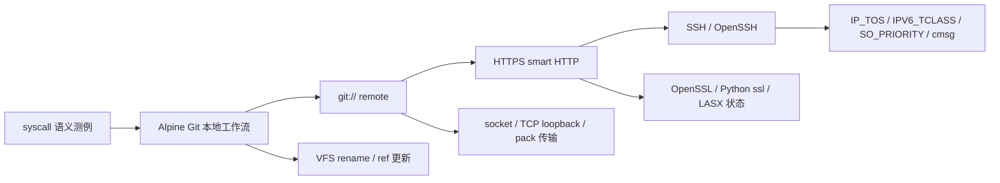

## 摘要

本报告记录了我在 2026 春季开源操作系统训练营中围绕 StarryOS Linux 兼容性完成的工作。整体工作分为两个层次：第一层是方案一的 syscall 语义测例与修复，补充 `eventfd2`、`signalfd4`、`utimensat` 三组源码级测试；第二层是方案二的真实 Linux app 支持，以 Alpine Git 为牵引，从本地工作流推进到 `git://`、HTTPS smart HTTP 和 SSH remote。

Git 的价值不在于“实现 Git 本身”，而在于它能把文件系统、进程执行、网络栈、TLS、OpenSSL、CPU feature、socket option 等路径串起来。沿着这条路径，StarryOS 暴露并修复了 loongarch64 LASX 用户态状态保存恢复、socket QoS option、`recvmsg` control message 写回等兼容性问题，并补充了对应 regression。

<!-- more -->

## 一、项目背景

StarryOS 构建在 ArceOS 组件化内核基础之上，目标之一是提供 Linux 兼容运行环境。Linux 兼容性不是只让某个程序启动，而是要让应用依赖的系统语义尽量接近 Linux：syscall 参数校验、用户态内存访问、文件系统 rename、socket 行为、动态库执行路径、CPU feature 暴露和上下文保存恢复，都可能影响真实应用。

训练营前半段，我先从 syscall 测例入手。syscall 的语义边界相对清楚，适合学习 StarryOS 的 syscall 分发、用户态指针访问、错误码返回和测试套件组织方式。后半段则选择 Alpine Git 作为方案二目标应用。Git 足够复杂，又可以通过 guest 内本地服务构造确定性测试，不依赖公网仓库，因此适合作为 Linux app 兼容性改进的牵引点。

整体路线如下：



## 二、阶段工作概览

本阶段直接合入的主要 PR 如下：

| 阶段 | PR | 内容 |
| --- | --- | --- |
| 方案一 | [#670](https://github.com/rcore-os/tgoskits/pull/670) | 新增 `eventfd2` syscall 测例 |
| 方案一 | [#683](https://github.com/rcore-os/tgoskits/pull/683) | 新增 `signalfd4` 测例，修复 `ssi_pid` / `ssi_uid` |
| 方案一 | [#763](https://github.com/rcore-os/tgoskits/pull/763) | 新增 `utimensat` 测例，修复 flag 与 `AT_EMPTY_PATH` 语义 |
| 方案二 | [#1025](https://github.com/rcore-os/tgoskits/pull/1025) | 补 loongarch64 `to_bin` 支持与 rename 测例 |
| 方案二 | [#1026](https://github.com/rcore-os/tgoskits/pull/1026) | 新增 Git 本地 stress suite |
| 方案二 | [#1169](https://github.com/rcore-os/tgoskits/pull/1169) | 新增 `git://` remote stress probes |
| 方案二 | [#1178](https://github.com/rcore-os/tgoskits/pull/1178) | 新增 Git HTTPS remote，并修复 loongarch64 LASX 状态保存恢复 |
| 方案二 | [#1319](https://github.com/rcore-os/tgoskits/pull/1319) | 新增 Git SSH app，并补齐 socket QoS 与 receive cmsg 语义 |
| 方案三探索 | [#1248](https://github.com/rcore-os/tgoskits/pull/1248) | 新增 Rockchip RGA dry-run command buffer |

其中方案三 RGA 工作属于初步探索，本文主要展开 syscall 与 Git 兼容性两条主线。

## 三、主要工作

### 主线一：syscall 语义测例与修复

方案一阶段完成了三组 syscall 工作。

| syscall | 覆盖重点 | 修复或价值 |
| --- | --- | --- |
| `eventfd2` | flag、普通计数器/信号量模式、非阻塞、溢出、fork 继承 | 补齐事件通知类 fd 的源码级测例，覆盖计数读写和边界行为 |
| `signalfd4` | signal mask、signalfd 返回信息字段 | 修复 `ssi_pid` / `ssi_uid` 硬编码，使信号来源信息更接近 Linux 语义 |
| `utimensat` | 文件时间戳更新、flag 校验、`AT_EMPTY_PATH` | 修复对应权限和参数语义，补齐文件时间戳接口回归 |

这部分工作的意义不只是增加三个测试文件。它建立了后续工作的方法：从 Linux 行为出发写源码级测例，观察 StarryOS 的差异，再把差异缩小到具体的内核逻辑。后面做 Git 时，虽然路径更复杂，但调试方法仍然相同：真实应用失败只是入口，最终要落到一个可以解释、可以回归的系统语义。

### 主线二：Git 分层测试链路

Git 测试没有停留在 `git --version`，而是分层覆盖应用路径。

| 层次 | 测试形态 | 覆盖操作 | 主要验证点 |
| --- | --- | --- | --- |
| 本地 Git | guest 内 shell probe | `init/config/add/commit/log/status/diff/branch/checkout/reset/merge/stash/tag` | 文件系统、进程执行、ref/reflog、临时文件、rename |
| `git://` remote | guest 内 `git daemon` | `ls-remote/clone/fetch/pull/push` | socket、TCP loopback、Git client/server、pack/ref 传输 |
| HTTPS remote | guest 内 HTTPS smart HTTP server | `ls-remote/clone/fetch/pull/push` | TLS、OpenSSL、Python `ssl`、`git http-backend` |
| SSH remote | guest 内 sshd + Git client | `ls-remote/clone/fetch/pull/push` 和失败路径 | OpenSSH 依赖的 socket option 与 QoS 语义 |

本地 Git stress suite 共包含 13 个 probe。它们会频繁访问 `.git/objects`、`.git/refs`、`.git/logs`，也会触发临时文件、rename、删除和工作区更新。相比单个 syscall 测例，这一层更接近真实应用对文件系统和进程环境的使用方式。

`git://` remote 使用 guest 内本地 `git daemon`：

```text
git://127.0.0.1:9418/src.git
```

这样可以避免公网网络和外部仓库状态影响测试稳定性，同时覆盖 Git client/server 交互、TCP loopback、pack/ref 传输和 remote URL 行为。

HTTPS remote 继续保持闭环：在 guest 内启动 Python `ThreadingHTTPServer`，通过 `ssl` 调用 `git http-backend`，生成临时自签名证书，并设置 `GIT_SSL_NO_VERIFY=true`。这条路径不把重点放在公网 CA trust store，而是验证 Git smart HTTP、TLS、OpenSSL 和 Python `ssl` 能否在 StarryOS 中协同工作。

SSH remote 则进一步引入 OpenSSH。OpenSSH client 会设置 `IP_TOS` 等 socket option，因此这个路径自然暴露出 StarryOS 网络栈在 socket QoS 语义上的不足。

### 主线三：真实应用路径暴露出的内核修复

#### loongarch64 LASX 状态保存恢复

Git HTTPS 在 loongarch64 上触发了 OpenSSL / Python `ssl` 异常。触发链路可以简化为：

```text
Git HTTPS -> Python ssl -> OpenSSL -> LSX/LASX 向量路径
```

问题不在 Git，而在架构状态管理。OpenSSL 会根据 CPU feature 选择向量实现。如果内核允许用户态执行 LASX 指令，或者向用户态暴露对应能力，就必须在任务切换和信号路径中保存恢复 LASX 的 256-bit 寄存器状态。

修复包括：

- 启动时开启 `EUEN.ASXE`；
- 扩展 `FpuState`，保存/恢复 `xr0..xr31`；
- `AT_HWCAP` 上报 LASX；
- `/proc/cpuinfo` 上报 `lasx`；
- 增加 `openssl-loongarch` regression，覆盖 OpenSSL 命令和 Python `ssl`。

这个问题说明，真实 Linux app 可能通过动态库和 CPU feature 走到 syscall 测例覆盖不到的路径。兼容性测试必须让用户态库真正运行起来。

#### socket QoS 与 `recvmsg` cmsg

Git SSH 暴露了 `IP_TOS`、`IPV6_TCLASS`、`SO_PRIORITY`、`IP_RECVTOS`、`IPV6_RECVTCLASS` 等 socket option 的兼容缺口。修复内容包括 socket option 分发、ax-net per-socket QoS 状态、出站 IPv4/IPv6 header 写入、RX metadata，以及 UDP receive cmsg 返回。

review 过程中还发现了一个更隐蔽的 `recvmsg` cmsg 问题。Linux 中 `msg_controllen` 有输入/输出双重含义：

- 进入 syscall 时，它表示用户提供的 control buffer 容量；
- 成功返回时，它表示内核实际写入的 ancillary data 长度。

旧实现中，`CMsgBuilder::new()` 一进入 syscall 就把用户态 `msg_controllen` 清零。如果用户使用 `MSG_DONTWAIT`，第一次没有数据返回 `EAGAIN`，随后复用同一个 `msghdr` 重试，第二次即使读到了 payload，也因为 control buffer 容量已经被清成 0 而拿不到 `IP_TOS` / `IPV6_TCLASS` cmsg。

修复方式是把输入容量和输出长度拆开：

```text
capacity = 进入 syscall 时读取的用户 buffer 容量
written  = 本次成功接收中实际写入的 cmsg 长度
```

`CMsgBuilder::new()` 不再提前清零用户态 `msg_controllen`，只在成功路径通过 `finish()` 写回实际长度。为了降低通用 cmsg 改动的风险，还额外验证了 AF_UNIX `SCM_RIGHTS` 和 cmsg byte-mark 回归。

#### VFS rename 语义

Git 本地路径还涉及 VFS rename 语义。Git 在更新 branch/ref/reflog 时会移动普通文件，旧 VFS 逻辑为了防止“目录移动到自身子树”，使用了过宽的祖先检查，导致普通文件 rename 到子目录也可能被拒绝。

这里需要准确说明贡献边界：相关 VFS 修复在 [#807](https://github.com/rcore-os/tgoskits/pull/807) 中由其他同学合入；我的 Git 线工作主要是在 [#1025](https://github.com/rcore-os/tgoskits/pull/1025) 和 [#1026](https://github.com/rcore-os/tgoskits/pull/1026) 中补充 Git/rename 回归覆盖，使这个真实应用暴露出的语义问题进入长期测试集。

## 四、达到的效果

### 4.1 功能覆盖

当前已经覆盖的内容包括：

- `eventfd2`、`signalfd4`、`utimensat` 三组 syscall 语义测例；
- Alpine Git 本地主要工作流；
- `git://` remote 的 `clone/fetch/pull/push`；
- HTTPS smart HTTP remote 的 `clone/fetch/pull/push`；
- Git SSH/OpenSSH 暴露出的 socket QoS 语义；
- loongarch64 LASX 状态保存恢复；
- `recvmsg` cmsg 写回时机。

### 4.2 回归测试

新增或补强的 regression 包括：

| regression | 作用 |
| --- | --- |
| Git 本地 13 个 probe | 覆盖本地 Git 工作流和文件系统行为 |
| `git://` remote stress | 覆盖本地 Git daemon 与 TCP loopback |
| HTTPS remote stress | 覆盖 Git smart HTTP、TLS、OpenSSL、Python `ssl` |
| Git SSH app | 覆盖 OpenSSH client/server 与 Git remote |
| `openssl-loongarch` | 覆盖 LASX/HWCAP/cpuinfo/OpenSSL/Python ssl |
| `bugfix-bug-socket-qos-options` | 覆盖 `IP_TOS`、`IPV6_TCLASS`、`SO_PRIORITY` |
| `bugfix-bug-recv-qos-cmsg` | 覆盖 `IP_RECVTOS`、`IPV6_RECVTCLASS` 和 cmsg 写回 |
| AF_UNIX cmsg 回归 | 确认通用 cmsg builder 没有破坏 `SCM_RIGHTS` |

测试设计上尽量使用 guest 内本地服务，避免依赖外部网络和可写公网仓库。这样更适合放入长期测试套件。

## 五、经验与教训

这次工作里比较重要的经验有三点。

第一，真实应用失败只是入口，最终仍要落到具体系统语义。Git HTTPS 表面上是 Git remote 失败，根因却是 loongarch64 LASX 状态保存恢复；Git SSH 表面上是应用网络路径，根因之一是 socket QoS option 和 `recvmsg` cmsg 写回时机。

第二，测试要分层。Git 的使用场景很多，如果一次性覆盖全部路径，不利于定位；把它拆成本地、`git://`、HTTPS、SSH 四层后，每一层都有明确的系统边界和失败归因。

第三，通用路径修改要补相邻回归。`CMsgBuilder` 属于通用 control message 逻辑，修 QoS cmsg 时同时验证 AF_UNIX `SCM_RIGHTS`，可以降低引入新回归的风险。

## 六、当前边界与后续方向

当前工作覆盖的是 Alpine Git 的主要本地工作流、`git://` remote、HTTPS smart HTTP remote，以及 Git SSH/OpenSSH 暴露出的 socket QoS 语义。后续仍可以继续扩展：

- SSH 认证矩阵；
- credential helper；
- 完整 CA trust store 与 TLS 边界条件；
- 代理认证；
- 外部可写公网仓库；
- LFS、submodule 等复杂 Git 扩展；
- 完整 qdisc/device priority 调度模型。

## 七、工作仓库

- 跟踪 issue：<https://github.com/rcore-os/tgoskits/issues/579>
- 总结报告与 slide：<https://github.com/Utopia-V/tgoskits/tree/report/os-camp-starryos-git>
- Blog PR：<https://github.com/rcore-os/blog/pull/890>

## 八、总结

这次工作不是实现 Git 本身，而是以 Git 为牵引，推动 StarryOS 补齐真实 Linux app 会依赖的一组系统语义。前期 syscall 测例建立了 Linux 语义验证的方法；后续 Git 分层测试则把文件系统、网络、TLS、架构状态和 socket option 串成一条可持续回归的应用路径。
