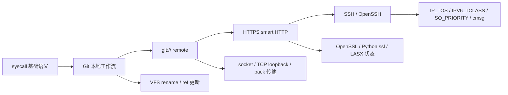

## 摘要

本阶段工作围绕 StarryOS 的 Linux 兼容性展开。前期先补齐 `eventfd2`、`signalfd4`、`utimensat` 等 syscall 语义测试；随后以 Alpine Git 作为真实 Linux app，逐步验证并改进 Git 本地操作、`git://` remote、HTTPS smart HTTP remote，以及 Git SSH 场景中暴露出的 socket QoS 行为。

选择 Git 的原因并不是要实现 Git 本身，而是 Git 足够真实、复杂、可确定化测试：本地分支与对象操作会压测文件系统 rename/ref 更新；remote 操作会经过 socket、TCP loopback、pack/ref 传输；HTTPS 会引入 OpenSSL/Python `ssl`；SSH 会触发 OpenSSH 对 socket option 的依赖。通过这条路径，StarryOS 暴露并修复了 loongarch64 LASX 用户态状态保存恢复、socket QoS option、`recvmsg` control message 写回等实际兼容性问题，同时为文件系统 rename 语义补齐了 Git 侧回归覆盖。

本文整理这一阶段的目标、测试设计、关键问题、修复思路、验证结果和当前边界。当前已经验证的重点是本地 Git 主要工作流、`git://` remote、HTTPS smart HTTP remote，以及 Git SSH 场景暴露出的 socket QoS 语义。

<!-- more -->

## 一、背景与目标

StarryOS 构建在 ArceOS 组件化内核基础之上，目标之一是提供 Linux 兼容运行环境。Linux 兼容性并不是只要某个命令能启动就算完成；真实应用通常会同时依赖多个系统层面的行为，包括 syscall 参数校验、文件系统语义、进程执行、socket 网络栈、动态库、CPU feature 暴露和上下文保存恢复。

本阶段我选择 Git 作为方案二的目标 Linux app。Git 的优点是：

- 本地操作可重复、可脚本化，适合 CI；
- ref、branch、reflog、pack 等操作会覆盖大量文件系统行为；
- remote URL 可以通过本地服务确定化，不依赖公网；
- HTTPS/SSH 路径会自然触发真实用户态库和网络栈行为；
- 一旦失败，通常能缩小成可单独回归的内核语义问题。

因此，本阶段目标不是一次性覆盖 Git 的所有使用场景，而是以 Git 为牵引，形成一条可验证的 Linux app 兼容性改进路径：

1. 先补 syscall 基础语义测试；
2. 再覆盖 Git 本地工作流；
3. 继续覆盖 `git://` remote；
4. 继续覆盖 HTTPS smart HTTP remote；
5. 对 Git SSH/OpenSSH 暴露出的 socket QoS 问题做补齐；
6. 对每个修复点添加 regression，避免后续回归。

整体路线可以概括为：



这条路线的好处是每一层都有明确边界：先让 Git 的一个确定路径跑通，再看它暴露出的系统语义是否符合 Linux 行为；修完以后，再把问题沉淀成可以长期运行的回归测试。

## 二、贡献概览

### 2.1 方案一：syscall 测例与语义完善

方案一阶段主要补齐 syscall 语义测试，并在测试过程中修复 StarryOS 的兼容性问题。

| PR | 内容 |
| --- | --- |
| [#670](https://github.com/rcore-os/tgoskits/pull/670) | 新增 `eventfd2` syscall 测例，覆盖 flag、普通/信号量模式、非阻塞、溢出、fork 继承等语义 |
| [#683](https://github.com/rcore-os/tgoskits/pull/683) | 新增 `signalfd4` 测例，并修复 `ssi_pid` / `ssi_uid` 硬编码问题 |
| [#763](https://github.com/rcore-os/tgoskits/pull/763) | 新增 `utimensat` 测例，并修复 flag 校验、`AT_EMPTY_PATH` 权限等语义问题 |

这一阶段让我熟悉了 StarryOS 的 syscall 分发、用户态指针访问、测试套件组织方式，也为后续定位 Git 暴露的问题打下基础。

### 2.2 方案二：Git app 支持

Git 方向按本地、`git://`、HTTPS、SSH/QoS 四层推进。

| PR | 内容 |
| --- | --- |
| [#1025](https://github.com/rcore-os/tgoskits/pull/1025) | 补 loongarch64 `to_bin` 支持和 rename 测例 |
| [#1026](https://github.com/rcore-os/tgoskits/pull/1026) | 新增 Git 本地 stress suite，覆盖 13 个本地 Git probe |
| [#1169](https://github.com/rcore-os/tgoskits/pull/1169) | 新增 `git://` remote stress probes |
| [#1178](https://github.com/rcore-os/tgoskits/pull/1178) | 新增 Git HTTPS remote，并修复 loongarch64 LASX 用户态状态保存恢复问题 |
| [#1319](https://github.com/rcore-os/tgoskits/pull/1319) | 新增 Git SSH app，并补齐 socket QoS option 与 receive cmsg 语义 |

跟踪 issue 为 [#579](https://github.com/rcore-os/tgoskits/issues/579)。截至本文撰写时，上述 Git 相关 PR 均已合入。

从测试层次看，Git 方向的覆盖关系如下：

| 层次 | 测试形态 | 覆盖操作 | 主要验证点 | PR |
| --- | --- | --- | --- | --- |
| 本地 Git | guest 内 shell probe | `init/config/add/commit/log/status/diff/branch/checkout/reset/merge/stash/tag` | 文件系统、进程执行、ref/reflog、临时文件和 rename | [#1026](https://github.com/rcore-os/tgoskits/pull/1026) |
| `git://` remote | guest 内 `git daemon` | `ls-remote/clone/fetch/pull/push` | socket、TCP loopback、Git client/server、pack/ref 传输 | [#1169](https://github.com/rcore-os/tgoskits/pull/1169) |
| HTTPS remote | guest 内 HTTPS smart HTTP server | `ls-remote/clone/fetch/pull/push` | TLS、OpenSSL、Python `ssl`、`git http-backend` | [#1178](https://github.com/rcore-os/tgoskits/pull/1178) |
| SSH remote | guest 内 sshd + Git client | `ls-remote/clone/fetch/pull/push` 和失败路径 | OpenSSH 依赖的 socket option 与 QoS 语义 | [#1319](https://github.com/rcore-os/tgoskits/pull/1319) |

### 2.3 方案三方向探索

在方案三方向，我还尝试了 Rockchip RGA 方向，提交了 [#1248](https://github.com/rcore-os/tgoskits/pull/1248)，新增 `rockchip-rga` no_std 驱动基础 crate、dry-run command buffer 编码和 `ax-driver` FDT probe glue。由于没有实板，当前只作为方案三入口探索，不作为本文主线成果。

## 三、Git 本地工作流覆盖

第一层目标是让 Git 在 StarryOS guest 内完成主要本地工作流，而不是只运行 `git --version`。

[#1026](https://github.com/rcore-os/tgoskits/pull/1026) 新增 `test-suit/starryos/stress/git/`，包含 13 个 shell probe：

- `init`
- `config`
- `add`
- `commit`
- `log`
- `status`
- `diff`
- `branch`
- `checkout`
- `reset`
- `merge`
- `stash`
- `tag`

测试在 x86_64、aarch64、riscv64、loongarch64 四个 QEMU 架构上注册。每个 probe 覆盖正常路径、边界路径或失败路径，并通过统一的完成标记和失败正则避免“某个子测试失败但整体误报 PASS”。

本地 Git 测试的价值在于覆盖 Git 对文件系统和进程环境的基础依赖。比如 branch/ref 操作会涉及 `.git/refs`、`.git/logs`、临时文件、rename 和删除；merge/reset/stash 会触发更多对象和工作区更新。这些路径比单个 syscall 测例更接近真实应用。

## 四、文件系统 rename 语义问题

Git 本地路径中，一个重要问题来自 rename 语义。Git 在更新 branch/ref/reflog 时会移动普通文件，类似将父目录中的文件移动到子目录下。旧的 VFS 逻辑为了防止“目录移动到自身子树”这种非法操作，使用了过宽的祖先检查，导致普通文件 rename 到子目录也可能被拒绝。

这个问题的本质是把“目录防循环”的约束应用到了普通文件。Linux 语义中，目录不能被移动到自身子树里，但普通文件移动到子目录是合法的。

这里需要准确区分贡献边界：相关 VFS 修复在 [#807](https://github.com/rcore-os/tgoskits/pull/807) 中由其他同学合入；我的 Git 线工作主要是在 [#1025](https://github.com/rcore-os/tgoskits/pull/1025) 和 [#1026](https://github.com/rcore-os/tgoskits/pull/1026) 中补齐 Git/rename 回归覆盖，使这个由真实应用暴露出的语义问题进入可持续验证。

这个过程也形成了后续工作的基本方法：不要只停留在“Git 某个命令失败”，而要缩小到内核语义缺口，并补充能长期运行的 regression。

## 五、`git://` remote 覆盖

本地 Git 通过后，下一步是 remote URL。为了避免外部网络和公网仓库影响测试稳定性，[#1169](https://github.com/rcore-os/tgoskits/pull/1169) 在 guest 内创建 bare repository，并启动本地 `git daemon`：

```text
git://127.0.0.1:9418/src.git
```

这条路径覆盖：

- `git ls-remote`
- `git clone`
- clone 到已有空目录
- 连接关闭端口的失败路径
- `git fetch`
- `git pull --ff-only`
- `git push`

这一层主要验证 StarryOS 的 socket、TCP loopback、Git client/server 交互、pack/ref 传输和 remote URL 行为。相比本地 Git，它已经经过网络栈，但不涉及 TLS、认证或公网不确定性，因此适合作为 Git remote 的第一层确定性测试。

## 六、HTTPS smart HTTP remote 与 LASX 修复

`git://` remote 通过后，[#1178](https://github.com/rcore-os/tgoskits/pull/1178) 继续加入 HTTPS smart HTTP remote。

测试仍然保持确定性：在 StarryOS guest 内启动本地 HTTPS server，使用 Python `ThreadingHTTPServer` + `ssl` 调用 `git http-backend`，暴露 Git smart HTTP 服务。测试创建临时自签名证书，设置 `GIT_SSL_NO_VERIFY=true`，将重点放在 Git HTTPS remote 操作本身，而不是 CA trust store 或公网证书链。

覆盖路径包括：

- `git ls-remote`
- `git clone`
- 关闭端口失败路径
- `git fetch`
- `git pull`
- `git push`

### 6.1 loongarch64 LASX 问题

补 loongarch64 配置时，HTTPS 路径触发了 OpenSSL / Python `ssl` 上的用户态异常。这个问题不是 Git 自身 bug，而是 CPU feature 和用户态状态管理不一致。

这个问题的触发链路比较典型：

| 环节 | 内容 |
| --- | --- |
| 触发场景 | Git HTTPS remote 启动本地 smart HTTP server，并通过 Python `ssl` / OpenSSL 走 TLS 路径 |
| 表面现象 | loongarch64 上 HTTPS 测试不稳定，用户态库在加密路径中触发异常 |
| 根因 | 用户态可能走到 LSX/LASX 向量指令，但内核没有完整保存恢复 LASX 的 256-bit 寄存器状态 |
| 修复 | 开启 `EUEN.ASXE`，保存恢复 `xr0..xr31`，同步 `AT_HWCAP` 与 `/proc/cpuinfo` |
| 回归 | `openssl-loongarch` 覆盖 OpenSSL 命令和 Python `ssl` import/context |

loongarch64 上存在 LSX/LASX 向量扩展。OpenSSL 这类加密库为了性能可能使用这些向量能力。如果内核向用户态暴露这些能力，或者允许用户态执行对应指令，就必须在任务切换和信号路径中完整保存恢复相关寄存器状态。

修复前，StarryOS 没有完整保存恢复 LASX 256-bit 状态，导致 OpenSSL/Python `ssl` 路径不稳定。修复内容包括：

- 启动时开启 `EUEN.ASXE`；
- 扩展 `FpuState`，保存/恢复 `xr0..xr31` 完整 256-bit LASX 状态；
- `AT_HWCAP` 上报 LASX；
- `/proc/cpuinfo` 上报 `lasx`，并去掉未确认提供的 feature；
- 异常诊断保留 raw `ecode/esubcode`，将 LSX/LASX disabled 类异常归为 illegal instruction。

为防止回归，PR 中新增 `openssl-loongarch` regression，覆盖 `/proc/cpuinfo`、`AT_HWCAP`、OpenSSL `rand/genrsa/req`、Python `ssl import/context`。

这个问题说明，Linux app 兼容性测试不应只停在 syscall 表面。真实用户态库可能会根据 auxv、`/proc/cpuinfo` 或运行时探测选择不同实现路径，内核也要把对应的架构状态管理补齐。

## 七、Git SSH 场景与 socket QoS

HTTPS 之后，我继续尝试 Git SSH remote。OpenSSH client 在建立连接时会设置 `IP_TOS`，同时常见 Linux 程序也可能查询或设置 `IPV6_TCLASS`、`SO_PRIORITY`、`IP_RECVTOS`、`IPV6_RECVTCLASS` 等 socket option。StarryOS 此前只覆盖了部分基础 socket option，导致 SSH/Git 路径暴露出 QoS 兼容缺口。

[#1319](https://github.com/rcore-os/tgoskits/pull/1319) 做了两类工作。

第一类是 Git SSH app 测试。测试在 Alpine guest 内安装 Git/OpenSSH，启动本机 sshd，通过 `ssh://127.0.0.1:2222/...` 覆盖：

- `git ls-remote`
- `git clone`
- `git push`
- `git fetch`
- `git pull --ff-only`
- 关闭端口失败路径
- 缺失 repo 失败路径

第二类是 socket QoS 兼容修复，包括：

- Starry syscall socket option 分发接入 `IP_TOS`；
- ax-net 保存 per-socket TOS/traffic-class 状态；
- TCP/UDP/raw 出站包路径将 TOS 写入实际 IP header；
- IPv4 写 DSCP/ECN 并重新计算 header checksum；
- IPv6 写 traffic class；
- 补齐 `IPV6_TCLASS` 的 Linux 边界语义；
- 补齐 `SO_PRIORITY` 的 socket option 可见语义；
- 在 RX token 中携带 IPv4 TOS / IPv6 traffic class 元数据；
- UDP `recvmsg` 在启用 `IP_RECVTOS` / `IPV6_RECVTCLASS` 时返回对应 cmsg。

这里也明确了 deferred 范围：本 PR 不实现完整 qdisc/device priority 调度模型，只保证 socket option 层面的 Linux 兼容行为。

### 7.1 `recvmsg` cmsg 写回时机

review 过程中又暴露出一个更隐蔽的 bug：`recvmsg` 失败路径会提前改写用户态 `msg_controllen`。

这里的关键点是 `msg_controllen` 同时承担输入和输出两种含义：

| 环节 | 内容 |
| --- | --- |
| 触发场景 | 用户态用 `MSG_DONTWAIT` 调 `recvmsg`，第一次没有数据返回 `EAGAIN`，随后复用同一个 `msghdr` 重试 |
| 表面现象 | payload 后续能收到，但 `IP_RECVTOS` / `IPV6_RECVTCLASS` 对应的 cmsg 丢失 |
| 根因 | 旧实现进入 syscall 时就把用户态 `msg_controllen` 清零，失败路径提前破坏了用户提供的 control buffer 容量 |
| 修复 | `CMsgBuilder` 内部拆分 `capacity` 和 `written`，只在成功返回前写回实际 cmsg 长度 |
| 回归 | `bugfix-bug-recv-qos-cmsg` 覆盖 bounded retry、IPv4 TOS、IPv6 traffic class，并额外跑 AF_UNIX cmsg 回归 |

Linux `recvmsg` 中，`msg_controllen` 具有输入/输出双重语义：

- 进入 syscall 时，它表示用户提供的 control buffer 容量；
- syscall 成功返回时，内核再把它写成实际写入的 ancillary data 长度。

旧实现中，`CMsgBuilder::new()` 一进入 syscall 就把 `msg_controllen` 清零。如果用户使用 `MSG_DONTWAIT`，第一次没有读到数据会返回 `EAGAIN`，但用户态可能复用同一个 `msghdr` 继续 retry。此时 `msg_controllen` 已经被内核清成 0，下一次即使读到了 payload，也因为 control buffer 容量为 0 而无法返回 `IP_TOS` / `IPV6_TCLASS` cmsg。

修复方式是把输入容量和输出长度拆开：

- `capacity`：进入 syscall 时读取的用户 buffer 容量；
- `written`：本次成功接收中实际写入的 cmsg 空间。

`CMsgBuilder::new()` 不再立刻清零用户态 `msg_controllen`。只有在成功接收之后，统一调用 `finish()` 把 `written` 写回。packet socket 和 netlink 这种提前成功返回但没有 cmsg 的路径，也在成功返回前 `finish()`，写回 0，保持 Linux 行为。

新增的 `bugfix-bug-recv-qos-cmsg` 用例使用 `MSG_DONTWAIT` bounded retry 覆盖这个场景，并在 loongarch64 QEMU 下验证 `IP_RECVTOS` / `IPV6_RECVTCLASS` 都能通过 cmsg 返回。为了避免通用 `CMsgBuilder` 改动破坏既有控制消息路径，还额外运行了 AF_UNIX `SCM_RIGHTS` 和 cmsg byte-mark 回归测试。

## 八、验证方式

这条线的测试目标不是“命令能跑一次”，而是每个层次都能被 CI 或本地 QEMU 反复验证。

### 8.1 Git 本地

- 13 个 Git 本地 probe；
- 四架构 QEMU 配置；
- 使用 `ALL_13_PROBES_COMPLETE` 和失败正则捕获子探针失败。

### 8.2 Git remote

- `git://` remote 覆盖 `ls-remote`、`clone`、`fetch`、`pull`、`push`；
- HTTPS remote 覆盖 smart HTTP server、TLS、`git http-backend`、OpenSSL/Python `ssl`；
- Git SSH app 覆盖 OpenSSH server/client 与 Git remote 操作。

### 8.3 内核回归

- `git-rename`：覆盖 Git/rename 暴露的文件系统语义；
- `openssl-loongarch`：覆盖 LASX/HWCAP/cpuinfo/OpenSSL/Python ssl；
- `bugfix-bug-socket-qos-options`：覆盖 `IP_TOS`、`IPV6_TCLASS`、`SO_PRIORITY`；
- `bugfix-bug-recv-qos-cmsg`：覆盖 `IP_RECVTOS`、`IPV6_RECVTCLASS` 和 `recvmsg` cmsg 内容；
- AF_UNIX cmsg 回归：确认通用 control message builder 没有破坏 `SCM_RIGHTS`。

## 九、当前边界

目前可以稳妥地说，StarryOS 已经覆盖 Alpine Git 的以下路径：

- 本地 Git 主要工作流；
- `git://` remote 的 `clone/fetch/pull/push`；
- HTTPS smart HTTP remote 的 `clone/fetch/pull/push`；
- Git SSH / OpenSSH 暴露的 socket QoS option 语义；
- x86_64、aarch64、riscv64、loongarch64 四个 QEMU 架构上的相关回归。

还有一些 Git 使用方式没有纳入当前测试闭环，后续仍可继续扩展：

- SSH 认证矩阵；
- credential helper；
- 完整 CA trust store 与 TLS 边界条件；
- 代理认证；
- 外部可写公网仓库；
- LFS、submodule 等复杂 Git 扩展；
- 完整 qdisc/device priority 调度模型。

因此，这一阶段更准确的结果是：通过 Git 这个真实 Linux app，StarryOS 在文件系统、网络、TLS、架构状态和 socket option 等路径上补齐了多处可验证的 Linux 兼容性语义。

## 十、总结与反思

这条线最大的收获是理解了“应用驱动内核兼容性改进”的实际工作方式。

如果只写孤立 syscall 测例，很容易停留在接口表面；如果直接面对一个复杂应用，又容易被大量场景同时淹没。比较可控的方法是选择一个真实应用，将它拆成确定性、可验证的路径：本地操作、网络 remote、HTTPS、SSH，然后每次失败都缩小成一个具体的内核语义问题。

本阶段形成了几个可复用经验：

- 测试要有稳定成功标记和失败正则，避免误报；
- remote 测试应尽量使用 guest 内本地服务，避免依赖公网；
- 用户态库触发的问题不一定在 syscall 层，可能来自 CPU feature、上下文切换或 `/proc`/auxv 信息；
- 修改通用路径时要补相邻回归，例如修 `recvmsg` cmsg 时同时验证 AF_UNIX `SCM_RIGHTS`；
- 报告中应明确直接贡献和相关协作，不把他人 PR 写成自己的代码贡献。

总的来说，这次工作不是实现 Git 本身，也不是一次性覆盖 Git 的所有场景，而是以 Git 为牵引，推动 StarryOS 补齐了一组真实 Linux app 会依赖的系统语义，并为这些语义留下可持续运行的回归测试。
