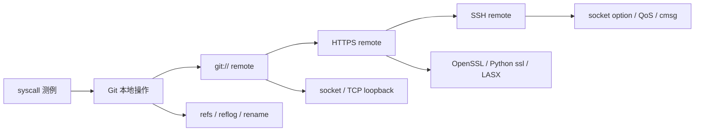

## 摘要

这篇报告整理的是我在 StarryOS Linux 兼容性方向做的一组工作。前半段主要是方案一的 syscall 测例，补了 `eventfd2`、`signalfd4`、`utimensat`；后半段转到方案二，用 Alpine Git 作为测试对象，把 Git 从本地操作一路测到 `git://`、HTTPS 和 SSH remote。

我选 Git 的原因比较直接：它本身会碰到很多系统行为。本地仓库会频繁改 `.git/refs` 和 `.git/logs`，remote 会走 socket 和 TCP loopback，HTTPS 会带出 OpenSSL 和 Python `ssl`，SSH 又会碰到 OpenSSH 对 socket option 的使用。沿着这条线做下来，除了补测试，也修到了 loongarch64 LASX 状态保存、socket QoS option、`recvmsg` cmsg 写回这些比较具体的兼容性问题。

<!-- more -->

## 一、项目背景

StarryOS 构建在 ArceOS 组件化内核之上，目标之一是运行 Linux 用户程序。刚开始做兼容性时，很容易只看“程序能不能启动”。但实际调试下来，真正容易出问题的地方往往更细：syscall 的 flag 怎么判、用户态指针什么时候写回、rename 对普通文件和目录是不是一样处理、网络包的 header 有没有真的被写进去、CPU feature 暴露出去以后上下文切换有没有配套保存。

所以我一开始先做了三个 syscall 测例。单个 syscall 的范围比较小，容易对照 Linux 行为，也适合熟悉 StarryOS 的测试套件。后面再选 Git，是因为 Git 比单个 syscall 更接近真实应用，同时又可以用 guest 内本地服务把测试做得比较稳定，不需要依赖公网仓库。

大致路线如下：



## 二、做了哪些工作

本阶段合入的主要 PR 如下：

| 阶段 | PR | 内容 |
| --- | --- | --- |
| 方案一 | [#670](https://github.com/rcore-os/tgoskits/pull/670) | 新增 `eventfd2` syscall 测例 |
| 方案一 | [#683](https://github.com/rcore-os/tgoskits/pull/683) | 新增 `signalfd4` 测例，修复 `ssi_pid` / `ssi_uid` |
| 方案一 | [#763](https://github.com/rcore-os/tgoskits/pull/763) | 新增 `utimensat` 测例，修复 flag 与 `AT_EMPTY_PATH` 语义 |
| 方案二 | [#1025](https://github.com/rcore-os/tgoskits/pull/1025) | 补 loongarch64 `to_bin` 支持与 rename 测例 |
| 方案二 | [#1026](https://github.com/rcore-os/tgoskits/pull/1026) | 新增 Git 本地 stress suite |
| 方案二 | [#1169](https://github.com/rcore-os/tgoskits/pull/1169) | 新增 `git://` remote stress probes |
| 方案二 | [#1178](https://github.com/rcore-os/tgoskits/pull/1178) | 新增 Git HTTPS remote，并修复 loongarch64 LASX 状态保存恢复 |
| 方案二 | [#1319](https://github.com/rcore-os/tgoskits/pull/1319) | 新增 Git SSH app，并补齐 socket QoS 与 receive cmsg 语义 |
| 方案三探索 | [#1248](https://github.com/rcore-os/tgoskits/pull/1248) | 新增 Rockchip RGA dry-run command buffer |

其中 RGA 是方案三方向的前期尝试。本文主要讲 syscall 和 Git 这两部分。

## 三、先做 syscall：把基础语义测清楚

方案一里我做了三组 syscall 测例：

| syscall | 主要覆盖点 | 对应问题 |
| --- | --- | --- |
| `eventfd2` | flag、计数器/信号量模式、非阻塞、溢出、fork 继承 | 事件通知类 fd 的读写和边界行为 |
| `signalfd4` | signal mask、signalfd 返回字段 | `ssi_pid` / `ssi_uid` 不能硬编码 |
| `utimensat` | 文件时间戳更新、flag 校验、`AT_EMPTY_PATH` | 参数校验和权限边界 |

这部分看起来不像 Git 那么“应用化”，但对后面帮助很大。写 syscall 测例时，我需要先查清 Linux 在边界条件下应该怎么返回，再去看 StarryOS 是哪里不一致。这个过程基本训练了后面做 Git 时的调试方式：先看应用失败，再把失败缩小到一个具体系统行为。

## 四、再做 Git：按层拆开测

Git 这块我先拆成几层测，避免一开始就把所有场景混在一起。

| 层次 | 测试方式 | 覆盖操作 | 主要看什么 |
| --- | --- | --- | --- |
| 本地 Git | guest 内 shell probe | `init/config/add/commit/log/status/diff/branch/checkout/reset/merge/stash/tag` | 文件系统、进程执行、ref/reflog、临时文件、rename |
| `git://` remote | guest 内 `git daemon` | `ls-remote/clone/fetch/pull/push` | socket、TCP loopback、Git client/server、pack/ref 传输 |
| HTTPS remote | guest 内 HTTPS smart HTTP server | `ls-remote/clone/fetch/pull/push` | TLS、OpenSSL、Python `ssl`、`git http-backend` |
| SSH remote | guest 内 sshd + Git client | `ls-remote/clone/fetch/pull/push` 和失败路径 | OpenSSH 用到的 socket option |

本地 Git suite 里一共有 13 个 probe。它们会反复访问 `.git/objects`、`.git/refs`、`.git/logs`，也会创建临时文件、rename 文件、删除文件和更新工作区。相比单个 syscall 测例，这些路径更像真实程序对文件系统的使用。

`git://` remote 没有用公网仓库，而是在 guest 内启动本地 `git daemon`：

```text
git://127.0.0.1:9418/src.git
```

这样测试失败时更容易判断问题是否在 StarryOS 里，也能减少外部网络和仓库状态的干扰。

HTTPS remote 也是同样思路：在 guest 内启动 Python `ThreadingHTTPServer`，通过 `ssl` 调 `git http-backend`，证书用临时自签名证书，测试里设置 `GIT_SSL_NO_VERIFY=true`。这一步主要是把 Git smart HTTP、OpenSSL 和 Python `ssl` 这条链路跑起来。

SSH remote 则引入了 OpenSSH。这里最直接暴露出来的是 socket option 问题，比如 OpenSSH 会设置 `IP_TOS`。

## 五、几个比较有代表性的问题

### 5.1 loongarch64 LASX 状态没有保存完整

HTTPS remote 在 loongarch64 上跑出过 OpenSSL / Python `ssl` 异常。简化一下触发链路是：

```text
Git HTTPS -> Python ssl -> OpenSSL -> LSX/LASX 向量路径
```

这个问题最后定位到架构状态管理。OpenSSL 会根据 CPU feature 选择向量实现，如果内核允许用户态使用 LASX，或者把 LASX 暴露给用户态，就要在任务切换时保存恢复对应寄存器。修复前 StarryOS 没有完整保存 LASX 的 256-bit 状态，所以 TLS 路径会不稳定。

这部分修复包括：

- 启动时开启 `EUEN.ASXE`；
- 扩展 `FpuState`，保存/恢复 `xr0..xr31`；
- `AT_HWCAP` 上报 LASX；
- `/proc/cpuinfo` 上报 `lasx`；
- 增加 `openssl-loongarch` regression。

这个问题给我的感觉是，真实应用很容易把问题带到 syscall 之外。用户态库会根据 auxv、`/proc/cpuinfo` 或运行时探测选择不同代码路径，所以内核不能只做到“接口表面像 Linux”。

### 5.2 socket QoS 和 `recvmsg` cmsg

Git SSH 继续暴露了网络相关问题。OpenSSH 会设置 `IP_TOS`，而 Linux 程序也可能使用 `IPV6_TCLASS`、`SO_PRIORITY`、`IP_RECVTOS`、`IPV6_RECVTCLASS` 这些选项。修复 #1319 时，主要补了 socket option 分发、ax-net per-socket QoS 状态、出站 IPv4/IPv6 header 写入、RX metadata，以及 UDP receive cmsg 返回。

review 里还发现了一个更细的 `recvmsg` 问题。Linux 里的 `msg_controllen` 有两层含义：

- 调用前，它是用户传进来的 control buffer 容量；
- 成功返回后，它是内核实际写入的 cmsg 长度。

旧实现里，`CMsgBuilder::new()` 一进 syscall 就把用户态 `msg_controllen` 清零。如果用户用 `MSG_DONTWAIT`，第一次没有数据返回 `EAGAIN`，之后复用同一个 `msghdr` 重试，那么第二次即使读到了 payload，也因为 control buffer 容量已经被清成 0，拿不到 `IP_TOS` / `IPV6_TCLASS` cmsg。

修复时把这两个状态拆开：

```text
capacity = 进入 syscall 时读到的用户 buffer 容量
written  = 本次成功接收中实际写入的 cmsg 长度
```

`CMsgBuilder::new()` 不再提前写用户态 `msg_controllen`，成功路径最后再 `finish()`。因为这是通用 cmsg 逻辑，所以还额外跑了 AF_UNIX `SCM_RIGHTS` 和 cmsg byte-mark 回归，确认没有影响别的控制消息。

### 5.3 Git 路径里的 rename

Git 本地操作还涉及 VFS rename。Git 更新 branch/ref/reflog 时会移动普通文件。旧 VFS 逻辑为了防止“目录移动到自身子树”，祖先检查做得太宽，普通文件移动到子目录也可能被拒绝。

这里需要说清楚贡献边界：相关 VFS 修复在 [#807](https://github.com/rcore-os/tgoskits/pull/807) 中由其他同学合入；我这边主要是在 [#1025](https://github.com/rcore-os/tgoskits/pull/1025) 和 [#1026](https://github.com/rcore-os/tgoskits/pull/1026) 中补 Git/rename 回归覆盖，让这个问题后续能持续被测到。

## 六、现在能跑到什么程度

目前已经覆盖：

- `eventfd2`、`signalfd4`、`utimensat` 三组 syscall 测例；
- Alpine Git 本地主要工作流；
- `git://` remote 的 `clone/fetch/pull/push`；
- HTTPS smart HTTP remote 的 `clone/fetch/pull/push`；
- Git SSH/OpenSSH 暴露出的 socket QoS 语义；
- loongarch64 LASX 状态保存恢复；
- `recvmsg` cmsg 写回时机。

对应的 regression 包括：

| regression | 作用 |
| --- | --- |
| Git 本地 13 个 probe | 覆盖本地 Git 工作流和文件系统行为 |
| `git://` remote stress | 覆盖本地 Git daemon 与 TCP loopback |
| HTTPS remote stress | 覆盖 Git smart HTTP、TLS、OpenSSL、Python `ssl` |
| Git SSH app | 覆盖 OpenSSH client/server 与 Git remote |
| `openssl-loongarch` | 覆盖 LASX/HWCAP/cpuinfo/OpenSSL/Python ssl |
| `bugfix-bug-socket-qos-options` | 覆盖 `IP_TOS`、`IPV6_TCLASS`、`SO_PRIORITY` |
| `bugfix-bug-recv-qos-cmsg` | 覆盖 `IP_RECVTOS`、`IPV6_RECVTCLASS` 和 cmsg 写回 |
| AF_UNIX cmsg 回归 | 检查通用 cmsg builder 没有破坏 `SCM_RIGHTS` |

## 七、还没有覆盖的部分

这部分工作主要覆盖 Alpine Git 的本地操作、`git://` remote、HTTPS smart HTTP remote，以及 Git SSH 暴露出的 socket QoS 行为。还没有展开的部分包括：

- SSH 认证矩阵；
- credential helper；
- 完整 CA trust store 与 TLS 边界条件；
- 代理认证；
- 外部可写公网仓库；
- LFS、submodule 等 Git 扩展；
- 完整 qdisc/device priority 调度模型。

## 八、工作仓库

- 跟踪 issue：<https://github.com/rcore-os/tgoskits/issues/579>
- 总结报告与 slide：<https://github.com/Utopia-V/tgoskits/tree/report/os-camp-starryos-git>
- Blog PR：<https://github.com/rcore-os/blog/pull/890>

## 九、总结

这次工作对我来说比较重要的一点，是从“写单个 syscall 测例”逐步过渡到了“用一个真实应用去牵出系统问题”。syscall 测例适合把语义边界缩小；Git 这种应用则会把文件系统、网络、TLS、架构状态和 socket option 串起来。把这些路径拆开测，再把失败收敛成具体 regression，是这段工作里最有收获的部分。
