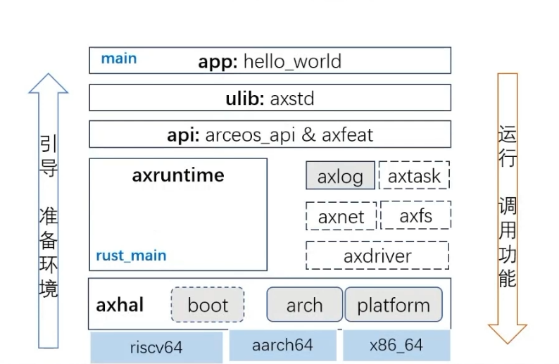
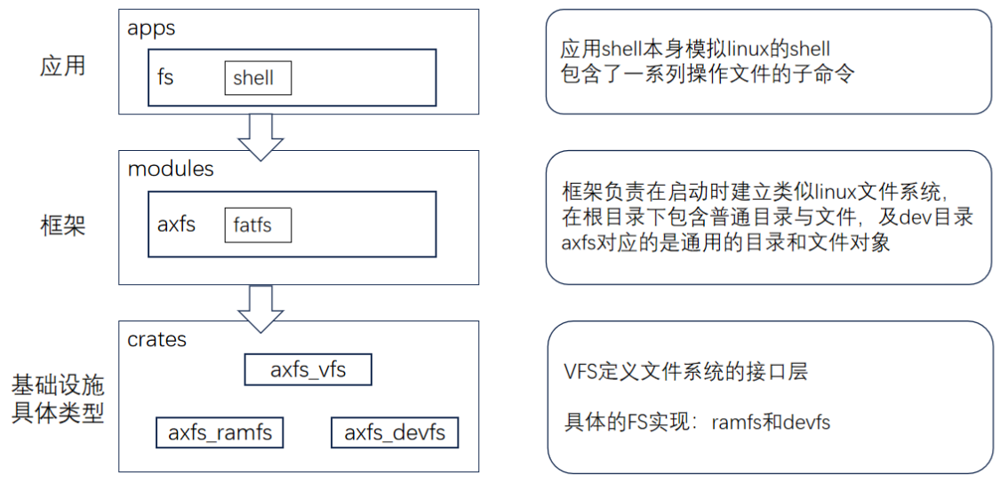

# 前言
大家好，我是ACrazyShark（李卓恒）。今年2月，我和志同道合的同学们组队报名了全国大学生系统能力赛操作系统内核赛道，开启了操作系统开发的探索之旅。备赛过程中，我们有幸接触到由清华大学等高校打造的rcore训练营——这个以Rust语言重写Linux内核的实践项目，不仅帮助我们构建了从理论到落地的完整知识体系，更让我们在"通过开源学习开源"的理念中感受到系统级编程的魅力。

<!-- more -->


# Stage1 - rust
该阶段开始于今年2月份，当时为了准备操作系统内核赛接触到了Rust。Rust不同于以往我接触到的所有开发语言，它有着极为严格的“老师”--编译器，对内存管理的安全性提出了新颖的设计理念。第一次接触Rust，看着满屏的报错，也有点不知所措，所有权、错误处理Result等，一系列新鲜的东西，带给我很大的震撼。在开营之前，通过学习之前训练营的材料，也通过阅读《Rust圣经》对Rust有了一个浅浅的了解，并在后续对于操作系统的学习过程中，对Rust的设计哲学产生了很大的钦佩。Rust的内存安全的设计，降低了内存错误的风险，减少程序员debug的成本。此外Rust中Trait的特性，为组件化的操作系统设计提供了一个强大的工具。


## 1. 所有权
所有权是Rust中为了降低内存错误风险所进行的设计，通过使用三个规则确保**内存安全**且**无需垃圾回收（GC）**，这个部分我认为是Rust的核心，是Rust可以保障高效且安全的秘诀。
+ 每个值只有一个所有者，如果变量离开作用域时自动释放其内存；
+ 赋值或传参时，值的所有权会转移（而非复制），原变量失效，避免重复释放；
+ 通过不可变引用（&T）或可变引用（&mut T）临时借用数据，由编译器静态检查引用生命周期，防止数据竞争或悬垂指针；

## 2. 生命周期
生命周期是Rust所有权的延伸，我们可以通过手动设置生命周期避免防止悬垂引用的错误发生。生命周期赋予Rust灵活性，可以让开发者有权力去处理复杂的引用，解决更加复杂的需求。


## 3. 错误处理Result
Rust的错误处理设计理念是显示化和及时处理，不同于以往Java和C++的错误处理哲学，我认为传统的错误处理通过throw抛出，这样的话，错误会被累积，交给下一层的开发人员处理，错误可能会一直被开发人员抛出，这样就可能会出现嵌套错误，随着开发，代码复杂性增大，代码腐蚀的可能性也随之变大。

## 4. Trait
Rust的Trait特征提供了抽象接口，他提高了代码的复用性，并为Rust代码设计提供了丰富的架构，为操作系统的组件设计，提供了强大的工具。开发者可以根据需求实现特定的Trait行为，提升了Rust的泛化能力。


# Stage2 - rcore
rcore是通过Rust实现的宏内核操作系统，这个阶段开始于今年3月份，是花费时间最长的一个阶段，足足学习了2个多月，其中在文档上花费的时间大约占80%。总体来说，rcore为我解开了操作系统神秘的面纱，我可以看到操作系统许许多多优美的设计思路，之前从未了解的Trap陷入、神奇的虚拟地址，还通过实验独自实现了几个浓缩的系统调用。这个阶段的学习策略除了点问题，前期在《rCore-Tutorial-Book-v3》文档上花费了超级长的时间，尤其是虚拟地址那个章节，本以为能够在全部学习完后，留出时间将课后题做完。结果遇上了学校课程设计等杂七杂八的事情，给耽搁了，最后通过一周的紧张刷题才通过了这个阶段。

第二阶段总体来说，后面的章节学习并不如前面章节学习的扎实，尤其是文件管理系统相关的部分。预计在四阶段开始之处要抽出时间重新温习这个部分。习题部分，前面章节的习题并不如后面章节习题做的好，代码的结构设计并优美，到了ch5的习题后才逐渐摸清syscall实现的套路。

## 程序的运行
程序如何在计算机中运行起来的呢？通过rcore的学习，逐渐解答了我心中的疑惑。
### 内核启动
实现一个操作系统前，我们需要明确操作系统都完成了哪些工作，操作系统要加载用户程序到内核，这里用户程序会被编译为二进制，我们可以通过link的内容来调整内存分布的结构，以便操作系统更好的管理和运行程序。
  ```shell
  +---------------------+ boot_stack_top (初始 sp 指向这里，sp 向着低地址方向增长，也就是减小，在图中向下移动)
  |                     | 
  |     栈空间           | 大小为 16KB (4096 * 16)
  |    (向下增长)        |
  |                     |
  +---------------------+ boot_stack_lower_bound
  |                     | 
  |     其他内存区域      | （如 .text, .data 等）
  |                     | 
  +---------------------+ 0x80200000 (BASE_ADDRESS)
  ```
  然后内核就可以进行读取程序进行执行。

  ### Trap陷入
  操做系统对用户程序和内核程序进行了划分，用户程序无法随意的执行内核所具备的功能，所以当应用程序中需要执行内核功能时，会调用系统调用函数（底层ecall），发生Trap中断，然后计算机硬件会进行处理，跳转到Trap中断发生后的处理函数部分进行处理，这一过程就是Trap陷入，实现了从用户态到内核态的转换。

  ### 虚拟地址
  操作系统为了提高内核的安全性，并提供更大的内存空间使用，提出了虚拟内存的概念。虚拟内存要做的事情简而言之就说实现虚拟地址向物理地址的映射，自此以后，我们用户可以直接访问的地址全部视为虚拟地址，操作系统会通过转换，将虚拟地址转换为真实物理地址，进行读写等操作。

  ### 进程
  后续，为了提高代码的灵活性我们提出进程的概念，进程我们对任务进行了重整，将每个运行程序视为进程，也产生了交互性。这里我们定义了时间片轮转算法，当一个进程执行完规定的时间片后，cpu资源就会被收回，然后给其他的应用去使用，这样就可以平等的分配资源。


> rcore 的丰富的知识远不止于此，个人认为这是一个值得回味的章节🧐


# Stage3 - unikernel
三阶段带给我的更多的是震撼和惊叹，第一次接触到组件操作系统的大抵都会赞叹声“妙哉”吧。组件化操作系统充分发挥了Rust语言的特性，通过“即用即拿”的方式，实现了对应功能的最小化内核，一方面提高了内核的整体性能，也为内核的可扩展性提出了新颖的结构设计理念。


个人认为这张图是最能表示组件化操作系统结构的分析图。

阶段我花费了4-5天的时间，调整了在二阶段的策略上的失误，选择了一边做题，一边刷课，也很快的做完了该部分。简单分享下其中给我留下深刻印象的题目：

## 1. Hasbmap
在一开始要实现Hashmap，我首先想到的是分析测试用例中可能会涉及的Hashmap部分，然后我就去参考rust::Std::collections中Hashmap部分的实现，然后将他们一点一点搬到axstd中，不过在这个过程发现，一方面Hashmap的体量太大，通过阅读和修改花费的时间周期很长，另一方面，我注意到有一个叫做Hashbrown的库，它为我们实现了一个简单高效的hashmap，并且也为hashmap相关的开发提供了接口，所以最后选用了已经很完整的hashmap，本想着也要为他实现随机数种子，但是当我测试了一下发现通过了该题的用例，个人认为，hashbrown中可能已经将需要的随机数种子进行了实现，并在此基础上继承和实现了hashmap。

## 2. 内存分配-接口、框架与算法
### Bump 分配器？

**Bump Allocator**（又称**指针碰撞分配器**）是一种**线性内存分配策略**。

### 🧠设计原理

```text
         START
           │
           ▼
字节分配 → ████████████....................████████████ ← 页分配
           ▲                    ▲                    ▲
           b_pos             可用区域               p_pos

关键规则：
1. b_pos 只能向右移动（地址增大）
2. p_pos 只能向左移动（地址减小）
3. 两者相遇时内存耗尽
```

### 👀为什么早期分配器不支持动态添加内存（add_memory）？

个人认为，bump在创建的时候（new），已经固定的分号的内存空间的start和end，如果进行扩容可能会增加复杂性，并增加碎片。

### Layout 

Layout： 描述内存块布局

```rust
pub struct Layout {
    size: usize, // 内存块大小（字节）
    align: Alignment,// 内存对齐要求（必须是2的幂）
}
```

align会告诉我们内存分配的对齐要求。


### 对齐

指导内存分配的对齐要求后，我们就需要对于分配的空间进行对齐，如下：

#### 地址向上对齐

```rust
fn align_up(addr: usize, align: usize) -> usize {
    (addr + align - 1) & !(align - 1)
}
```

+ 找到 >= `addr`且是`align`倍数的最小地址。

+ 公式：
  $$
  \text{aligned\_addr} = 
  \begin{bmatrix}
  \text{addr} \\
  \text{align}
  \end{bmatrix} \times \text{align}
  $$


#### 地址向下对齐

```rust
fn align_down(addr: usize, align: usize) -> usize {
    addr & !(align - 1)
}
```

+ 找到 <= `addr`且是`align`倍数的最小地址。

+ 公式：
  $$
  \text{aligned\_addr} = \left\lfloor \frac{\text{addr}}{\text{align}} \right\rfloor \times \text{align}
  $$

## 3. 文件管理操作




### 应用程序

调用文件管理系统的具体功能函数：

```rust
// Only support rename, NOT move.
fn rename_file(src: &str, dst: &str) -> io::Result<()> {
    println!("Rename '{}' to '{}' ...", src, dst);
    fs::rename(src, dst)
}
```


### `axstd::fs`

```rust
pub fn rename(old: &str, new: &str) -> io::Result<()> {
    arceos_api::fs::ax_rename(old, new)
}
```

将功能进行封装，为用户提供有用的功能函数，具体实现还是在`arceos_api::fs::ax_rename`


### `api`

该层用作`ulib`和下层具体实现模块的衔接，这里实现了所有针对文件管理系统`fs`的全部的方法接口。

#### `arceos_api::fs::ax_rename`

用于对`ulib`公开`api`的接口

```rust
/// Filesystem manipulation operations.
pub mod fs {
    use crate::AxResult;

    define_api_type! {
        @cfg "fs";
        pub type AxFileType;
    }

    define_api! {
        @cfg "fs";
        /// It will delete the original file if `old` already exists.
        pub fn ax_rename(old: &str, new: &str) -> AxResult;

    }
}
```

#### `arceos_api::fs`

用于调用`modules`中的实现

```rust
// arceos_api::fs
/// A handle to an opened directory.
pub fn ax_rename(old: &str, new: &str) -> AxResult {
    axfs::api::rename(old, new)
}
```


### `axfs`

该层用于实现`api`函数接口中的所有功能

```rust
/// Rename a file or directory to a new name.
/// Delete the original file if `old` already exists.
///
/// This only works then the new path is in the same mounted fs.
pub fn rename(old: &str, new: &str) -> io::Result<()> {
    crate::root::rename(old, new)
}
```

可见`rename`功能在`crate::root::rename`中被实现：

```rust
pub(crate) fn rename(old: &str, new: &str) -> AxResult {
    if parent_node_of(None, new).lookup(new).is_ok() {
        warn!("dst file already exist, now remove it");
        remove_file(None, new)?;
    }
    parent_node_of(None, old).rename(old, new)
}
```

这里`parent_node_of`查找到了文件系统操作结构体的实例对象，然后通过调用对应的实例对象的rename功能，修改名字。

> `VfsNodeOps` **虚拟文件系统（Virtual File System, VFS）** 中的一个核心抽象接口，用于定义文件系统节点（如文件或目录）的操作方法，他为不同的底层文件系统提供了统一的接口，允许不同的底层文件系统以统一的方式接入 VFS 层。系统开发人员只用通过使用rust中Trait的特性，对该接口定义的方法进行实现即可。

> `RootDirectory` 文件系统的核心管理结构，负责整合主文件系统和所有挂载的子文件系统，实现统一的文件操作接口。其实就是管理了一个主要的文件系统，此外我们可以通过该管理系统来管理其它的子文件系统。
>
> + 主要的文件系统：一般是`main_fs`，处理未匹配任何挂载点的路径操作（`"/"`）。
> + 子文件系统：**`mounts`** 存储所有挂载的子文件系统及其路径（`"/dev, /dev/input"`）。
>   如果和`mounts`中子文件系统匹配成功，就采用该子文件系统给定的文件管理操作方法（实现了抽象类接口`VfsNodeOps`）。
>
> 🚩`RootDirectory`实现 **`VfsNodeOps` trait**，对外提供标准的文件系统操作。

### `rename`的实现

测试用例中，通过在`ramfs`中定义了`RamFileSystem`（内存文件系统）为 `ArceOS` 的文件系统实现:

```rust
extern crate alloc;

use alloc::sync::Arc;
use axfs_ramfs::RamFileSystem;
use axfs_vfs::VfsOps;
use std::os::arceos::api::fs::{AxDisk, MyFileSystemIf};

struct MyFileSystemIfImpl;

#[crate_interface::impl_interface]
impl MyFileSystemIf for MyFileSystemIfImpl {
    fn new_myfs(_disk: AxDisk) -> Arc<dyn VfsOps> {
        Arc::new(RamFileSystem::new())
    }
}
```


# 总结心得
整个训练的前三个阶段完成下来既有艰辛又有快乐，多少次通宵的夜里为一个题头大，在天快亮的时候AC那道题又带给了我极大的快乐。我很高兴也很荣幸能有这个机会参加到我们的训练营中，通过与各位佬的接触和交流，相互学习，我进步了很多，从对于计算机完全不懂到现在能够读懂计算机，理解部分细节，我收获了很多。但这并不是结束，通过rcore训练营，极大的调动起了我对于系统开发的热情，未来我也会继续努力的投入和学习，始终在路上。