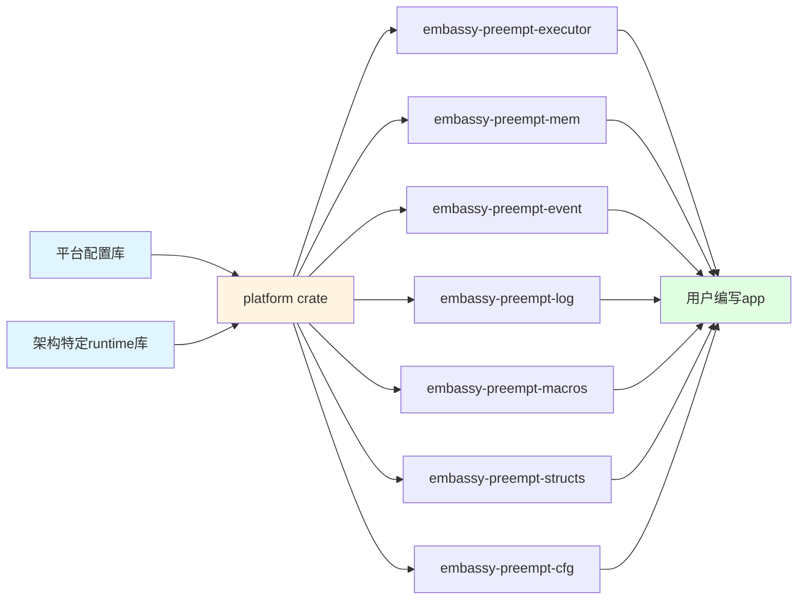

# Embassy Preempt

## 摘要

Embassy Preempt是一个嵌入式异步实时操作系统调度模块，结合Rust协程机制与传统RTOS的抢占式调度，在内存效率和实时性之间取得平衡。系统支持Rust原生async/await语法定义实时任务，兼容uCOSII API接口，并实现了创新的动态栈空间管理——主动让权时共享栈以节省内存，被抢占时按需分配私有栈保存上下文，在64任务场景下相比固定栈方案节省约53%内存。

项目已适配RISC-V平台，在VisionFive2（JH7110）开发板上实现了完整的AMP方案：S7核心运行Embassy Preempt处理实时任务，U74核心运行StarryOS处理通用计算，通过ov_channel共享内存库实现Notification和RPC双向通信。在无数据缓存的S7核心上，上下文切换性能与U74核心上的RT-Thread相当，核间通信延迟比官方AMP方案低约5~6倍。

[汇报仓库](https://github.com/Oveln/embassy_preempt_on_Visionfive2-2026-04-19)

## 系统简介

Embassy Preempt是一个嵌入式异步实时操作系统的调度模块，它通过Rust提供的协程机制，结合embassy的异步执行器的实现方式，并借鉴传统嵌入式实时操作系统uCOSII的任务切换机制，在任务调度时实现了一套创新的内存管理和实时性保证机制。

在传统嵌入式实时操作系统（如uCOSII）中，每个任务都占有一个私有的栈空间，但在实际应用中，大部分任务释放CPU都是由于主动让权，而非被高优先级的任务抢占，这使得栈空间存在一定的浪费。而在embassy中，虽然通过引入Rust的协程机制使得栈空间的利用率得到了极大的提升，但是由于协程之间无法进行抢占，并且没有优先级裁决机制，导致在多任务场景下实时性较差。

Embassy Preempt在这两者之间进行了"折衷"，实现了一个既可以满足实时应用环境下的实时性要求，又可以尽可能缩小内存使用的嵌入式异步实时操作系统调度模块。其核心在于：

- **混合任务调度**：支持Rust原生协程作为任务，兼容传统uCOSII API接口
- **动态栈空间管理**：主动让权时进行栈复用，被抢占时进行栈分配和现场保存
- **抢占式内核**：支持高优先级任务抢占低优先级任务=

2025年11月以来，项目重点进行了RISC-V平台支持的开发，特别是在VisionFive2（JH7110）开发板上实现了完整的AMP方案：S7核心运行Embassy Preempt处理实时任务，U74核心运行StarryOS处理通用计算，两系统间实现了Notification和RPC的双向通信机制。

## 系统架构




## 系统特性

### 支持rust原生协程作为task

Embassy Preempt完全支持Rust原生的async/await语法，开发者可以使用标准的异步函数作为实时任务。这种支持基于Rust的Future trait，通过执行器的poll机制驱动异步任务执行。

**核心特性：**

- **原生异步语法**：直接使用`async fn`定义任务，配合`.await`进行异步等待
- **零成本抽象**：协程在编译期转换为状态机，无运行时开销
- **统一的任务模型**：异步任务与同步任务在同一调度器中管理
- **优先级支持**：协程任务可以设置优先级，参与抢占式调度

**任务创建示例：**

```rust
use embassy_preempt_executor::AsyncOSTaskCreate;

// 创建异步任务 ([源代码](https://github.com/Oveln/embassy_preempt/blob/a708bb1ea723da795e79d672916791790e841dd5/modules/embassy-preempt-executor/src/os_task.rs#L79-L97))
AsyncOSTaskCreate(
    my_async_task,           // 异步函数
    ptr::null_mut(),
    ptr::null_mut(),
    priority,                // 优先级
);

// 异步任务定义
async fn my_async_task() {
    loop {
        // 执行实时任务
        embassy_preempt_log::info!("Async task running");
        // 主动让权，等待定时器
        Timer::after_micros(100000000).await;
    }
}
```

**执行机制：**

协程任务的执行通过执行器的poll函数驱动。当协程遇到`.await`点时，会将控制权交还给调度器，调度器可以选择：
- 继续poll当前协程（如果未完成）
- 切换到其他就绪任务
- 进入低功耗状态（如果无就绪任务）

这种机制使得协程在主动让权时不需要保存完整的栈上下文，因为所有的局部变量都存储在Future的状态机中，而非栈上。

### ucosii api兼容

Embassy Preempt提供了与传统uCOSII RTOS兼容的API接口，使得现有的嵌入式代码可以轻松迁移。

**主要兼容接口：**

- **OSTaskCreate/OSTaskCreateExt** - 任务创建 ([源代码](https://github.com/Oveln/embassy_preempt/blob/a708bb1ea723da795e79d672916791790e841dd5/modules/embassy-preempt-executor/src/os_task.rs#L43-L97))
- **OSTimeDly** - 任务延迟 ([源代码](https://github.com/Oveln/embassy_preempt/blob/a708bb1ea723da795e79d672916791790e841dd5/modules/embassy-preempt-executor/src/os_time/mod.rs#L70-L83))
- **OSTimeDlyHMSM** - 按时分秒延迟
- **OSSemCreate/OSSemPend/OSSemPost** - 信号量操作 ([源代码](https://github.com/Oveln/embassy_preempt/blob/a708bb1ea723da795e79d672916791790e841dd5/modules/embassy-preempt-event/src/os_sem.rs#L10-L32))

**使用示例：**

```c
// C风格任务创建 ([源代码](https://github.com/Oveln/embassy_preempt/blob/a708bb1ea723da795e79d672916791790e841dd5/modules/embassy-preempt-executor/src/os_task.rs#L43-L76))
extern "C" void my_task(void* arg) {
    while (1) {
        // 任务逻辑
        OSTimeDly(100);
    }
}

// 创建任务
SyncOSTaskCreate(my_task, NULL, NULL, 10);
```

**统一调度机制：**

在系统内部将任意sync函数视作单个Future，使得所有task能被统一调度

### 动态栈空间使用

Embassy Preempt实现了创新的动态栈空间管理机制，根据任务调度方式智能选择栈分配策略，最大化内存利用率。

**内存设计：**

- **栈复用**：主动让权时共享栈空间，避免内存浪费
- **按需分配**：仅在发生抢占时分配私有栈

**两种调度模式：**

1. **让权模式（主动让权）**
   - 任务通过`.await`主动让出CPU
   - 所有协程共享同一个程序栈
   - 无需保存完整栈上下文（局部变量在Future状态机中）
   - 栈空间利用率最高

2. **抢占模式（被动切换）**
   - 高优先级任务抢占低优先级任务
   - 当前程序栈分配给被抢占任务保存上下文
   - 立即分配新栈供系统继续运行
   - 恢复执行时可能回收私有栈（如果任务再次让权或完成）

**栈分配器实现：**

采用固定大小块分配算法 ([源代码](https://github.com/Oveln/embassy_preempt/blob/a708bb1ea723da795e79d672916791790e841dd5/modules/embassy-preempt-mem/src/arena.rs))，支持8种栈大小：
```rust
const STACK_SIZES: [usize; 8] = [
    128, 256, 512, 1024, 2048, 4096, 8192, 16384  // 字节
];
```

根据Qemu平台的测试数据（64任务场景）：
- **动态栈开销**：120KB（峰值时约7个任务同时拥有私有栈）
- **uCOSII固定栈**：256KB（每任务4KB）
- **内存节省**：约53%

这种设计既保持了抢占式RTOS的实时性，又最大程度地降低了内存占用，特别适合资源受限的嵌入式系统。

### 上下文切换性能

基于QEMU RISC-V平台的精确指令计数测试，Embassy Preempt展现了高效的上下文切换性能。

**测试环境：**

| 项目 | 参数 |
|------|------|
| 测试平台 | QEMU RISC-V |
| 架构 | RISC-V 64位 |
| 测试方法 | 指令计数 |
| 测试流程 | 从发起上下文切换请求到处理完成 |

| 测试项 | 指令数 | 说明 |
|--------|--------|------|
| **完整上下文切换** | **378条指令** | 从请求到完成的完整流程 |

在实际平台上运行会因为cache miss等原因大于378时钟周期，具体表现在visionfive2的部分会有比较

# Embassy Preempt On VisionFive2

## S7核心适配

VisionFive2开发板上的JH7110处理器有5个核心，其中S7核心（hart0）专门运行Embassy Preempt。

**S7核心特点：**

| 特性 | S7核心 |
|------|--------|
| 指令集 | RV64IMAC（整数+乘法+压缩）|
| 浮点 | 无 |
| 原子指令 | 不支持CAS，需要软件模拟 |
| 缓存 | 仅有I cache，无D cache |
| 运行位置 | L2 Cache Lim区域 |

S7核心不支持S态，只能运行在M态，这意味着不需要OpenSBI层，可以直接访问硬件，减少了中断延迟。

**L2 Cache Lim配置：**

L2 Cache Lim是JH7110中L2 Cache的特殊功能，disabled的cache ways可以直接作为内存寻址，提供确定的访问时间。

**配置原理：**
- 总共2MB = 16 ways × 128KB
- 复位状态：只有way 0是cache，其他15个ways都是disabled（可作为L2 LIM）
- Enable规则：通过WayEnable寄存器enable ways，从最低编号way开始
- 地址映射：最高编号way映射到最低L2 LIM地址
- 一旦enable就不可disable，除非系统复位

**启动流程与SPL自搬运：**

初始状态下，这块低内存区域（0x800_0000）被SPL使用。启动流程如下：

1. **SPL阶段**：SPL搬运opensbi、uboot、embassy_preempt到对应内存位置
2. **U-Boot阶段**：需要初始化cache2驱动

为了给Embassy Preempt腾出L2 LIM空间，做了以下修改：

**1. SPL自搬运**
- 新增`arch/riscv/cpu/spl_relocate.S`（适用于多核的自搬运算法）
- 将SPL自身从`0x800_0000`搬运到`0x808_0000`
- 修改`u-boot-spl.lds`链接脚本
- 这样让出了低内存的512KB空间

**2. Cache2驱动修改**
- 添加`sifive,max-enabled-ways`设备树选项
- 修改`cache-sifive-ccache.c`驱动
- 只enable way 0~11作为cache（12个ways，1.5MB）
- 保持way 12~15为disabled状态（4个ways，512KB）

**最终内存布局：** ([源代码 - memory.x](https://github.com/Oveln/embassy_preempt/blob/a708bb1ea723da795e79d672916791790e841dd5/modules/embassy-preempt-platform/platforms/jh7110/memory.x))
```
0x800_0000 ┌───────────────────────┐
           │ L2 LIM (4 ways)       │  ← 512KB，disabled ways
           │ way 15 → way 12       │     embassy_preempt运行区
           │   - embassy_preempt.  │
           ├───────────────────────┤
0x808_0000 │ SPL (搬运后位置)       │  ← SPL自搬运到这里
           │在uboot阶段初始化为Cache │
           │ Cache (12 ways)      │  ← 1.5MB，enabled ways
           │ way 11 → way 0       │
           └──────────────────────┘
0x820_0000
```

Embassy Preempt的代码段通过链接脚本放置在L2 LIM区域（0x800_0000），享受确定的访问延迟，不会有cache miss。

## StarryOS兼容

VisionFive2的另外4个U74核心（hart1-4）运行StarryOS操作系统。

**U74核心特点：**

| 特性 | U74核心 |
|------|--------|
| 指令集 | RV64GC（完整指令集）|
| 浮点 | 支持双精度浮点 |
| 原子指令 | 完整支持 |
| 缓存 | 完整L1 + 共享L2 |

U74核心性能比S7核心强，有浮点单元和完整的原子指令，适合运行通用计算任务。

StarryOS基于ArceOS，支持多核SMP模式。hart1-4核心通过OpenSBI启动，然后uboot加载StarryOS内核，走的是标准的RISC-V启动流程，使用SBI接口访问硬件。

这与hart0直接运行Embassy Preempt不同：hart0在M态直接运行，而U74核心在S态运行，保持了与传统RISC-V Linux系统的兼容性。

## 双系统通信

S7核心的Embassy Preempt与U74核心的StarryOS之间通过ov_channel库实现双向通信。

**ov_channel库简介：**

ov_channel是一个为该场景特殊设计的双系统共享内存通信库，专门设计用于裸机环境下的高效通信。这个库基于环形缓冲区实现无锁通信。

**主要特性：**

- `no_std`
- 基于环形缓冲区的无锁通信
- 四种消息类型：Notification（通知）、Data（数据）、RPC Request/Response（远程过程调用）
- 每个消息256字节，包含1字节类型标识和255字节负载数据
- 支持类型安全的RPC调用，使用postcard二进制序列化

**测试验证：**

该库已经在x86和RISC-V 64位平台上进行了充分测试，验证了跨平台兼容性和正确性。

**MSIP中断通知机制：**

两系统间通过MSIP（Machine Software Interrupt）寄存器实现中断通知：

1. **StarryOS → Embassy Preempt**
   - StarryOS写入共享内存消息
   - 通过OpenSBI扩展SBI接口触发MSIP0中断
   - Embassy Preempt的MSI中断处理函数被调用
   - 唤醒`wait_for_ipi().await`等待的任务
   - 处理共享内存中的消息

2. **Embassy Preempt → StarryOS**
   - Embassy Preempt写入共享内存消息
   - 直接写MSIP1寄存器触发hart1的SSI中断
   - StarryOS的IPI设备驱动处理中断
   - 读取并处理共享内存中的消息

对于StarryOS来说，ov_channal所在的内存区域是一块mmio设备

**RPC通信流程：**

```
StarryOS 发起RPC调用:
1. 写入RPC Request到Channel 0
2. 触发MSIP中断通知Embassy Preempt
3. Embassy Preempt处理请求并写入RPC Response到Channel 1
4. 触发MSIP中断通知StarryOS
5. StarryOS读取响应
```

**实际应用示例：**

在embassy_preempt_app_Visionfive2中实现了RPC服务器，支持的方法包括：
- `HELLO_WORLD`: 测试方法
- `ADD`: 加法运算

任务可以通过`wait_for_ipi().await` ([源代码](https://github.com/Oveln/embassy_preempt/blob/a708bb1ea723da795e79d672916791790e841dd5/modules/embassy-preempt-executor/src/ipi.rs#L186-L189)) 异步等待来自StarryOS的RPC调用或Notification。

## 性能比较

与官方在VisionFive2大核心（U74）上移植的RT-Thread AMP方案进行性能对比。

| 对比项 | Embassy Preempt | RT-Thread |
|--------|----------------|-----------|
| **运行核心** | S7 (hart0) | U74 |
| **指令集** | RV64IMAC | RV64GC |
| **浮点单元** | 无 | 双精度浮点 |
| **数据缓存** | 无 | 完整L1+L2 |
| **上下文切换** ([源代码](https://github.com/Oveln/embassy_preempt/blob/a708bb1ea723da795e79d672916791790e841dd5/modules/embassy-preempt-executor/src/os_cpu.rs#L27-L77)) | 1.25~2.48 μs | 平均1μs，最大2μs |
| **核间通信** | RPC: 3.585~4.669 μs | IPI: ~25μs，最大70μs |

**核心优势**：

1. **上下文切换**：在无数据缓存的S7核心上，实现了与U74核心上RT-Thread相当的调度性能

2. **核间通信**：通过软件中断提醒，通过ov_channal的延迟比官方AMP方案的延迟低约5~6倍，主要得益于共享内存通信和协程异步模型

3. **资源利用**：动态栈管理机制在64任务场景下相比传统固定栈方案节省约53%内存

## 相关链接

- **源代码仓库**：[Oveln/embassy_preempt](https://github.com/Oveln/embassy_preempt) — 项目主仓库，包含所有模块源码
- **汇报仓库**：[Oveln/embassy_preempt_on_Visionfive2-2026-04-19](https://github.com/Oveln/embassy_preempt_on_Visionfive2-2026-04-19) — VisionFive2平台适配的汇报材料
- **开发日志**：项目开发过程中的提交记录和设计决策可通过上述仓库的 Git 提交历史查阅