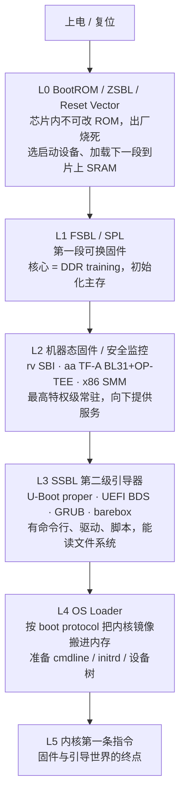

<!-- more -->

## 0. 引子：按下电源到内核接管，中间这段最神秘

按下电源键，到屏幕上滚出第一行内核日志，中间有一段几乎没有人看得见的旅程。这段旅程里没有操作系统，没有 `printf`，没有调试器，没有文件系统，甚至最开始连内存都不能用。CPU 从一个写死在芯片里的地址取出第一条指令，在一片荒地上一砖一瓦地把自己能用的世界搭起来——初始化时钟、训练内存、建立串口、找到下一段代码、校验它、跳过去——如此接力四五棒，直到把控制权郑重交给内核的第一条指令。

这段旅程的主角，是固件（firmware）与引导（boot）——要拆解的，正是它从上电到内核入口之间的每一棒，收束点精确落在**内核拿到 CPU 的第一条指令之前**。

为什么单独花一篇大笔记讲"之前"？因为这段最容易被跳过，也最容易被误解。大多数人对启动的认识停在"BIOS 然后 GRUB 然后开机"，而真实的启动链是一条有五六棒的接力，每一棒都有它存在的硬件理由：有的因为复位时 DRAM 还不能用，有的因为需要一个比内核更高的特权级来管硬件，有的因为要在不可信的世界外面再套一层可信的世界。把这条链拆开，每一棒"为什么出现、解决了什么、被谁取代",才算真的看懂了一台机器是怎么活过来的。

贯穿全篇会反复出现四种指令集架构，约定缩写：**RISC-V（rv）**、**x86/x64（x86）**、**aarch64/arm（aa）**、**LoongArch（la）**。其中 rv 特权架构干净、从 reset vector 到内核每条指令全程开源，是把启动链看到底的最佳样本。

目标不只是"看懂"，而是"能写"：理解到能自己动手实现一个最小的 SBI 固件、最小的 SPL、最小的 UEFI 引导程序、最小的裸机 booter，并在 QEMU 上跑通。

---

## 1. 总纲：从上电到内核的六级接力（L0 → L5）

无论哪种架构，从上电到内核都遵循同一个骨架：**一段接一段地"加载下一段、移交控制权"**，每一段比上一段能力更强、运行环境更完整。我们把它抽象成六级接力，记作 L0 到 L5。



逐级说明它"是什么、为什么存在、做完什么就移交"：

| 级别 | 角色 | 为什么需要这一棒 | 典型产物 |
|:--:|:--:|:--:|:--:|
| **L0** | BootROM / ZSBL / Reset Vector | 复位瞬间 CPU 一无所有：无 RAM、无外设、不知从哪取码。必须有一段出厂固化、永不失效的代码托底 | 选定启动设备，把 L1 搬进片上 SRAM 并跳入 |
| **L1** | FSBL / SPL | 主存 DRAM 上电后是一片乱码，必须先做 **DDR training** 才能用；这段代码因此只能挤在几十 KB 的片上 SRAM 里 | 主存可用，加载更大的 L2/L3 到 DRAM |
| **L2** | 机器态固件 / 安全监控 | 需要一个比内核更高的特权级，常驻于此，统一管理底层硬件、提供运行时服务、隔离可信与不可信世界 | 设置特权委托与内存保护，降级跳入 L3 |
| **L3** | SSBL（第二级引导器） | 需要一个"功能丰富"的引导环境：能读文件系统、跑命令行、走网络、解析脚本、按需选择启动项 | 找到并加载内核镜像与配套数据 |
| **L4** | OS Loader | 内核镜像有固定的交接格式（boot protocol），必须按规矩把它放到正确地址、对齐 ABI、备好参数 | 内核镜像在内存就位，寄存器按约定填好 |
| **L5** | 内核入口 | —— | 内核第一条指令开始执行 |

几点要点，贯穿全篇：

- **同构异形**：六级骨架三大架构通用，但每一棒的"肉"长得很不一样。比如 L2 这一棒，rv 是 SBI，aa 是 TF-A 加 OP-TEE，x86 是藏在固件里的 SMM——它们解决的是同一类问题（最高特权级的常驻服务与隔离），实现却天差地别。
- **棒数会伸缩**：六级是"最完整"的形态。开发与虚拟机里常常合并或省略某几棒（例如 QEMU 上直接 `-bios` 加载 SBI，跳过 L0/L1；或 OpenSBI 内嵌内核当 payload，省掉 L3/L4）。真硬件量产则往往六棒齐全。
- **每一棒都在回答两个问题**：上一棒把什么交给我（入口地址、参数寄存器、机器状态）？我做完之后把什么交给下一棒？把这两个"接口"摸清楚，就摸清了整条链。

---

## 2. 一眼看全：rv · x86 · aa · la

在钻进任何一棒的细节之前，先把几条线整体摊开，让"它们都长什么样"一眼可见。先看一张总览表（六级 × 各架构），再并置几段简史，最后用一段话把它们贯起来。

### 2.1 启动链总览表

| 级别 | rv | x86 | aa | la |
|:--:|:--:|:--:|:--:|:--:|
| **L0** BootROM | 复位向量 + ZSBL（片内 mask ROM）；QEMU virt 是 `0x1000` 处十余条指令的 stub | 复位向量 `0xFFFFFFF0`（16 位实模式），芯片组 + ME/PSP 早期初始化 | 片内 mask ROM（Boot ROM），选启动设备，支持救砖下载模式 | 片内 BootROM（同 aa 路线） |
| **L1** FSBL/SPL | U-Boot SPL / HSS（PolarFire），DDR training | 早期无独立 FSBL，由 BIOS/coreboot 的 romstage 兼任（cache-as-RAM 做 DDR） | TF-A BL1 + BL2 / Xilinx FSBL，DDR training | UEFI 固件早期 init（含 DDR）|
| **L2** 机器态/安全 | **SBI**（M-mode）：OpenSBI / RustSBI / BBL / 自研 | SMM（系统管理模式）/ SGX / TDX / SEV | TF-A **BL31**（EL3 安全监控）+ OP-TEE **BL32**（安全 EL1）；PSCI | UEFI 运行时（无独立机器态规范层）|
| **L3** SSBL | U-Boot proper / UEFI（EDK2 或 U-Boot 内置） | 传统 BIOS（INT 调用 + MBR）/ UEFI BDS / GRUB | U-Boot proper / UEFI / barebox | UEFI + GRUB（早期 PMON）|
| **L4** OS Loader | U-Boot `booti` / GRUB / EFI stub | GRUB / Windows Boot Manager / systemd-boot | U-Boot `booti` / GRUB / EFI stub | GRUB / EFI stub |
| **L5** 交接 ABI | `mret` 进 S-mode，`a0`=hartid，`a1`=dtb 物理地址 | bzImage 实模式/保护模式/长模式分段交接，`boot_params` | 降到 EL1/EL2，`x0`=dtb 物理地址 | UEFI 交接进内核 |
| 硬件描述 | Device Tree（FDT/dtb） | ACPI 为主（DT 极少） | Device Tree 为主，服务器走 ACPI | ACPI（服务器）/ DT |
| 中断控制器 | CLINT/ACLINT + PLIC/APLIC+IMSIC | LAPIC + IOAPIC / MSI | GIC（v2/v3/v4） | 自有（extioi 等）|

这张表是全篇的地图。后续每一章都在放大其中一格，而 rv 那一列是放得最大的一列。

### 2.2 三线简史并置：同一道难题的三种演化

三条线各自的固件史，本质都在回答同一个问题——"复位之后怎么一步步把机器带起来、又怎么把硬件细节对内核屏蔽掉"。但它们出发的年代、背负的兼容包袱不同，于是走出了三条形状各异的路。

**x86：从 BIOS 到 UEFI，一部兼容性史。** 1981 年 IBM PC 的 BIOS（Basic Input/Output System）把"开机自检 + 从磁盘第一个扇区加载引导代码"固化下来，16 位实模式、`INT 13h` 读盘、512 字节 MBR——这套接口一用就是二十多年，靠的是死磕向后兼容。问题是它太老：实模式只有 1MB 地址空间，MBR 只能管 2TB 盘，没有可扩展的驱动模型。1998 年 Intel 为安腾另起炉灶做 EFI，2005 年交给 UEFI Forum 演化成 UEFI，2007 年随 Tianocore/EDK2 开源。UEFI 用 32/64 位、GPT 分区、FAT32 的 EFI 系统分区（ESP）、Protocol/GUID 的驱动模型、Boot Manager 的启动项管理，系统地取代了 BIOS。今天 PC/服务器固件几乎全是 UEFI，但仍保留 CSM（兼容支持模块）模拟老 BIOS——又是兼容性。

**aa：从各家乱战到 TF-A 统一。** 早期 aa 没有统一固件标准，每家 SoC 的 BootROM、第一级加载器各搞各的。随着 ARMv8 引入 EL0–EL3 四个异常级，需要一个跑在最高 EL3、负责安全世界与非安全世界切换的"安全监控"。aa 阵营于是推出 Trusted Firmware-A（TF-A），把启动切成 BL1（BootROM 之后第一段）、BL2（加载器）、BL31（EL3 常驻安全监控，实现 PSCI 电源接口）、BL32（安全世界 OS，常用 OP-TEE）、BL33（非安全引导器，常用 U-Boot 或 UEFI）。TrustZone 把世界一分为二，TF-A + OP-TEE 是这套分裂的看门人。

**rv：后发者的干净起步。** rv 2010 年才在伯克利起步，没有历史包袱，从一开始就把"机器态固件接口"标准化。最早是 BBL（Berkeley Boot Loader，源于 riscv-pk 项目），在 M-mode 提供一层薄薄的环境给上面的内核；随着生态成熟，这层被抽象成 **SBI（Supervisor Binary Interface）**规范——S-mode 内核通过 `ecall` 调用 M-mode 固件的标准服务（定时器、核间中断、远程 fence、热插拔、关机等）。OpenSBI（C，Western Digital 主导）成为参考实现，RustSBI（Rust）是另一套主流实现。SBI 之于 rv，约等于 PSCI + 一部分固件运行时服务之于 aa，又约等于被规范化、被开源、被简化的那部分 BIOS/UEFI 运行时之于 x86。这条线最年轻，却也最清爽。

把三段史叠在一起看，会发现一条共同的暗线：**早期是"实现即标准"（BIOS、各家 aa 固件），后来都走向"规范与实现分离"（UEFI 规范 + EDK2 实现、SBI 规范 + OpenSBI/RustSBI 实现、PSCI 规范 + TF-A 实现）。** 规范化让内核不必关心固件是谁家的——这正是固件层存在的根本意义：向上屏蔽硬件与厂商差异。

### 2.3 一段贯通：同一件事，三种长相

把镜头拉到最高，三条线做的是同一件事，分四步走：

1. **托底**（L0）。复位后从一个固定地址取第一条指令，这段代码出厂烧死、永不可改。rv 是复位向量加 ZSBL，x86 是 `0xFFFFFFF0` 的复位向量，aa 是片内 mask ROM。它们都只做最低限度的事：选好从哪个设备继续，把下一段搬到能跑的地方。

2. **唤醒主存**（L1）。复位时 DRAM 不可用，必须有一段小代码挤在片上 SRAM 里完成 DDR training，把主存激活。rv/aa 是 SPL/FSBL，x86 早期把这步藏在 BIOS/coreboot 的 romstage 里用 cache-as-RAM 顶着。这一步做完，机器才第一次有了"大内存"。

3. **架起常驻服务与可信边界**（L2）。需要一个最高特权级的常驻固件：对内核屏蔽底层差异、提供运行时服务、隔离可信世界。rv 是 SBI（M-mode），aa 是 TF-A BL31 加 OP-TEE（EL3/安全 EL1），x86 是 SMM 加 SGX/TDX/SEV 这类机密计算扩展。

4. **挑选并加载内核**（L3–L5）。一个功能丰富的引导器（U-Boot/UEFI/GRUB/barebox）读文件系统、走网络、解析配置、选出内核，按 boot protocol 搬进内存、对齐寄存器约定，最后一跳交给内核第一条指令。

四步之中，第 3 步（L2）是三条线差异最大、也最值得花笔墨的一棒，而 rv 的 SBI 又是其中结构最清晰的样本。

### 2.4 la 一瞥

la 是龙芯自研指令集，启动思路与 aa/x86 同源而非另立门户：桌面/服务器平台走 **UEFI**（基于 EDK2 的龙芯移植）加 GRUB；早期与嵌入式平台有 **PMON**（一个历史悠久的类 BIOS 引导器，本仓 `boot/pmon` 即是）。它有自己的特权级（PLV0–PLV3）与异常入口，但在"六级接力"的框架里完全对得上号：BootROM → 固件 → 引导器 → 内核。

---

## 3. L0：上电第一条指令——Reset Vector / BootROM / ZSBL

复位（reset）是一切的起点。复位信号拉低再拉高，CPU 内部寄存器回到确定的初值，程序计数器 PC 被置成一个**架构规定或芯片固定**的地址，然后取出第一条指令。这个地址叫**复位向量（reset vector）**，它指向的那段出厂固化代码，就是 L0。

L0 的处境是整条链里最艰难的：没有 DRAM（只有寄存器和极少量片上 SRAM/cache 可用），没有初始化好的外设，不知道从哪个设备继续启动，甚至时钟可能还是最慢的初始频率。它能做的事极有限，目标也极明确：**做最低限度的初始化，选好启动设备，把下一段（L1）搬到能执行的地方，然后跳过去。**

下面先看 rv，再对照 x86 与 aa，最后归纳 L0 的共性职责。

### 3.1 rv：复位向量 + ZSBL

rv 特权规范并未把复位向量的具体数值钉死，而是交给平台实现。真实 SoC 上，复位向量指向片内的一块 **mask ROM**（也叫 BootROM、BROM，或在 SBI 语境里称 **ZSBL**，Zeroth Stage Boot Loader——"第零级引导器"，强调它在 SBI 之前）。这块 ROM 几 KB 到几十 KB，出厂时光刻进芯片，无法更改。

真机 ZSBL 的职责相当实在：

- 初始化最基础的时钟（PLL），让 CPU 跑到可用频率；
- 根据 GPIO/eFuse/拨码开关选择启动设备（SD 卡 / SPI Flash / eMMC / USB 下载模式）；
- 把第一段可换固件（SPL）从启动设备读进片上 SRAM（此时 DRAM 还不能用）；
- 可选地校验 SPL 的签名（这是 Verified Boot 信任链的根，详见 §9.2）；
- 提供救砖入口：当正常启动失败或被强制时，进入串口/USB 下载模式（全志的 FEL、瑞芯微的 MaskROM 模式等），让主机灌入固件。

几个代表性平台的 ZSBL 形态：

| 平台 | L0 形态 | 大致体量 | 行为概要 |
|:--:|:--:|:--:|:--:|
| SiFive FU540/FU740（HiFive Unmatched） | 片内 mask ROM | ~32 KB | 读 GPIO 选启动设备，把 SPL 加载进 L2 cache-as-RAM |
| StarFive JH7110（VisionFive 2） | 片内 BootROM（BROM） | 几十 KB | 选 SD/Flash，加载含 OpenSBI 的 SPL |
| Allwinner D1 | brom | ~32 KB | 加载 SPL；失败则进 FEL 下载模式 |
| SpacemiT K1 | 片内 BootROM | 几十 KB | 加载 SPL 到片上 SRAM |
| Microchip PolarFire SoC | HSS（Hart Software Services） | MB 级 | 比典型 ZSBL 复杂得多，是用户可编译的固件而非 mask ROM |
| QEMU virt | `0x1000` 处的 stub | ~10 条指令 | 设 `a0`=hartid、`a1`=dtb，跳 `0x80000000` |

QEMU 把 L0 简化到了极致，正好用来看清 L0 的最小本质。QEMU virt 复位后 PC = `0x1000`，那里是 QEMU 预置的一小段复位代码（等价于真机 ZSBL，逆向自 QEMU 源码）：

```asm
# QEMU virt 复位向量 @ 0x1000
0x1000:  auipc t0, 0x0          # t0 = 0x1000（取当前 PC）
0x1004:  addi  a2, t0, 40       # a2 = 0x1028
0x1008:  csrr  a0, mhartid      # a0 = 当前 hart 的硬件 ID
0x100c:  ld    a1, 32(t0)       # a1 = dtb 物理地址（QEMU 自动放好）
0x1010:  ld    t0, 24(t0)       # t0 = 0x80000000（下一段入口）
0x1014:  jr    t0               # 跳到 0x80000000
```

这十几条指令，就是 QEMU 版 L0 的全部：**读出 hartid 放进 `a0`，读出设备树地址放进 `a1`，跳到 `0x80000000`。** 这里已经埋下了贯穿全链的一条 ABI 暗线——`a0`=hartid、`a1`=dtb，从 L0 一路传到内核（§8 详述）。

关于 `0x80000000` 这个地址：它不是规范强制，而是事实标准。SiFive 早期 SoC 把 DRAM 映射到 `0x80000000`，QEMU virt 抄了 SiFive 的布局，后续 rv 板（VisionFive、SpacemiT K1、Allwinner D1 等）几乎全部沿用。对比之下 aa 板的 DRAM 起点五花八门（`0x0`、`0x40000000`、`0x80000000` 都有），全靠设备树描述；rv 这一点要齐整得多。

### 3.2 x86：复位向量 0xFFFFFFF0 与实模式

x86 的 L0 背着最重的历史包袱。CPU 上电复位后进入 **16 位实模式**，PC（准确说是 CS:IP）被硬件置为 `0xFFFFFFF0`——注意这是接近 4GB 顶端的地址，而不是低地址。芯片组把这个地址映射到主板上的固件 Flash（SPI Flash）的顶部，那里放着固件的复位入口。`0xFFFFFFF0` 距 4GB 只有 16 字节，刚够放一条跳转指令，跳到固件的真正初始化代码。

为什么是实模式、为什么在 4GB 顶端？这是从 8086 一路继承下来的兼容性约定：早期 BIOS 固件就映射在地址空间高端，复位向量自然落在那里；为了让几十年的固件和引导代码继续能跑，现代 x86 CPU 复位时仍旧装成一颗 16 位实模式的 8086，然后由固件一步步把它"升级"成 32 位保护模式、再到 64 位长模式。

现代 x86 的 L0 远比一条跳转复杂：在 x86 主核取第一条指令之前，往往已有一颗独立的管理核先跑过一轮——Intel 的 ME（Management Engine）或 AMD 的 PSP（Platform Security Processor）。它们负责最早期的硬件门禁与固件验证，是 x86 信任链真正的根。主核复位后，固件（传统 BIOS 或 UEFI 的 SEC 阶段）接手，逐步初始化芯片组、内存控制器、把 CPU 切到保护模式。x86 没有独立的"SPL"概念，DDR 初始化这一步被吸收进固件早期阶段（见 §4.4）。

### 3.3 aa：片内 mask ROM 与救砖模式

aa 的 L0 与 rv 形态最接近：片内一块出厂固化的 **Boot ROM（mask ROM）**。复位后 CPU 从复位向量进入 Boot ROM，由它根据启动引脚/eFuse 选择启动设备，把第一级加载器（TF-A 的 BL1 或厂商 FSBL）读进片上 SRAM 并跳入。

aa 阵营把"救砖模式"做得尤其成熟，因为嵌入式设备一旦固件刷坏就需要从外部重新灌入：

- NXP i.MX 的串口/USB 下载模式（Serial Download Protocol）；
- 全志的 FEL 模式（USB）；
- 高通的 EDL（Emergency Download，9008 模式）；
- 苹果设备的 DFU（Device Firmware Update）。

这些模式本质都一样：当 Boot ROM 发现正常启动设备无效、或检测到强制信号时，转而从 USB/串口等待主机推送一段固件到 SRAM 执行，从而绕过损坏的存储。这是 Boot ROM 作为"永不失效托底层"的价值所在——只要芯片还活着，就有一条进得去的后门（受签名校验约束）。

### 3.4 共性归纳：L0 的职责清单

抛开三家的外形差异，L0 这一棒做的事高度一致，可归纳为八项（不是每个平台都全做，但都从这张清单里取）：

1. 把 CPU 从复位的混沌态带到一个确定、可执行代码的最小状态；
2. 初始化最基础的时钟（让 CPU 跑到可用频率）；
3. 选择启动设备（GPIO/eFuse/拨码/优先级表）；
4. 把下一段固件（L1）从启动设备读进**片上 SRAM**（因为 DRAM 还不能用）；
5. 建立信任链的根：校验下一段的签名（Verified/Secure Boot 起点）；
6. 提供救砖/恢复入口（串口/USB 下载模式）；
7. 传递最基本的交接信息（如 rv 的 hartid、dtb 地址）；
8. 跳入 L1，移交控制权。

L0 永远是**不可改**的（mask ROM 或芯片组写死），这既是它的可靠性来源（永远托底），也是它的局限（有 bug 也改不了，只能靠后续固件绕开）。理解了 L0 的"一无所有"，才能理解下一棒 L1 为什么必须先做一件大事——唤醒主存。

---

## 4. L1：第一段可换固件——FSBL / SPL，灵魂是 DDR training

L0 把控制权交出来时，机器仍然只有寄存器和片上 SRAM 可用，主存 DRAM 还是一片不能读写的乱码。L1 这一棒的核心使命，就是**把 DRAM 唤醒**，然后把更大的后续固件加载进这片刚激活的主存。它在不同体系里有不同名字——rv 与 U-Boot 称 **SPL（Secondary Program Loader）**，aa 的 TF-A 称 **BL1/BL2**，Xilinx 称 **FSBL（First Stage Boot Loader）**，x86 没有独立的 L1，把这步吸收进了固件早期阶段——但它们做的是同一件事。

### 4.1 为什么必须有这一棒：DRAM 的"鸡生蛋"困局

DRAM（动态随机存取存储器）不像 SRAM 那样上电即用。它由电容存储电荷表示比特，需要一个**内存控制器**按精确时序去刷新、寻址、读写；而高速 DDR 接口（DDR3/4/5，数据率达每秒数十亿次传输）的物理信号还必须经过一轮**校准**才能可靠工作。这套初始化与校准，统称 DDR 初始化与 **DDR training**。

这就形成了一个"鸡生蛋"的困局：

- 要用 DRAM，得先运行一段初始化它的代码；
- 但这段代码不能放在 DRAM 里（它还没初始化）；
- 只能放在容量极小的片上 SRAM（几十 KB 到几百 KB）里运行。

于是 L1 的两条铁律就被钉死了：**第一，它必须极小**（要塞进 SRAM）；**第二，它必须可换**（DDR 参数随板卡、随内存颗粒、随走线而变，写死在 mask ROM 里行不通，必须做成可重新编译、可烧录的固件）。这正是 L0（不可改、托底）与 L1（可改、专门唤醒主存）分成两棒的根本原因。

### 4.2 DDR training 深讲：为什么非得运行时校准

DDR training 是 L1 里技术含量最高、也最容易被一笔带过的部分。它之所以无法在编译期算好、必须上电实测，根源在物理：DDR 总线上，时钟/选通信号（DQS）与数据信号（DQ）从控制器到内存颗粒，经过不同长度的走线、不同的负载、随温度与电压漂移，到达时间各不相同。在每秒数十亿次传输的速率下，这点时间差足以让采样采到错误的电平。training 就是逐根信号去寻找正确的采样延迟与参考电压，把采样窗口对准数据眼图的中心。

典型的 training 步骤（DDR4 为例）：

| 阶段 | 校准目标 | 解决的问题 |
|:--:|:--:|:--:|
| Write Leveling | DQS 与 CK 时钟对齐 | 补偿 fly-by 走线导致各颗粒时钟到达不同步 |
| Read Gate Training | 读选通门控窗口 | 找到读数据何时到达，开正确的接收门 |
| Read/Write Leveling | 每根 DQ 相对 DQS 的延迟 | 把每比特采样点对准数据眼中心 |
| VREF Training | 参考电压阈值 | 把判 0/1 的电压门限调到最佳 |

这些参数**只能上电后在目标硬件上实测得出**——工艺偏差、板级走线、内存颗粒批次、当前温度，编译期一概无从得知。这就是 DDR training 必须运行时做、且必须由一段"贴着硬件"的固件来做的原因。为了缩短后续启动时间，训练得到的参数常被缓存进 eMMC/Flash，下次启动直接载入、跳过部分重训。

理解了这一点，"L1 为什么必须在片上 SRAM 里跑、为什么必须极小"就顺理成章了：它运行时，DRAM 尚不可用。x86 没有大块片上 SRAM，于是用了另一招——**Cache-as-RAM（CAR）**：把 CPU 的 L2/L3 cache 临时锁成一块可读写的 RAM，让早期代码（包括 DRAM 初始化）有地方运行栈和变量，等 DRAM 训练好再切换过去。三种体系，殊途同归。

### 4.3 rv：U-Boot SPL

rv 平台上 L1 通常就是 U-Boot 的 SPL。它的主控制流分两大段，对应"DRAM 之前"与"DRAM 之后"：

```c
// 简化的 SPL 主链（U-Boot, arch/riscv + common/spl）
start.S            // SPL 入口汇编：设栈（在 SRAM 内）、清 BSS、跳 C
  └─ board_init_f  // "f" = before relocation，DRAM 尚不可用
        ├─ 时钟/IO 最小初始化
        └─ DRAM 控制器初始化 + DDR training   // 核心！主存在此被唤醒
  └─ board_init_r  // "r" = after，DRAM 已可用，可加载大镜像
        └─ spl_load_image / spl_load_simple_fit  // 从启动设备读下一段
              └─ jump_to_image_no_args / spl jump // 跳入下一棒
```

几个关键源码锚点（U-Boot 源码树）：

- `common/spl/spl.c` —— SPL 主流程 `board_init_r()`，决定从哪个 backend（MMC/SPI/NOR/NET/RAM…）加载下一段；
- `common/spl/spl_fit.c` —— 解析 FIT/ITB 镜像（多组件打包格式，详见 §6/§7）；
- `arch/riscv/lib/spl.c` —— rv 专用的跳转逻辑；
- `drivers/ram/` —— 各家 SoC 的 DRAM 控制器与 training 驱动。

一个 rv 特有的细节：SPL 运行在 **S-mode**，它本身不提供 M-mode 的机器态服务，因此依赖一个已经就位的 SBI 固件（L2）。在 QEMU 教程链里，U-Boot 构建系统通过 `OPENSBI=` 环境变量把 RustSBI 或 OpenSBI 打包进来，由 SPL 解析 FIT 后把 SBI 拷到 `0x80000000`、U-Boot proper 拷到 `0x80200000`，再跳进 SBI——这条搬运链在 §5、§7 会逐字拆开。更复杂的形态如 Microchip PolarFire 的 **HSS（Hart Software Services）**，是一个 MB 级、多 hart 协同的可编译 FSBL，承担比典型 SPL 重得多的职责。

### 4.4 x86：coreboot 的 bootblock / romstage（Cache-as-RAM）

x86 没有独立的"SPL"概念，DRAM 初始化被吸收进固件的早期阶段。以开源固件 coreboot 为例，它的启动分四段：

| 阶段 | 运行环境 | 主要职责 |
|:--:|:--:|:--:|
| bootblock | CAR（cache 当 RAM） | 最早期 CPU/芯片组设置，进入 romstage |
| romstage | CAR | **DRAM 初始化**（原生 raminit 或调用 Intel FSP 的 MemoryInit），完成后切到 DRAM |
| ramstage | DRAM | 枚举并初始化设备、建立 ACPI 表、装载 payload |
| payload | DRAM | SeaBIOS / GRUB / UEFI（TianoCore）/ 直接 Linux 等 |

其中 **romstage 在 CAR 里做 DRAM 初始化**，功能上等价于 rv/aa 的 SPL/BL2 那一棒。值得一提的是 **FSP（Firmware Support Package）**：Intel 把内存初始化、硅初始化这些与具体芯片强绑定的代码做成闭源二进制 blob，coreboot 调用它完成 raminit——这也是 x86 固件至今难以完全开源的症结之一。传统 BIOS 同样用 CAR 顶过 DRAM 就绪前的窗口，只是整个过程封装在厂商固件内、不对外暴露。

### 4.5 aa：TF-A BL1/BL2 与 Xilinx FSBL

aa 把 L1 拆得更细。在 TF-A 的分级模型里：

- **BL1**：BootROM 之后的第一段可信固件，运行在片上 SRAM（可信区），做最小初始化，加载并校验 BL2；
- **BL2**：可信引导固件，**在这里完成 DDR 初始化**，随后把后续各级（BL31 安全监控、BL32 安全 OS、BL33 非安全引导器）加载到合适位置；
- 之后才进入 L2 的 BL31（§5 详述）。

厂商也有自己的 FSBL，例如 Xilinx Zynq 的 **FSBL**：除 DDR 初始化外，还负责加载 FPGA 比特流（PL 部分）、再加载 BL31/U-Boot——这是 SoC FPGA 平台的特色。

把三家放在一起，L1 的共性一目了然：**一段必须极小、必须可换的固件，在片上 SRAM（或 CAR）里把主存唤醒，再把更大的后续固件搬进主存。** 名字不同、源码不同，骨架完全一致。

| 维度 | rv（U-Boot SPL） | x86（coreboot romstage） | aa（TF-A BL2 / FSBL） |
|:--:|:--:|:--:|:--:|
| 运行环境 | 片上 SRAM | Cache-as-RAM | 片上 SRAM（可信区） |
| 核心职责 | DDR training + 加载下一段 | DRAM init（FSP/native）+ 加载 payload | DDR init + 加载 BL31/32/33 |
| 主存初始化代码 | `drivers/ram/` | FSP blob / native raminit | 平台 DDR 驱动 |
| 下一棒 | SBI（M-mode） | ramstage → payload | BL31（EL3） |

---

## 5. L2：机器态固件与安全世界——SBI

DRAM 唤醒、后续固件搬进主存之后，到了整条链上差异最大、也最值得细看的一棒：一个跑在最高特权级、常驻不退的固件，向下屏蔽硬件、提供运行时服务、隔离可信世界。rv 这一棒叫 **SBI**，aa 是 TF-A 的 BL31 加 OP-TEE，x86 是藏在固件里的 SMM 与机密计算扩展。三者里 rv 的 SBI 结构最清晰、最开放——版本史、v0.1 最小实现、v3.0 全部扩展的每个 EID/FID、哪些必备、Linux 启动需要哪些、各自对应什么硬件，逐一来看；x86 与 aa 随后对照。

### 5.1 SBI 是什么，为什么 rv 需要它

rv 特权架构定义三个模式：U-mode（用户态）、S-mode（操作系统内核）、M-mode（机器模式，最高特权）。复位后 CPU 进入 M-mode。

问题在于：每块板子的 CLINT（定时器/核间中断）、UART、复位寄存器地址都不同。如果 S-mode 内核直接去读写这些寄存器，就得为每块板各写一份内核。**解法是在 M-mode 放一层薄固件，对 S-mode 暴露一套统一的 `ecall` 接口；内核只发 `ecall`，由固件去碰真实硬件。** 这套接口的规范，就是 **SBI（Supervisor Binary Interface）**，规范文档由 riscv-non-isa/riscv-sbi-doc 维护。

```
U-mode 程序  ──syscall(ecall)──→  S-mode 内核  ──SBI(ecall)──→  M-mode 固件  ──→  CLINT/UART/...
                                              ←──── mret ─────
```

类比很整齐：U→S 是系统调用，S→M 是 SBI 调用，两者都用 `ecall` 指令陷入更高特权级，区别只在谁来处理、处理完用什么指令返回（S-mode 用 `sret`，M-mode 用 `mret`）。

**调用约定**（S-mode → M-mode）：

```
a7 = EID   扩展 ID（Extension ID，哪一类服务）
a6 = FID   函数 ID（Function ID，该扩展里的第几个函数）
a0–a5      参数（最多 6 个）
执行 ecall
```

**返回约定**（M-mode → S-mode，经 mret）：

```
a0 = error  错误码（SbiError）
a1 = value  返回值（仅 error == 0 时有意义）
```

错误码是一套统一枚举，随版本扩充：

| 值 | 名称 | 含义 |
|:--:|:--:|:--:|
| 0 | SUCCESS | 成功 |
| -1 | ERR_FAILED | 通用失败 |
| -2 | ERR_NOT_SUPPORTED | 扩展/函数不存在 |
| -3 | ERR_INVALID_PARAM | 参数非法 |
| -4 | ERR_DENIED | 权限不足 |
| -5 | ERR_INVALID_ADDRESS | 地址无效/不可访问 |
| -6 ~ -8 | ALREADY_* | 资源已存在/已启动/已停止 |
| -9 | ERR_NO_SHMEM | 共享内存未设置（v2.0+）|
| -10 ~ -13 | INVALID_STATE / BAD_RANGE / TIMEOUT / IO | v3.0 新增 |

多核广播类调用（IPI/RFNC/HSM）用 **HartMask** 寻址一组 hart：`a0` 是位图、`a1` 是位图起始偏移（`-1` 表示所有 hart）。

### 5.2 版本史与 v0.1 的最小实现

SBI 规范从 2019 走到 2025，分四个大版本，**只增不改**——新版从不删除或修改旧扩展，这是它能让内核与固件解耦演进的根基。

```
v0.1 (2019)        9 个 Legacy 函数，无 EID 概念，a7 直接是函数号
v0.2 / v0.3        Legacy 小修订与定稿
v1.0 (2022)        EID/FID 体系确立；一次引入 BASE/TIME/IPI/RFNC/HSM/SRST 六大主力；rc3 加 PMU
v2.0 (2024-02)     +DBCN +SUSP +CPPC +NACL +STA（调试台、挂起、电源、虚拟化加速、被偷时间）
v3.0 (2025)        +SSE +MPXY +DBTR +FWFT（软件事件、消息代理、调试触发器、固件特性开关）
```

**v0.1 Legacy——最小可用的 SBI。** 在 EID 体系之前，SBI 只有 9 个函数，`a7` 直接是函数编号 0–8，返回值只用 `a0`（没有 `a1`，也没有统一错误码，更没有"探测某函数是否存在"的机制）：

| a7 | 函数 | 功能 | 对应硬件 |
|:--:|:--:|:--:|:--:|
| 0 | set_timer | 设定时器（写 mtimecmp）；不清 STIP，由调用方管 | CLINT mtimecmp |
| 1 | console_putchar | 向调试串口输出一个字节（阻塞） | UART THR |
| 2 | console_getchar | 从调试串口读一个字节，无数据返回 -1 | UART RBR |
| 3 | clear_ipi | 清本 hart 的软件中断（清 SSIP） | CLINT |
| 4 | send_ipi | 向位图指定 hart 发 IPI（写 MSIP） | CLINT MSIP |
| 5 | remote_fence_i | 通知目标 hart 执行 fence.i | （经 IPI）|
| 6 | remote_sfence_vma | 通知目标 hart 刷 TLB | （经 IPI）|
| 7 | remote_sfence_vma_asid | 带 ASID 的远程 TLB 刷新 | （经 IPI）|
| 8 | shutdown | 关机 | 复位设备 |

这 9 个函数，就是"一个能把早期内核引导起来的最小 M-mode 固件"需要实现的全部：设个定时器让调度有心跳、有串口能打字、能发核间中断和远程 fence 撑起多核、能关机。后文 §11 自己写 minimal SBI，起点正是这一张表。

**v1.0 的 EID 体系——一道分水岭。** v1.0 把"函数号直接放 a7"换成了"EID（扩展号）放 a7、FID（函数号）放 a6"，带来四个关键改进：

1. EID 命名空间，扩展之间不再冲突；
2. 返回值分 error 与 value 两个字段；
3. 有 `probe_extension`，内核可以先探测、再调用；
4. EID 取值是 ASCII 串，可读性好——`0x54494D45` = "TIME"、`0x53525354` = "SRST"、`0x735049` = "sPI"（IPI）。

**版本号的 wire 格式**是 `(major << 24) | minor`：v1.0 = `0x01000000`，v2.0 = `0x02000000`，v3.0 = `0x03000000`，而 v0.1 = `0x00000001`。Linux 启动时先调 `sbi_get_spec_version`，若结果 `< 0x01000000` 就判定为 Legacy 固件、退回兼容路径；否则走 EID 体系。

### 5.3 v3.0 全部扩展：EID / FID / 功能 / 必备性 / Linux 前置 / 对应外设

SBI 规范定义的扩展就是下面这 16 个（加 Legacy 共 17 项），**再无其他**。先看一张总表，再逐个展开，最后归纳"哪些必备、Linux 启动到底要哪些、各对应什么硬件"。

| EID | 名称 | 简称 | FID 数 | 引入版本 | 强制 | 一句话功能 |
|:--:|:--:|:--:|:--:|:--:|:--:|:--:|
| — | Legacy | — | 9 | v0.1 | v0.x 中是 | 最早的 9 个函数 |
| 0x10 | Base | BASE | 9 | v1.0 | **必须** | 版本信息 + 扩展探测 + CPU ID |
| 0x54494D45 | Timer | TIME | 1 | v1.0 | 否† | 设定时器（自动清 STIP）|
| 0x735049 | IPI | IPI | 1 | v1.0 | 否 | 核间中断 |
| 0x52464E43 | Remote Fence | RFNC | 7 | v1.0 | 否 | 远程 TLB/缓存刷新 |
| 0x48534D | Hart State Mgmt | HSM | 4 | v1.0 | 否 | hart 启停/挂起/查状态 |
| 0x53525354 | System Reset | SRST | 1 | v1.0 | 否 | 关机/重启 |
| 0x504D55 | Perf Monitor | PMU | 8 | v1.0-rc3 | 否 | 硬件性能计数器 |
| 0x4442434E | Debug Console | DBCN | 3 | v2.0 | 否 | 调试串口（批量读写）|
| 0x53555350 | Suspend | SUSP | 1 | v2.0 | 否 | 系统挂起到内存 |
| 0x43505043 | CPPC | CPPC | 4 | v2.0 | 否 | 协作电源管理（DVFS）|
| 0x4E41434C | Nested Accel | NACL | 5 | v2.0 | 否 | 嵌套虚拟化加速 |
| 0x535441 | Steal-time Acct | STA | 1 | v2.0 | 否 | 虚拟化被偷时间记账 |
| 0x535345 | Supervisor SW Events | SSE | 11 | v3.0 | 否 | 固件向 S-mode 注入事件 |
| 0x4D505859 | Message Proxy | MPXY | 6 | v3.0 | 否 | 核间/服务消息通道 |
| 0x44425452 | Debug Triggers | DBTR | 8 | v3.0 | 否 | 硬件调试触发器接口 |
| 0x46574654 | FW Features | FWFT | 2 | v3.0 | 否 | 运行时开关固件特性 |

> † TIME 名义上非强制，但实际是 Linux 调度心跳的来源，几乎必备；硬件支持 Sstc 时内核可绕过它直接写 stimecmp。

**逐个展开**（重点是"做什么 + 关键 FID + 落到哪个硬件"）：

- **BASE（0x10，唯一强制）**。9 个函数：`get_spec_version`（版本号）、`get_impl_id`（实现者：0=BBL、1=OpenSBI、4=RustSBI…）、`get_impl_version`、`probe_extension(eid)`（探测扩展是否存在）、`get_mvendorid/marchid/mimpid`（CPU 三个识别 CSR）、`get_mhartid`（v2.0 加）、`get_features`（v3.0 加）。Linux 第一条 SBI 调用就是 `get_spec_version`，随后用 `probe_extension` 逐个探 TIME/IPI/HSM 决定走哪条路径。BASE 永远不返回 NOT_SUPPORTED。

- **TIME（0x54494D45，1 个 FID）**。`set_timer(stime_value)`：设定本 hart 下次定时器中断的时刻。硬件行为：当自增计数器 `mtime ≥ mtimecmp` 时硬件置 MTIP，固件转成 STIP 交给 S-mode。**对应硬件 = CLINT 的 mtimecmp**；若 CPU 有 Sstc 扩展，S-mode 可直接写 `stimecmp` CSR、完全跳过 ecall（固件在初始化时把 `menvcfg.STCE` 置 1 放行）。与 Legacy `set_timer` 的关键差异：TIME 版会自动清 STIP。

- **IPI（0x735049，1 个 FID）**。`send_ipi(mask, base)`：向一组 hart 发软件中断。**对应硬件 = CLINT 的 MSIP 寄存器**——固件写目标 hart 的 MSIP，目标 hart 进 M-mode、固件清 MSIP 并置 SSIP，S-mode 看到 SSIP 处理。用于调度迁移、TLB shootdown、唤醒待启动的 hart。

- **RFNC（0x52464E43，7 个 FID）**。远程 fence：通知其他 hart 执行 `fence.i` / `sfence.vma`，维持多核指令缓存与 TLB 一致性。FID 0–2 是普通 OS 用的（`remote_fence_i` / `remote_sfence_vma` / `remote_sfence_vma_asid`），FID 3–6 是 H 扩展（虚拟化）才用的 G-stage / VS-stage fence。**底层依赖 IPI**——本地先 fence，再发 IPI 让远端 fence。

- **HSM（0x48534D，4 个 FID）**。Hart 生命周期：`hart_start(id, addr, opaque)`（让某 hart 从 addr 开始跑 S-mode 代码）、`hart_stop`（自停）、`hart_get_status`、`hart_suspend`。这是 Linux SMP 启动的基础——boot hart 起来后，逐个 `hart_start` 把其他核拉进内核。hart 有一套状态机（Stopped / Start_pending / Started / Suspended…）。**底层用 IPI 唤醒等在 wfi 里的从核**。

- **SRST（0x53525354，1 个 FID）**。`system_reset(type, reason)`：type = 关机 / 冷重启 / 温重启。**对应硬件 = 平台复位设备**（QEMU virt 上是 SiFive test device，写特定值即退出/重启）。替代 Legacy 的 shutdown，多了重启与原因码。

- **PMU（0x504D55，8 个 FID）**。性能监控单元接口：枚举/配置/启停硬件性能计数器（hpmcounter），读固件计数器。`perf` 工具的底座。**对应硬件 = CPU 的性能计数 CSR**。

- **DBCN（0x4442434E，3 个 FID）**。调试控制台：`console_write` / `console_read`（批量，传物理地址 + 长度，支持 >4GB）/ `console_write_byte`（单字节最简）。替代 Legacy 的 putchar/getchar。**对应硬件 = 调试串口**（QEMU virt 上是 NS16550A 兼容 UART）。

- **SUSP（0x53555350，1 个 FID）**。`system_suspend(type, resume_addr, opaque)`：整系统挂起到内存（S2RAM），唤醒后 boot hart 从 resume_addr 继续。

- **CPPC（0x43505043，4 个 FID）**。协作式处理器性能控制，ACPI CPPC 寄存器的 SBI 包装，服务器调频用；嵌入式一般不需要。

- **NACL（0x4E41434C，5 个 FID）**。嵌套虚拟化加速：用共享内存批量同步 CSR / hfence / sret，减少 Guest↔Hypervisor 的 VM-exit 次数。

- **STA（0x535441，1 个 FID）**。`steal_time_set_shmem`：虚拟化下，固件周期性把"本 vCPU 被宿主偷走多少 CPU 时间"写进共享内存，Guest 读取后修正调度与负载统计。

- **SSE（0x535345，11 个 FID）**。Supervisor Software Events：M-mode（或硬件）向 S-mode 注入事件，直接跳到 S-mode 注册的处理函数（不经中断控制器），类似从固件发起的信号。用于 RAS 错误上报、PMU 溢出、双重陷阱等。是 v3.0 里最复杂的扩展。

- **MPXY（0x4D505859，6 个 FID）**。Message Proxy：固件开"通道"，S-mode 通过共享内存与 M-mode 侧服务（TEE、SCMI、PLDM 等）收发消息，统一替代零散 ecall，近似一套 IPC。

- **DBTR（0x44425452，8 个 FID）**。Debug Triggers：让 S-mode 经 SBI 管理 RISC-V Debug 规范的硬件触发器（执行断点 / 数据监视点 / 触发链），而不必直接碰 M-mode 调试寄存器。

- **FWFT（0x46574654，2 个 FID）**。Firmware Features：运行时开关固件行为，如"非对齐访问异常是否委托给 S-mode"、控制流完整性（landing pad / shadow stack）、PTE A/D 位是否硬件更新、指针屏蔽等，可加锁不可再改。

**必备性与 Linux 启动前置**——这是最实用的一张地图：

| 层级 | 扩展 | 没有会怎样 |
|:--:|:--:|:--:|
| 必须 | BASE | Linux 第一条 SBI 就是 `get_spec_version`，没有 BASE 起不来 |
| 强烈需要 | TIME | 调度心跳没了，无法分时调度 |
| 强烈需要 | IPI | SMP 核间通信没了，多核失效 |
| 强烈需要 | RFNC | 进程切换/缺页时无法刷远端 TLB，内存管理出错 |
| 强烈需要 | HSM | 无法拉起非 boot hart，退化成单核 |
| 推荐 | SRST | 无法正常关机/重启（panic 后悬停）|
| 推荐 | DBCN | 早期 earlycon 失效（可用 Legacy putchar 顶替）|
| 可选 | PMU/SUSP/CPPC/NACL/STA | 分别失去 perf / 休眠 / 调频 / 虚拟化优化 |
| 前沿 | SSE/MPXY/DBTR/FWFT | v3.0 高级特性，缺则相应高级功能不可用 |

换言之，**一个能把多核 Linux 跑到登录提示符的 SBI 固件，实现 BASE + TIME + IPI + RFNC + HSM + SRST + DBCN 七个扩展即可**；单核、无 earlycon 的最小场景还能更省。

**扩展 → 外设的对应一览**：

| 扩展 | 落到的硬件 |
|:--:|:--:|
| TIME | CLINT `mtimecmp`（或 Sstc 的 `stimecmp` CSR）|
| IPI | CLINT `MSIP` |
| RFNC | 经 IPI 触发，目标 hart 执行 `fence.i`/`sfence.vma` |
| HSM | 经 IPI 唤醒 `wfi` 中的从核 |
| SRST | 平台复位设备（QEMU：SiFive test device）|
| DBCN | 调试串口（QEMU：NS16550A UART）|
| PMU | 性能计数 CSR（hpmcounter）|

**换个角度——从实现者出发：实现哪些扩展，解锁哪些能力。** 上面是"消费者视角"（某外设/某功能需要哪个扩展、Linux 至少要哪些）。把它翻过来从"实现者视角"看同一件事会更立体：固件每多实现一组扩展，就多解锁一层能力，由简到全是一道阶梯。

| 累加实现的扩展 | 解锁的能力 | 适用场景 |
|:--:|:--:|:--:|
| Legacy putchar（或 BASE + DBCN）| 能往串口打字 | 最早的 bring-up，连调度都还没有 |
| ＋ TIME | 定时器心跳，可分时调度 | 单核内核跑起来 |
| ＋ IPI ＋ RFNC ＋ HSM | 多核唤醒 + 核间中断 + 远程 TLB 一致 | 多核 SMP |
| ＋ SRST | 能正常关机/重启 | 完整生命周期 |
| **以上 7 个（BASE/TIME/IPI/RFNC/HSM/SRST/DBCN）** | **把多核 Linux 引到登录提示符的全部所需** | **通用 OS 启动基线** |
| ＋ PMU | perf 性能分析 | 调优 |
| ＋ SUSP | 挂起到内存（S2RAM）| 低功耗 |
| ＋ CPPC | 动态调频 | 服务器/移动 |
| ＋ NACL ＋ STA | 嵌套虚拟化加速 + steal-time 记账 | 虚拟化宿主 |
| ＋ SSE/MPXY/DBTR/FWFT | 软件事件/消息代理/硬件调试/特性开关 | v3.0 前沿全特性 |

这张表有个直觉：**"启动一个内核"只卡在中间那一行（7 个扩展）**——往下是 bring-up 的过渡态，往上是锦上添花。这也解释了为什么各家最小 SBI 实现都不约而同先把这 7 个做齐：它既是"消费者"眼里 Linux 的启动底线，也是"实现者"眼里性价比最高的一档。

### 5.4 M-mode 固件启动八步：从 _start 到 mret 进 S-mode

把上面的接口落到代码，一个 SBI 固件从复位到交棒给内核，主干就八步。这里用与具体语言无关的方式呈现（OpenSBI 的 `fw_base.S`、RustSBI 的 `_start`、其它实现都是这套骨架），它也正是 §11 自己动手写 minimal SBI 的模板。

**入口 `_start`（裸函数，无序言尾声——此刻栈还没建好）：**

```asm
_start:
    csrr  t0, mhartid          # 1. 读当前 hart ID
    la    sp, __stack_top      # 2. 每 hart 一段独立栈：sp = top - hartid*STACK_SIZE
    li    t1, STACK_SIZE
    mul   t1, t0, t1
    sub   sp, sp, t1
    csrw  mscratch, sp         # 3. 关键：把 M-mode sp 存进 mscratch，
                               #    供 trap 入口用 csrrw 原子换栈
    bnez  t0, secondary        # 4. boot hart(0) 去清 BSS，从核去等 IPI
    # boot hart：清零 BSS（全局变量初始化）→ 调 C 初始化
    call  fw_init              #    （传入 a1 = dtb 物理地址）
secondary:
    call  fw_secondary         # 从核：设好栈与 trap 后 wfi 等 HSM hart_start
```

**C 初始化 `fw_init`（M-mode 配置完成后 mret 降到 S-mode），关键八步：**

| 步 | 操作 | 作用 |
|:--:|:--:|:--:|
| 1 | `mtvec = trap_entry` | 设 M-mode 异常/中断入口（Direct 模式）|
| 2 | `mstatus`：MPP=01, MPIE=1, FS=01 | mret 后进 S-mode、开中断、放行 FPU |
| 3 | `menvcfg`：STCE=1（如有 Sstc）等 | 放行 S-mode 直接写 stimecmp、cbo 指令 |
| 4 | `pmpaddr0 = 全地址`，`pmpcfg0 = TOR\|R\|W\|X` | PMP 直通，让 S-mode 能访问全部物理内存（默认拒绝一切）|
| 5 | `medeleg` 委托异常给 S-mode，**但不委托 S-mode ecall** | 缺页/断点/U-ecall 交 S-mode；S-ecall 必须留 M-mode（这正是 SBI 入口）|
| 6 | `mideleg` 委托 SSIP/STIP/SEIP 给 S-mode | S-mode 自己收软件/定时器/外部中断 |
| 7 | `mepc = os_entry`（如 0x80200000）；`a0=hartid`，`a1=dtb` | 设好返回地址与交接寄存器 |
| 8 | `mret` | CPU：PC=mepc、特权级=MPP=S-mode、MIE=MPIE——控制权交给内核 |

第 5 步是整个 SBI 机制的命门：**所有异常里唯独 S-mode 的 `ecall` 不委托**，于是内核每次 `ecall` 都精确陷回 M-mode 固件，这才有了 SBI。第 4 步的 PMP 直通同样不能省——默认 PMP 拒绝一切，不放行的话 S-mode 连内存都读不了。

**运行时的 trap 循环（S-mode 每次 ecall 走这里）：**

```
S-mode 执行 ecall
  → 硬件：mepc=ecall地址, mcause=9(S-ecall), 跳 mtvec(trap_entry)
trap_entry（裸函数）:
  csrrw sp, mscratch, sp      # 原子换栈：拿到 M-mode 栈，同时把 S-mode sp 存回 mscratch
  保存 31 个通用寄存器到 TrapFrame
  call trap_handler(frame, mepc, mcause)
      若中断: MTIP→置 STIP 转交; MSIP→清 MSIP 置 SSIP 转交
      若 S-ecall:
          eid=a7, fid=a6, args=a0..a5
          ret = dispatch(eid, fid, args)   # 按 §5.3 的大 switch 分发
          frame.a0 = ret.error; frame.a1 = ret.value
          frame.mepc += 4                  # 跳过 ecall 指令，避免死循环
  恢复寄存器
  csrrw sp, mscratch, sp      # 换回 S-mode 栈
  mret                        # 回 S-mode
```

`dispatch` 内部就是 §5.3 那张扩展表的代码化——一层 `switch(eid)` 套一层 `switch(fid)`。值得一提的是，有的实现把"支持哪些扩展"做成编译期可裁剪：按选定的 SBI 规范版本，在编译期就决定启用哪些 case、未选的折叠成 NOT_SUPPORTED，固件因此能做到只包含用到的扩展、零运行时分支开销（KuSBI 即以此为卖点，可在 v0.1 到 v3.0 之间按版本变体编译）。

### 5.5 OpenSBI 源码走读（C，事实参考实现）

OpenSBI 是 SBI 的参考实现，C 写成，结构清晰，是读 SBI 源码的首选样本。目录骨架：

```
opensbi/
├── firmware/                ← 固件入口汇编与三种固件形态
│   ├── fw_base.S            M-mode 第一条指令
│   ├── fw_jump.S            跳转固件（编译期固定下一阶段地址）
│   ├── fw_dynamic.S         动态固件（运行时从上一级取入口，QEMU 默认）
│   └── fw_payload.S         内嵌载荷固件（把 OS 打包进来）
├── lib/sbi/                 ← 与硬件无关的 SBI 核心
│   ├── sbi_init.c           C 入口 sbi_init()
│   ├── sbi_ecall.c          ecall 分发器
│   ├── sbi_trap.c           trap 总入口
│   └── sbi_ecall_*.c        各扩展实现（timer/ipi/hsm/...）
├── lib/utils/               ← 通用驱动库（clint/aclint/uart8250/...）
├── include/sbi/sbi_ecall_interface.h   所有 EID/FID 常量
└── platform/generic/        通用平台：启动扫 FDT 自动匹配驱动
```

`fw_base.S` 的 `_start` 就是 §5.4 那套骨架的 C 实现版前奏：关中断（`csrw mie, zero`）、为每个 hart 设独立栈、清 BSS、把 `mtvec` 指向 `_trap_handler`、然后 `call sbi_init`。

`sbi_init()`（`lib/sbi/sbi_init.c`）分两段：每个 hart 都执行的初始化（堆、domain 内存保护域、hart 的 PMP、串口、平台、定时器、IPI），随后只有 boot hart 执行 `sbi_ecall_init()` 注册全部扩展 handler；最后调 `sbi_hart_switch_mode()` 执行 `mret` 降到 S-mode，正常不返回。

`sbi_ecall_handler()`（`lib/sbi/sbi_ecall.c`）是运行时核心：从陷阱帧取 `a7`（EID）、`a6`（FID），`sbi_ecall_find_extension(eid)` 找到扩展，调它的 `handle()`，把结果写回 `a0`（error）、`a1`（value），再把 `mepc += 4` 跳过 `ecall` 指令避免死循环。

**三种固件形态**是 OpenSBI 的实用设计，对应不同部署：

| 形态 | 下一阶段入口怎么来 | 典型场景 |
|:--:|:--:|:--:|
| `fw_jump` | 编译期固定地址（`FW_JUMP_ADDR`） | QEMU 测试、布局固定的板 |
| `fw_dynamic` | 运行时由上一级（如 SPL）经 `a2` 传入 `next_addr` | 生产环境（QEMU `-bios default` 即此）|
| `fw_payload` | 把 OS 镜像打包进固件本身 | 单文件部署，无需 bootloader |

**generic 平台**是 OpenSBI 通用性的关键：启动时遍历 FDT，按 `compatible` 字符串自动绑定驱动——`riscv,clint0` → CLINT 驱动、`ns16550a` → uart8250、`sifive,test` → 复位驱动，地址从 FDT 的 `reg` 属性读取，无需编译期硬编码。代价是所有驱动都编进固件、二进制偏大。适配新板，往往只要给出正确的 FDT。

### 5.6 RustSBI 与前身 BBL / riscv-pk

**RustSBI**（Rust）走的是另一条路：用 trait 表达扩展、用类型系统保证安全。平台适配 = 实现 trait：

```rust
// 板级适配：为某板实现 Timer trait
impl rustsbi::Timer for MyBoardClint {
    fn set_timer(&self, stime_value: u64) { /* 写该板 CLINT mtimecmp */ }
}
let sbi = RustSBI::builder().timer(MyBoardClint).console(MyBoardUart).build();
```

其 **Prototyper** 是对标 OpenSBI `fw_dynamic` 的通用固件，同样 FDT 动态发现。入口 `_start` 是裸函数，`rust_main(hartid, opaque)` 里 `opaque` 即 dtb 地址，随后设委托、PMP，`mret` 降到 S-mode。与 OpenSBI 的核心差异：

| 维度 | OpenSBI | RustSBI |
|:--:|:--:|:--:|
| 语言 | C | Rust |
| 扩展实现 | 静态编译进固件 | trait 对象注入 |
| 平台适配 | `platform/` + 编译期选择 | trait dispatch / 独立 BSP crate |
| 安全保证 | 依赖 C 编程规范 | 所有权 + 借用检查 |
| 入口 | `fw_base.S` 汇编 | `#[naked] _start` |

**BBL / riscv-pk——SBI 的前身。** 在 SBI 规范成形之前，伯克利的 `riscv-pk` 项目提供了 M-mode 环境：`bbl`（Berkeley Boot Loader）在 M-mode 给上层内核搭一层薄环境，`pk`（proxy kernel）则能在 M-mode 代理运行用户程序、把系统调用转发给宿主，常用于 Spike 模拟器上跑单个程序、教学。SBI 的"S-mode 通过 ecall 请求 M-mode 服务"这一核心思想，正是从 BBL 提炼、标准化而来。现代生产已由 OpenSBI / RustSBI 取代 BBL，但理解 SBI 的来历绕不开它——它是这条线的起点。

### 5.7 SBI 实现横向

同一套 SBI 规范，对上层（U-Boot / Linux）完全透明，换实现只需改 `-bios` 参数或 SPL 的打包配置：

| 实现 | 语言 | 扩展实现方式 | 平台适配 | 定位 |
|:--:|:--:|:--:|:--:|:--:|
| BBL / riscv-pk | C | 固定少量 | 编译期 | 历史前身，Spike/教学 |
| OpenSBI | C | 静态编译 | FDT generic + platform/ | 事实参考实现，生态最广 |
| RustSBI | Rust | trait 注入 | trait / BSP crate | Rust 生态主流实现 |
| tg-rcore SBI | Rust | 内置精简 | 教学内核自带 | 随教学内核一体 |
| KuSBI | Zig | comptime 裁剪 | BSP / Kconfig / FDT 三路 | 按 spec 版本变体编译的实验实现（彩蛋一枚）|

### 5.8 x86 配角：SMM / SGX / TDX / SEV

x86 没有像 SBI 这样"开放规范 + 开源实现"的机器态服务层，但功能上有对应物，只是大多藏在闭源固件里。

- **SMM（System Management Mode）**：一个比 ring 0 还隐蔽、优先级更高的执行模式，由 SMI（系统管理中断）触发，进入固件预置的 SMM handler，处理电源管理、风扇、固件级功能，对操作系统完全透明。它在"最高特权、常驻、对 OS 屏蔽底层"这点上与 M-mode 固件神似，区别是它由 BIOS/UEFI 厂商提供、闭源、不可换。
- **SGX / TDX（Intel）、SEV（AMD）**：机密计算扩展，分别提供 enclave 飞地、机密虚拟机、加密内存，隔离出可信执行环境。它们对应的是 SBI/安全监控的"可信边界"一面。

一句话对照：rv 把机器态服务做成了**开放、开源、可替换**的 SBI；x86 这一层是**厂商私有、随固件出货**的。

### 5.9 aa 配角：TF-A BL31 + PSCI + OP-TEE

aa 把这一棒拆成"安全监控 + 电源接口 + 安全世界 OS"三件套，与 SBI 的对应相当工整。

- **TF-A BL31**：常驻 EL3（最高异常级）的安全监控，负责非安全世界与安全世界的切换，是 aa 版的"M-mode 固件"。
- **PSCI（Power State Coordination Interface）**：aa 的"电源 SBI"。S-mode/EL1 通过 `SMC` 指令（功能上等同 rv 的 `ecall`）陷入 BL31，请求 CPU 上电/下电/挂起、系统关机重启。它对应 SBI 的 **HSM + SRST + SUSP** 三者之和——多核 bring-up、关机、休眠都走它。
- **OP-TEE（BL32）**：跑在安全 EL1 的 TEE 操作系统，承载可信应用（TA），提供 GlobalPlatform API。它实现了 TrustZone 切出来的那个"安全世界"。

把三条线的 L2 并起来看：

| 维度 | rv | aa | x86 |
|:--:|:--:|:--:|:--:|
| 最高常驻固件 | SBI（M-mode） | TF-A BL31（EL3） | SMM（隐藏模式） |
| 调用指令 | `ecall` | `SMC` | SMI 触发 |
| 电源/多核接口 | HSM + SRST + SUSP | PSCI | ACPI + 固件 |
| 安全世界 | Keystone / CoVE（较新） | TrustZone + OP-TEE | SGX / TDX / SEV |
| 开放程度 | 开放规范 + 开源实现 | 开放规范（PSCI）+ 多为开源 | 厂商私有为主 |

到这里，L2 这一棒就讲完了。有了机器态服务托底，下一棒是一个功能丰富的引导器，去文件系统和网络里把内核找出来。

---

## 6. L3：第二级引导器（SSBL）——U-Boot / UEFI / GRUB / barebox

L1/L2 把硬件铺平之后，需要一个"功能丰富"的引导环境：能读文件系统、跑命令行、走网络、解析配置、按需选启动项，最终找到内核并加载。这一棒叫 SSBL（Second-Stage Boot Loader）。它有几个主角——U-Boot、UEFI（实现如 EDK2）、GRUB、barebox——彼此定位不同，先厘清"它们各自算哪种意义上的标准"，再逐个深入。

### 6.1 三种"标准"的本质不同

初学时容易把 U-Boot、UEFI、GRUB 混为一谈，其实它们处在不同层面：

- **U-Boot 是一个实现，没有独立的规范文档。** 它的"标准性"来自事实地位：嵌入式世界几乎人人用它，于是它的命令、环境变量、FIT 镜像格式就成了约定俗成。换言之，U-Boot 即标准本身，靠源码定义。
- **UEFI 是一份开放规范。** UEFI Forum 出规范文档，定义 Boot Services、Runtime Services、Protocol/GUID、启动项管理等接口；EDK2（TianoCore）是参考实现，但任何人都能实现这套规范——U-Boot 自己就内置了一个 UEFI 实现（`lib/efi_loader/`），能加载 grub.efi、Linux EFI stub、systemd-boot。规范与实现分离，是 UEFI 与 U-Boot 最大的不同。
- **GRUB 是一个实现，同时推动了一个协议（Multiboot）。** GRUB 本身是引导器实现，但它定义的 **Multiboot/Multiboot2** 协议让"引导器"与"被引导的内核"解耦：任何遵守 Multiboot 的内核都能被任何遵守 Multiboot 的引导器加载。所以 GRUB 兼具"实现"与"协议倡导者"两重身份。

记住这条分层，看它们的源码与行为就不会串味。

### 6.2 U-Boot：proper 与 SPL 为什么是两个二进制

U-Boot 全称 Universal Boot Loader，是嵌入式世界的"BIOS + Bootloader 二合一"。理解它，第一件事就是搞清它为什么被切成 **SPL** 与 **U-Boot proper** 两个独立编译的二进制。

**为什么分成两个：容量、时序、特权级三层理由。**

1. **容量**：完整的 U-Boot proper 有几 MB（Driver Model + 命令行 + 网络 + 文件系统 + UEFI 实现），而上电瞬间只有片内 SRAM 可用（几十 KB 到几 MB），proper 根本装不进去。官方文档的说法是 "xPL images normally have a different text base"——不同链接基址，注定是两个二进制。
2. **时序**：DRAM 必须先训练才能用，而训练代码本身得先驻留在 SRAM。于是需要一个极小的先行者，先把 DRAM 唤醒，再去加载大块头。
3. **特权级（rv 特有）**：SPL 跑在 M-mode（最早期），proper 则由 SBI（OpenSBI/RustSBI 等）`mret` 切到 S-mode 才运行——proper 不再碰硬件初始化，只负责"找 OS、构造启动参数、跳转"。

于是分工清晰：**SPL = 极小、跑在 SRAM、训练 DRAM 并把 proper 搬进 DRAM；proper = 全功能、跑在 DRAM、交互式地把内核找出来加载走。** 二者是同一份仓库源码、一次 `make` 同时编出（构建跑两轮，带 `CONFIG_XPL_BUILD` 宏的那轮编 SPL），连入口汇编 `arch/riscv/cpu/start.S` 都共用，靠 `#ifdef CONFIG_XPL_BUILD` 分裂出两条路径。

| 维度 | SPL | U-Boot proper |
|:--:|:--:|:--:|
| 大小 | ≤ 64 KB（典型） | 几 MB |
| 跑在哪 | 片上 SRAM | DRAM |
| 时机 | DRAM 未就绪 | DRAM 已就绪 |
| 特权级（rv） | M-mode | S-mode（被 SBI 切下来）|
| 职责 | DRAM 训练 + 加载 proper + 跳转 | 命令行 + env + 文件系统 + 网络 + UEFI + 加载 OS |
| 可选性 | 可省（SRAM 够大/Falcon 直跳 OS） | 不可省（除非 SPL 链式加载 OS）|

派生层级也是同一思路的延伸：**TPL**（Tertiary PL，比 SPL 更早、更小，专门去加载 SPL）、**VPL**（Verification PL，A/B 验证启动时决定加载哪个 SPL）。

**24 年连续演化的史。** U-Boot 不是某次重写出来的，而是从 1999 年连续长到今天（本地样本 `Makefile` 显示 `VERSION=2026 PATCHLEVEL=04`，文件数从最早的 1401 长到 37780，支持板从 71 到 722）：

| 时间 | 里程碑 | 解决什么 |
|:--:|:--:|:--:|
| 1999→2002 | PPCBoot + ARMboot 合并为 U-Boot | 跨架构通用引导器（双 copyright DNA 为证）|
| v2008.10 | `nand_spl/` → SPL 概念主线化 | SoC 变大、SRAM 没变大，逼出两阶段启动 |
| v2008.10 | 版本号转 YYYY.MM | 季度/双月发布节奏 |
| ~v2014.07 | Kconfig 取代 `#define` 大杂烩 | 上千块板的配置不再失控 |
| ~v2014.04 | Driver Model（`drivers/core/`） | 统一驱动模型 + DT 自动 probe |
| v2014.04 | `arch/` 重构、`dts/` 与 Linux 共享 | 目录现代化、设备树复用 |
| ~v2018.05 | rv 完整移植 | 大批 rv SBC 进入 |
| v2017.09+ | EFI loader（`lib/efi_loader/`） | U-Boot 反向实现 UEFI，生态汇合 |
| v2020.10+ | bootstd/Bootflow，2024 弃 `distro_bootcmd` | 用可测试的 C 状态机取代 shell 脚本 |

**SPL 的核心动作 = 让 DRAM 可用 + 把 proper 搬进 DRAM。** SPL 的 C 主链是 `board_init_f`（`arch/riscv/lib/spl.c`，DRAM 之前）到 `board_init_r`（`common/spl/spl.c`，主驱动循环，选 backend 加载、按镜像类型选跳转器）。DRAM 训练完全藏在 Driver Model 里——`spl_dram_init()` 实质就是 `uclass_get_device(UCLASS_RAM, 0, &dev)`，触发对应 SoC 的 DDR 驱动 probe；具体形式三选一：厂商闭源 blob 前置（K230/D1/RK35xx）、U-Boot 内的 `UCLASS_RAM` 驱动（FU540/FU740/JH7110）、或 BootROM 已训完 SPL 只读容量寄存器（SpacemiT K1）。

**proper 的核心动作 = 自我重定位 + 全功能引导。** proper 启动后先 `relocate_code`（`start.S`）把自己搬到高端 RAM——它用 `-pie -fpie` 编译，搬完手动修补 `.rela.dyn` 里的 `R_RISCV_RELATIVE` 重定位项，因此同一个二进制能落到任意 RAM 地址（"一个 binary 多 SoC 部署"）。随后是 24 年不变的二段式：`board_init_f`（重定位前，`initcall_run_f()` 跑 50+ 步）到 `board_init_r`（重定位后，`initcall_run_r()` 跑 80+ 步），最后进 `for(;;) main_loop()`。`board_init_f`（f = before relocation）与 `board_init_r`（r = after，in RAM）的二段切分，是 rv/aa/x86 通用的金科玉律。

**Driver Model：uclass / driver / udevice 三件套。** 这是 U-Boot 现代驱动的核心抽象（`drivers/core/`）：

- **udevice**：设备实例，组织成树（root → bus → device → child）；
- **driver**：驱动定义，关键字段有 `id`（归属哪个 uclass）、`of_match`（compatible 字符串数组）、`probe`/`bind` 回调、`ops`（接口函数指针表）；
- **uclass**：接口分类——所有 UART 归一个 uclass，所有 MMC 归另一个，给上层统一接口。

注册不靠运行时，而靠 **linker section**：`U_BOOT_DRIVER(name)` 宏在编译期把驱动塞进链接段 `__u_boot_list_2_driver_*`（`KEEP+SORT` 防 gc、按名排序），运行时取数组。这与 Linux 的 `module_init`/动态加载不同——U-Boot 是纯静态、编译期决定全集，适合裸机、省代码。DT 驱动 probe 的流程：`lists_bind_fdt` 拿驱动的 `of_match` 去匹配设备树节点的 `compatible`，匹配上就 bind（登记），需要时 probe（激活、真写寄存器）；分 pre-reloc 与 post-reloc 两次扫描，pre 阶段只 bind 标了 `u-boot,dm-pre-reloc`/`u-boot,dm-spl` 的少数节点（此时 malloc 池才 64K）。

**启动流程：main_loop → autoboot → bootcmd → booti/bootm。** proper 进 `main_loop()` 后，倒数若干秒没人按键就执行环境变量 `bootcmd`（这个"倒数自动启动"机制 24 年没变）。老式路径是字符串膨胀的 `distro_bootcmd`：`run distro_bootcmd` → 各设备的 `bootcmd_<dev>` → 扫 `extlinux.conf`/`boot.scr`/EFI app → `booti $kernel - $fdt`。最终落到两个命令：

- **`booti`**（rv/aa64 的 Image 直跳，`cmd/booti.c`）：探测压缩、解析 Image 头、relocate、找 ramdisk/fdt，跑 bootm 状态机到 `OS_GO`；
- **`bootm`**（`boot/bootm.c` 的状态机：START/FINDOS/LOADOS/RAMDISK/FDT/.../OS_GO）：rv 最终落到 `arch/riscv/lib/bootm.c` 的 `boot_jump_linux`——`kernel(gd->arch.boot_hart, images->ft_addr)`，即 **rv Linux 入口 ABI =（hartid, dtb）**。rv 的 `do_bootm_linux` 只有不到 100 行，因为特权级早被 SBI 处理好了，不像 aa64 还要做 EL 切换与 cache flush。

**SPL → SBI 的接力 ABI。** 双二进制中间还夹着 SBI。SPL 通过 `common/spl/spl_opensbi.c` 填一个 `fw_dynamic_info` 结构（magic = "OSBI"、`next_addr` = proper 入口、`next_mode` = 1 即 S-mode、`boot_hart`），然后以 `a0`=hartid、`a1`=dtb、`a2`=&fw_dynamic_info 跳进 OpenSBI；OpenSBI 看到 `a2` 的 magic 走 fw_dynamic 路径，初始化完 `mret` 把 proper 拉到 S-mode。这正是 §5 讲的 SBI 接力，在 SPL 这一侧的对接代码。

**env 系统。** 环境变量是 proper 的专属功能（SPL 太小一般不带）。它有一条 backend 优先级链（MMC/SPI flash/ext4/FAT/NAND/...），`env_load` 逐个 backend 尝试加载，支持多 backend 冗余与 A/B。`env_get`/`env_set`/`env_save` 三件套从 2002 年至今核心未变。

**现代化：bootstd/Bootflow 与 Falcon mode。** 老式 `distro_bootcmd` 是 shell 脚本，难懂、难扩展、没测试，2020 年起被 C 实现的 **bootstd/Bootflow** 取代（`boot/` 目录：bootdev 设备层 / bootmeth 扫描方法 / bootflow 一次启动尝试），2024 年正式弃用 distro 脚本。另一条优化路线是 **Falcon mode**：让 SPL 跳过 proper、直接启动 Linux——SPL 预先用 `spl export` 把内核启动参数存进持久区，启动时直接加载内核并复制参数，省掉 proper 那一棒以加速；代价是需要自定义机制选择"加载 proper 还是 kernel"，常规 Falcon 失败可回退标准流程。

### 6.3 UEFI 与 EDK2：一个开机前的微型操作系统

如果说 U-Boot 是"一个实现即标准"，UEFI 则是"先有规范、再有实现"。UEFI（Unified Extensible Firmware Interface）由 UEFI Forum 维护规范，**当前版本是 2.11 + PI 1.9（2024-12-17 发布）**；EDK2（TianoCore）是它的开源参考实现。

**为什么会有 UEFI。** 1981 年的 BIOS 是 16 位实模式、汇编写成、只能寻址 1MB、没有标准镜像格式、没有模块化——到了 64 位服务器时代彻底力不从心。1998 年 Intel 为 Itanium 起 EFI 项目，2005 年成立 UEFI Forum 并把 EFI 改名 UEFI、规范权威从 Intel 移交论坛，2007 年 UEFI 2.0 发布、同年 Tianocore EDK 开源。此后是一串能力补齐：2011 年 UEFI 2.3.1 引入 **Secure Boot**（随 Windows 8 强制普及），2014 年 HTTP Boot，2016 年 AArch64 完整化（aa 服务器走 UEFI），**2019 年 UEFI 2.8 引入 rv binding**，2024 年 UEFI 2.11 把 la 纳入规范。一句话：UEFI 把 BIOS 那点固件升级成了"开机前的一个微型操作系统"——64 位原生、C 开发、阶段化、标准 ABI、PE/COFF 镜像、GUID+Protocol 模块化、NVRAM 变量。

要分清几个常被混用的名字：**UEFI Specification** 是文档；**Tianocore** 是开源社区；**EDK / EDK II** 是社区的产品（EDK II 自 2010 用 C 重写至今）；**UDK** 是 EDK II 的定期稳定发布。产业链是：UEFI Forum 写规范 → EDK II 是参考实现 → AMI（Aptio，约占 PC 一半）、Insyde（H2O，笔记本）、Phoenix、百敖（国产）在 EDK II 上二次开发卖给 OEM。

**启动阶段：常说五段，PI 规范实为七段。** 平台初始化（PI）规范把 UEFI 启动切成七个阶段，日常多简称前五个：

| 阶段 | 全称 | 做什么 |
|:--:|:--:|:--:|
| SEC | Security | 复位后第一段代码，系统信任根；x86 reset vector = `0xFFFFFFF0`，无 DRAM 时用 Cache-As-RAM 顶着 |
| PEI | Pre-EFI Init | **核心是 DRAM 训练**（最难，几千行），产出 HOB 链传给 DXE |
| DXE | Driver Execution Env | 加载所有驱动，建立 Handle/Protocol/GUID 数据库与 Dispatcher |
| BDS | Boot Device Selection | 读 NVRAM `Boot####`/`BootOrder` 选启动项，开机 F12 菜单在此 |
| TSL | Transient System Load | OS 厂商的 boot loader 运行阶段（rboot / grub.efi / EFI stub 都在这里）|
| RT | Runtime | OS 接管后仍可调用的少量 Runtime Services |
| AL | After Life | OS 还给固件的过渡（关机/重启路径）|

**核心机制四件套。** 第一，**System Table 是唯一入口**：任何 UEFI 应用的入口签名是 `EfiMain(ImageHandle, SystemTable)`，从 SystemTable 能拿到 BootServices、RuntimeServices、控制台、ConfigurationTable（ACPI/DT/SMBIOS 指针）。第二，**Boot Services（BS，仅启动前）vs Runtime Services（RS，启动前后均可）**：BS 提供内存分配、事件、Protocol、镜像加载等 30+ API，其中 `ExitBootServices` 是权限交接的瞬间——调用后 BS 全部失效、硬件交给 OS；RS 提供变量读写、时间、`ResetSystem` 等 14 个 API，Linux 的 `efivarfs` 就是访问 RS 变量的桥。第三，**Protocol / Handle / GUID 是模块化基石**：UEFI 不是函数库，而是 COM 风格的"面向对象 + 服务发现"运行时——Handle 是匿名对象、可挂多个 Protocol，Protocol 是一组函数指针、由 128 位 GUID 唯一标识，全局 Database 是服务目录。第四，**镜像格式统一为 PE/COFF**（后缀 `.efi`，与 Windows .exe 同格式），这相对"BIOS 毫无标准镜像格式"是革命性的。

**ESP——EFI 系统分区。** 老 BIOS 的引导代码只有 MBR 里 446 字节；UEFI 把固件内置了 FAT 驱动，于是引导器升级成"独立分区里的 PE/COFF 文件"。这个分区就是 ESP，规范强制用 **FAT32**（GPT 类型 GUID `C12A7328-...`，MBR 类型 `0xEF`）。选 FAT32 是因为它是无专利费的公开标准、跨 OS 通用、简单到能塞进固件 ROM。目录固定为 `EFI/`：

```
ESP (FAT32，Linux 常挂 /boot/efi)
└── EFI/
    ├── BOOT/BOOTX64.EFI / BOOTAA64.EFI / BOOTRISCV64.EFI   ← fallback 默认引导器
    ├── ubuntu/{shimx64.efi, grubx64.efi, grub.cfg}
    └── Microsoft/Boot/bootmgfw.efi
```

固件选哪个 `.efi` 有两条路径：**正式路径**读 NVRAM 的 `BootOrder` + `Boot####` 变量（每个是一个 `EFI_LOAD_OPTION`，含描述与设备路径），Linux 装系统时用 `efibootmgr` 写一项指向 `\EFI\ubuntu\shimx64.efi`；**fallback 路径**在找不到启动项或选"从 U 盘启动"时，自动找 `\EFI\BOOT\BOOT<arch>.EFI`。

**EDK2 在 rv 上的关键形态：PEI-less 的 S-mode payload。** 这一点与 rv 的整体思路高度契合。EDK2 的 `OvmfPkg/RiscVVirt/README` 写得很清楚：rv 上的 EDK2 是"前一级 M-mode 固件（如 OpenSBI）之后的一个 S-mode payload，采用 PEI-less 设计"。也就是说——**M-mode 的 SBI 先把内存训练好，EDK2 跳过传统的 SEC/PEI/CAR，直接从 DXE 起步**，整条链是 `SBI(M-mode) → EDK2(S-mode, PEI-less) → OS`。这与 x86 上 EDK2 自己从 reset vector 一路 SEC/PEI 训内存的形态截然不同，正是因为 rv 把"机器态固件"独立成了开放的 SBI。EDK2 本体体量惊人（约 200 万行 C、27 个顶层 Pkg，核心是 MdePkg 接口定义 + MdeModulePkg 通用驱动 + OvmfPkg 平台），是工业固件的事实底座。

### 6.4 rboot：527 行的极小 UEFI 引导器

与 EDK2 的庞大相对，rboot 是个绝佳的反例——一个 527 行 Rust、4 个文件的 UEFI 引导器（rcore-os 王润基所作，x86_64）。关键在于它**不实现 UEFI，而是 UEFI 的"客户"**：它编译成一个 PE/COFF 的 `.efi` 应用，跑在前述 TSL 阶段，把文件系统解析、物理内存管理、串口、显存、ACPI 查找、PE/COFF 加载这些约一万七千行的脏活全部交给底下的固件（EDK2/OVMF），自己只专注"把内核加载好、跳进去"。这正是"规范与实现分离"带来的红利：写引导器不必从零造固件。

rboot 的 `efi_main` 主流程（按真实源码，八步）：

1. 初始化 uefi-rs 运行时（装上分配器、日志、panic handler，都靠固件的 BS）；
2. 从 ESP 读配置文件 `\EFI\Boot\rboot.conf`；
3. 经 GOP（Graphics Output Protocol）初始化显存，拿到 framebuffer 信息；
4. 从 ConfigurationTable 取 ACPI RSDP 与 SMBIOS 地址（要传给内核）；
5. 读 ELF 格式的内核文件，记下入口地址；
6. 读 initramfs（可选）；
7. **建页表——注意必须在 `ExitBootServices` 之前**：因为页表的帧分配器底层调用的是 `allocate_pages`，那是 Boot Service，一旦 ExitBootServices 就失效了。rboot 在这里有个精到的细节：它不新建 PML4、不切 CR3，而是拿固件已经在用的页表（从 `Cr3::read()` 读出）、临时去掉写保护、在其上**追加**高半区映射（映射内核段、栈、以及把物理内存线性映射到一个偏移），映射完恢复写保护；
8. 预分配好 BootInfo（exit 之后连内存分配都没了），调 `ExitBootServices` 交接，把最终内存图填进 BootInfo，最后跳进内核——跳转用的是 `call`（不是 `jmp`）、通过 `rdi` 传 `&BootInfo`（System V AMD64 第一参数寄存器）、**且不重载 CR3**，内核就跑在"固件页表 + rboot 追加映射"之上。

这一步步正是"穿越系统之前"最后一跳的精确机制：`ExitBootServices` 就是 UEFI 世界的"权限交接瞬间"，与 rv 里 SBI `mret` 从 M-mode 降到 S-mode 是同一性质的动作。

值得并提的是 **EFI stub**：Linux 内核可以自己伪装成一个 PE/COFF 的 `.efi`（x86 在 `arch/x86/boot/header.S` 加 PE 头、`libstub` 提供 EFI 入口），从 Linux 3.3（2012）起，UEFI 能直接把内核当应用启动，连独立引导器都省了。rboot 与 EFI stub 是 TSL 阶段的两种风格——前者是"外部引导器加载 ELF 内核"，后者是"内核自带 PE 头、自己当引导器"。

### 6.5 GRUB2：OS 选择器与 Multiboot 协议

GRUB2（约 30 万行 C，GPL-3.0+）的生态位与 U-Boot/barebox 不同：它是**OS 选择器 / boot manager**，跑在 BIOS 或 UEFI 固件之上，**不做硬件初始化**（DDR、时钟都依赖固件已就绪），职责是"找内核 + 出菜单 + 按协议加载 + 跳转"。同位的是 systemd-boot、rEFInd。它同时是"实现"与"协议倡导者"——Multiboot 协议就是它定的。

**会用它（使用者角度）。** 桌面/服务器上，GRUB 的配置是 `grub.cfg`，但一般不手写，而是用 `grub-mkconfig` 从 `/etc/default/grub`（约 30 个变量）+ `/etc/grub.d/*`（一组脚本：`10_linux` 探测内核、`30_os-prober` 探测其它 OS、`40_custom` 自定义项）生成。安装到磁盘用 `grub-install`。一个启动项是一段 `menuentry`，里头是 `linux`/`initrd`/`multiboot` 等命令。启动失败掉进 `grub rescue>` 还能手动 `set root=`、`linux`、`boot`。

**会写它（实现者角度，源码级）。** GRUB 的可移植性来自几个干净抽象：

- **加载器统一抽象**：所有协议（multiboot/linux/chainloader/xnu…）都实现一组 `cmd_xxx + xxx_boot + xxx_unload`，注册进唯一的全局加载器槽（`grub_loader_set`）；`boot` 命令或超时触发 `grub_loader_boot()` 调用当前 boot 钩。
- **文件系统抽象**：42 个 fs 驱动（ext2/btrfs/fat/xfs/zfs/erofs…），统一 `struct grub_fs` vtable；**没有固定 magic 表**，`grub_fs_probe` 顺序对每个 fs 试探性 `fs_dir(device,"/")`，第一个不报 BAD_FS 的中标。
- **分区表抽象**：11 种 partmap（gpt/msdos/apple/bsd…），各是一个 `iterate` vtable；GPT 解析就是读 protective MBR 验 `0xAA55` → 读 LBA1 验 "EFI PART" → 遍历分区项。
- **脚本引擎**：`grub.cfg` 是简化版 shell，由 Flex 词法 + Bison 语法（约 350 行文法）解析成 AST，再由树解释器执行；`menuentry` 本身是个内置命令，body 当"延迟求值的字符串块"，选中才执行。
- **Secure Boot = verifiers 框架**：核心是一个通用校验过滤器——每次 `grub_file_open` 都过一遍注册的 `grub_file_verifier`。其中 `shim_lock` verifier 有两条路径：现代 shim 暴露 image-loader 协议、旧 shim 用 `EFI_SHIM_LOCK_PROTOCOL` 的 `verify(buf,size)`；UEFI 变量 `MokSBState==1` 可关闭校验。另有一条并列的 **PGP verifier**——把 GPG 公钥编进 `core.img`，对内核/模块/ACPI/设备树做 detached 签名校验，是独立于 shim 的第二条信任根。

**Multiboot 协议——让内核与引导器解耦。** 这是 GRUB 对生态的最大贡献：任何遵守 Multiboot 的内核都能被任何遵守 Multiboot 的引导器加载。机制是内核在文件开头嵌一个 magic 头，引导器扫描确认后按约定加载并在跳转时把信息表地址放进寄存器：

| 常量 | Multiboot 1 | Multiboot 2 |
|:--:|:--:|:--:|
| 内核内嵌 header magic | `0x1BADB002` | `0xE85250D6` |
| 引导器跳转时寄存器 magic | `0x2BADB002`（EAX）| `0x36D76289`（EAX）|
| header 必须在文件前 N 字节 | 8192 | 32768 |
| header 对齐 | 4 | 8 |

跳转 ABI（BIOS 下）：`EAX` = 引导器 magic、`EBX` = 信息表（mbi）物理地址、32 位保护模式、关中断。MB2 用 tag 链表传递命令行、内存图、framebuffer 等，比 MB1 灵活得多。自己写一个 Multiboot 内核或引导器，照着这几个常量与 ABI 即可对接。

### 6.6 barebox：Linux 风格重写的 bootloader

barebox（约 10 万行 C，是 U-Boot 的七分之一，GPL-2.0）的生态位与 U-Boot 相同——一个**独立 bootloader**，自己做 DDR 后期、时钟、驱动，提供 shell/fs/net，加载内核。它的设计哲学是"用 Linux kernel 的风格重写 U-Boot"：POSIX 文件系统接口、devfs、Linux 式驱动模型、与 Linux 同款的 Kconfig。主战场是工业、汽车、医疗。

**会用它（使用者角度）。** 交互是 `hush`（Bourne 语法的 shell），有 if/for/while/function。启动策略可以一行 `boot bootchooser` 走 A/B 回退；启动项可走 `blspec`（BootLoaderSpec，与 systemd-boot 同规范，读 `loader/entries/*.conf`）。配置在 `defaultenv` 与全局变量。调试体验是亮点：`sandbox` 架构能直接在 PC 上把 barebox 当普通程序跑，配 pytest 做自动化测试。

**会写它（实现者角度，源码级）。** barebox 也分两段，但命名和组织更像内核：

- **PBL（Pre-Bootloader）→ proper**：PBL 相当于 SPL，它自重定位（PIC）、**解压前就开 MMU 加速 D-cache**、解压（lz4/lzo/gz/xz）——而且解压出来的是 ELF 不是裸二进制，按段权限 `PF_R/W/X` 推页表权限（PBL 阶段就实施 W^X），再通过 type-tag 的 handoff-data 把 FDT 传给 proper（取代 r0/r1/r2 寄存器约定）。
- **proper = initcall for 循环**：`start_barebox` 顺序跑 17 级 initcall（pure/core/postcore/console/mem/mmu/.../late），然后进 autoboot 倒计时、`run_shell(hush)`。这与 Linux 的 initcall 机制几乎同构。
- **驱动模型仿 Linux**：`drivers/` 下 52 个子目录与 Linux `drivers/` 几乎一一对应（clk/i2c/spi/mtd/net/mci/pci/usb…）。
- **POSIX VFS + devfs**：`fs/fs.c`（3654 行）提供 `open/read/write/lseek/mount`，18 个 fs；devfs 把分区做成 cdev（子 cdev 自动带 offset），任意嵌套。学完 Linux VFS 基本就懂了 barebox VFS——`i_fop` 同名同语义。
- **bootchooser A/B 回退状态机**：每个 target 有 priority 和 remaining_attempts；选 target 时**先把 attempts 减一并立即写回非易失存储，再跳转**（防 panic 循环耗尽），OS 跑到用户态调 `last_boot_successful` 才重置计数。天然对接 RAUC OTA。

**关于 multi_v8 的一个常见误解（顺带澄清）。** 常说"barebox 一个二进制跑数十块板"，更精确的说法是：`multi_v8_defconfig` 一次构建出数十个镜像，**它们共享同一个 barebox proper，但每块板有各自的 PBL**（含该板设备树，prepend 到公共 proper 前）。唯一真正"一个二进制通用"的是 `barebox-dt-2nd.img`——它作为第二级被上层（U-Boot/UEFI）加载，靠运行时传入的 FDT 判断板型，因此 aa64 任意板可跑同一份。

把 L3 的四位主角放一起：U-Boot 与 barebox 是嵌入式独立引导器（自己初始化硬件），GRUB 是桌面/服务器的 OS 选择器（依赖固件），UEFI 是规范化的固件引导环境。它们的共同点是"把内核加载进内存、按 ABI 跳转"；差异在做不做硬件初始化、是实现还是规范、面向嵌入式还是桌面。

---

## 7. L4：OS Loader 与 boot protocol——把内核搬进内存、对齐交接契约

引导器找到内核之后，要做两件事：把内核镜像放到正确的内存位置，并按内核期望的"交接契约"（boot protocol）准备好寄存器、机器状态与配套数据。这一棒看似只是"加载 + 跳转"，但每个架构的契约细节不同，错一个寄存器就启动失败。

### 7.1 内核镜像格式速览

内核从编译产物到可引导镜像，经过一条加工链：

- **vmlinux**：ELF 格式、带符号的完整内核，用于调试，**不直接启动**；
- **Image**（rv/aa64）：`objcopy` 从 vmlinux 抽出的裸二进制，前 64 字节是约定的头（见下），可加载到任意 2MB 对齐地址自重定位；常配 `Image.gz`；
- **bzImage**（x86，"big zImage"）：自带实模式 setup 头 + 自解压的内核，是 x86 的标准可引导格式；
- **uImage**（U-Boot 传统格式）：在内核前加 64 字节 mkimage 头（魔数 `0x27051956`，记录加载/入口地址、类型、CRC）；
- **FIT（.itb）**：复用 DTB 二进制格式，把内核 + 设备树 + initramfs 多个 payload 打成一个文件，支持逐镜像哈希/签名与多 configuration（见 §7 末）。

### 7.2 三线 boot protocol

| 维度 | rv | aa64 | x86（bzImage）|
|:--:|:--:|:--:|:--:|
| 传参方式 | 寄存器 | 寄存器 | 结构体（setup header）|
| 硬件描述指针 | `a1` = dtb 物理地址 | `x0` = dtb 物理地址 | 无（x86 走 ACPI）|
| 其它入口寄存器 | `a0` = hartid | `x1`–`x3` = 0（保留）| —— |
| 镜像头魔数 | `"RSC\x05"` @0x38 | `"ARM\x64"` @0x38 | `HdrS`(0x53726448) @0x202 |
| 进入时 MMU | 由 SBI 设好，内核自建页表 | **必须 off** | 实模式起步，内核自切 |
| 进入时 cache | —— | data cache **必须 off** | —— |
| 进入特权级 | S-mode | EL2（首选）或 EL1 | 实模式→保护→长模式 |

三线细看：

- **rv**：入口时 `a0` = 当前 hart 的 ID、`a1` = dtb 物理地址（这正是从 L0 一路透传下来的那两个寄存器）。64 字节 Image 头里，`code0`/`code1` 是可执行跳转码（EFI 启动时 `code0` 被换成 "MZ"）、`text_offset`、`image_size`、`flags`，`magic2` = `"RSC\x05"` 在偏移 0x38——这个偏移与 aa64 刻意对齐。进内核时 MMU 还是关的，内核自己建页表。
- **aa64**：只传 `x0` = dtb 物理地址（注意 aa64 **不传 hartid**），`x1`–`x3` 保留为 0。机器状态约束很硬：MMU 必须关、内核镜像区的 data cache 必须关、异步中断 masked、进入 EL2（首选）或 EL1；dtb 要 8 字节对齐且不超过 2MB。镜像头魔数 `"ARM\x64"` 在 0x38。
- **x86**：不靠寄存器，而是一整个实模式 setup header（`HdrS` 魔数在偏移 0x202，不在则按老协议处理）。引导器填 `boot_params`/`setup_header` 里的 `cmd_line_ptr`（命令行线性地址）、`ramdisk_image` + `ramdisk_size`（initrd）、`code32_start` 等，保护模式内核放在 `0x100000`（high）。

### 7.3 Multiboot：OS 无关的引导契约

Multiboot 是 GRUB 推动的协议，特点是**与具体 OS 无关**——任何遵守它的内核都能被任何遵守它的引导器加载，常见于教学 OS（如 xv6）。它不绑 UEFI，硬件信息靠引导器构造的信息表传递，而非 DTB/ACPI。两代的关键常量在 §6.5 已列：MB1 内核头魔数 `0x1BADB002`、跳转时 `EAX` = `0x2BADB002` + `EBX` = 信息表指针；MB2 头魔数 `0xE85250D6`、`EAX` = `0x36D76289` + tag 链表。

### 7.4 EFI stub：内核自己当引导器

现代 UEFI 平台上有一条统一三线的捷径：**内核镜像本身同时是一个合法的 PE/COFF（`.efi`）**——`code0` 处是 "MZ"、偏移 0x3C 指向 PE 头。于是 UEFI 固件能像运行普通 `.efi` 一样直接 `LoadImage`/`StartImage` 内核，内核里的一段 stub 代码先作为 EFI 应用运行（此时 Boot Services 还在），自己取齐信息、调 `ExitBootServices`，再跳进真正的内核入口。这让 rv/aa64/x86 的内核"既是裸 Image，又是 `.efi`"。

stub 与内核主体怎么通信，是这条暗线的收口：stub 用一棵设备树（哪怕在 ACPI 系统上也造一棵极小的 "tiny DT"）承载 EFI system table 地址与 EFI 内存图，其余信息（RSDP、cmdline、initrd、KASLR 种子）走 Linux 私有的 EFI configuration table 或写进 DT 的 `/chosen`。设备发现的最终分叉就在这里：ACPI 启用时，RSDP 经 EFI Configuration Table 的 `ACPI_20_TABLE_GUID` 暴露给内核（UEFI 规范强制）；ACPI 禁用时，内核用经 `DEVICE_TREE_GUID` 转发的设备树。

### 7.5 cmdline 与 initrd 怎么带过去

内核命令行与初始内存盘的传递，对应三条 boot protocol 各有通道：

| 数据 | DT 线 | x86 线 | EFI stub 线 |
|:--:|:--:|:--:|:--:|
| cmdline | `/chosen/bootargs`（引导器 fixup 写入）| `setup_header.cmd_line_ptr` | 从 `.efi` LoadOptions 转写进 `/chosen` 或 boot_params |
| initrd | `/chosen/linux,initrd-start` + `-end` | `ramdisk_image` + `ramdisk_size` | `LINUX_EFI_INITRD_MEDIA_GUID` 设备路径加载 |

FIT 镜像则把内核、设备树、ramdisk 一起打包，U-Boot 解析后填 `/chosen` 再 `booti`/`bootm`——`mkimage -f kernel.its kernel.itb` 生成，`bootm 0x...#conf-name` 用 `#` 选 configuration，配合把公钥嵌进 `u-boot.dtb` 可做验证启动。

---

## 8. L5：内核第一条指令之前的最后一跳

所有铺垫到此收束于一个动作：把 CPU 的控制权交给内核的第一条指令。这一跳的精确性是整条链的成败所在——入口地址、参数寄存器、机器状态，一个错位就是 panic。

### 8.1 三线交接 ABI 对照

| 维度 | rv | aa64 | x86 |
|:--:|:--:|:--:|:--:|
| 交接指令 | `mret`（M→S）或 `sret` | `ERET`（降到 EL1/EL2）| 跳转到保护/长模式入口 |
| 入口寄存器 | `a0`=hartid，`a1`=dtb | `x0`=dtb | `RSI`/`boot_params` 指针 |
| 硬件描述 | dtb（`a1`）| dtb（`x0`）或 ACPI（EFI table）| ACPI（RSDP）|
| 进入特权级 | S-mode | EL1/EL2 | 长模式 ring 0 |

### 8.2 最后一跳的精确动作

- **rv**：固件（SBI）设 `mepc` = 内核入口、`mstatus.MPP` = S-mode、`a0` = hartid、`a1` = dtb，执行 `mret`——CPU 一步切到 S-mode、PC 落在内核第一条指令。这正是 §5.4 那八步的终点。
- **aa64**：BL31 或 U-Boot 把状态降到 EL1/EL2（`ERET`），`x0` = dtb，且确保 MMU、data cache 已关——内核 head 代码不能踩到陈旧缓存。
- **x86**：引导器填好 `boot_params`，按协议跳进保护/长模式内核入口；走 UEFI 时则是内核 EFI stub 或外部引导器在 `ExitBootServices` 之后完成跳转。
- **UEFI 通路（以 rboot 为例）**：`ExitBootServices` 是这条路的"交接瞬间"——之后引导器用 `call` 跳进内核、用 `RDI` 传 `&BootInfo`，内核就跑在固件页表加引导器追加的映射之上（§6.4 已逐步拆过）。

### 8.3 一个寄存器都不能错

把这一跳单独成节，是因为它最不容差错也最能体现整条链的契约本质：**每一棒都在"上一棒交给我什么、我交给下一棒什么"的寄存器约定上严丝合缝。** rv 的 `a1`、aa64 的 `x0` 一旦不是 dtb 物理地址，内核要么找不到内存、要么解析到垃圾，瞬间崩在第一条指令附近；x86 的 `boot_params` 字段错位同理。这套从 L0 的复位向量一路传到 L5 的寄存器契约，就是"穿越系统之前"这趟旅程的脊梁。

走完这一跳，固件与引导的世界就结束了——内核的第一条指令开始执行，机器从此进入操作系统的纪元。

---

## 9. 贯穿全链的两条暗线：设备发现 与 安全启动

前面按 L0–L5 纵向走了一遍，还有两条暗线横向贯穿每一棒：**硬件长什么样怎么告诉内核**（设备发现），以及**怎么保证每一棒都没被篡改**（安全启动）。它们不属于某一级，而是从 BootROM 一路渗到内核。

### 9.1 设备发现：Device Tree 与 ACPI

操作系统启动后不能把"机器上有哪些硬件、在什么地址"写死在代码里——否则换块板就得改内核。业界有两套答案：**Device Tree（DT/FDT）**，嵌入式、rv、aa SoC 的主流；**ACPI**，x86 PC/服务器、aa 服务器、以及未来 rv 服务器的选择。

**两套体系的由来。** DT 源自 1990 年代 Sun 的 OpenFirmware（OpenBoot），2005 年 Ben Herrenschmidt 把内存里的设备树**扁平化序列化**成 Flattened Device Tree（FDT），随 Linux PowerPC 移植引入——这是今天 DTB 二进制格式的起点；2011–2013 年 Linus 痛斥 ARM 子树满地板级 hack，DT 借机在 ARM 全面铺开；2016 年 devicetree.org 独立维护规范，v0.4（2020）是当前稳定版。ACPI 则诞生于 1996 年（Intel + Microsoft + Toshiba），为 PC + Windows + 即插即用 + 电源管理设计，取代了更早的 APM/PnP BIOS/MPS；它的核心创新是用 **AML 字节码**描述硬件与"控制方法"，让 OS 不必为每台机器写死代码；2013 年 ACPI 5.0 引入 Hardware-Reduced 模式 + ARM 支持，走出 x86 进了 aa 服务器；参考实现是 Intel 维护的 ACPICA（本仓 `boot/acpica`），2023 年起 rv 的 ACPI 支持也进了 Linux 主线。

要点是：**DT 没"取代"ACPI，ACPI 也没"取代"DT，二者按生态分流**——嵌入式/移动用 DT，PC/服务器用 ACPI；被真正取代的是 BIOS 里的 APM/PnP 和 ARM 早期的 `mach-*` C 代码。

**DTB 的二进制结构（实现者要懂的）。** DTB 是一坨连续字节（装进内存后叫 FDT，同一坨），**big-endian**，由四段组成：Header（魔数 `0xD00DFEED`、各段偏移、版本）、内存保留块、Structure Block（token 流：`BEGIN_NODE`/`END_NODE`/`PROP`/`NOP`/`END`）、Strings Block（属性名去重池）。属性名不存在树里、而存在 Strings Block，`PROP` token 用偏移引用，所以 `reg`/`compatible` 出现 N 次只存一份。关键概念：`compatible`（字符串列表，按"最具体→最通用"排，驱动据此匹配）、`reg`（地址+大小，cell 宽度由父节点的 `#address-cells`/`#size-cells` 决定）、`phandle`（节点引用 ID）、`/chosen`（放 bootargs、initrd 地址等 boot 元数据，引导器常往这写）、`/memory`（标 RAM）、`interrupt-parent` + `interrupts`（树状中断模型）。

**DTB 在全链怎么流转。** 这正是暗线：dtb 物理地址从 L0 起就放在 `a1`（rv）/`x0`（aa），一路透传到内核，途中**只有四处真正修改它**——U-Boot SPL 打板级补丁（内存大小/MAC）、U-Boot proper 在 bootcmd 期间写 `/chosen`、SBI 在 mret 前加 memreserve 保护自己的 M-mode 内存区、Linux 运行时的 overlay；其余各棒只读透传。其中 SBI 加 memreserve 这步不可省：Linux unflatten 后建页分配器，没被声明保留的物理内存全发给用户，SBI 自己的 `.text`/`.stack` 若不在 memreserve 里就会被占用，下次 ecall 跳进垃圾代码而 panic——这是 OS 友好告知固件占用区的唯一通道。

**ACPI 的体系（对照）。** ACPI 是一组表，信任根是 **RSDP**（签名 `"RSD PTR "`），指向 RSDT/XSDT（表目录），再指向各功能表：FADT（电源管理寄存器 + 指向 DSDT）、**DSDT**（主 AML 字节码块）、**MADT**（中断控制器描述，= DT 里中断控制器节点的等价物）、rv 专用的 RINTC/IMSIC/APLIC/PLIC/RHCT 等。与 DT 最大的不同是 **ACPI 有解释器**：`_CRS`（取资源）、`_STA`（状态）这些是可执行的 AML 控制方法，OS 跑 ACPICA 解释器去执行，而 DT 是纯静态数据、直接读。RSDP 怎么找：x86 legacy 扫 EBDA 与 `0xE0000` 段（16 字节步进 + checksum），现代/aa/rv 一律走 UEFI——从 EFI Configuration Table 按 `ACPI_20_TABLE_GUID` 取（规范强制）。

| 维度 | Device Tree | ACPI |
|:--:|:--:|:--:|
| 生态 | 嵌入式 / rv / aa SoC | x86 PC/服务器 / aa 服务器 / rv 服务器 |
| 语法 | DTS → DTB | ASL → **AML 字节码** |
| 解释器 | **无**（纯静态读 blob）| **有**（AML 解释器，控制方法可执行）|
| 大小 | 几 KB ~ 几十 KB | 几十 KB ~ 几 MB |
| 字节序 | big-endian | little-endian |
| 信任根 | `a1`/`x0` 指针 | RSDP（扫描或 EFI table）|
| 资源获取 | `reg`/`interrupts`（静态字段）| `_CRS`（AML 控制方法，动态）|
| 维护方 | devicetree.org | UEFI Forum / Intel ACPICA |

核心取舍：DT 简单、静态、无解释器，适合不变的硬件和极小固件（SBI 单趟 walk 就能解析）；ACPI 复杂、动态、自带字节码解释器，适合多变配置与高级电源管理（厂商把逻辑封进 AML，OS 不必知道板子细节），代价是庞大、需要解释器、攻击面大。rv 嵌入式默认 DT，是因为 DT 出生于嵌入式、结构简单；rv 服务器走 ACPI，是为了对齐 aa 服务器生态（统一发行版镜像与 OEM 工具链）。

**自己实现一个最小的设备发现（实现者角度）。** 写一个极小的固件，不必上完整 libfdt：一个 FDT 单趟 walk parser 约两百行就够——校验魔数 `0xD00DFEED`、读 `off_dt_struct`/`off_dt_strings`、主循环逐 token（`BEGIN_NODE` 深度加一并读节点名、`PROP` 读长度与名偏移、`END_NODE` 深度减一、`END` 结束），关心的字段（`/cpus` 的 `timebase-frequency`、CPU 的 `riscv,isa`、`/soc` 下设备的 `compatible` 首串与 `reg` 首地址）拷进自己的 `.bss` 缓冲（别留 FDT 内指针，那块内存可能被 OS 覆盖），单趟扫完即扔。ACPI 侧同理：要做 CPU/中断发现，**不必实现 AML**——拿到 RSDP、走 XSDT、按签名找 MADT，逐子表解析（rv 的 RINTC 取 HartId/ImsicAddr、PLIC 取 BaseAddr）即可；只有电源管理（`_CRS`/`_PSx`）才需要 AML 解释器，这是裁剪的关键点。

### 9.2 安全启动：Secure / Verified / Measured Boot 三线

启动链的每一棒都可能被篡改，于是有了三种保护机制——名字相近，机理不同，常被混用，这里厘清。

| 机制 | 动作 | 是否拦截 | 信任根 | 代表 |
|:--:|:--:|:--:|:--:|:--:|
| **Secure Boot** | 执行点门卫：拒绝运行未签名/不可信代码 | 是（在执行点拦）| UEFI PK/KEK/db/dbx | UEFI Secure Boot |
| **Verified Boot** | 每段被上一段用 OEM 密钥验签后才加载 | 是（在加载点拦）| SoC eFuse 固化的 OEM 公钥 hash + 不可改 ROM | Android AVB / ChromeOS |
| **Measured Boot** | 度量每段 hash，extend 进 TPM PCR，不拦不拒 | 否（只记录）| TPM EK（出厂注入）| TPM + 远程证明 |

核心分歧：**Secure/Verified 是"强制"**——签名不对就不让跑；**Measured 是"记录"**——照跑，但把"跑了什么"刻进 TPM，事后由远程证明（用 AIK 签 PCR 交给远端裁决）。三者常叠加：先 Verified/Secure 保证只跑可信码，再 Measured 留下可证明的运行证据。TPM 的累积机制是 `PCR_new = H(PCR_old ‖ measurement)`——哈希链上任一段偏离，PCR 终值就错。信任根分两类：度量根是 TPM 的 EK（出厂可信），验证根是 SoC eFuse 里烧死的 OEM 公钥 hash + 上电第一条指令所在的不可改 mask ROM（物理不可篡改）；私钥永不落到设备上。

把它落到本篇的 L0–L5 链上，就是一条**逐级验签的信任链**：

```
硬件信任根（SoC ROM 内固化 OEM 公钥 hash）
  → 验 SPL 签名 → SPL
  → 验 FIT 签名 → FIT（SBI + U-Boot proper + dtb）
  → 验 kernel 签名 → Linux
  → 验 rootfs 哈希树（dm-verity）→ rootfs
  → 验 app 签名 → 应用
```

每一段都用上一段提供的公钥验下一段，断在哪一环就停在哪一环。各家生产实现各有侧重：ChromeOS 是 RO firmware → RW firmware → kernel → dm-verity rootfs 全链；Android AVB 2.0 用 vbmeta 分区集中存哈希与签名、链式验各分区、并有绿/黄/橙/红启动状态分级；iOS 是 BootROM → LLB → iBoot → kernel 的 Apple 私钥链；Windows/UEFI 走微软签 shim → 发行版签 grub → 签 kernel；Intel TXT 则是 Measured Boot 的典型，度量固件→bootloader→kernel 进 TPM PCR0–7。

**跨架构的"安全世界"。** 安全启动之外，运行时的可信隔离三线差异很大：x86 是 SMM（ring -2）/ME（ring -3）/SGX/TDX/SEV，比较碎片化；aa 的 **TrustZone** 最成熟——EL3 的安全监控就是 TF-A BL31，安全 EL1 跑 OP-TEE 这类 TEE OS，非安全位由硬件强制，入口指令是 `smc`；rv 基础 ISA 没有 TEE，靠 PMP/ePMP 打底，社区有 Keystone/Penglai 等方案在竞争（多为研究态），入口是 `ecall` 进 M-mode 的安全监控；la 没有独立安全世界，靠 UEFI Secure Boot + 外挂 TPM 2.0 + 国密 SM2/3/4 + 厂商签名链。这一段正好与 §5 的 L2 呼应——机器态固件那一棒，本身就是安全边界的看门人。

---

## 10. 跨架构抽象：用一套 HAL 收住四条线

前面把四条线的差异铺开了，自然会问：内核能不能用一套代码同时支持它们？答案是硬件抽象层（HAL）。这里用一个真实的跨架构 HAL——polyhal（Byte-OS 出品，MIT，支持 rv/x86/aa/la 四架构，与 arceos 的 axhal 属同一"Rust 跨架构内核基座"潮流）——把全篇的四架构分歧在代码级收口，看看抽象能做到什么程度、又有哪些做不到。

### 10.1 一个抽象名，四份实现

polyhal 的核心机械是一个过程宏 `define_arch_mods!`：任何子系统目录只写一行，它就按当前目标架构把 `riscv64.rs`/`x86_64.rs`/`aarch64.rs`/`loongarch64.rs` 里对应那份接进来。于是上层只看到统一的抽象名，底下是四份独立实现。最能体现差异的是启动入口——四份 `_start` 都是裸函数、职责一致（建栈 → 建地址翻译 → 开 MMU/分页 → 跳进 Rust），但指令毫不相同：

| 架构 | `_start` 收到什么 | 怎么建地址翻译 | 跳入 |
|:--:|:--:|:--:|:--:|
| rv | `a0`=hartid，`a1`=dtb | Sv39 临时页表（1G 大页恒等 + 高半区）→ `satp` | `rust_main` |
| aa | `x0`=dtb，mpidr→cpuid | 配 MAIR/TCR/TTBR0+TTBR1 临时页表 → SCTLR 开 M | `rust_tmp_main` |
| x86 | Multiboot：`eax`=magic，`ebx`=info | 汇编设 CR0(PG)/CR4(PAE)/EFER(LME) 切长模式 | `rust_tmp_main` |
| la | `csrrd` 读 cpuid | 写 DMW 直接映射窗口（无需页表即可线性访问物理）→ CRMD 开分页 | `rust_tmp_main` |

这张表是四架构启动差异最浓缩的一处：rv/aa 走"临时页表 + satp/TTBR"，la 走"DMW 直接映射窗口"（连页表都不必先建），x86 走"Multiboot 头 + 长模式切换"，polyhal 用四份独立裸汇编各自吃掉。

四个入口随后收口到同一套 **ctor 多阶段框架**：按固定优先级 `Primary → Cpu → Platform → HALDriver → KernelService → Normal` 跑构造器，驱动与中断控制器用一个 `ph_ctor!` 宏把自己的 `init` 函数注册进一个链接段、由框架统一扫描调用——这取代了"一长串手写 `init()` 调用"，和 §6.2 讲的 U-Boot linker-list 注册是同一思路。

### 10.2 同一个 boot_core，背后四种固件协议

把这套抽象放到"上电后谁来拉第二个核"这个问题上，最能看出 HAL 之下的硬件分歧。polyhal 的 `boot_core(hartid, entry, sp)` 是统一抽象，四份实现却调了四种完全不同的固件协议：

| 架构 | 拉核机制 |
|:--:|:--:|
| rv | **SBI HSM** `hart_start`（§5 讲的那个）|
| aa | **PSCI** `cpu_on`（经 `smc`/`hvc` 进 EL3 的 TF-A BL31）|
| la | **IPI mailbox**：写 mail buffer + 发 IPI，从核从邮箱取栈指针 |
| x86 | **INIT-SIPI-SIPI**：经 LAPIC 发，AP 从实模式 trampoline 起 |

这正是前面各章铺垫的收束——L2 那一棒（SBI / PSCI / 固件）不只是"启动时降一次特权级"，还在运行期持续提供"拉核、关机、定时器"这些服务，而它们在四条线上是四套协议。trap 抽象同理：polyhal 用统一的 `TrapType` 枚举，但装中断入口与译码各异（rv 写 `stvec` 读 `scause`、la 写 `eentry` 读 `estat`、aa 用 VBAR 向量表、x86 用 IDT）。

### 10.3 HAL 能屏蔽到什么程度（要诚实）

抽象不是万能的。polyhal 的中断抽象只在 aa 的 GICv2 与 x86 的 APIC 上是完整的；**rv 的 PLIC 与 la 的 EIOINTC 它并不驱动**——per-IRQ 的开关、claim/complete 都是"未实现"占位，外部中断留给上层内核处理，HAL 只统一了"全局中断开关 + 时钟"。原因在 §9.1 的取舍里能找到根：rv 早期 PLIC 各家变体多、难统一抽象。此外 polyhal 的板级地址多是按 QEMU virt 硬编码的（GICD、IOAPIC、la 的 dtb 地址等），真实多板仍要靠 FDT/ACPI 运行时发现。说"HAL 屏蔽硬件差异"时，要清楚它的边界在哪。

### 10.4 la 启动一瞥：从 PMON 到 UEFI

la 的启动路径正好是一个"私有固件拥抱标准"的活案例，值得对照一句。**老的 MIPS 龙芯**（2E/2F、3A1000–4000）用 **PMON2000**——一个 MIPS 平台的单体固件，BIOS + bootloader + monitor + debugger 四合一（谱系可追到 Phil Bunce 的 PMON、再由瑞典 Opsycon 大改成 PMON2000；本仓 `boot/pmon` 即此）：复位向量 `0xbfc00000` 进 `start.S`（开头十六条指令内配 CP0、建栈、PIC 重定位），做 DDR 训练（`arch/mips/mm/` 下几十个 leveling 汇编）与 cache 初始化，进 C 后跑监控器主循环，最后用 `argc/argv/envp`（`a0/a1/a2`）把内核命令行交给 Linux——这套交接约定与 rv（`a0`=hartid/`a1`=dtb）、aa（`x0`=dtb）、x86（Multiboot）又都不同。**新的 LoongArch**（3A5000 起，2021 后）则改用 **UEFI 固件（基于 EDK2 的龙芯移植）** + GRUB 或 EFI stub，内核是 EFI PE 镜像。也就是说，PMON 在 LoongArch 上被 UEFI 取代了，路径与 x86 从 BIOS 走向 UEFI、U-Boot 反向内置 UEFI 是同一股标准化潮流。需要分清的是：本仓 PMON 的 `arch/` 只有 mips/i386/powerpc、没有 loongarch——"龙芯用 PMON"严格说指的是老 MIPS 龙芯，不是今天的 LoongArch。

### 10.5 四架构分歧总表

把全篇的横向差异收成一张表，作为这一章的落点：

| 环节 | rv | aa | x86 | la |
|:--:|:--:|:--:|:--:|:--:|
| 上电交接 ABI | `a0`=hartid，`a1`=dtb | `x0`=dtb | Multiboot `eax`/`ebx` | 新：UEFI；老：`argc/argv/envp` |
| 地址翻译开启 | satp（Sv39 临时页表）| TTBR0/1 + TCR | CR0.PG + CR4.PAE + EFER.LME | DMW 直接映射窗口 |
| 拉第二个核 | SBI `hart_start` | PSCI `cpu_on`（smc/hvc）| INIT-SIPI-SIPI（LAPIC）| IPI mailbox |
| 时钟 | SBI `set_timer` / Sstc | generic timer（CNTP）| APIC timer | tcfg CSR |
| 外部中断控制器 | PLIC / APLIC+IMSIC | GIC v2/v3/v4 | 8259→APIC→MSI | EIOINTC / HT 向量 |
| 最高常驻固件 | SBI（M-mode）| TF-A BL31（EL3）| SMM | UEFI 运行时 |

---

## 11. 动手：自己写一个最小的 SBI / SPL / UEFI app / booter

前面每一棒都既讲了"怎么用"也讲了"怎么实现"，这一章把它们落到能照着敲出来的最小骨架。目标是：读完能在 QEMU 上跑通一个自己写的 M-mode SBI 固件、明白最小 SPL 的思路、写出一个最小 UEFI 应用与一个站在 SBI 上的裸机 booter，并知道一条最短可跑链。rv 为主，其余对照。

### 11.1 最小 SBI 固件（M-mode）

任何最小 SBI 固件（无论 OpenSBI 的 C、RustSBI 的 Rust 还是其它）都走同一条五步不变骨架，差别只在用汇编还是 naked Rust、支持几个 hart：

1. **关中断 + 选 boot hart**：`csrw mie, zero`；多 hart 用原子指令（`amoswap.w`/`amoadd.w`）抢一个 boot hart，其余自旋等待，避免多核同时清 bss 竞争；
2. **设栈**：每个 hart 一段独立 stack，`sp` 指向某段 RAM 顶；
3. **清 .bss**：boot hart 把 `_bss_start.._bss_end` 写零（清之前不能用全局变量；PIC 固件还要先处理 `.rela.dyn` 里的 `R_RISCV_RELATIVE` 重定位）；
4. **设 trap + 委托 + PMP**：`mtvec` 指向 trap handler，`mideleg`/`medeleg` 把中断与异常委托给 S-mode，配 PMP 给 S-mode 开内存窗口；
5. **`mret` 跳 S-mode**：填 `mepc` = 内核入口、`mstatus.MPP` = S、`a0` = hartid、`a1` = dtb，执行 `mret`。

入口汇编（综合 OpenSBI `fw_base.S` 与 RustSBI 的 naked `_start`，去掉平台细节）：

```asm
.section .text.entry
_start:
    csrw  mie, zero                  # 关中断
    # 选 boot hart：第一个抢到 lottery 的继续，其余去自旋
    la    t0, _boot_lottery
    li    t1, 1
    amoswap.w t1, t1, (t0)
    bnez  t1, _wait_for_boot_hart
    # boot hart：设栈 + 清 bss
    la    sp, _stack_top
    la    t0, _bss_start
    la    t1, _bss_end
1:  bgeu  t0, t1, 2f
    sd    zero, (t0)
    addi  t0, t0, 8
    j     1b
2:  call  fw_init                    # 进 C/Rust 世界，不返回
```

第四、五步的核心在 C/Rust 侧。**委托**最容易写错的是：把 `mideleg`/`medeleg` 几乎全开，但必须**收回 S-mode 的 `ecall`**（否则 SBI 调用被 S-mode 自己吃掉，固件根本收不到），通常还收回非对齐访问与非法指令交给 M 侧软件模拟：

```rust
// 委托给 S-mode，但 SBI 入口（S-ecall）必须留在 M
csrw!(mideleg, !0);
csrw!(medeleg, !0);
medeleg::clear_supervisor_env_call();   // 关键：否则 SBI ecall 进不来
medeleg::clear_illegal_instruction();   // M 侧软件处理
```

**PMP**绝不能省——默认 PMP 拒绝一切，不开窗 S-mode 第一条访存就 access-fault。教学级最小写法是一区全开：

```
pmpaddr0 = usize::MAX >> 2;   // PMP 地址按 4 字节粒度，故右移 2
pmpcfg0  = 0x1f;              // A=NAPOT(0x18) | R|W|X(0x7) → 全地址空间对 S/U 开放
```

OpenSBI/RustSBI 之所以分七八个 PMP 区（TOR 模式逐段设），是为了把固件自身的 `.text`/`.rodata` 设成 S-mode 不可写，防内核改坏固件；最小实现先用一区全开即可。

**`mret` 三件套**：`mepc` = 入口地址、`mstatus.MPP` = 01（S-mode）、摆好 `a0`/`a1`，然后 `mret`，CPU 一步落到 S-mode 的内核第一条指令。

**ecall 最小集**——要把内核引到登录提示符，需要服务这几类（`a7`=EID、`a6`=FID、`a0`–`a5`=参数；返回 `a0`=error、`a1`=value，**收尾必须 `mepc += 4` 跳过 ecall 指令，否则返回后死循环**）：

| 服务 | 没它会怎样 |
|:--:|:--:|
| console 输出（DBCN `console_write_byte` 或 legacy `0x01`）| 看不到任何输出 |
| `set_timer`（TIME 或 legacy `0x00`）| 调度器/时钟卡死 |
| BASE 探测（`probe_extension` 等）| 内核启动早期问扩展时拿不到答复 |
| `send_ipi` + RFENCE | 多 hart 才需要，单 hart 可省 |
| HSM `hart_start` | 多核启动从核才需要 |
| SRST `system_reset` | 关机/重启（可选）|

**"下一阶段去哪"三选一**：编译期写死地址（最适合 minimal，对应 OpenSBI `fw_jump`）、把内核打包进固件镜像（`fw_payload`）、运行时从 `a2` 指向的结构读（`fw_dynamic`，SPL 用这条传参）。链接脚本骨架也简单：`. = 0x80000000`、`ENTRY(_start)`、`.text.entry` 放最前、payload 段固定 `0x80200000`。把这套写出来，就是一个能跑的 SBI——KuSBI 正是在这套骨架上用 comptime 按 spec 版本裁剪扩展。

### 11.2 最小 SPL 思路

SPL 比 SBI 更早一级（L1 FSBL），骨架与 SBI 极像但职责不同：它跑在 SRAM，核心是 **DDR 训练 + 时钟配置**，然后从存储（eMMC/SD/SPI-NOR/网络）把下一级（打包成 FIT 的 SBI + U-Boot proper）读进 DDR、跳过去。流程是 `start.S` 设栈（在 SRAM）→ 清 bss → `board_init_f`（早期 init，此时还不能用全局变量）→ DDR 训练 → `spl_load_image`（读 FIT）→ `jump_to_image`（传 dtb）。它**不做 PMP/委托/mret**（那是 SBI 的活），加载完直接跳 SBI。唯一不可省的硬骨头是 DDR 训练——每块板的 DDR PHY 寄存器序列都不同。好消息是 QEMU virt 的 RAM 上电即在，SPL 在 QEMU 上可以空跑、重点只剩"读 FIT + 跳转"，纯学习时甚至可整级跳过（QEMU 直接 `-bios`/`-kernel`）。

### 11.3 最小 UEFI app

UEFI 应用不实现 UEFI，而是固件的"客户"。入口是 `efi_main(ImageHandle, SystemTable)`，不需要链接脚本（它是 PE/COFF，固件按 PE 入口加载），编译目标 `x86_64-unknown-uefi`（或 rv 的 `riscv64gc-unknown-uefi`）。最小的 Hello：

```rust
#[entry]
fn efi_main() -> Status {
    uefi::helpers::init().unwrap();
    system::with_stdout(|out| out.output_string(cstr16!("Hello UEFI!\r\n")));
    Status::SUCCESS
}
```

要让它真正当引导器干活，就是 rboot 的五步：读配置 → 读 ELF 内核 → 映射内核段/栈/物理内存 → `exit_boot_services`（此后不能再用分配器/日志，所以 BootInfo 必须在这之前分配好）→ 跳内核（`call` 入口、`RDI` 传 `&BootInfo`）。文件访问遵循 UEFI 的"按 Protocol 找服务"模式：拿 `SimpleFileSystem` 句柄 → `open_protocol` → `open_volume` → `open(path)` → `read`；ACPI/SMBIOS 则遍历 `ConfigurationTable` 按 GUID 找。写这些**不必碰 EDK2 源码**，只要 OVMF.fd 当运行环境 + uefi-rs（或 C 的 GNU-EFI）当 SDK 即可——EDK2 是"造固件"，这里是"在固件上跑 app"。

### 11.4 最小裸机 booter（站在 SBI 上）

最小的"裸机内核/booter" = 一个 `_start` + 串口输出 + 死循环。rv 上它站在 SBI 之上：链接到 `0x80200000`（QEMU 默认 OpenSBI 把 S-payload 放这），`_start` 设栈后 `call rust_main`，`rust_main` 用 SBI `ecall` 打印（`a7`=0x01 legacy putchar，或 DBCN 的 `console_write_byte`），再 panic handler + `wfi` 死循环。这样就和 §11.1 的 SBI 凑成完整的两层——下面 M-mode 固件提供服务，上面 S-mode 内核通过 ecall 用它打出 Hello。x86 上的等价物是 rboot 的 example-kernel：`_start` 往 COM1 端口（`out 0x3F8`）写字符、用 isa-debug-exit 退出 QEMU，编译目标 `x86_64-unknown-none` + 高半区 image-base + 静态重定位（no_std 必须自带 panic handler）。

### 11.5 一条最短可跑链

```sh
# 绝对最短：QEMU 内置 OpenSBI + 你的 S-mode 内核
qemu-system-riscv64 -machine virt -nographic -kernel kernel.bin
```

不写 `-bios` 时 QEMU 用内置默认 OpenSBI（fw_dynamic）当固件、load 到 `0x80000000`，`-kernel` 放到 `0x80200000` 当 S-mode payload，进内核时 `a0`=hartid、`a1`=自动生成的 dtb。这就是"内核入口前"最短的一跳：上电 → OpenSBI(M) → `mret` → 你的内核(S)。要测自己写的 M-mode 固件，用 `-bios none` 让 QEMU 复位后直接把 `-kernel` 当成你的 M-mode 程序：

```sh
qemu-system-riscv64 -machine virt -nographic -bios none -kernel my_mmode_firmware.bin
qemu-system-riscv64 -machine virt -nographic -bios fw_jump.bin -kernel kernel.bin -s -S  # 挂 GDB 调试
```

完整的 SBI + U-Boot 链则是：`make qemu-riscv64_smode_defconfig && make` 出 S-mode 的 `u-boot.bin`，再用 OpenSBI 的 `fw_dynamic.bin` 当 `-bios`、`u-boot.bin` 当 `-kernel`；换 RustSBI 就用 `cargo prototyper --payload u-boot.bin` 出一体镜像作 `-bios`（rustsbi-qemu 仓已归档，现以 Prototyper 为准）。这条链把 §4–§8 的 SPL/SBI/U-Boot/内核接力完整跑了一遍。

### 11.6 易踩坑速记

- ecall 返回前 `mepc += 4`，否则死循环再 ecall；
- S-mode 的 env_call **不能** medeleg，否则 SBI 调用被 S 自己吃掉；
- 不配 PMP，S-mode 第一条访存就 access-fault（最小 `pmpaddr0 = -1>>2`、`pmpcfg0 = 0x1f` 全开）；
- `mret` 前摆好 `mepc`/`mstatus.MPP=S`/`a0`/`a1`；PMP 地址是 `addr >> 2`；
- 清 bss 前别用全局变量，PIC 固件清 bss 前先做 `R_RISCV_RELATIVE` 重定位；
- 多 hart 用原子指令选 boot hart，避免并发 init 竞争；
- UEFI：`exit_boot_services` 之后不能再 alloc/log，BootInfo 要提前分配；字符串是 UCS-2 宽字符；
- 裸机 no_std 必须自带 panic handler；QEMU `-kernel` 不带 `-bios` 会自动塞默认 OpenSBI，测自己的 M-mode 固件要 `-bios none`。

---

## 12. 想自己读源码：去哪读、按什么顺序

这一棒一棒讲下来，真正"会写"还得自己读源码。下面是各组件的上游仓库与入门文件，按从易到难排：

| 组件 | 上游仓库 | 入门读哪里 | 体量 |
|:--:|:--:|:--:|:--:|
| 极小 UEFI loader | `rcore-os/rboot` | `src/main.rs`（efi_main 全流程）| 527 行，最易读 |
| RustSBI | `rustsbi/rustsbi` | `prototyper/`（naked `_start` + `rust_main`）| 中 |
| OpenSBI | `riscv-software-src/opensbi` | `firmware/fw_base.S` → `lib/sbi/sbi_init.c` → `sbi_ecall.c` | 中，工业基准 |
| SBI 前身 BBL | `riscv-software-src/riscv-pk` | `bbl/` + `machine/mentry.S` | 小，读历史 |
| U-Boot SPL/proper | `u-boot/u-boot` | `common/spl/spl.c` + `arch/riscv/` | 大 |
| EDK2 | `tianocore/edk2` | `MdePkg` + `OvmfPkg/RiscVVirt/` | 极大（200 万行）|
| GRUB2 | `gnu/grub`（Savannah）| `grub-core/loader/multiboot.c` | 大 |
| barebox | `barebox/barebox` | `arch/arm/cpu/uncompress.c`（PBL）| 中 |
| OP-TEE | `OP-TEE/optee_os` | `core/arch/arm/kernel/` | 中 |
| 跨架构 HAL | `Byte-OS/polyhal` | `polyhal-boot/src/arch/` | 小 |
| ACPI 参考实现 | Intel ACPICA | `source/components/tables/tbxfroot.c` | 大 |

推荐顺序：先读 **rboot**（527 行，一眼看清"UEFI 应用怎么加载内核"），再读 **RustSBI prototyper**（Rust naked 入口最直观地展示委托/PMP/mret），再啃 **OpenSBI fw_base.S**（工业基准的汇编范式），然后是 **U-Boot SPL**（理解 FIT 加载与两阶段），最后才碰 **EDK2**（量级最大，挑 `OvmfPkg/RiscVVirt` 看 rv 的 PEI-less 路径）。规范文档配套看：SBI 规范（`riscv-non-isa/riscv-sbi-doc`）、UEFI/PI 规范（uefi.org）、Devicetree Specification（devicetree.org）、Multiboot/Multiboot2（GNU）。

---

## 13. 词典

- **BootROM / ZSBL / Mask ROM**：芯片内出厂固化、不可改的第一段代码（L0），上电复位后第一条指令所在。rv 语境也叫 ZSBL（Zeroth Stage Boot Loader）。
- **Reset Vector（复位向量）**：复位后 PC 被硬件置到的固定地址。x86 = `0xFFFFFFF0`，la = `0x1C000000`，rv 实现定义（QEMU virt = `0x1000`），aa 由 `RVBAR_EL3` 配置。
- **FSBL / SPL**：第一段可换固件（L1），核心是 DDR 训练。U-Boot 叫 SPL，TF-A 叫 BL1/BL2，Xilinx 叫 FSBL。
- **SSBL**：第二级引导器（L3），功能丰富（命令行/文件系统/网络），如 U-Boot proper、UEFI、GRUB、barebox。
- **DDR training**：上电后对高速内存接口逐根信号校准采样延迟与参考电压的过程，必须运行时实测，是 L1 的灵魂。
- **Cache-as-RAM（CAR）**：x86 把 CPU cache 临时锁成可读写 RAM，供 DRAM 就绪前的早期代码使用。
- **SBI（Supervisor Binary Interface）**：rv 上 S-mode 内核通过 `ecall` 调用 M-mode 固件标准服务的规范；实现有 OpenSBI/RustSBI/BBL/KuSBI。
- **EID / FID**：SBI 调用里的扩展 ID（`a7`）与功能 ID（`a6`）。
- **HSM**：SBI 的 Hart State Management 扩展，管 hart 启停挂起，多核启动靠它。
- **PMP（Physical Memory Protection）**：rv M-mode 配置的物理内存访问权限；不配则 S-mode 无法访存。
- **medeleg / mideleg**：把异常/中断委托给 S-mode 处理的 CSR；唯独 S-mode 的 ecall 不委托，才有 SBI。
- **mret / sret / smc / ecall**：特权级返回/陷入指令。`mret` 从 M 降到 S（rv），`smc` 进 EL3（aa），`ecall` 陷入更高特权级。
- **Device Tree（DT/FDT/DTB）**：描述硬件的树状数据。DTS 是源码、DTB 是二进制（魔数 `0xD00DFEED`，big-endian）、装进内存后叫 FDT。
- **ACPI**：x86/服务器的硬件描述与电源管理体系，用 AML 字节码 + 解释器；信任根是 RSDP，关键表有 FADT/DSDT/MADT。
- **RSDP / MADT / RHCT**：ACPI 的根指针 / 中断控制器表 / rv 能力表。
- **UEFI**：开机前的微型操作系统规范，当前 2.11 + PI 1.9；实现如 EDK2。
- **PI 七阶段**：SEC → PEI → DXE → BDS → TSL → RT → AL；常简称前五个（SEC/PEI/DXE/BDS/RT）。
- **BS / RS（Boot/Runtime Services）**：UEFI 的启动期服务与运行期服务；`ExitBootServices` 是二者的交接点。
- **Protocol / Handle / GUID**：UEFI 的 COM 风格服务发现机制。
- **ESP（EFI System Partition）**：放 `.efi` 引导器的 FAT32 分区，目录 `EFI/`。
- **PE/COFF**：UEFI 应用的镜像格式（`.efi`），与 Windows .exe 同源。
- **EFI stub**：内核自带 PE 头，能被 UEFI 当应用直接启动，免独立引导器。
- **TF-A / BL31 / PSCI / OP-TEE / TrustZone**：aa 的安全监控固件 / EL3 常驻段 / 电源协调接口 / 安全世界 OS / 安全隔离机制。
- **SMM / SGX / TDX / SEV**：x86 的系统管理模式与机密计算扩展。
- **Multiboot**：GRUB 推动的 OS 无关引导协议（MB1 魔数 `0x1BADB002`，MB2 `0xE85250D6`）。
- **Image / bzImage / uImage / FIT**：rv/aa 的裸内核镜像（64 字节头）/ x86 自解压镜像 / U-Boot 加头镜像 / 多 payload 打包镜像（`.itb`）。
- **Secure / Verified / Measured Boot**：执行点拒未签名 / 加载点验签 / 度量 hash 进 TPM 供远程证明。
- **Falcon mode**：U-Boot SPL 跳过 proper 直接启动 Linux 的加速模式。
- **Driver Model（DM）**：U-Boot 的 uclass/driver/udevice 驱动框架，DT 自动 probe。
- **fw_jump / fw_dynamic / fw_payload**：OpenSBI 三种固件形态——固定地址跳转 / 运行时取入口 / 内嵌内核。

---

## 14. 思考题

**Q1. 为什么 L0（BootROM）和 L1（SPL）要分成两棒，不能合并？**

> 因为二者的硬性约束相反。L0 必须**不可改**——它是上电托底，写死在 mask ROM 里永不失效，有 bug 也只能靠后续绕开；而 L1 的核心是 DDR 训练，训练参数随板卡、内存颗粒、走线、温度而变，**必须可重新编译烧录**。再加上"鸡生蛋"困局：要用 DRAM 得先运行初始化它的代码，但这段代码不能放在还没初始化的 DRAM 里，只能挤进几十 KB 的片上 SRAM，因此 L1 还必须**极小**。一个不可改、一个必须可改且极小，自然分成两棒。

**Q2. rv 的 SBI、aa 的 TF-A BL31+PSCI、x86 的 SMM 都属 L2，它们解决同一类什么问题？三者最大的不同是什么？**

> 它们都提供一个**比内核更高特权级、常驻不退的固件层**，对内核屏蔽底层硬件差异、提供运行时服务（定时器、多核启停、电源、关机），并充当可信与不可信世界的边界。最大不同在开放程度：rv 的 SBI 是**开放规范 + 开源实现**（OpenSBI/RustSBI），内核完全不必关心固件是谁家的；aa 的 PSCI 是开放规范、TF-A 多为开源；x86 的 SMM 则是**厂商私有、随固件出货、闭源**。这也是为什么本篇能把 SBI 讲到源码级，而 SMM 只能讲到机制。

**Q3. 一个能把多核 Linux 引到登录提示符的最小 SBI 固件，要实现哪几个扩展？为什么是这几个？**

> BASE、TIME、IPI、RFNC、HSM、SRST、DBCN 共七个。BASE 是强制（内核第一条 SBI 就是问版本）；TIME 提供调度心跳（没它无法分时）；IPI 是核间通信（没它 SMP 失效）；RFNC 做远程 TLB 刷新（没它进程切换/缺页时内存管理出错）；HSM 拉起非 boot hart（没它退化成单核）；SRST 负责正常关机/重启；DBCN 提供早期控制台。再往上（PMU/SUSP/CPPC/…）都是锦上添花，再往下（单核、无 earlycon）还能更省。

**Q4. dtb 的物理地址是怎么从最早的固件一路传到内核的？全链里哪几处会真正修改 dtb？**

> 通过一个寄存器一路透传：rv 是 `a1`、aa 是 `x0`，从 L0 的复位代码设好后，SPL、SBI、U-Boot 各棒只透传不重载，直到内核从该寄存器读出。全链里**只有四处真正修改 dtb**：U-Boot SPL 打板级补丁（内存大小/MAC 等）、U-Boot proper 在 bootcmd 期间写 `/chosen`（bootargs/initrd）、SBI 在 `mret` 前加 memreserve 声明自己占用的 M-mode 内存、Linux 运行时的 overlay；其余各棒只读。SBI 加 memreserve 这步不可省，否则内核会把固件的内存当空闲发给用户，下次 ecall 跳进被覆盖的代码而 panic。

**Q5. UEFI 的 `ExitBootServices` 和 rv 的 `mret` 有什么共性？rboot 为什么必须在 `ExitBootServices` 之前建好页表？**

> 二者都是**权限交接的瞬间**——之前是固件的世界（UEFI 的 Boot Services / rv 的 M-mode），之后控制权交给下一层（OS / S-mode），交接后某些能力立即失效。rboot 必须在 `ExitBootServices` 之前建页表，是因为它的页表帧分配器底层调用的是 `allocate_pages`，那是一个 Boot Service，一旦 `ExitBootServices` 就不可用了；所以页表、BootInfo 这些需要分配内存的工作都得赶在交接前做完，交接之后只剩"填最终内存图 + 跳内核"。

**Q6. 写最小 SBI 固件时，为什么 `medeleg` 几乎全开、却必须单独收回 S-mode 的 ecall？不配 PMP 会怎样？**

> 把异常尽量委托给 S-mode 是为了让内核自己处理缺页、断点等，减少 M 侧往返；但**S-mode 的 `ecall` 正是 SBI 调用的入口**——如果把它也委托给 S-mode，那么内核每次 `ecall` 就被自己接住了，固件永远收不到，SBI 形同虚设。所以必须 `clear_supervisor_env_call` 把这一项收回 M-mode。至于 PMP：rv 的 PMP 默认拒绝一切，不配置的话 S-mode 内核第一条访存指令就会 access-fault，连内存都读不了；最小可用写法是一区全开（`pmpaddr0 = -1>>2`、`pmpcfg0 = 0x1f`）。

**Q7. Device Tree 和 ACPI 为什么是"分生态"而不是"互相取代"？rv 的嵌入式与服务器分别用哪个，为什么？**

> 因为二者的设计取向适配不同场景：DT 简单、静态、无解释器，适合硬件相对固定、固件要极小的嵌入式（SBI 单趟 walk 就能解析）；ACPI 复杂、自带 AML 字节码解释器，适合配置多变、需要高级电源管理、希望"OS 不必知道板子细节"（厂商把逻辑封进 AML）的 PC 与服务器。所以它们按生态分流，谁也没取代谁。rv 的嵌入式默认 DT（出生于嵌入式、结构简单）；rv 服务器走 ACPI，是为了对齐 aa 服务器生态——统一发行版镜像、统一 OEM 工具链。

---
