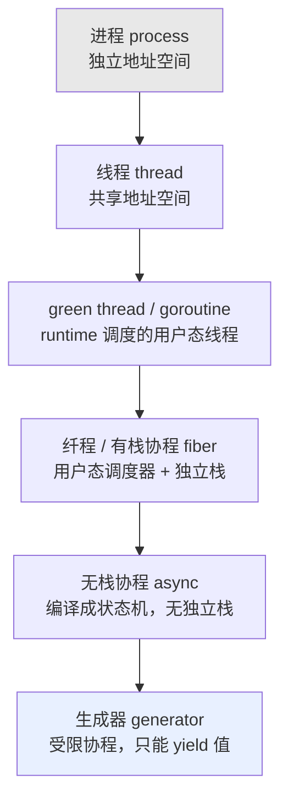
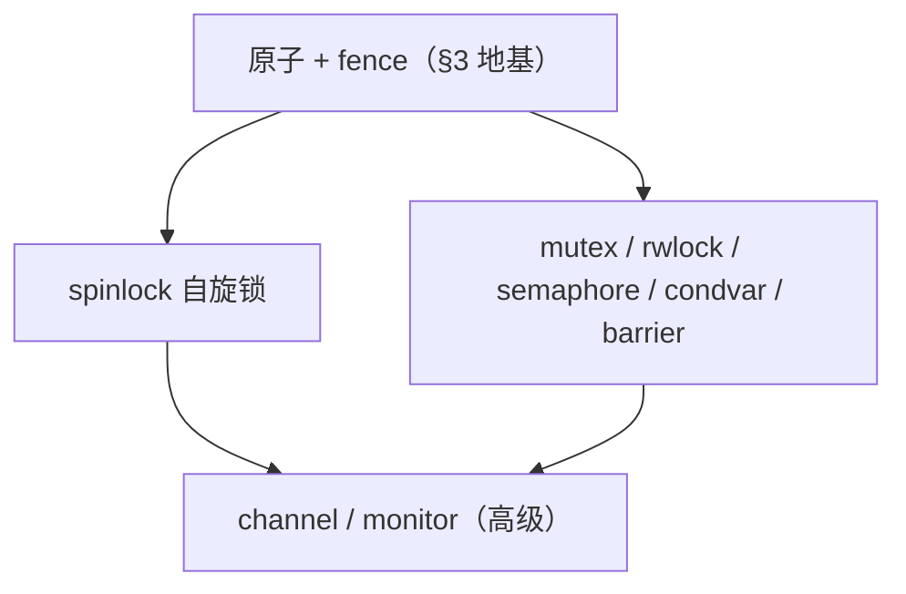

<!-- Fiber-纤程/有栈协程 Generator-生成器/受限协程 -->
<!-- Stackless Coroutine    Rust async/await、Python async、C++20 coroutines -->
<!-- Stackful Coroutine    Go goroutine、Erlang process、Lua coroutine -->

<!-- more -->

> **本篇两条主线**：**异步**——怎么让一个线程交错跑很多任务（协程 / 纤程 / 生成器 / 运行时）；**原子**——多核共享数据时怎么保证"不可分割"，以及建在其上的锁与无锁结构。以 Rust / Zig 为主轴，旁及 Go / Python / C++20 / Kotlin / JS，逐点给跨语言写法对照。

---

## 1. 四组最容易混的概念

并发的讨论，先把这四组概念分清，后续才不致混淆。

### 1.1 并发 vs 并行

- **并发（concurrency）**：一个核**轮流**跑多个任务，逻辑上"同时推进"，物理上某一刻只有一个在跑。
- **并行（parallelism）**：多个核**物理上真同时**跑多个任务。

Rob Pike 的经典区分：*Concurrency is about dealing with lots of things at once; parallelism is about doing lots of things at once.*——并发是"结构"（怎么组织多个任务），并行是"执行"（真同时跑）。协程 / async 主要解决**并发**（用极低开销交错大量 I/O 任务），不一定带来并行；要并行还得把任务摊到多个 OS 线程上（tokio 多线程运行时、Go 的 `GOMAXPROCS`、rayon）。

### 1.2 同步/异步 × 阻塞/非阻塞（四象限）

这两组维度正交，组合出四象限——很多人把"异步"和"非阻塞"混为一谈，其实是两回事：

| \ | 阻塞（调用方原地等结果）| 非阻塞（立即返回，可能没结果）|
|:--:|:--:|:--:|
| **同步**（自己主动取结果）| 普通 `read()`：调用方阻塞挂起，数据就绪后被唤醒 | `read()` + `O_NONBLOCK`：没数据立即返 `EAGAIN`，得自己轮询 |
| **异步**（结果好了来通知你）| 较少见：提交请求后仍挂起等通知 | `io_uring` / 回调 / `await`：提交后照常干别的，完成由内核 / 运行时通知 |

- **阻塞 vs 非阻塞**：调用方要不要在原地等。
- **同步 vs 异步**：结果由谁、怎么交付——同步是你主动取，异步是好了通知你（回调 / Future / 完成队列）。

### 1.3 抢占式 vs 协作式调度

切换执行流的**触发者**不同，这是理解协程的关键：

- **抢占式（preemptive）**：调度器靠**时钟中断**强行把当前任务切走，任务自己不知情。OS 线程、Go goroutine（带抢占点）属此类。好处：一个任务死循环也饿不死别人；代价：随时可能被打断，共享数据必须加锁。
- **协作式（cooperative）**：任务**自己显式让出**（`yield` / `await` / `suspend`）才切。绝大多数协程（Rust async、Python async、Lua coroutine）属此类。好处：让出点明确、单线程内无需锁；代价：一个任务不让出就卡死整个调度器。

### 1.4 贯穿全篇的核心判断

协程 / 纤程之所以比线程"轻"，根因只有一句：**切换时要保存 / 恢复的东西更少，且不进内核**。线程切换要换页表（`satp`）、刷 TLB、过特权级；协程切换只在用户态存几个寄存器（有栈），甚至什么都不存（无栈，只改状态机的当前状态）。下一节用一张谱系图说明。

---

## 2. 执行流载体全景：从进程到生成器

把"能独立推进的执行流"按**从重到轻**排成一条谱系：



越往下越轻——切换要保存的东西越少、越不碰内核：

| 载体 | 谁来切 | 切换保存什么 | 每个的栈 | 切换开销 | 典型代表 |
|:--:|:--:|:--:|:--:|:--:|:--:|
| 进程 | 内核 | 全寄存器 + 页表(`satp`) + 信号 + fd 表 | 内核栈 + 用户栈 | ~μs（特权切换 + TLB 刷新）| `fork` |
| 线程 | 内核 | 全寄存器 + 信号掩码（页表共享）| 独立栈 | ~μs（特权切换，无 TLB 刷新）| `pthread` / `std::thread` / `std.Thread` |
| green thread / goroutine | 语言 runtime | 用户态寄存器 | 动态增长栈（2–8 KB 起）| ~100 ns | Go goroutine / Java 虚拟线程 |
| 纤程 / 有栈协程 | 用户态调度器 | callee-saved 寄存器 + `SP` | 固定用户栈（需预分配）| ~10–100 ns | corosensei / may / zigcoro / Lua / Erlang |
| 无栈协程（async）| 调用方 `poll` | **无**——编译成状态机 | 无独立栈（帧在堆 / 父栈）| ~ns（函数调用级）| Rust `async` / Python `async` / C++20 / Zig 状态机 |
| 生成器（受限协程）| 调用方 `next` | **无**——状态机 | 无 | ~ns | Python `yield` / Rust Generator / JS `function*` |

> **核心洞察**：这张表从上到下，"切换"这件事从"内核换页表刷 TLB"一路退化到"改一个状态机枚举的当前值"。有栈协程的切换本质就是**用户态的上下文切换**——和 OS 切线程的机制几乎一样（存恢复 SP + 寄存器），只是发生在用户态、没有内核参与、没有页表切换。无栈协程更彻底：连栈都不切，编译器把函数拆成一段段状态，`poll` 一次推进一段。后面会把这两条路各自拆到汇编 / 源码级。

---

## 3. 原子操作与内存模型

异步讲的是"一个核怎么交错跑多个任务"；一旦任务摊到**多个核**真并行，就绕不开"共享数据怎么不打架"——这就是原子与内存模型的地盘，也是后面一切锁与无锁结构的地基。

### 3.1 为什么要"原子"

多核共享一个变量时，`x += 1` 这种看似一步的操作，机器层面其实是三步：**读 → 改 → 写**。两个核同时做，可能都读到旧值、各自加一、各自写回——结果只加了一次（丢更新）。**原子操作**就是硬件保证这组"读-改-写"不可分割：要么没发生，要么整体完成，中间不会被另一个核插进来。

不只多核——**单核多任务同样会出问题**：某任务刚执行完"改"、还没"写回"，时间片就结束、切到下一任务；后者完成了自己的"改 + 写回"，切回来时前者又把过期的旧值写回原位，同样丢了更新。因此单核环境下一种常见的原子实现就是**关中断**——在临界区结束前禁止任务切换。

> 概括地说：原子操作即硬件级的"事务"——要么整体生效、要么视作未发生，不存在中间态。

### 3.2 原子类型与操作（Rust + Zig 0.17 对照）

```rust
use std::sync::atomic::{
    AtomicUsize,  // 无符号整数        AtomicIsize,  // 有符号整数
    AtomicBool,   // 布尔值            AtomicPtr,    // 指针
    AtomicU8, AtomicU16, AtomicU32, AtomicU64,
    AtomicI8, AtomicI16, AtomicI32, AtomicI64,
    Ordering,     // 内存序（见 3.3）
};

let counter = AtomicUsize::new(0);
counter.store(42, Ordering::SeqCst);              // 存
let value = counter.load(Ordering::SeqCst);       // 取
let old = counter.swap(100, Ordering::SeqCst);    // 交换，返回旧值
let old = counter.fetch_add(1, Ordering::SeqCst); // 原子加，返回旧值
let old = counter.fetch_sub(1, Ordering::SeqCst); // 原子减，返回旧值

// 比较并交换 (CAS)：当前值 == expected 才写入 new
let res = counter.compare_exchange(
    expected,          // 期望的当前值
    new,               // 要写入的新值
    Ordering::SeqCst,  // 成功时的内存序
    Ordering::SeqCst,  // 失败时的内存序
);  // 返回 Result：Ok(旧值)=成功 / Err(当前实际值)=失败
```

Zig 0.17 对位写法（原子类型是 `std.atomic.Value(T)`）：

```zig
const std = @import("std");

var counter = std.atomic.Value(usize).init(0);
counter.store(42, .seq_cst);                  // 存
const value = counter.load(.seq_cst);         // 取
const old = counter.swap(100, .seq_cst);      // 交换，返回旧值
_ = counter.fetchAdd(1, .seq_cst);            // 原子加，返回旧值
_ = counter.fetchSub(1, .seq_cst);            // 原子减
// CAS：当前 == expected 才写 desired（示意值，不依赖前面 counter 的实际值）
const res = counter.cmpxchgStrong(expected, desired, .seq_cst, .seq_cst);  // ?usize
```

> 一处易错对照：**CAS 的返回反着来**——Rust `compare_exchange` 返回 `Result`（`Ok(旧值)`=成功）；Zig `cmpxchgStrong` 返回 `?T`（`null`=成功、非 null=当前实际值）。内存序枚举：Rust `Relaxed` = Zig **`.monotonic`**，其余 `.acquire`/`.release`/`.acq_rel`/`.seq_cst` 同名。

这套语义，各语言只是换了套写法：

| 操作 | Rust | Zig | C++ | Go |
|:--:|:--:|:--:|:--:|:--:|
| 类型 | `AtomicUsize` | `std.atomic.Value(usize)` | `std::atomic<size_t>` | `atomic.Uint64` |
| 加载 | `.load(ord)` | `.load(ord)` | `.load(ord)` | `.Load()` |
| 存储 | `.store(v, ord)` | `.store(v, ord)` | `.store(v, ord)` | `.Store(v)` |
| 原子加 | `.fetch_add(1, ord)` | `.fetchAdd(1, ord)` | `.fetch_add(1, ord)` | `.Add(1)` |
| CAS | `.compare_exchange(…)` | `.cmpxchgStrong(…)` | `.compare_exchange_strong(…)` | `.CompareAndSwap(…)` |

> Go 的原子默认即最强序（顺序一致），不开放内存序选择；Rust / Zig / C++ 均要求显式指定内存序——这正引出下一节。

### 3.3 五种内存序（memory ordering）

光"原子"还不够：编译器和 CPU 都会**重排指令**提速，多核下重排会让别的核看到"不该看到的顺序"。内存序就是你给原子操作附加的排序约束，编译器据此生成对应的**内存屏障**挡住重排。从弱到强：

```rust
// 1. Relaxed —— 只管原子，不管顺序
counter.fetch_add(1, Ordering::Relaxed);
// √ 保证：操作本身原子（不被打断、不撕裂）
// × 不保证：与其它变量的先后顺序、跨线程可见性时机
// 用：纯计数器（只要最终总数对，不关心中间顺序）

// 2. Release —— "写完才能发布"
data = 42;
ready.store(true, Ordering::Release);
// √ 保证：本线程在此 store 之前的所有写，对"用 Acquire 读到这个值"的线程可见
//        —— ready 翻 true 这一刻，data=42 一定已经写好

// 3. Acquire —— "读到才能往下看"
if ready.load(Ordering::Acquire) {
    println!("{}", data);   // 一定看到 42
}
// √ 保证：此 load 之后的读，不会被重排到 load 之前

// 4. AcqRel —— 读改写合一（给 fetch_xxx 这类 RMW 用）
let old = counter.fetch_add(1, Ordering::AcqRel);
// = 读那一半 Acquire + 写那一半 Release，原子地一起做

// 5. SeqCst —— 全局单一顺序
counter.store(42, Ordering::SeqCst);
// √ 保证：所有线程看到的所有 SeqCst 操作排成同一个全局顺序（最直觉、最安全、也最慢）
```

| Ordering | 保证 | 典型用途 | 性能 |
|:--:|:--:|:--:|:--:|
| Relaxed | 仅原子性 | 简单计数器 | 最快 |
| Release | 之前的写不重排到它之后 | 发布数据 | 快 |
| Acquire | 之后的读不重排到它之前 | 获取数据 | 快 |
| AcqRel | Release + Acquire | read-modify-write | 中 |
| SeqCst | 全局一致顺序 | 通用、最安全 | 最慢 |

各语言内存序名字几乎一一对应：**Rust `Relaxed` = C++ `relaxed` = Zig `.monotonic`**；`Acquire`/`Release`/`AcqRel`/`SeqCst` 四个 Zig/C++ 同名（Zig 写 `.acquire`/`.release`/`.acq_rel`/`.seq_cst`）。

### 3.4 Release-Acquire 必须配对

内存序的精髓是**配对**：一个线程 `Release` 写、另一个线程 `Acquire` 读**同一个原子变量**，才建立起 happens-before——发布方在 Release 之前的写，获取方在 Acquire 之后一定看得到。

```rust
// 线程1（生产者）
data = 42;                              // ① 写数据
ready.store(true, Ordering::Release);   // ② 发布：此前的写一并生效

// 线程2（消费者）
if ready.load(Ordering::Acquire) {      // ③ 获取：读到 true 后即可安全读取
    assert_eq!(data, 42);               // ④ 一定成立
}
```

Zig 0.17 同款（语义一致，只是内存序写 `.release`/`.acquire`）：

```zig
// 线程1（生产者）
data = 42;
ready.store(true, .release);          // 发布
// 线程2（消费者）
if (ready.load(.acquire)) {           // 获取
    std.debug.assert(data == 42);     // 一定成立
}
```

> 单独一个 Release 或单独一个 Acquire 没意义——必须 Release 配 Acquire（读写**同一个**原子量）才形成同步。这是无锁编程最容易出错的地方。

### 3.5 落到硬件：RISC-V A 扩展

原子操作最终要变成 CPU 指令。RISC-V 用 **A（Atomic）扩展**实现，两条路：

- **AMO（Atomic Memory Operation）**：一条指令完成读-改-写，如 `amoadd.d` / `amoswap.d` / `amoand.d` / `amoor.d`。
- **LR/SC（Load-Reserved / Store-Conditional）**：两条指令拼出任意原子操作（CAS 就靠它）。

A 扩展（后续模块化拆分）由两个子集组成：

| 子扩展 | 内容 | 指令 |
|:--:|:--:|:--:|
| **Zaamo** | 原子内存操作（AMO）| `amoswap` / `amoadd` / `amoand` / `amoor` / `amoxor` / `amomax[u]` / `amomin[u]`，各带 `.w`/`.d` 宽度 |
| **Zalrsc** | 加载保留 / 条件存储 | `lr.w` / `lr.d`、`sc.w` / `sc.d` |

`A = Zaamo + Zalrsc`。AMO 适合"定操作"（加 / 换 / 与或异或 / 取极值），一条指令完成、最快；LR/SC 灵活，能拼出 AMO 没有的任意 read-modify-write（CAS、带上限的自增、无锁链表摘点等）。

**AMO 怎么做到"原子"**——以 `amoadd.d rd, rs2, (rs1)` 为例，硬件在缓存 / 内存控制器层把"读旧值 → 运算 → 写回 → 返回旧值"锁成不可分割的一拍：

```
// amoadd.d rd, rs2, (rs1) 的硬件语义（伪码）
atomic {                          // 由 cache 一致性协议锁住该 cacheline，期间其它 hart 不能介入
    let tmp  = mem[rs1];          // 读旧值
    mem[rs1] = tmp + reg[rs2];    // 运算并写回
    reg[rd]  = tmp;               // 旧值返回 rd
}
```

实现上，持有该地址 cacheline 的核先将其置为**独占**（MESI 的 M / E 态），在独占期间完成读-改-写；其它核对该行的访问请求被一致性协议挡住，从而保证整组操作不可分割。

内存序则落成 `fence` 屏障。同一个 Rust 操作，Relaxed 与 SeqCst 编出的指令不同：

| Rust | RISC-V（Relaxed）| RISC-V（SeqCst）|
|:--:|:--:|:--:|
| load | `ld` | `fence; ld; fence` |
| store | `sd` | `fence; sd; fence` |
| fetch_add | `amoadd.d` | `fence; amoadd.d; fence` |
| swap | `amoswap.d` | `fence; amoswap.d; fence` |
| compare_exchange | `lr/sc` 循环 | `fence; lr/sc; fence` |
| fetch_and | `amoand.d` | `fence; amoand.d; fence` |
| fetch_or | `amoor.d` | `fence; amoor.d; fence` |

> 实际上 AMO 与 LR/SC 指令本身就带两个内存序 bit——`.aq`（acquire：本操作之后的访存不得前移）、`.rl`（release：本操作之前的访存不得后移）、`.aqrl`（两者皆有）。内存序直接编码在指令里，比插独立 `fence` 更省；上表"裸指令 vs 加 `fence`"是为建立直觉而做的简化对照。

**LR/SC 怎么"抢"同一个地址**——让多核安全地争抢同一内存地址（比如多个核同时改一个计数器）：

- **LR（Load-Reserved）**：先读取数据，同时令硬件**标记保留该地址**（reservation）。
- **SC（Store-Conditional）**：尝试写回——**只有这个坑没被别人动过**才写入成功；否则写失败、返回非零，软件**跳回 LR 重试**。

```asm
# CAS 的 LR/SC 实现骨架：把 *a0 从 a1(old) 换成 a2(new)
retry:
    lr.d   t0, (a0)        # 保留读：t0 = *a0，并 reserve 该地址
    bne    t0, a1, fail    # 当前值 != old → 放弃
    sc.d   t1, a2, (a0)    # 条件写：reservation 还在才写 new；t1=0 成功 / 非0 失败
    bnez   t1, retry       # 期间被其它核改动过 → 重试
fail:
```

其硬件机制是每个 hart 维护一组保留状态（reservation）：

```
// 每个 hart 一组保留寄存器
reg reservation_valid;            // 是否持有保留
reg reservation_addr;             // 保留的地址

on LR(addr):                      // lr.d rd, (addr)
    reservation_valid = 1;
    reservation_addr  = addr;     // 登记保留
    rd = mem[addr];

on SC(addr, val):                 // sc.d rd, val, (addr)
    if reservation_valid && reservation_addr == addr:
        mem[addr] = val;  rd = 0; // 成功
    else:
        rd = 1;                   // 失败
    reservation_valid = 0;        // 不论成败，保留都被清
```

令保留失效（被打破）的情形：① 另一 hart 向 `reservation_addr` 写入（cache 一致性使该行失效）；② 本 hart 又执行了别的 `SC`、或发生异常 / 中断 / 上下文切换；③ 规范还允许**虚假失败**——即便无人改动，`SC` 也可能偶发失败。正因如此，LR/SC 代码必须写成"`lr` → 运算 → `sc`，失败即跳回重试"的循环（上面骨架的 `bnez t1, retry`）。这是 RISC-V 的有意取舍：reservation 只需记一个地址、无需复杂的总线锁，硬件简单、易于多核伸缩。

**硬件内存模型**决定默认重排有多凶，也就决定要插多少 `fence`：

| 架构 | 内存模型 | 强度 |
|:--:|:--:|:--:|
| x86 / x86_64 | TSO（Total Store Order）| 强（只允许 store-load 重排）|
| ARMv8 / AArch64 | weak | 弱（多种重排）|
| RISC-V | RVWMO（RISC-V Weak Memory Ordering，2019 批准）| 弱（类 ARM）|

x86 强序，很多 Acquire/Release 几乎不用额外屏障；RISC-V / ARM 弱序，同样代码仍需显式插入 `fence`——这正是"同一份无锁代码，x86 上跑对了、搬到 ARM/RISC-V 就出错"的根因。

---

## 4. 同步原语：都建在原子之上

§3 的原子是最底层的"不可分割"；再往上，所有锁与通道，剥到底都是"**原子 + 一套等待 / 唤醒策略**"。



### 4.1 自旋锁：纯原子搭出来的最小锁

最小的锁——一个原子标志位，抢不到就空转重试。适合**极短临界区**（内核 / RTOS）；长持有则空耗 CPU。

```rust
// Rust：用 AtomicBool 手写
use std::sync::atomic::{AtomicBool, Ordering};
use std::hint::spin_loop;

let lock = AtomicBool::new(false);
while lock.swap(true, Ordering::Acquire) {   // 抢锁：换成 true；旧值若是 true，说明别人正持有
    spin_loop();                             // 提示 CPU 这是自旋（PAUSE / yield）
}
// 临界区 ...
lock.store(false, Ordering::Release);        // 放锁
```
```zig
// Zig 0.17：用 std.atomic.Value(bool) 手写
const std = @import("std");
var lock = std.atomic.Value(bool).init(false);

while (lock.swap(true, .acquire)) {          // 抢锁
    std.atomic.spinLoopHint();               // 自旋提示
}
// 临界区 ...
lock.store(false, .release);                 // 放锁
```

### 4.2 互斥锁 / 读写锁 / 信号量 / 条件变量

这些不再空转，而是抢不到就**睡**（让出 CPU）、被唤醒再跑——底层 = 原子快路径 + 慢路径 `futex`（Linux）/ 内核等待队列。

**Rust** 的这些原语由 `std::sync` 提供：`Mutex` 返回 **RAII 守卫**（离开作用域自动解锁），还带 poison（持锁线程 panic 后锁"中毒"）：

```rust
use std::sync::{Mutex, RwLock};

let m = Mutex::new(0);
{
    let mut g = m.lock().unwrap();   // 返回 MutexGuard，drop 时自动 unlock
    *g += 1;
}                                     // ← 作用域结束，自动解锁

let rw = RwLock::new(0);
let _r = rw.read().unwrap();          // 多读
// let _w = rw.write().unwrap();      // 单写
```

**Zig 0.17** 把同步原语挪进了 **`std.Io`**（`std.Io.Mutex` / `RwLock` / `Semaphore` / `Condition`），而且 `lock` / `unlock` / `wait` 都要**传入 `io`**——加锁这件事被接进了新的 Io 并发模型：

```zig
// Zig 0.17：std.Io.Mutex —— lock/unlock 带 io 参数，且可被取消（Cancelable）
var m: std.Io.Mutex = .init;
try m.lock(io);          // 抢锁（io 决定怎么等：自旋 / futex 挂起 / 异步让出）
defer m.unlock(io);      // 手动解锁，由 defer 保证
// 临界区 ...

var cond: std.Io.Condition = .init;
try cond.wait(io, &m);   // 条件变量：原子地"解锁 + 睡；醒来再上锁"，wait 同时要 io 和它守护的 mutex
```

> 一眼对照：**Rust 的锁是 RAII**（守卫 drop 自动解锁、无 io 参数）；**Zig 0.17 的锁手动 `unlock`（靠 `defer` 配合）、且 `lock(io)` 把 io 注入进来**——后者是 Zig"无隐藏 + 显式注入调度器"哲学的延续：连"等锁"都不会隐式阻塞线程，而是交给 `io` 决定怎么等（这和后面 §5 的"函数染色 / io 注入"是同一套思路）。注意这套 `std.Io` 同步原语仍随 Io 模型重构，API 可能继续变。

跨语言一览：

| 原语 | 干什么 | Rust | Zig 0.17 | C++ | Go |
|:--:|:--:|:--:|:--:|:--:|:--:|
| 自旋锁 | 忙等短临界区 | 手写 atomic / `spin` crate | 手写 `atomic`+`spinLoopHint` | `atomic_flag` 手写 | 手写 atomic |
| 互斥锁 | 睡等独占 | `Mutex`（RAII）| `std.Io.Mutex`（`lock(io)`）| `std::mutex` | `sync.Mutex` |
| 读写锁 | 多读单写 | `RwLock` | `std.Io.RwLock` | `std::shared_mutex` | `sync.RWMutex` |
| 信号量 | 计数许可 | std 无（用 tokio / 三方）| `std.Io.Semaphore` | `std::counting_semaphore` | 缓冲 channel 模拟 |
| 条件变量 | 等待-通知 | `Condvar` | `std.Io.Condition`（`wait(io,&m)`）| `std::condition_variable` | `sync.Cond` |
| 一次性初始化 | 只跑一次 | `OnceLock` / `Once` | `std.once` | `std::call_once` | `sync.Once` |
| 屏障 | 所有线程到齐 | `Barrier` | 手写 atomic | `std::barrier` | `sync.WaitGroup` |

### 4.3 共享内存 vs 消息传递

并发协作有两条哲学路线：

- **共享内存 + 锁**：大家围着同一块数据，靠锁保护（传统、灵活、易错）。
- **消息传递 + channel**：谁也不碰谁的内存，值通过管道传（Go / Erlang / Rust mpsc）。

> Go 的名言：*Don't communicate by sharing memory; share memory by communicating.*——别用共享内存来通信，要用通信来共享内存。

```rust
// Rust：std::sync::mpsc（多生产者单消费者）
use std::sync::mpsc;
let (tx, rx) = mpsc::channel();
std::thread::spawn(move || { tx.send(42).unwrap(); });
println!("{}", rx.recv().unwrap());   // 42
```
```go
// Go：channel + goroutine（语言内建）
ch := make(chan int)
go func() { ch <- 42 }()
fmt.Println(<-ch)   // 42
```

Zig 没有内建 channel——要么手写基于原子的无锁队列（下一节），要么用社区库。

### 4.4 无锁数据结构（lock-free）

锁之外的另一条路：不加锁，靠原子 CAS 让"至少一个线程总能往前走"。入门经典是 **SPSC（单生产者单消费者）无锁环形队列**——head / tail 两个原子下标，生产者只动 tail、消费者只动 head，靠 acquire/release 配对保证可见性，全程无锁：

```zig
// Zig：SPSC 无锁环形队列（节选）
fn SpscQueue(comptime T: type, comptime CAP: usize) type {
    return struct {
        buf: [CAP]T = undefined,
        head: std.atomic.Value(usize) = std.atomic.Value(usize).init(0),
        tail: std.atomic.Value(usize) = std.atomic.Value(usize).init(0),

        pub fn push(self: *@This(), v: T) bool {
            const t = self.tail.load(.monotonic);
            const next = (t + 1) % CAP;
            if (next == self.head.load(.acquire)) return false; // 满
            self.buf[t] = v;
            self.tail.store(next, .release);                    // release 发布
            return true;
        }
        pub fn pop(self: *@This()) ?T {
            const h = self.head.load(.monotonic);
            if (h == self.tail.load(.acquire)) return null;     // 空
            const v = self.buf[h];
            self.head.store((h + 1) % CAP, .release);
            return v;
        }
    };
}
```

> 强度分层：**wait-free**（每个操作有界步内完成）> **lock-free**（至少一个线程有进展）> **obstruction-free**。工业经典：Michael-Scott 队列、Treiber 栈、Linux 的 **RCU**（读多写少、读侧零开销）。无锁最难的不是写，而是**内存回收**——别的线程可能还在读你想 `free` 的节点，要靠 hazard pointer / epoch GC 处理。

### 4.5 Rust 的独到设计：Send / Sync（把线程安全钉死在编译期）

前面所有原语，C / C++ / Zig / Go 都靠**程序员自律 + 运行时工具**（ThreadSanitizer、Go race detector）抓数据竞争；Rust 把它提前到了**编译期**：

- **`Send`**：类型 `T` 可以**跨线程移动**（所有权转移到别的线程）。
- **`Sync`**：`&T` 可以**跨线程共享**（多个线程同时持引用）。

```rust
use std::rc::Rc;
use std::sync::Arc;

// Rc 是非原子引用计数 → 不是 Send；下面这行编译就报错：
// std::thread::spawn(move || { let _x = Rc::new(1); });
//   error: `Rc<i32>` cannot be sent between threads safely

// Arc 是原子引用计数 → 是 Send，可以跨线程：
std::thread::spawn(move || { let _x = Arc::new(1); });   // OK
```

> 把一个线程不安全的类型塞进 `thread::spawn`，编译期就会被拒绝。这把"会不会数据竞争"从**运行时崩溃**提前到**编译期报错**，是 Rust"无数据竞争"承诺的根。代价是类型系统更重；Zig / C / Go 把这份责任留给你和工具。

---

## 5. 函数染色：异步为什么"传染"

讲完原子 / 同步（多核共享的地基），转入异步主线。绕不开的第一个概念是**函数染色（function coloring）**。

### 5.1 什么是函数染色

Bob Nystrom 2015《What Color is Your Function?》：一门语言引入 `async`/`await` 后，函数被隐式分成两色——**普通函数（红）** 和 **async 函数（蓝）**。规则：蓝函数只能被蓝函数 `await`，红函数调不了蓝函数。于是**只要调用链最底层有一个 async，整条链都得染成 async**：

```python
# Python：染色传染
async def fetch():       ...    # 蓝
async def process():            # 被迫也蓝
    data = await fetch()
async def main():               # 一路蓝到顶
    await process()
# 普通同步函数无法直接调 fetch()，得 asyncio.run() 起一个事件循环
```

同样的传染在 Rust / JS(ES6) / C# / Kotlin 都有：底层一个 `async fn`，上面全得 `async`。

### 5.2 各语言对染色的态度

| 语言 | 异步方案 | 染色？ |
|:--:|:--:|:--:|
| Python / JS(ES6) / Rust / C# / C++20 | `async`/`await` 关键字 | **有**，传染整条链 |
| Kotlin | `suspend` 函数 + 协程 | **有**（`suspend` 即颜色），编译器隐式传 Continuation |
| Go | goroutine + 阻塞自动挂起 | **无**——任何函数都能在 goroutine 里阻塞 |
| Java 虚拟线程（Loom, JDK 21）| 阻塞调用自动挂起 | **无** |
| Erlang | 进程 + 消息 | **无** |
| 老 Zig（stage1 时代）| `async fn` 关键字 | **有**（同 Rust）|
| 新 Zig（self-hosted 后）| 移除内建 async + `io` 参数注入 | **设计上无** |

### 5.3 消除染色的两条路

**路一 · 绿色线程 / 虚拟线程**（Go / Java Loom / Erlang）：函数不分色，遇到阻塞调用，**运行时自动把当前任务挂起**、切去跑别的。代价：需要一个**有栈**的运行时（每任务一个可增长栈），运行时较重。这正是 §2 里"green thread / goroutine"那一档——**无染色 = 用有栈协程 + runtime 自动调度换来的**。

**路二 · Zig 的 `io` 注入**（0.15+）：把"是否异步"从函数类型里挪出来，改成一个普通参数 `io`：

```zig
// 普通函数，只是多收一个 io 参数；同步还是异步由传进来的 io 决定
fn fetch(io: std.Io, url: []const u8) ![]u8 {
    return io.http.get(url);   // 单线程 io → 顺序；线程池 / 事件循环 io → 并发
}
```

函数本身中性、不染色——但**调用链仍要一路把 `io` 传下去**。还记得 §4.2 的 `std.Io.Mutex.lock(io)` 吗？连加锁都收 `io`，正是这套思路的延续。

> 进一步看：Zig 这招**没有真正消灭染色，只是把它从"类型传染"换成"参数传染"、把决定权推迟到调用方**——决定用哪种 `io` 后端的那一刻，颜色就定了。区别在于：`io` 是普通参数、函数类型不变，所以不需要异步的中间函数可以不收 `io`、可运行时换后端，比"编译期钉死在类型上"灵活。

### 5.4 Rust 为何接受染色的代价

Rust 偏偏选了**有染色**的 `async`/`await` + `Future`，因为它要**零成本 + 不强制运行时**：async 编译成状态机（见 §6 无栈那半），不需要 Go 那样每任务一个有栈协程 + 重运行时，能跑在 `#![no_std]` 裸机上（embassy）。染色是 Rust 为"零成本异步"付的代价——配合 §4.5 的 `Send`/`Sync`，构成 Rust"显式、可控、但啰嗦"的并发风格。

---

## 6. 协程深挖：有栈（纤程）vs 无栈（async）

§2 把协程分了"有栈 / 无栈"两档。这不是风格差异，而是**实现机制的根本分叉**——决定了切换开销、能在哪挂起、要不要染色。

### 6.1 核心区分

- **有栈协程 / 纤程（stackful）**：每个协程有**自己的独立栈**。切换 = 保存当前 SP + callee-saved 寄存器、恢复另一个的——和 OS 切线程几乎一样，只是在用户态、不换页表。能在**调用链任意深度**直接 `yield`（整个栈都保住了）。代表：Go goroutine、Erlang 进程、Lua coroutine、Rust corosensei / may、Zig zigcoro / zap。
- **无栈协程（stackless）**：**没有独立栈**。编译器把 async 函数拆成一个**状态机**，局部变量塞进一个"帧"结构体，`poll` 一次推进一段。只能在**显式标记点**（`await`）挂起。代表：Rust async/await、Python async、C++20 coroutine、JS async、Zig 状态机。

### 6.2 有栈协程的上下文切换（RISC-V 汇编）

有栈切换需保存 **callee-saved 寄存器（`sp` 与 `s0–s11`）外加返回地址 `ra`**：

```asm
# RISC-V：context_switch(old: *Context, new: *Context)
# 需换出 = sp + s0–s11（callee-saved，13 个）+ ra（恢复点），共 14 个 = 112 字节；布局同 §9.1 的 TaskContext
context_switch:
    sd sp,   0*8(a0)      # 存当前：栈指针
    sd ra,   1*8(a0)      # 返回地址(=恢复时的 PC)
    sd s0,   2*8(a0)
    # ... s1–s11 ...
    sd s11, 13*8(a0)

    ld sp,   0*8(a1)      # 恢复下一个：sp
    ld ra,   1*8(a1)      # ra
    ld s0,   2*8(a1)
    # ... s1–s11 ...
    ld s11, 13*8(a1)
    ret                   # 跳到新协程上次 yield 时存的 ra
```

> 对比进程 / 线程切换：有栈协程切换要保存 / 恢复的寄存器量，其实不大（callee-saved 那批加 ra）——**省的不是保存量，而是省掉了切页表与刷缓存**。进程 / 线程切换还要换 `satp`（页表基址）、执行 `sfence.vma` 刷 TLB、过特权级；有栈协程在**同一进程 / 线程内**，地址空间不变，无需切页表、无需刷 TLB 与各级 cache——这才是它快一两个数量级的根因。有栈协程的本质，就是"用户态自己做的一次上下文切换"。无栈协程则更彻底：状态全由自身字段保存，切换**连上下文的保存 / 重载都省了**，改一个变量（状态机的当前值）即完成。

Rust 的 corosensei / may、Zig 的 zigcoro / zap，底层都是这套平台汇编（x86-64 / aarch64 / RISC-V 各一份）的封装：

```rust
// Rust：corosensei（有栈协程）
let mut co = Coroutine::new(|yielder, input: i32| {
    let x = yielder.suspend(input * 2);   // 暂停，把 input*2 交给调用方；恢复时拿到新输入
    x + 1
});
co.resume(10);   // → Yield(20)
co.resume(99);   // → Return(100)
```
```zig
// Zig：zigcoro（有栈协程，底层汇编 context_switch）
var frame = try coro.Coro.init(worker, stack);
coro.xresume(frame);   // 切入 worker，跑到 xsuspend 返回
coro.xresume(frame);   // 继续到结束
fn worker() void {
    coro.xsuspend();   // 让出（context_switch 回到调用方）
}
```

> `may`（Rust）/ `zap`（Zig，kprotty 的实验性调度器，已停更）更进一层：在上面套了 **M:N 调度器**（多个 OS 线程跑多个有栈协程，work-stealing），API 像 Go 的 `go`/`spawn`——这就是"goroutine 风格"的库实现。

### 6.3 无栈协程：状态机 + poll

无栈不切栈——编译器把 async 函数翻译成一个**状态机**，每个 `await` 点是一个状态。Rust 的核心抽象是 `Future`：

```rust
pub trait Future {
    type Output;
    fn poll(self: Pin<&mut Self>, cx: &mut Context<'_>) -> Poll<Self::Output>;
}
pub enum Poll<T> { Ready(T), Pending }   // 对应有栈的 return / yield
```

`async fn` 编译后大致等价于一个状态机：

```rust
// async fn f() { let a = step1().await; step2(a).await; }
// ≈ 编译成：
enum F { Start, AwaitStep1(Step1Fut), AwaitStep2(Step2Fut), Done }
// 每次 poll 按当前状态推进一段；遇到内层返回 Pending 就也返回 Pending，等下次再被 poll
```

跨 `await` 存活的局部变量被搬进这个帧里——所以无栈协程"没有独立栈"，帧放堆上或父任务栈上。（`Future::poll` 的 `self: Pin<&mut Self>` 正因如此：帧可能自引用，`Pin` 钉住其地址、禁止移动——这是 Rust async 最著名的一道坎。）Zig 没有内建 async 语法（self-hosted 编译器起已移除），无栈就靠**手工状态机**或 0.17 落地中的 `io.async`；Python / JS / C++20 各有 `async`/`await` 语法糖，编译 / 解释器同样生成状态机。

### 6.4 全维度对比 + 跨语言归属

| 维度 | 有栈协程 / 纤程 | 无栈协程 / async |
|:--:|:--:|:--:|
| 独立栈 | 有（预分配 / 可增长）| 无（帧在堆 / 父栈）|
| 切换保存 | SP + callee-saved 寄存器 | 无——只改状态机当前值 |
| 切换开销 | ~10–100 ns | ~ns（函数调用级）|
| 能在哪挂起 | 调用链**任意深度**直接 yield | 只能在 `await` 标记点 |
| 染色 | **无**（普通函数即可 yield）| **有**（async 传染）|
| 栈溢出 | 要手动设栈大小 | 不存在（无栈）|
| 调试回溯 | 栈回溯正常 | 状态机，回溯可能割裂 |
| 每任务内存 | 一个栈（KB 级）| 一个帧（按需，字节级）|

| | 有栈 | 无栈 |
|:--:|:--:|:--:|
| 语言内建 | Go goroutine · Erlang 进程 · Lua coroutine | Rust · Python · C++20 · JS(ES6) · Kotlin(`suspend`) |
| 库 | Rust corosensei / may · Zig zigcoro / zap | Rust futures · Zig 手工状态机 / libxev |

> 总纲：**有栈用空间（每协程一个栈）换"任意处可挂起 + 无染色"；无栈用"染色 + 只能定点挂起"换极致省内存 + 零运行时**。Go 选有栈（开发省心、运行时重）；Rust 选无栈（零成本、能上裸机，但有染色、写法更繁）。

---

## 7. 异步运行时（执行器）

无栈 async 只是**语法 / 状态机**，本身不会跑——必须有个**运行时（执行器）**反复 `poll` 它、在 I/O 就绪时唤醒。这一层是 Rust async 生态最厚的地方。

### 7.1 为什么 async 需要运行时

`async fn` 返回的 `Future` 是个"还没跑的状态机"。谁来 `poll`？运行时。它干三件事：① 拿顶层 Future 循环 `poll`；② Future 返回 `Pending` 就挂起它、记下"它在等什么"；③ I/O / 定时器就绪时通过 **`Waker`** 唤醒对应 Future，再 `poll`。

```rust
let fut = async { 42 };        // 只是造了个 Future，什么也没发生
let v = smol::block_on(fut);   // 必须交给运行时；block_on 在当前线程把它跑到完成
```

Rust **不自带运行时**（std 只给 `Future` trait），这是"零成本 + 不强制运行时"的代价——你得自己选 tokio / smol / …。Go / Python / JS 则**内建运行时**（goroutine 调度器 / asyncio 事件循环 / 浏览器事件循环），开箱即用。

### 7.2 就绪式 vs 完成式 I/O

运行时怎么向内核要 I/O，分两大流派：

- **就绪式（readiness，epoll / kqueue）**：内核说"fd 可读了"→ 你再 `read()` → 内核把数据**从内核缓冲拷到你的 buf**。tokio 走这条。
- **完成式（completion，io_uring / IOCP）**：你**提交 read 请求 + buf** → 内核异步执行 → 完成时通知你"buf 已填好"（少一次拷贝）。monoio 走这条。

完成式代价是**所有权模型不同**：buf 在内核处理期间不能碰，得交出所有权：

```rust
file.read(&mut buf).await?;                    // tokio（就绪式）：&mut buf 借用即可
let (res, buf) = file.read_exact(buf).await;   // monoio（完成式）：buf 移进去、完成后移回来
```

> monoio 源码里这套所有权的真实长相：`fn read<T: IoBufMut>(&mut self, buf: T) -> impl Future<Output = BufResult<usize, T>>`（`BufResult<T, B> = (io::Result<T>, B)`）——buffer 按值 move 进函数，飞行期间由内部 `Op` 结构体在堆上持有（连同对 `SharedFd` 的强引用，防止 fd 在传输途中被关闭），io_uring 完成后连同结果一并还回。

### 7.3 Rust 运行时横向

| 运行时 | 线程模型 | I/O 后端 | 适合 |
|:--:|:--:|:--:|:--:|
| **tokio** | 多线程 work-stealing | epoll / kqueue / IOCP | 服务端通用，生态最大 |
| **monoio** | 单线程 | io_uring（Linux）| 极低延迟、零拷贝 |
| **async-std** | 多线程 | 同 tokio | API 镜像 std，迁移友好 |
| **smol** | 多线程 | async-io（poll/epoll）| ~1500 行，最适合读源码学原理 |

```rust
// tokio：spawn(类 goroutine) + join!(并发等) + select!(等第一个) + mpsc channel
#[tokio::main]
async fn main() {
    let h1 = tokio::spawn(async { 1u32 });
    let h2 = tokio::spawn(async { 2u32 });
    let (a, b) = tokio::join!(h1, h2);          // join!：并发等多个
    let _ = (a, b);
    tokio::select! {                            // select!：等最先完成的那个
        v = async { 42u32 } => { let _ = v; }
        _ = tokio::time::sleep(std::time::Duration::from_millis(10)) => {}
    }
}
```
```rust
// smol：最小执行器，吃透它就懂"执行器怎么驱动 Future"
fn main() {
    smol::block_on(async {
        let h = smol::spawn(async { 42u32 });
        assert_eq!(h.await, 42);
    });
}
```

### 7.4 Zig 的并发：没有"运行时生态"，只有 io 后端

Zig 没有 tokio 那样的第三方运行时生态，并发由 **`std.Io` 后端** + 几条路拼出来：

| 路 | 适用 | 代表 |
|:--:|:--:|:--:|
| 手工状态机 | 裸机 / no_std，永远有效 | §6.3 风格 |
| `std.Thread` | 有 OS、CPU 密集 | 线程 + §4 锁 |
| `libxev` 事件循环 | 高并发 I/O，回调式 | mitchellh/libxev |
| `io.async` / `io.await` | 0.17 落地中的官方协程 | `std.Io` |

```zig
// libxev：跨平台事件循环（Linux=io_uring / macOS=kqueue / Windows=IOCP），回调式无栈异步
var loop = try xev.Loop.init(.{});
defer loop.deinit();
var timer = try xev.Timer.init();
timer.run(&loop, &c, 1000, T, &ud, callback);   // 1000ms 后触发 callback
try loop.run(.until_done);
```

> Zig 的并发单位是 **Completion 回调**，不是帧 / 栈——本质是工程化的回调式事件驱动，适合高并发 I/O，但书写体验不如 Rust 的 `async`/`await`。0.17 的 `io.async` 意在补足这一环，仍在落地中。

### 7.5 嵌入式：embassy（Rust async-on-bare-metal）

`embassy` 把 Rust async/await 搬上**裸机 MCU**（`#![no_std]`、无 OS）：一个极小执行器跑 Future，靠中断当 Waker 唤醒任务——**无栈协程不需要每任务一个栈，恰好契合 KB 级 RAM 的 MCU**。这正是无栈路线相对有栈（Go 风格每任务一栈）在嵌入式的关键优势：同样的并发，async 内存占用小一个数量级。

---

## 8. 生成器：受限的协程

生成器（generator）是协程的"受限版"——只能**单向把值 yield 给调用方**，不能任意挂起去等别的任务。本质还是个**无栈状态机**（每个 `yield` 是一个状态），归在协程家族里，但更窄：只解决"惰性产出一串值"。

### 8.1 其他语言一瞥（仅示例用法）

```python
# Python：yield 即生成器
def fib():
    a, b = 0, 1
    while True:
        yield a
        a, b = b, a + b
```
```javascript
// JS(ES6)：function* + yield
function* fib() {
    let [a, b] = [0, 1];
    while (true) { yield a; [a, b] = [b, a + b]; }
}
```

C# 的 `yield return`、Kotlin 的 `sequence { yield(x) }` 同理——都是"形如普通循环、实则惰性产出"的语法糖。

### 8.2 Rust：从 nightly Generator 到 stable genawaiter

Rust 的真·生成器（`Coroutine` trait + `yield`）还在 nightly：

```rust
#![feature(coroutines, coroutine_trait)]
let mut g = #[coroutine] || { yield 1; yield 2; yield 3; };
// Pin::new(&mut g).resume(()) → Yielded(1) → Yielded(2) → ...
```

stable 上用 **genawaiter**——它没有真生成器，而是**借 async/await 模拟**：把 async 块当协程体，靠一个共享单元 `Airlock` 在"生成端"和"驱动端"之间传值。看它的真实源码：

```rust
// genawaiter/src/rc/engine.rs：Airlock = 一个共享的 Cell
pub struct Airlock<Y, R>(Rc<Cell<Next<Y, R>>>);   // Next: Empty / Yield(Y) / Resume(R) / Completed

// genawaiter/src/core.rs：yield_ 不真返回值，而是往 airlock 塞 Yield，再交出一个 Barrier future
pub fn yield_(&mut self, value: A::Yield) -> impl Future<Output = A::Resume> + '_ {
    self.airlock.replace(Next::Yield(value));
    Barrier { airlock: &self.airlock }
}
```

> 其机制是：`yield_` 把值写入 `Rc<Cell<Next>>`、返回一个"挂起一次"的 `Barrier`；驱动方 `poll` 这个 async 块，执行到 `yield_` 即暂停、从 airlock 取出值——**借无栈 async 的"暂停"能力，实现了生成器的"产出一个值"**。这是"语言未提供 X，便以 Y 组合实现"的一种做法。

惰性产出还有 **itertools**——迭代器的工具集合，纯 pull 式惰性求值，思想和生成器一致：

```rust
use itertools::Itertools;
let w: Vec<_> = (1..=5).tuple_windows::<(_, _)>().collect();   // [(1,2),(2,3),(3,4),(4,5)]
for chunk in &(0..100).chunks(10) { let _s: i32 = chunk.sum(); }  // 惰性分组
```

### 8.3 Zig：没有内建生成器，用手工状态机 next()

Zig 没有 `yield` 语法，生成器就是一个带 `next()` 的 struct——状态全在字段里，每次 `next` 推进一步：

```zig
const FibGen = struct {
    a: u64 = 0,
    b: u64 = 1,
    pub fn next(self: *FibGen) u64 {
        const r = self.a;
        const nb = self.a + self.b;
        self.a = self.b;
        self.b = nb;
        return r;
    }
};
var fib = FibGen{};
for (0..10) |_| std.debug.print("{d} ", .{fib.next()});   // 0 1 1 2 3 5 8 13 21 34
```

> 这其实就是 §6.3 无栈协程"状态机"的最朴素形态——Zig 把它留给你手写，而不给 `yield` 关键字。比起 Python 的 `yield`，Zig 更啰嗦但**所见即所得**（状态就是那几个字段，无编译器隐藏的处理）。

### 8.4 生成器 / 迭代器 / 协程的关系

| | 方向 | 能力 |
|:--:|:--:|:--:|
| 迭代器 Iterator | 拉（调用方 `next` 取）| 只产出值 |
| 生成器 Generator | 推（`yield` 主动产出）| 产出值（受限协程）|
| 协程 Coroutine | 双向（`yield` 送出 + `resume` 送入）| 产出 + 接收，可对称协作 |

Rust 的 `Iterator` trait 是 pull 式；生成器是"写迭代器的语法糖"（手写 `Iterator::next` 很烦，`yield` 让你像写循环一样写）；完整协程（§6 有栈那种）还能双向传值（corosensei 的 `suspend(x)` 返回 resume 时的输入）。三者一脉相承、能力递增。

---

## 9. 实验：oscamp 对照验证 + 代码走读

前 8 节的概念，在 `oscamp-base-experiment` 仓里都有对应练习。三组练习正好把本篇内容落到三个实验：

| 练习 | 对应本篇 | 验证什么 |
|:--:|:--:|:--:|
| `01_concurrency_sync` | §3 / §4 | 线程 / `Arc<Mutex>` / mpsc / 进程管道 |
| `04_context_switch` | §6 有栈协程 | 真·RISC-V 上下文切换 + 绿色线程调度器 |
| `05_async_programming` | §6.3 / §7 | 手写 Future / poll / Waker + tokio |

### 9.1 上下文切换：真·RISC-V naked 汇编（对应 §6.2）

§6.2 讲的有栈切换，这里是能跑的真版 `switch_context`（即 §6.2 那个 `context_switch`，riscv64 only）。`TaskContext` 用 `#[repr(C)]` 锁死布局，汇编偏移与字段严格对应：

```rust
#[repr(C)]                         // sp@0  ra@8  s0..s11@16..104
pub struct TaskContext { pub sp: u64, pub ra: u64, pub s0: u64, /* … */ pub s11: u64 }

impl TaskContext {
    pub fn init(&mut self, stack_top: usize, entry: usize) {
        self.sp = (stack_top & !0xF) as u64;   // 16 字节对齐（RISC-V ABI 要求）
        self.ra = entry as u64;                // 首次 ret 就跳到 entry
    }
}

#[unsafe(naked)]                    // naked：禁止编译器加 prologue / epilogue
pub unsafe extern "C" fn switch_context(old: &mut TaskContext, new: &TaskContext) {
    std::arch::naked_asm!(
        "sd sp, 0(a0)", "sd ra, 8(a0)", "sd s0, 16(a0)", /* … s1..s11 … */ "sd s11, 104(a0)",
        "ld sp, 0(a1)", "ld ra, 8(a1)", "ld s0, 16(a1)", /* … s1..s11 … */ "ld s11, 104(a1)",
        "mv a0, zero",  "mv a1, zero",   // 清掉指针参数，不泄漏进新上下文
        "ret",                           // 跳到 new.ra
    )
}
```

> 印证 §6.2 那句"有栈协程 = 用户态自己做的一次上下文切换"：换出 13 个 callee-saved（`sp`/`s0–s11`）外加作为恢复点的 `ra`（共 14 个）、`ret` 跳走，没有 `satp`、没有 `sfence.vma`。`init` 把 `ra` 设成入口——**第一次切到这个任务时，那条 `ret` 直接跳进任务函数**——这就是协程首次启动的关键。在它之上加一层 Ready/Running/Finished 状态 + 一个调度循环，就是 `02_green_threads` 的协作式绿色线程。

### 9.2 手写 Future：异步运行时的最小内核（对应 §6.3 / §7.1）

§7.1 说"Future 不自己跑，要运行时反复 poll + Waker 唤醒"。这个练习把它剥到最小——手写一个 `Future`：

```rust
use std::future::Future;
use std::pin::Pin;
use std::task::{Context, Poll};

pub struct CountDown { pub count: u32 }

impl Future for CountDown {
    type Output = &'static str;
    fn poll(mut self: Pin<&mut Self>, cx: &mut Context<'_>) -> Poll<Self::Output> {
        if self.count == 0 {
            Poll::Ready("liftoff!")            // 完成
        } else {
            self.count -= 1;
            cx.waker().wake_by_ref();          // 关键：告诉运行时"我还没好，请再 poll 我"
            Poll::Pending                      // 未完成
        }
    }
}
```

> 这就是 §6.3 状态机的实例：`count` 是状态，每次 `poll` 推进一步。`Poll::Pending` 对应有栈协程的 `yield`、`Poll::Ready` 对应 `return`。最关键的是 `cx.waker().wake_by_ref()`——**没有它，运行时 poll 一次拿到 Pending 就将任务挂起、不再轮询**；调用 wake 后，运行时才知道"该任务可再次 poll"。Waker 正是 §7.1 中"I/O 就绪时唤醒任务"的那一机制。最小的"挂起一次"版是 `YieldOnce`：首次 poll 置标志 + wake + Pending，二次 poll 直接 Ready。

### 9.3 原子 / 锁 / channel / 进程（对应 §3 / §4）

`01_concurrency_sync` 把 §3 / §4 的同步原语全跑一遍：

```rust
// Arc<Mutex> + thread::scope（作用域线程，借栈数据无需 move）
let res = Arc::new(Mutex::new(0));
thread::scope(|s| {
    for _ in 0..n {
        let r = Arc::clone(&res);
        s.spawn(move || { *r.lock().unwrap() += step; });   // 锁守卫，离开块自动解锁
    }
});                                                          // scope 结束 = 所有线程 join
```

进程那一题揭示了"用户态 API = 底层 syscall"：`Command::new` 内部就是 `fork()+execve()`、`Stdio::piped()` = `pipe()+dup2()`、`drop(stdin)` = `close()` 写端给子进程发 EOF——**高层 API 都是对 syscall 的包装**。

### 9.4 思考题（附参考答案）

**Q1. 有栈协程的 `switch_context` 只换出 14 个寄存器，为什么不用存 `a0`–`a7`、`t0`–`t6`？**
> 因为 `switch_context` 是个**普通函数调用**：按 RISC-V ABI，caller-saved 寄存器（`a*`/`t*`）的保存责任在**调用方**——调用前编译器已把还需用的 caller-saved 值压栈。切换只需随上下文换出 **callee-saved（`sp` 与 `s0–s11`，共 13 个）**，再加上 **`ra`**——注意 `ra` 按 ABI 其实是 caller-saved，这里单独换出是因为它充当协程的**恢复地址**（首次 `ret` 即跳入入口），与"是否 callee-saved"无关。其余 caller-saved 寄存器交给正常的函数调用约定。这也是有栈切换轻的原因之一。

**Q2. `CountDown` 每次 poll 都调 `wake_by_ref()`；删掉这行会怎样？**
> 任务**永远卡住**。运行时逻辑是"poll 拿到 Pending → 挂起，等 Waker 通知再 poll"。不调 wake，就没人通知"可以再 poll 了"，任务再也不被推进。真实场景里 wake 由 I/O 就绪 / 定时器到点触发；这个练习里 count 没到 0 就自我 wake，相当于"立刻安排下一次 poll"（忙轮询）。

**Q3. 同一段无锁 SPSC 队列（§4.4），x86 上用 `Relaxed` 跑对了，搬到 RISC-V 就出错——为什么？**
> x86 是 TSO 强模型，几乎不重排（只允许 store-load），`Relaxed` 碰巧不暴露问题；RISC-V 是 RVWMO 弱模型，读写可大幅重排，head/tail 与 buf 之间若不用 acquire/release 配对，消费者可能"看到 tail 更新了、但 buf 数据还没写进来"。**正确性要靠内存序、而非依赖运气**——§3.4 的 acquire/release 配对、§3.5 的弱内存模型，讲的都是这个道理。

**Q4. Zig 0.17 的 `std.Io.Mutex.lock(io)` 要传 `io`，Rust 的 `Mutex::lock()` 不用——本质差异是什么？**
> 本质是两种并发哲学（§5 染色）。Rust 的锁阻塞的是 **OS 线程**（陷入内核 futex 睡眠），锁本身不关心运行时。Zig 0.17 把"等锁"接进了 `io`：传哪种 `io`，就决定等锁时是自旋、是 futex 挂起线程、还是**让出当前异步任务**——锁与调度器解耦、由调用方注入。代价是 `io` 一路传下去（参数传染），好处是同一把锁能适配线程 / 协程 / 异步多种后端。

---

## 10. 其他相关补充：把异步推进到内核与硬件

前面的异步都在**用户态**（协程、运行时、生成器）。本地资源里还有一批，把"异步"这套思路推进到**内核结构**乃至**硬件中断**——这是异步的前沿，也是本篇标题里"其他相关补充"所指。

### 10.1 异步内核：把 future / 协程搬进内核

长期以来，Linux 等主流内核仍是同步线程模型，异步只存在于用户态。近年的研究尝试把 future / 协程作为**内核自身的执行单位**，按"异步如何进入内核"可分四派：

| 流派 | 代表 | 异步如何进入内核 |
|:--:|:--:|:--:|
| 异步 I/O 接口 | Linux io_uring | 用户态 ring buffer + 内核 worker；内核本体仍是同步线程 |
| async fn syscall | NoAxiomOS | syscall handler 写成 `async fn`，编译期生成 future |
| 共享调度器外置 | TornadoOS | 调度器单独编译成裸机库、固定物理地址、跨地址空间共享 raw table |
| 运行时可选 | arceos | runtime 是编译期 feature，由上层决定是否启用异步 |

以 TornadoOS 为例：它把调度器编译成独立的 `shared-scheduler.bin`、加载到固定物理地址，通过一张 `SHARED_RAW_TABLE`（若干函数指针 + 调度器静态变量地址）让内核态与用户态**共享同一个协程调度器**——future 在内核或用户态注册后，跨地址空间统一调度。这是把 §6 / §7 的"无栈 Future + 执行器"模型从用户态上移到内核的一次尝试。

### 10.2 用户态中断：让异步通知绕过内核

异步的另一半是"完成时如何通知"。传统通知（信号 / epoll 唤醒）都要陷入内核。**用户态中断**（RISC-V N 扩展 / Intel uintr）允许一个用户态任务**直接向另一个用户态任务发中断**，全程不经内核——uintr（ISA 扩展）、TAIC（任务感知中断控制器硬件）即此方向；rCore-N 则把调度器做成 vDSO（用户态共享代码），配合用户态中断实现异步调度。

典型应用是异步 IPC：client 向 server 申请服务，内核开辟一块 IPC buffer 供双方共享；**同步**时 client 轮询等待结果，**异步**时 client 注册一个用户态中断回调，server 处理完毕后直接发用户态中断通知——`async read / write` 由此实现，零拷贝、无内核介入。这把 §7 的"I/O 就绪 → Waker 唤醒任务"链路，从"内核唤醒"压缩到了"硬件用户态中断直达"。

### 10.3 给 async 加抢占：embassy_preempt

§1.3 区分过协作式与抢占式，也指出绝大多数协程是协作式（任务不让出即卡死调度器）。embassy_preempt 在 embassy（§7.5 的裸机 async 运行时）之上引入 uC/OS-II 式抢占，让 async 任务也能被时钟中断抢占——在 async 的省内存与抢占式的实时性之间取得折中。

---

> **回望全篇**：从"四组概念 + 执行流载体"起步，向下抵达"原子 + 内存模型 + 同步原语"的硬件地基，向上延伸到"协程（有栈 / 无栈）+ 染色 + 运行时 + 生成器"的异步上层，最后以 oscamp 练习对照。一条主线贯穿始终：**并发的种种机制，要么在解决"如何高效切换执行流"（协程谱系），要么在解决"如何安全共享内存"（原子谱系）**——Rust 以类型系统将安全约束固化在编译期，Zig 以显式与 io 注入将控制权交还给开发者，各有取舍。
