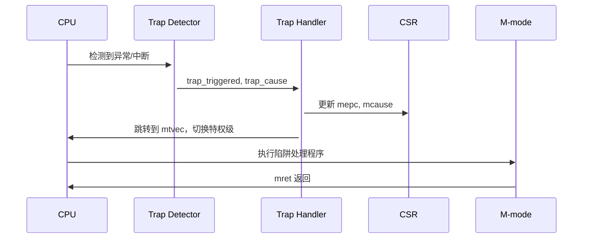
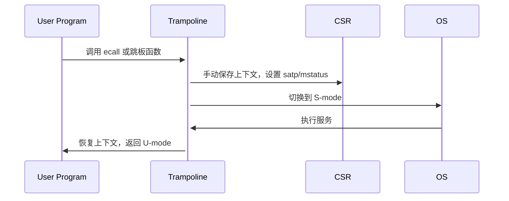

# Lfan-ke：第三阶段总结报告

about-me: [heke1228@gitee](https://gitee.com/heke1228), [heke1228@atom](https://atomgit.com/heke1228), [Lfan-ke@github](https://github.com/Lfan-ke), [heke1228@codeberg](https://codeberg.org/heke1228)

## 内核发展史

> 很早很早以前~，并不区分应用与操作系统。所有功能都绑定在一起，负责开发的也是同一批人。某些底层功能被频繁复用，慢慢的常用功能形成了特定的模块，通过接口与其他模块交互。比如：储存模块就是一个大数组。那么，为什么不能把系统作为一个库呢？

多道操作系统通过分时复用的方式在一台计算机上同时运行多个应用程序。但是出现了安全问题：如果每个应用都可以控制全局资源，如何保证不同应用之间的隔离？不会出现A想格式化，B想重启……所以必须限制应用不允许直接改变全局的系统状态。所以应用与系统分离，至少需要两种权限。

低权限的不允许改变全局系统状态，用来运行应用，高权限的集中运行能改变全局系统状态的操作（特权操作），分化出操作系统内核。



CPU对软件提供的接口：ISA - Instruction Set Architecture - 指令集架构 ：：： RV64、x86、mips、[LoongArch](https://www.loongson.cn/system/loongarch)等等。软硬件的分界线以及交互规范标准。

[RISC-V](https://riscv.org/)指令集 = 基础指令集 + 标准扩展指令集 + 用户自定义扩展指令集，比如RV32IM就是RV32的拥有整数以及乘除法指令的配置。RV64GC的G是一个省略书写，实际GC = IMAFD + C。RV32E是一个16个寄存器的嵌入式精简指令集。在gcc编译时使用[march](https://gcc.gnu.org/onlinedocs/gcc/RISC-V-Options.html)指定。使用mabi指定应用程序二进制接口对应类型的字长，比如ilp指的是int/long/usize_t(void*ptr)为32位，lp64f指的是int32位，long/usize_t为64位，支持单精度浮点采用浮点寄存器传递，但是双精度浮点仍然采用栈传递（即硬件指令集得支持F/D扩展，不然你硬件只有整数寄存器，没有对应精度的浮点寄存器）。在未支持的扩展，比如RV64I中书写乘法，则会以软件替代的形式出现，比如使用循环和移位的函数[\_\_mulsi3](https://gcc.gnu.org/onlinedocs/gcc-3.4.0/gccint/Integer-library-routines.html)来替代（当然，如果target=RVxIM但是运行在RVxI，M系指令也会通过trap的形式硬件兜底执行，但是效率低，其他扩展类似）。2020年，RISC-V发展的优先级从体系结构驱动切换为[软件](https://open-src-soc.org/2022-05/media/slides/RISC-V-International-Day-2022-05-05-11h05-Calista-Redmond.pdf)驱动。

```shell
riscv64-unknown-elf-gcc -march=rv32im -mabi=ilp32 -o program.elf program.c
riscv64-unknown-elf-g++ -march=rv64gc -mabi=lp64 -o program.elf program.cpp
rustc --target=riscv32imac-unknown-none-elf -C target-feature=+m,+a,+c program.rs
GOOS=linux GOARCH=riscv64 go build -o program program.go
tinygo build -target=riscv32-unknown-elf -o program.elf program.go
# cargo.toml：
[build]
target="riscv64gc-unknown-none-elf"
[target.riscv64gc-unknown-none-elf]
rustflags = [
    "-C", "link-arg=-Tlink.x",              # 可选：自定义链接脚本
    "-C", "target-feature=+m,+a,+f,+d,+c",  # 显式启用扩展
]
```

ISA包含：指令、寄存器等软件可见可操作的接口，从上到下切换的过程通常被称为陷入(trap)，比如S-sbicall->M/U-syscall->S/V<-syscall->H都是ecall和trap。其中trap是由硬件监测的，比如检测到某些错误就陷入M-Mode：

```verilog
module trap_detector (
    input  logic        clk,
    input  logic        rst,
    input  logic [31:0] current_pc,
    input  logic [31:0] instruction,
    input  logic        page_fault,         // 页错误
    input  logic        illegal_instr,      // 非法指令
    input  logic        timer_interrupt,    // 定时器中断
 ...
    output logic [3:0]  trap_cause          // 陷阱原因（scause 编码）
);

    always_comb begin
        trap_triggered = 0;
        trap_cause     = 0;

        // 同步异常检测 - 异常 - Exception
        if (xxx异常) begin
            trap_triggered = 1;
            trap_cause     = 2;
        end else ...

        // 异步中断检测 - 中断 - Interrupt
        else if (计时器等等) begin
            trap_triggered = 1;
            trap_cause     = {1'b1, timer_interrupt ? 3'd5 : 3'd9};
        end
    end
endmodule

// 检测到之后trap_handler触发硬件(trap)特权级切换，但是像跳板页是软件(ecall)特权级切换
// 补充：trap - riscv将ECF(异常控制流(Exceptional Control Flow))统称为trap
// 补充：无论是ecall还是trap，都是增删改部分csr与pc，处理结束后通常会逆增删改回到原位/+4
// 补充：ecall-U->S -> crud: scause/sepc等等   ecall-S->M -> crud: mcause/mepc等等   trap -> crud: mcause/mepc等等
// 可以是硬件处理，也可以是软件处理，比如编写中断处理函数并将地址刷入中断向量表
// 主打一个硬件可以做的软件也可以做，软件可以做的硬件也可以做，软慢成本低，硬快成本高……
```

操作系统在启动前需要先对部分寄存器赋予初值（初始化），以及传递设备等等硬件信息，这部分工作由SBI来完成。OS若需要M支持需要调用sbicall（比如操作定时器、关闭中断等等）。

定义底层固件与OS的接口：SBI - Supervisor Binary Interface - 监管层二进制接口 ：：： x86-UEFI/BIOS-Grub、RV-opensbi/rustsbi等等。

在SBI初始化结束，PC会被安置到OS的执行入口，开始操作系统初始化，比如开启页表、虚拟空间映射、启动第一个进程等等。比如RISC-V架构通常被放置在`0x8020_0000`。

操作系统：OS - 用来管理硬件资源并向上层应用提供统一的服务。除了最基础的存储、运行外，还有诸多如：网络、设备、显示等等扩展，以及：运行时环境、集成开发环境、基础库、编译工具链、编程语言、调试工具等等基础设施。

操作系统启动之后，如RISC-V架构，通常为三个特权级：MSU（虚拟化有五个，新增：VS VU，原S->HS）。用户程序运行在最上层。用户程序若需要S特权级支持需要调用syscall。基于操作系统的标准库，如GNUlibC，通常封装好了一部分syscall的便捷的调用方式，比如fork、printf -> write -> sys_write等等。

操作系统进行了内外两种演化：

- 外部接口：POSIX接口演化、系统调用的增删改、分布式软总线（鸿蒙）等等
- 内部架构：宏、微、外、多，以及在扩展性安全性性能等等方面的改进



宏内核：整个系统分为内核和应用两层，常见比如Linux的主体是宏内核。用户进程通过系统调用使用内核的各项功能。但是系统过于庞大。大量共享状态位于内核态。

微内核：最小化内核功能，将操作系统功能迁移到用户态，称之为”服务“，用户模块之间使用消息传递机制通信。常见比如：WinNT。WinNT实际上是混合内核，但其大部分功能采用微内核实现。共享数据状态部分在内核态，部分在用户态。

混内核：比如上述的WinNT以及MacOS/iOS，将需要性能的模块（线程调度、虚拟内存、IPC-进程间通信、图形子系统）放在内核态，扩展功能（文件系统、网络协议栈）放于用户态。

外核库：Exokernel不管理资源，只管理应用（计算资源、隔离等等），库OS则对硬件的抽象以库的形式提供，不通应用可以使用不通的LibOS。将管理与保护分离。



单内核：Unikernel（单/联内核），使用组件扩展操作系统的功能，在编译时确定系统组件。可看作虚拟化环境下的LibOS。应用与内核位于同一特权级。通过扩展，联内核可扩展为宏内核以及支持虚拟化。常见比如：ArceOS、Rumprun、Drawbridge、OSv等等。以及一个可以将Linux作为联内核的项目：[LKL]([https://github.com/lkl](https://github.com/lkl))。

多内核：又称：复内核。OS整体是一个分布式系统，应用程序仍然运行在OS之上。默认的状态是划分而非共享，显式的核间通信机制。支持设备（比如NPU/GPU等等）上的异构CPU。常见的如：Barrelfish、Popcorn Linux。



<!-- more -->

`虚拟化-Hypervisor`和`仿真器-Emulator`的区别

| **\**        | **虚拟化**          | **仿真器**   |  
|:----------:  |:-------------------:|:----------:|  
|指令集        | 与宿主机相同         | 与宿主机不同  |  
|性能          | 接近原生             | 显著下降|  
|硬件依赖      | 需要相同架构         |  可跨架构   | 
|常见工具      | VMware/KVM/Hyper-V   |  QEMU/Wine/Spike  |  
|应用场景      | 云计算，多系统隔离   |  跨平台兼容  | 
|详细举例      | 阿里云ECS的CPU核数实际上是vCPU | QEMU |

---

## 通关历程

### 打印颜色

ArceOS通过feature来启用不同的组件，不同层的组件影响范围不一致，比如：在shell启动前修改`axlog arceos_api::stdio::ax_console_write_fmt`会影响Logo颜色，修改`axstd:stdout().lock().write_fmt -> axio`只会影响在shell启动后的字符颜色，当然也可以修改屏蔽硬件细节的`axhal platform/arch/dw_apd_uart.rs`，逐字节控制颜色，但是会导致前台用户的颜色字符串被变成一堆`x[xx[`乱码。

而且如果一开始就在依赖上动手脚的话，后续的实验至少有三个会受到影响。影响的原因是评测脚本是取标准输出的最后一行：`tail -n1`，如果为了优化效果，比如采用取消ANSI格式时使用`\b`回车避免影响到下一行时，你会发现，`集合类型`&`文件命令`&`MMAP`三个实验会评测失败，除非将`tail -n1` -改为-> `tail -n2`甚至更大的grep范围。

所以最好的方式还真的就仅仅是在`println`后附加ANSI颜色转义序列。第一个评测脚本是根据标准输出流是否含有ANSI前缀字符来判别的，所以即使不真正搞颜色，仅仅面向结果编程`println!("Hello, Arceos!\x1b[");`也可以通过测例。

### 集合类型

集合类型主要就是向`axstd::collections`命名/包空间注册一个Map。所以既可以利用`随机模块+现有Map`或者利用数据结构的知识`手动实现`，也可以：利用`type/use as`将HashMap接口导向[HashBrown](https://docs.rs/hashbrown/0.9.1/hashbrown/#structs)/BTreeMap。

### 内存分配

实现一个简易的早期内存分配器。内存分配/管理，可以理解为饥荒年间分粮食。首先你是负责分米的小吏(new())，然后告诉你：你负责蓬莱东路的救济粮，一共2048升米，你给别人分起码得按4升为单位(init<4>(start: 0, size: 2048))。之后如何高效的分米就是自己的事情了。可以随意派发，不记账，发哪算哪。可以精打细算：按灾民家庭人口和受灾程度划分等级，大等级之下又有细分的高矮胖瘦。你总揽全局，当发粮的时候你就可以按着二级表进行发放，倘若此时一个特困户过来领粮食，你看到对应等级该有的米已经发完了，就可以触发`无米之炊`Err了。同时，倘若有灾民逃难到其他地方，你就可以将米回收，合并，万一之后有更大的困难户出现呢？

本题内容直接使用了随意发放通过了测例，但是并非毫无收获，最起码弄明白了一个混淆点：

```rust
let pages = alloc.alloc_pages(4, 16384).unwrap();
// ↑ - 分配连续的4页，且返回的地址是16kb对齐，比如返回：0x4000~0x7FFF
```

且字节分配器可以直接管理页分配器所分配的区域进行细粒度的字节分配。

### 文件命令

由于我是先写的报告，后3倍速刷完视频后写的实验，写完后又补充报告。视频课程对应的练习题是一个`example/shell`，然后我就在里面看`api`下的操作命令以及`m_1_0`对应的`loader/main`，实现了`mv`和`rename`之后跑完`shell`没问题就没管。直到最后总测的时候发现了两个问题：

- 该章节对应的练习题是：`make run A=exercises/ramfs_rename/ BLK=y` 测试命令：`./scripts/test-ramfs_rename.sh`
- 由于打印颜色我使用了`\b`+`ANSI`擦除样式，导致我需要将评测脚本的tail改为倒数2-3行才能通过，后续改回来了，但是我删了颜色对axlog等等的魔改代码
- 另外补充一点，就像法环指路一样，debug!需要使用开启makefile特定的标志，我常用的：`cls && make run A=exercises/ramfs_rename/ BLK=y LOG=debug MODE=debug` （alias cls=clear）

### 挑战题目

由于虚拟机上套虚拟机套虚拟机，导致软件模拟指令的速度指数级下降，另一条线中，一个普通机子4s编译完成的任务，愣是可以拉长战线到4h……所以挑战题目仅仅实现了一个基础的简易分配器。还有一些想法想试一试，但是CI也没好，本机又过于阻塞其他任务，就保留，未来有缘再弄吧！

### 虚拟映射

mmap函数可以将：驱动、文件、内存……映射，并返回对应的指针。用户程序可以像读写文件一样进行进程通信、文件读写等等等。常常用在大IO场景，比如：数据库。了解用处之后就易于实现了，两个标志位，一个直接用于文件打开，一个用于判断是匿名映射（只在内存）还是文件映射，就实现了。

提到映射，耳熟能详的就是mmio老朋友，前者是`将文件或设备映射到进程的地址空间，使应用程序可以直接通过内存访问方式操作文件或设备`，后者是将`设备寄存器或设备内存映射到处理器的地址空间，使CPU可以像读取内存一样读取设备地址空间`。前者是用来加速用户空间访问文件/设备，后者是使得CPU可以通过普通内存访问指令与设备通信。一个提升软件效率，一个提示硬件效率。当然，也可以通过mmap将mmio所映射的地址空间映射到用户空间，像读指针一样读写设备。

提到共享空间，有一个撞衫的熟人：SVM。智能的同学可能会说：`支持向量机嘛`，是的，今年前半年即使和OpenCL放在一起问DeepSeek，DS也偶尔使用支持向量机的内容回答你`动态/共享虚拟内存(Shared Virtual Memory)`的东西。今年[2025]年中好一些了。SVM是在`异构计算架构中实现主机（CPU）与加速器（GPU/NPU/FPGA等）共享统一虚拟地址空间的技术，它允许两者通过相同的指针访问同一块物理内存，同时提供内存一致性的管理机制`。MMIO/MMAP是单向的，SVM则是更高级的双向的，动态的，时机和条件控制合适，双方可以都在读以及都在写，所以常常使用UserEvent进行阻塞同步。部分的OCL-SVM实现也有用到MMIO/MMAP的。同时，其他通用计算框架也有类似的机制：`Cuda::cuMemMap`，也是`将物理内存映射到虚拟地址空间`，进行GPU的进程之间通信，`WebGPU::mapAsync`，CPU与GPU的数据交互，几天前`Vulkan::vkMapMemory`晃了一眼，但是最近过来推主线，就没细看，预计四阶段推完OS主线之后会回去继续看。

### 简易虚拟化

这次训练营最有收获的点就是参与训练营捋顺了硬件与操作系统之间的关系（除了驱动，不能直接从驱动理解操作系统行为是一个硬伤，下去自己找相关资料继续学习吧！这也是自己软硬件连通的最后屏障了），且接触了RV的H扩展，进行了简易的虚拟化实验。理解了Guest与Host之间的切换逻辑。结合其他训练营相关的内容，或许真的在不久的将来自己编写一个`MiniVMWare`。<!-- 彩蛋：笑死，中科院软研所的实习任务，我还真的是`言出法随`啊~ -->

<!-- 不会吧，不会吧？这年头还真的有开源码视角看笔记的？既然有缘看到，那就添加`QQ/WX`一起讨论吧！号码作为彩蛋分布在随机地方！ -->

以前以为虚拟化都是清一色的软件模拟，旅途到达这里才知道，虚拟化有：

- 指令集虚拟化 - 软件翻译指令，比如QE<!-- wx:heke1228 -->MU/NEMU
- 资源虚拟化 - 比如虚拟内存、网络共享空间、虚拟网卡
- 程序库虚拟化 - axstd/arceos_posix_api/arceos_rust_api/axlibc/musl libc...
- 编程语言虚拟化 - Java虚拟机JVM、.NET框架
- 系统虚拟化 - 平台虚拟化，比如运行在虚拟化层之上的不同操作系统与用户程序

等等分类。以前以为清一色的利用软件模拟指令，但是现在才知道虚拟化的客机和宿主机是指令集架构一致的。所以在VM_ENTRY之后在VS/VU模式中直接执行（实际上会因为不同实现而不同，可了解Type1/1.5/2相关虚拟机监控器实现）对应的指令。高效系统虚拟化为虚拟机内程序提供与该程序原先执行的硬件完全一样的接口，虚拟机只比在无虚拟化的情况下性能略差一点 ，虚拟机监控器控制所有物理资源。只不过在启用H扩展进入VS/VU模式设定标志位之后，访问M系列CSR即：sbicall会触发指令异常进行VM_EXIT，需要HS/M模式进行捕获并处理。如果把硬件当作冷冰冰的自动化流水线上的机器，那么软件抽象进入某某特权级/模式，仅仅是设置了特定的开关/标志位，导致晶体管电路在布尔运算的时候可能开启某个电闸触发特定的硬件模块而已。所以才需要SBI进行系统启动前的初始化，将相关寄存器都设定好初值。

有一句话乍一听奇奇怪怪，但是确实让人会耳目一新：`软件只是动态配置硬件的脚本`。

> 大家都是为梦而行的旅人，漫漫长路难免磕磕绊绊，不要因为一时的磕碰迷失了自我，慢慢的会发现，道路不会自然平坦，但是可以发现不平坦后，使道路平坦。这次训练营总结就到此为止了，祝先行者顺遂，同行者共勉，后来者同赴。
> 如果上述笔记有错误，也曾是我帮助自己理解知识认识世界的一层抽象，欢迎大家随时交流！

---
<h2 align="center">附录</h2>

- DS生成的硬软陷入的时序图



<!-- 3222087513 -->


