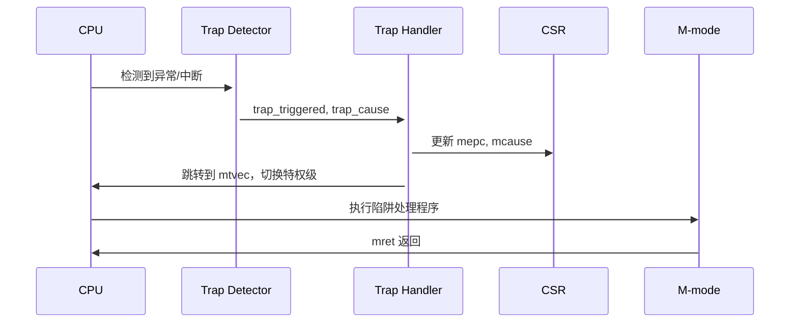
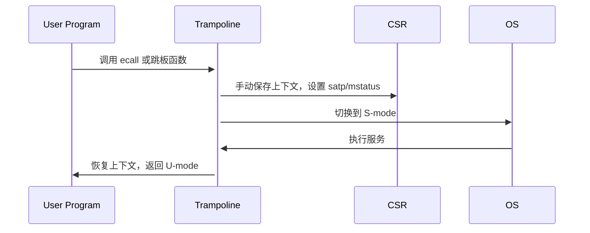

about-me: [heke1228@gitee](https://gitee.com/heke1228), [heke1228@atom](https://atomgit.com/heke1228), [Lfan-ke@github](https://github.com/Lfan-ke)

---
title: 穿越操作系统的迷雾
date: 2025-05-29 10:38:44
catogories:

- ArceOS
- 阶段三
- 2025S
tags:
  - author:Lfan-ke
  - repo:<https://github.com/LearningOS/2025s-arceos-Lfan-ke>
mathjax: true
mermaid.js: true
mermaid:
  enable:true
  theme:default
description: 本笔记内容来源于：ArceOS/rCore操作系统训练营、傲来二期操作系统训练营、YSYX学习计划、DeepSeek补充、底层补完计划、部分博客与第三方内容……

---

<script src="https://cdn.jsdelivr.net/npm/mermaid/dist/mermaid.min.js"></script>
<script>
 mermaid.initialize({
   startOnLoad: <%= theme.mermaid.options.startOnLoad || true %>,
   theme: "<%= theme.mermaid.options.theme || 'default' %>"
 });
</script>

## 内核发展史

> 很早很早以前~，并不区分应用与操作系统。所有功能都绑定在一起，负责开发的也是同一批人。某些底层功能被频繁复用，慢慢的常用功能形成了特定的模块，通过接口与其他模块交互。比如：储存模块就是一个大数组。那么，为什么不能把系统作为一个库呢？

多道操作系统通过分时复用的方式在一台计算机上同时运行多个应用程序。但是出现了安全问题：如果每个应用都可以控制全局资源，如何保证不同应用之间的隔离？不会出现A想格式化，B想重启……所以必须限制应用不允许直接改变全局的系统状态。所以应用与系统分离，至少需要两种权限。

低权限的不允许改变全局系统状态，用来运行应用，高权限的集中运行能改变全局系统状态的操作（特权操作），分化出操作系统内核。



CPU对软件提供的接口：ISA - Instruction Set Architecture - 指令集架构 ：：： RV64、x86、mips、[LoongArch](https://www.loongson.cn/system/loongarch)等等。软硬件的分界线以及交互规范标准。

[RISC-V](https://riscv.org/)指令集 = 基础指令集 + 标准扩展指令集 + 用户自定义扩展指令集，比如RV32IM就是RV32的拥有整数以及乘除法指令的配置。RV64GC的G是一个省略书写，实际GC = IMAFD + C。RV32E是一个16个寄存器的嵌入式精简指令集。在gcc编译时使用[march](https://gcc.gnu.org/onlinedocs/gcc/RISC-V-Options.html)指定。在未支持的扩展，比如RV64I中书写乘法，则会以软件替代的形式出现，比如使用循环和移位的函数[\_\_mulsi3](https://gcc.gnu.org/onlinedocs/gcc-3.4.0/gccint/Integer-library-routines.html)来替代（当然，如果target=RVxIM但是运行在RVxI，M系指令也会通过trap的形式硬件兜底执行，但是效率低，其他扩展类似）。2020年，RISC-V发展的优先级从体系结构驱动切换为[软件](https://open-src-soc.org/2022-05/media/slides/RISC-V-International-Day-2022-05-05-11h05-Calista-Redmond.pdf)驱动。

```shell
riscv64-unknown-elf-gcc -march=rv32im -mabi=ilp32 -o program.elf program.c
riscv64-unknown-elf-g++ -march=rv64gc -mabi=lp64 -o program.elf program.cpp
rustc --target=riscv32imac-unknown-none-elf -C target-feature=+m,+a,+c program.rs
GOOS=linux GOARCH=riscv64 go build -o program program.go
tinygo build -target=riscv32-unknown-elf -o program.elf program.go
# cargo.toml：
[build]
target="riscv64gc-unknown-none-elf"
[target.riscv64gc-unknown-none-elf]
rustflags = [
    "-C", "link-arg=-Tlink.x",              # 可选：自定义链接脚本
    "-C", "target-feature=+m,+a,+f,+d,+c",  # 显式启用扩展
]
```

ISA包含：指令、寄存器等软件可见可操作的接口，从上到下切换的过程通常被称为陷入(trap)，比如S-sbicall->M/U-syscall->S/V<-syscall->H都是ecall和trap。其中trap是由硬件监测的，比如检测到某些错误就陷入M-Mode：

```verilog
module trap_detector (
    input  logic        clk,
    input  logic        rst,
    input  logic [31:0] current_pc,
    input  logic [31:0] instruction,
    input  logic        page_fault,         // 页错误
    input  logic        illegal_instr,      // 非法指令
    input  logic        timer_interrupt,    // 定时器中断
 ...
    output logic [3:0]  trap_cause          // 陷阱原因（scause 编码）
);

    always_comb begin
        trap_triggered = 0;
        trap_cause     = 0;

        // 同步异常检测 - 异常 - Exception
        if (xxx异常) begin
            trap_triggered = 1;
            trap_cause     = 2;
        end else ...

        // 异步中断检测 - 中断 - Interrupt
        else if (计时器等等) begin
            trap_triggered = 1;
            trap_cause     = {1'b1, timer_interrupt ? 3'd5 : 3'd9};
        end
    end
endmodule

// 检测到之后trap_handler触发硬件(trap)特权级切换，但是像跳板页是软件(ecall)特权级切换
// 补充：trap - riscv将ECF(异常控制流(Exceptional Control Flow))统称为trap
// 补充：无论是ecall还是trap，都是增删改部分csr与pc，处理结束后通常会逆增删改回到原位/+4
// 可以是硬件处理，也可以是软件处理，比如编写中断处理函数并将地址刷入中断向量表
// 主打一个硬件可以做的软件也可以做，软件可以做的硬件也可以做，软慢成本低，硬快成本高……
```

操作系统在启动前需要先对部分寄存器赋予初值（初始化），以及传递设备等等硬件信息，这部分工作由SBI来完成。OS若需要M支持需要调用sbicall（比如操作定时器、关闭中断等等）。

定义底层固件与OS的接口：SBI - Supervisor Binary Interface - 监管层二进制接口 ：：： x86-UEFI/BIOS-Grub、RV-opensbi/rustsbi等等。

在SBI初始化结束，PC会被安置到OS的执行入口，开始操作系统初始化，比如开启页表、虚拟空间映射、启动第一个进程等等。比如RISC-V架构通常被放置在`0x8020_0000`。

操作系统：OS - 用来管理硬件资源并向上层应用提供统一的服务。除了最基础的存储、运行外，还有诸多如：网络、设备、显示等等扩展，以及：运行时环境、集成开发环境、基础库、编译工具链、编程语言、调试工具等等基础设施。

操作系统启动之后，如RISC-V架构，通常为三个特权级：MSU（虚拟化有五个，新增：VS VU，原S->HS）。用户程序运行在最上层。用户程序若需要S特权级支持需要调用syscall。基于操作系统的标准库，如GNUlibC，通常封装好了一部分syscall的便捷的调用方式，比如fork、printf -> write -> sys_write等等。

操作系统进行了内外两种演化：

- 外部接口：POSIX接口演化、系统调用的增删改、分布式软总线（鸿蒙）等等
- 内部架构：宏、微、外、多，以及在扩展性安全性性能等等方面的改进



宏内核：整个系统分为内核和应用两层，常见比如Linux的主体是宏内核。用户进程通过系统调用使用内核的各项功能。但是系统过于庞大。大量共享状态位于内核态。

微内核：最小化内核功能，将操作系统功能迁移到用户态，称之为”服务“，用户模块之间使用消息传递机制通信。常见比如：WinNT。WinNT实际上是混合内核，但其大部分功能采用微内核实现。共享数据状态部分在内核态，部分在用户态。

混内核：比如上述的WinNT以及MacOS/iOS，将需要性能的模块（线程调度、虚拟内存、IPC-进程间通信、图形子系统）放在内核态，扩展功能（文件系统、网络协议栈）放于用户态。

外核库：Exokernel不管理资源，只管理应用（计算资源、隔离等等），库OS则对硬件的抽象以库的形式提供，不通应用可以使用不通的LibOS。将管理与保护分离。



单内核：Unikernel（单/联内核），使用组件扩展操作系统的功能，在编译时确定系统组件。可看作虚拟化环境下的LibOS。应用与内核位于同一特权级。通过扩展，联内核可扩展为宏内核以及支持虚拟化。常见比如：ArceOS、Rumprun、Drawbridge、OSv等等。以及一个可以将Linux作为联内核的项目：[LKL]([https://github.com/lkl](https://github.com/lkl))。

多内核：又称：复内核。OS整体是一个分布式系统，应用程序仍然运行在OS之上。默认的状态是划分而非共享，显式的核间通信机制。支持设备（比如NPU/GPU等等）上的异构CPU。常见的如：Barrelfish、Popcorn Linux。



<!-- more -->

---
<h2 align="center">附录</h2>

- DS生成的硬软陷入的时序图




