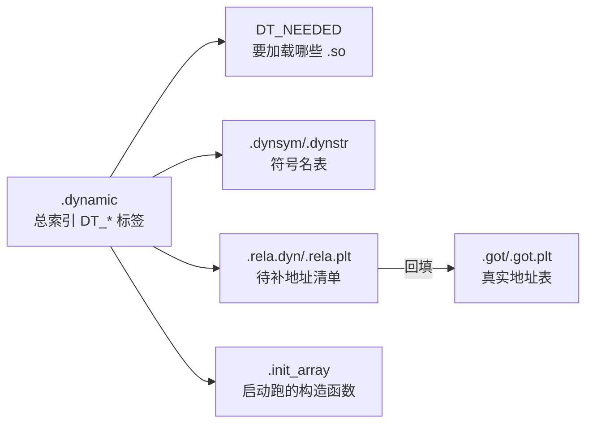
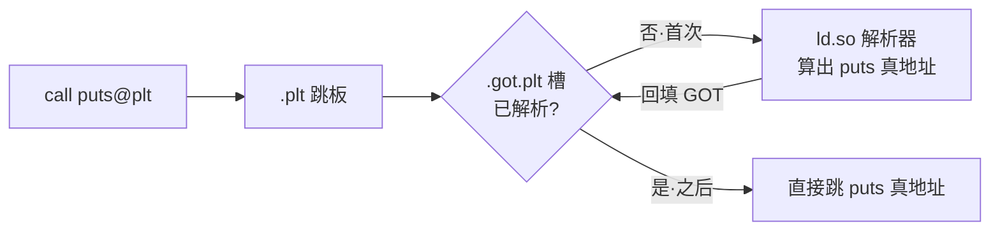
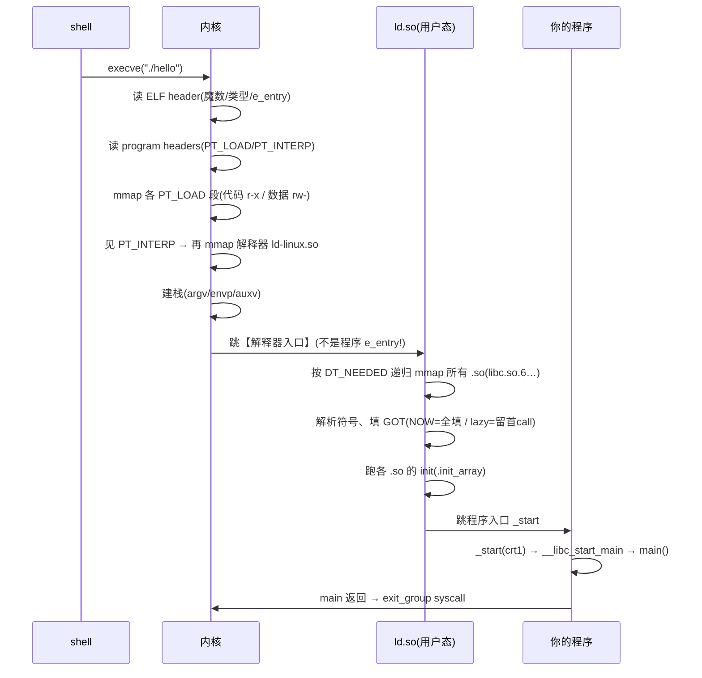
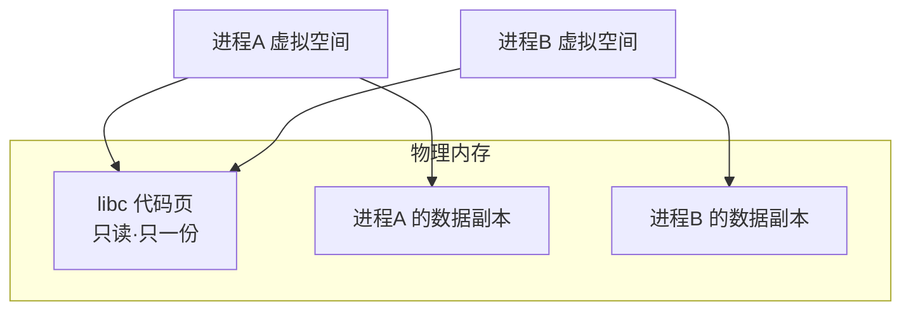
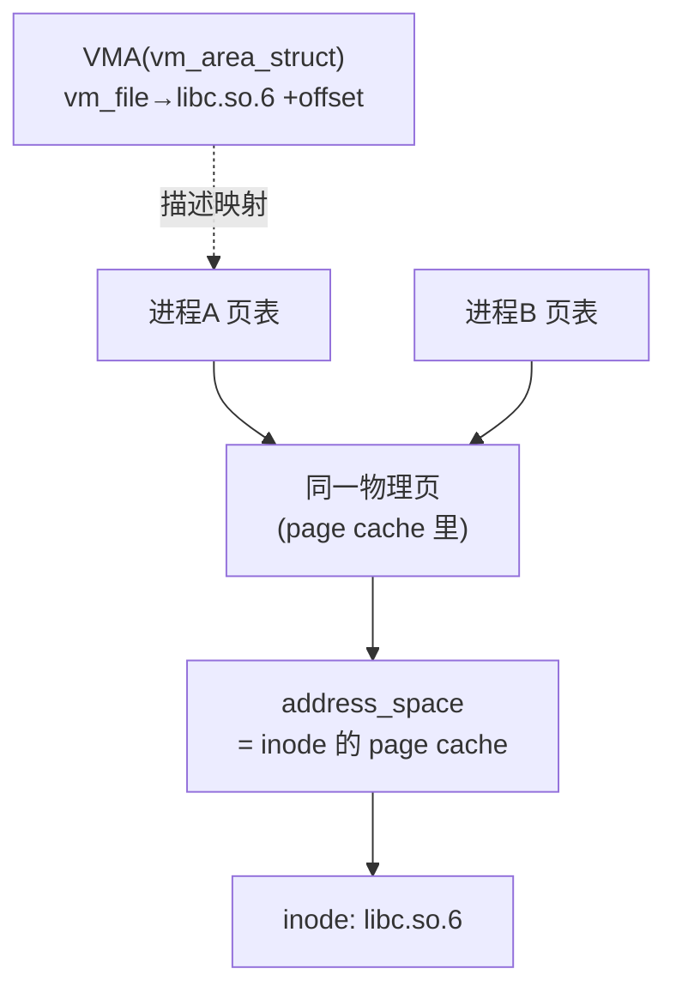

<!-- more -->

> 接上篇《烧镜像挂载》——那篇我们见了 ELF 的 `vmlinux`、以及能被 UEFI 当 PE 加载的 `Image`、还提了 `.ko`（内核模块/驱动）。这篇回答：**这些文件是怎么从源码生出来的，又怎么拼到一起跑起来的**。以 Linux/ELF 为主线，Windows 侧随手对照。

## 0. 从 `hello.c` 到能跑，到底经历了什么

```mermaid
graph LR
    C["hello.c"] -->|预处理 cpp| I["hello.i"]
    I -->|编译 cc1| S["hello.s 汇编文本"]
    S -->|汇编 as| O[".o 目标文件"]
    O -->|链接 ld| E["可执行 ELF"]
    A[".a / 库.o"] -. 静态链接·塞进去 .-> E
    SO[".so 动态库"] -. 运行时·ld.so 加载 .-> E
```

一句话：**编译把"人话"翻成"机器话"，链接把"一堆零件"拼成"一个整机"。** 下面逐段拆。

---

## 1. 编译四阶段 —— 别把"编译"和"汇编"并成一步

| 阶段 | 工具 | 输入→输出 | 干了啥 |
|---|---|---|---|
| 预处理 | `cpp` | `.c → .i` | 宏展开、`#include` 内联、去注释 |
| 编译 | `cc1` | `.i → .s` | C → **汇编文本** |
| 汇编 | `as` | `.s → .o` | 汇编 → **机器码目标文件**（ELF relocatable）|
| 链接 | `ld` | `.o(+库) → 可执行` | 解析符号、按链接脚本分配地址、回填重定位 |

```bash
gcc -E hello.c -o hello.i     # 只预处理 → 看宏展开后长啥样
gcc -S hello.c -o hello.s     # 停在汇编(.s 是文本,能读)
gcc -c hello.c -o hello.o     # 停在目标文件(.o)
gcc    hello.c -o hello       # 一路到可执行
```

- **编译**出的是**汇编文本** `.s`（可读），**汇编器** `as` 才把它变 `.o` 机器码——这俩是两步（`gcc -S` vs `gcc -c` 一眼分得开）。
- **链接**做两件事：① 把各 `.o` 里"欠的符号"（如 `puts`）找到定义；② 按**链接脚本**给各段分配最终地址（哪段进代码区、哪段进数据区；嵌入式里还指定 flash/ram 地址）。
- `objcopy -O binary` 再把 ELF 的多余段/符号去掉 → **裸二进制**（PC 一路递增即可执行）——这正是上篇的 `Image`！

### `-c` 停在 `.o` vs 一路到可执行 —— 差的就是「链接」

对照那两条命令的产物：

```text
gcc -c hello.c -o hello.o   →  hello.o    1488 字节   nm: T main / U puts        (没有 _start!)
gcc    hello.c -o hello     →  hello     15960 字节   nm: T _start / T main / U __libc_start_main
```

- **`gcc -c` = 只编译不链接**：跑完 预处理→编译→汇编 就停，产出 `.o`。里面**只有你写的 `main`，欠着 `puts`，没有入口 `_start`、没有启动代码、没有 libc** → 不能跑。
- **`gcc hello.c -o hello`（不带 `-c`）= 完整 4 阶段含链接**。链接这一步（gcc 实际调 `collect2`→`ld`）把这些拼进来：
  - **crt 启动文件**：`crt1.o`（含真正入口 `_start`；PIE 默认时换成 `Scrt1.o`）+ `crti.o`/`crtn.o`（init/fini 框架）+ `crtbeginS.o`/`crtendS.o`（gcc 自带）
  - **libc**（默认隐含 `-lc`，解析 `puts`）
  - 补上 ELF program headers、`PT_INTERP`、`.plt`/`.got` 等运行时骨架

所以体积从 **1488 → 15960 字节**，多出来的全是「**启动班底 + 运行时骨架**」；符号表也从只有 `main`，多出 `_start` 和 `__libc_start_main`。启动链就是：`_start`(crt1) → `__libc_start_main` → 你的 `main`。

```bash
gcc hello.c -o hello -v     # 看 gcc 背后实际调了哪些子程序
```

真实输出（截关键两行，路径已省略）：

```text
cc1 ... hello.c ... -o /tmp/cc*.s                              ← ① 编译器,产汇编
collect2 ... Scrt1.o crti.o crtbeginS.o hello.o -lc crtendS.o crtn.o   ← ② 链接器,拼 crt 启动文件+你的.o+libc
```

第 ② 行一眼看穿链接到底干了啥：把 **crt 启动文件**（`Scrt1.o`/`crti.o`/`crtbeginS.o`/`crtendS.o`/`crtn.o`）+ **你的 `hello.o`** + **libc（`-lc`）** 拼成一个完整可执行。也能手动分两步：

```bash
gcc -c hello.c -o hello.o   # 只编译,出半成品 .o
gcc    hello.o -o hello     # 纯链接,把启动文件+libc 拼上去
```

#### 插曲：`crt1.o` vs `Scrt1.o`（crt 全家）

这些 `crt`（C RunTime）启动文件都干同一件事——提供入口 `_start`，准备好后调 `__libc_start_main(main, …)`。区别在**给哪种可执行用**：

| 文件 | 用于 |
|---|---|
| `crt1.o` | 非 PIE 可执行（ET_EXEC）|
| `Scrt1.o` | **PIE** 可执行（ET_DYN，现代默认）|
| `rcrt1.o` | static-PIE |
| `gcrt1.o` / `Mcrt1.o` | profiling（`gcc -pg`）|
| `crti.o` / `crtn.o` | `.init`/`.fini` 的头/尾框架（都用）|

- **`S` 后缀 = Shared / 位置无关版**（PIE、共享库用）——同样的 `S` 也出现在 `crtbeginS.o`/`crtendS.o`。
- **本质区别**：历史上 `crt1.o` 用**绝对地址**引用 `main`（只能固定基址加载），`Scrt1.o` 用 **GOT** 间接引用（适应 PIE 的 ASLR 随机基址）。
- **趋同与否看架构**：在 **x86-64** 上两者对 `main` 的重定位**已趋同**（都走 GOT 的 `R_X86_64_REX_GOTPCRELX`）；但在 **RISC-V** 上**仍有区别**——`crt1.o` 用 `R_RISCV_PCREL_HI20`（PC 相对、直接引用），`Scrt1.o` 用 `R_RISCV_GOT_HI20`（经 GOT 间接，适应 PIE）。保留两个文件，就是为了让链接器按 `-pie`/`-no-pie` 自动挑对的。

> **Windows 对应**：`cl /P`(预处理) / `cl /FA`(出汇编) / `cl /c`(出 `.obj`) / `link`(链接成 `.exe`)。

---

## 2. 文件类型全家谱（Linux ↔ Windows）

| 角色 | Linux | Windows | 是什么 |
|---|---|---|---|
| 目标文件 | `.o` | `.obj` | 单个源码编译后的**可重定位**机器码（带符号表+重定位）|
| 静态库 | `.a` | `.lib` | 一堆 `.o` 的**打包**（`ar`/`lib.exe`）；链接时**整段塞进**可执行 |
| 动态库 | `.so` | `.dll` | 运行时才加载、**多程序共享**的库 |
| 导入库 | （无独立物）| `.lib`（import lib）| Windows 特有：链 `.dll` 时先链这个**桩**，真代码在 `.dll` |
| 可执行 | ELF（无后缀）| `.exe` | 能直接跑的完整程序（ELF = Executable and Linkable Format；Windows 用 PE = Portable Executable）|
| 内核模块 | `.ko` | `.sys` | （一嘴）特殊目标文件，用 `insmod` 链进**内核地址空间**（不走 ld.so、不含 libc、直接调内核 API），详见驱动篇 |

- `.a` = `ar rcs libfoo.a a.o b.o`（其实就是个 `.o` 的归档包）。
- `.so` = `gcc -shared -fPIC foo.c -o libfoo.so`（`-fPIC`=位置无关代码，下面讲为什么）。
- Windows 的 `.lib` 有**两种身份**：要么是**静态库**（含真代码），要么是某个 `.dll` 的**导入库**（只含跳转桩）——名字一样，看用途。

---

## 3. `.o` 为什么自己不能跑

`.o` 是**可重定位目标（relocatable）**——它欠着外部符号、没入口、段没按执行布局：

```text
gcc -c hello.c -o hello.o ;  nm hello.o
0000000000000000 T main      ← 已定义(代码在本文件)
                 U puts      ← 未定义(等链接去别处找)
```

两个细节：
1. `T main` = 本文件**定义**了 `main`；`U puts` = **未定义**，链接时才去 libc 里找。**`.o` 跑不了的根本原因是它的 ELF 类型是 `ET_REL`（可重定位）——内核直接拒绝执行**（`chmod +x x.o; ./x.o` 会报 `cannot execute binary file: Exec format error`），它既没入口 `_start`、也没 `PT_LOAD`/`PT_INTERP`。`U puts` 是**额外**的：还得**链接**才能补上外部符号。所以门槛是**链接**（编译期），不是"缺动态库"（哪怕全静态，也得先链接）。
2. 我源码写的是 `printf("hi\n")`，`nm` 却显示欠 `puts`！**编译器把"常量串+换行+无格式参数的 printf 优化成了 puts"**（更便宜）。你写的 ≠ 最终调的——这是编译器优化的活教材。

---

## 4. 静态 vs 动态链接（核心）

同一个 `hello.c`，两种链法，差距惊人：

```text
gcc hello.c -o hello_dyn          # 动态(默认)
gcc hello.c -static -o hello_sta  # 静态

ls -l :   hello_dyn  15960 字节   |  hello_sta  785360 字节   ← 差 49 倍!
size  :   text 1365             |  text 668337            ← 整个 glibc 塞进来了
file  :   ...dynamically linked, interpreter /lib64/ld-linux-x86-64.so.2
          ...statically linked
ldd hello_dyn :  linux-vdso.so.1 / libc.so.6 / ld-linux-x86-64.so.2
ldd hello_sta :  not a dynamic executable
```

| 维度 | 静态（`.a`，塞进去）| 动态（`.so`，共享）|
|---|---|---|
| 体积 | 大（每个程序各塞一份）| 小（只留符号引用 + 桩）|
| 运行依赖 | 无，单文件即可跑 | 需要 `.so` 文件 + `ld.so` 在位 |
| 内存 | 每进程各占一份库 | 多进程**共享**同一份库页 |
| 升级修漏洞 | 必须**重新编译/链接**每个程序 | **换一个 `.so`/打补丁**即可全体生效 |
| 启动 | 快（无运行时链接）| 略慢（`ld.so` 要解析）|

> 现实例子：Windows 上 360 之类老打"系统安全补丁补 DLL"——就是动态库的优势，**改一个 `.dll`，所有用它的程序一起修好**。反过来，静态链接的程序要修同一个漏洞，得逐个重编。

---

## 5. ELF 文件结构详解

ELF 有**两副面孔**：

- **Section（节）= 链接视角**：`.text` `.data` … 给链接器/调试器看。
- **Segment（段，program header）= 执行视角**：把若干 section 归成 `PT_LOAD` 等，给**内核 mmap** 用。

常见 section：

| section | 内容 | 备注 |
|---|---|---|
| `.text` | 代码 | r-x |
| `.rodata` | 只读数据/常量字符串 | r-- |
| `.data` | 已初始化全局变量 | rw- |
| `.bss` | 未初始化全局 | **不占文件**，加载时清零 |
| `.symtab`/`.strtab` | 符号表 | `strip` 可去 |
| `.dynsym`/`.dynstr` | 动态符号表 | 动态链接用 |
| `.rela.dyn`/`.rela.plt` | 重定位表 | 链接/加载时回填地址 |
| `.plt`/`.got`/`.got.plt` | **跳转表**（§6 详讲）| 动态调用的关键 |
| `.init_array`/`.fini_array` | 构造/析构函数指针 | C++ 全局对象、`__attribute__((constructor))` |
| `.interp` | 解释器路径 | 动态可执行才有 |
| `.dynamic` | 动态段（NEEDED 等）| `ld.so` 的导航图 |

```bash
readelf -h hello_dyn    # ELF 头(类型/入口/架构)
readelf -S hello_dyn    # 所有 section
readelf -l hello_dyn    # program headers(segment) + section→segment 映射
readelf -d hello_dyn    # 动态段(NEEDED 哪些库)
```

关键输出节选（`hello_dyn`）：

```text
readelf -h →  Type: DYN (Position-Independent Executable)   Entry: 0x1060
readelf -d →  (NEEDED) libc.so.6   (FLAGS) BIND_NOW   (FLAGS_1) NOW PIE
readelf -l →  INTERP → /lib64/ld-linux-x86-64.so.2 ; 两个 LOAD 段(代码 r-x / 数据 rw-)
```

### 动态链接专用 section 详解（`ld.so` 的工作底图）

上表里 `.dynsym`/`.rela.*`/`.got`/`.dynamic` 这几个是**动态链接的核心机器**，它们环环相扣：



逐个拆：

- **`.dynamic` —— 总索引**。一串 `DT_*` 标签，是 `ld.so` 进来**第一个读**的导航图：`DT_NEEDED`(要哪些 `.so`)、`DT_SYMTAB`/`DT_STRTAB`(符号表在哪)、`DT_RELA`/`DT_JMPREL`(重定位表在哪)、`DT_INIT_ARRAY`、`DT_RUNPATH`、`DT_SONAME`、`DT_FLAGS`(如 `BIND_NOW`)。`readelf -d` 看的就是它。
- **`.dynsym` / `.dynstr` —— 动态符号表 + 名字串**。`.dynsym` 是动态链接**必须保留**的符号子集（导出的 + 欠的如 `puts`），`.dynstr` 存它们的名字。区别于 `.symtab`（完整符号表，给链接器/调试器，`strip` 能删）——`.dynsym` **strip 不掉**，`ld.so` 运行时全靠它认符号。每条记录：名字、地址、类型(FUNC/OBJECT)、绑定(GLOBAL/WEAK)、所属段(`UND`=未定义=去别的 `.so` 找)。
- **`.rela.dyn` / `.rela.plt` —— 重定位表（"待补地址清单"）**。每条说"把**这个位置**按**这个规则**填上**某符号**的真实地址"。`.rela.dyn`=数据类(全局变量、GOT 数据项，加载时**立即**补)；`.rela.plt`=函数类(PLT 的 `JUMP_SLOT`，lazy 留到首调 / `NOW` 立即补)。常见类型：`R_X86_64_RELATIVE`(PIE 自身引用=基址+addend)、`GLOB_DAT`(全局变量)、`JUMP_SLOT`(函数)。`readelf -r` 看它。
- **`.plt` / `.got` / `.got.plt` —— 跳转表**（§6 详讲）。`.got`=真实地址表(可写)、`.plt`=跳板代码(可执行)；上面的重定位就是往 `.got`/`.got.plt` 里**回填**地址。
- **`.init_array` / `.fini_array` —— 构造/析构函数指针数组**。`.init_array` 里的函数在 `main` **之前**跑（C++ 全局对象构造、`__attribute__((constructor))`、libc 初始化）；`.fini_array` 在 `main` **之后**跑。每个 `.so` 被加载完，`ld.so` 也会跑它自己的 `.init_array`。（老式是 `.init`/`.fini` 段里的 `_init`/`_fini`，由 `crti.o`/`crtn.o` 包头尾。）
- **`.interp` —— 解释器路径**。就是一个字符串 `/lib64/ld-linux-x86-64.so.2`。内核读 `PT_INTERP`(指向它) → 加载这个解释器。**只有动态可执行才有**。`readelf -p .interp hello_dyn` 直接打印。

**一句话串起来**：`ld.so` 进来 → 读 `.dynamic` 拿导航 → 按 `DT_NEEDED` 加载 `.so` → 用 `.dynsym`/`.dynstr` 认符号 → 按 `.rela.*` 把地址**回填进 `.got`/`.got.plt`** → 跑 `.init_array` → 交给你的 `main`。

**ELF 三种类型**：`ET_REL`（`.o`）/ `ET_EXEC`（传统可执行）/ `ET_DYN`（`.so` **和 PIE 可执行**）。

> **PIE（Position-Independent Executable，位置无关可执行）= 放到任意地址都能跑的程序。**
> - **为什么**：老式可执行（`ET_EXEC`）被链接死在固定地址（传统 `0x400000`），地址写死 → 攻击者永远知道代码在哪、好打。
> - **ASLR**（地址随机化）：每次运行把程序加载到**随机基址**，攻击者猜不中。但要随机化主程序，主程序就得"位置无关"。
> - **PIE** = 把可执行也编成位置无关码（像共享库一样用 RIP 相对 / GOT 间接寻址；RIP = x86-64 指令指针寄存器，"相对当前指令算地址"而非写死绝对地址），于是加载器能把它随机摆放，ASLR 生效。
> - **PIC vs PIE 别混**：`PIC`(Position-Independent **Code**) 是**代码属性**（可在任意地址执行）；`PIE`(Position-Independent **Executable**) 是**可执行属性**（用 PIC 码做成、可被内核随机摆放的程序）。
> - **认出来**：PIE 的 ELF 类型是 **`ET_DYN`（和 `.so` 一样！）**，所以上面 `file` 说 `hello_dyn` 是 **pie executable**。现代 gcc 默认 `-pie`；`gcc -no-pie` 关掉后就是传统 `ET_EXEC`。代价是轻微运行时开销。
> **Windows 侧**：可执行/库都是 **PE/COFF** 格式（`.exe`/`.dll`），对应 ELF 的角色；查看用 `dumpbin /headers`、`dumpbin /imports`。

---

## 6. 跳转表在哪 + 动态链接机制

看跳转表落在哪些 section：

```text
readelf -S hello_dyn:
  .plt      0x1020   ← PLT 跳板,在【代码段】(可执行只读),紧挨 .text(0x1060) 前
  .got      0x3fb8   ← GOT 地址表,在【数据段】(可写),高地址
  .rela.plt 0x0610   ← PLT 用的重定位(JUMP_SLOT)
```

- **`.plt`**（Procedure Linkage Table）= 一堆**跳板小代码**，放可执行段。
- **`.got`/`.got.plt`**（Global Offset Table）= 一张**真实地址表**，放可写数据段。

**经典 lazy binding（懒解析）**：



第一次 `call puts` 走 PLT→GOT→`ld.so` 解析→**回填 GOT 槽**；以后再 call 直接命中真地址。

> **为什么要 GOT 隔一层？** PIE/共享库**位置无关**，代码段只读、不能把地址写死在指令里；于是把"会变的地址"集中到**可写的 GOT**，代码只引用 GOT 槽（相对固定偏移）。

**现代加固：now binding + RELRO（RELocation Read-Only）**。`readelf -d hello_dyn` 的 `DT_FLAGS` 显示 `BIND_NOW` + `NOW PIE`——这个 binary **不走 lazy**，而是 load 时一次性解析所有外部符号，再把 GOT 段标**只读**（防 GOT 覆写攻击）。这是安全 vs 启动速度的取舍，Ubuntu/Debian 默认开。

### 用 RISC-V 交叉编译看真汇编（对应上面的 mermaid）

默认 `hello_dyn` 是 `BIND_NOW`，看不到经典 lazy。编个**非 PIE + 懒绑定**的 **RISC-V** 版来看：

```bash
riscv64-linux-gnu-gcc hello.c -no-pie -fno-pie -Wl,-z,lazy -o hello_rv
riscv64-linux-gnu-objdump -d hello_rv
```

**① `main` 里调用 puts** → 跳 PLT（不是直接调 puts）：

```asm
10532:  jal  10450 <puts@plt>
```

**② `puts@plt` 跳板**（mermaid 的「.plt 跳板 → 查 .got.plt 槽」）：

```asm
0000000000010450 <puts@plt>:
  auipc t3, 0x2          # auipc=Add Upper Imm to PC; t3 = PC + (0x2<<12),拼 GOT 基址
  ld    t3, -1096(t3)    # t3 = *(GOT[puts] @ 0x12008)  ← 载入 .got.plt 槽
  jalr  t1, t3           # =jalr t1,0(t3);跳 t3,返回地址特意存 t1(供解析器反推是哪个 PLT 项)
  nop
```

**③ `.got.plt` 槽 + JUMP_SLOT 重定位**（mermaid 的「.got.plt 槽」「回填 GOT」）：

```text
readelf -r hello_rv:
  0x12008  R_RISCV_JUMP_SLOT  puts@GLIBC_2.27   ← 槽初值指向 PLT[0],解析后回填成 puts 真地址
```

**④ `.plt[0]` 公共解析跳板**（上面 mermaid 的「ld.so 解析器」）：

```asm
0000000000010420 <_PROCEDURE_LINKAGE_TABLE_>:    # PLT[0]:拼出 _dl_runtime_resolve 地址 → 跳 ld.so
```

**对应 mermaid 走一遍**：`main` `jal puts@plt`（call）→ `auipc/ld` 载入 GOT 槽（查 .got.plt）→ `jalr` 跳过去。**首次**：槽指向 PLT[0] → `_dl_runtime_resolve`(ld.so) → 算出 puts 真地址 → **回填 GOT 槽**；**之后**：`ld` 直接载入真地址 → `jalr` 直跳。

> **RV vs x86 的味道**：x86 一条 `jmp *0x2fb6(%rip)` 就能"间接跳过 GOT 槽"（CISC 有内存间接跳转）；RISC-V 必须 `auipc`+`ld`+`jalr` **三条**——先把地址 `ld` 进寄存器，再 `jalr` 跳（RISC 没有"经内存间接跳转"这种复杂寻址）。这就是 RISC 哲学的一个缩影。

---

## 7. 内核如何 load + `ld.so` 如何 link + 程序如何 run

一个最该澄清的点：**动态链接不是内核干的，是用户态的 `ld.so`（`ld-linux-*.so` / `ld-musl-*.so`）干的**。全流程：



- `ldd hello_dyn` 那三行也印证了：`linux-vdso.so.1`（内核映射进每个进程的**虚拟 .so**，磁盘上没文件，给快速 syscall 用）、`libc.so.6`（C 库）、`ld-linux-x86-64.so.2`（**动态链接器自己**）。
- **静态可执行**没 `PT_INTERP`，内核第 6 步直接跳程序 `_start`，全程不碰 `ld.so`。
- **Windows 侧**：没有独立的 `ld.so`，动态链接由 **加载器（`ntdll.dll` 里的 loader）** 在进程启动时完成；`.dll` 的延迟解析靠 IAT（Import Address Table，对位 GOT）。

### 7.1 `.so` 是怎么被多进程共享的

动态库省内存的根本：**一份代码，多进程共用**。



- `.so` 的**代码段是位置无关(PIC) + 只读** → 物理内存里**只存一份**，多个进程各自的页表把**同一物理页**映射进自己的虚拟地址空间。
- 每个进程的**数据段（`.data`/`.bss`/`.got`）是私有的**（写时复制 COW）——因为各进程的全局变量、GOT 里填的地址各不相同。
- 所以"共享" = **共享只读代码页 + 私有可写数据**。100 个进程都用 `libc`，代码在物理内存只占一份——这就是动态库省内存的本质（也是静态链接做不到的）。

### 7.2 `ld.so` 找库的顺序 + 加载步骤

**找一个 `.so` 的搜索顺序**（按 SONAME 如 `libc.so.6`——SONAME = Shared Object Name，`.so.6` 的 `6` 是主版本号，可多版本共存）：
1. `DT_RPATH`（可执行里写死的路径，已弃用——它会被 `DT_NEEDED` 继承，有安全隐患，故被只作用于自身的 `DT_RUNPATH` 取代）
2. `LD_LIBRARY_PATH`（环境变量，调试/临时用；suid/setgid 程序会**忽略**它，安全限制）
3. `DT_RUNPATH`（现代的 rpath）
4. **`/etc/ld.so.cache`**（`ldconfig` 建的索引，主路径；`ldconfig -p` 可查）
5. 默认 `/lib`、`/usr/lib`

**加载完整步骤**（`ld.so` 干的活）：
1. 读主程序 `.dynamic` → 拿 `DT_NEEDED` 列表（要哪些 `.so`）
2. 每个 `.so` 按上面顺序找到 → `mmap` 进地址空间（代码页共享只读，数据页私有 COW）
3. **递归**：`.so` 自己也可能 `DT_NEEDED` 别的库 → 继续加载，构建依赖图
4. **重定位**：处理 `.rela.dyn`，按实际加载基址把 GOT 里的全局地址回填好
5. **符号绑定**：解析 PLT 的 `JUMP_SLOT`（函数地址）——`NOW` 全填 / `lazy` 留到首次调用
6. 跑各 `.so` 的初始化（`.init_array` / `DT_INIT`）
7. 跳主程序 `_start`

### 7.3 深入：`.so` 怎么进到「公共映射页」（page cache + mmap）

先破一个误解：**没有一个"公共映射页登记表"让 `ld.so` 去查"有没有现成的"**。共享是**内核 page cache 自动给的**，`ld.so` 根本不知道别的进程存在。机制分三层：

**① `ld.so` 找文件（用户态）**：按 SONAME 走搜索顺序（§7.2）→ 在**磁盘**上找到文件，或找不到。

**② `mmap` 文件（用户态发起、内核服务）**：

```text
mmap(代码段, PROT_READ|EXEC,  MAP_PRIVATE)
mmap(数据段, PROT_READ|WRITE, MAP_PRIVATE)
```

`mmap` 只**建立映射关系**（一个 VMA），并不立刻读盘——按需分页（demand paging）。

**③ 内核 page cache 提供共享（自动）**：
- 进程首次访问某页 → **缺页异常** → 内核把该**文件页读进 page cache**（若还没缓存），再映射给进程。
- **page cache 全系统共享，按 `(inode, 偏移)` 索引。** 进程 B 也 `mmap` **同一个文件**时，它的缺页发现该页**已在 page cache** → B 的页表指向**同一块物理页**。**这就是「公共映射页」——不是查出来的，是同一文件被多次 `mmap` 自然落到同一 page cache 页。**
- **代码段只读** → 永不写 → COW 永不触发 → 一直共享一份；**数据段可写** → 首次写触发 COW → 各进程私有。

真实佐证（`/proc/self/maps` 里 `libc.so.6` 的几段）：

```text
...  r--p  /usr/lib/x86_64-linux-gnu/libc.so.6   ← ELF头/只读
...  r-xp  /usr/lib/x86_64-linux-gnu/libc.so.6   ← 代码段(多进程共享同一物理页!)
...  rw-p  /usr/lib/x86_64-linux-gnu/libc.so.6   ← 数据段(私有 COW)
```

#### 再往下钻：缺页那一刻，内核到底做了什么

**涉及的内核数据结构**：



- `struct vm_area_struct`（VMA）= 进程虚拟空间里"映射了某文件某段"的记录（`vm_file` 指向 `libc.so.6`、带 offset、权限）。
- `struct address_space` = **每个 inode 一个**的 page cache 索引，按文件 offset 存物理页。
- 多进程的 VMA 各自独立，但都指向**同一 inode 的同一 address_space** → 物理页只一份。

**缺页时序（demand paging）**：
1. `ld.so` `mmap(...MAP_PRIVATE...)` → 内核 `elf_map()`→`vm_mmap()` 建 VMA，**不读盘**（`fs/binfmt_elf.c:371`）。
2. 程序跳进 libc 代码 → 访问还没页表项的地址 → **缺页异常**。
3. 内核 `filemap_fault()`（`mm/filemap.c`）：算出文件 offset → 查该 inode 的 page cache：
   - **命中**（别的进程已读过该页）→ 直接复用同一物理页；
   - **未命中** → 分配页框 + 发起读盘填充 + 插入 page cache。
4. 把该物理页**只读**映进本进程页表。多进程缺页都解析到**同一 page cache 页** → 这就是共享。

**MAP_PRIVATE + COW（代码共享、数据私有的根）**：
- 代码段 `MAP_PRIVATE` 只读 → 页表只读指向共享页 → 不写 → COW 不触发 → 永远共享一份。
- 数据段 `MAP_PRIVATE` 可写 → 初始只读映射 page cache 页（文件里的初值）→ **首次写** → 触发 `do_wp_page()`（`mm/memory.c`）**写时复制**：拷一份匿名私有页、改可写 → 从此私有。`.bss` 则是匿名零页，一开始就私有。
- 为什么 `MAP_PRIVATE` 不是 `MAP_SHARED`：对 `.data` 的写**不能**回写文件、也不能传染别的进程。（源码：`fs/binfmt_elf.c:677` PT_LOAD 段用 `MAP_PRIVATE`。）

**GOT 为什么每进程一份**：GOT 在数据段（可写、私有 COW）→ `ld.so` 把解析出的地址写进**本进程私有的 GOT 页**（触发 COW）→ 每进程各有一份 GOT（各进程 ASLR 基址不同、填的地址不同）。代码段则始终只读共享——PIC 用 GOT 间接正是为了**不改代码**（避免 text relocation 把代码页也变私有、毁掉共享）。

**关键内核代码路径**（想深挖可对照 Linux 内核源码）：

| 环节 | 代码 |
|---|---|
| 映射 ELF 段（含解释器）| `fs/binfmt_elf.c` `elf_map()`（:371）|
| PT_LOAD 用 MAP_PRIVATE | `fs/binfmt_elf.c:677` |
| 建 VMA | `mm/mmap.c` `vm_mmap()` |
| 文件缺页 → page cache | `mm/filemap.c` `filemap_fault()` |
| 写时复制 | `mm/memory.c` `do_wp_page()` |
| VMA 结构 | `include/linux/mm_types.h` `struct vm_area_struct`（`vm_file`）|

**回答三个常见疑问：**
- **「公共映射页没有、但磁盘上有 → 载入?」**：`ld.so` 不查"公共映射页"，它查**磁盘**。`mmap` 后那页若没缓存（冷）→ 首次访问从盘读进 page cache；若别的进程已缓存（热）→ 直接复用。**「载入公共映射页」= 缺页时填 page cache，自动发生。**
- **「所有文件夹都没找到 → 报错?」**：是。`ld.so` 找不到 → `error while loading shared libraries: libXXX.so.N: cannot open shared object file` → 程序**根本启动不了**（`dlopen` 则返回 NULL，`dlerror()` 拿原因）。
- **机制一句话**：`ld.so` 只管"按名字在**磁盘**找到 + `mmap`"；**跨进程共享是内核 page cache（按 inode）白送的**，`ld.so` 全程不知道别的进程存在。

### 7.4 实例：两程序两库，看「共享」与「私有」

自己造一个公共函数的`.c`编译： `libmath.so`（`square()`）+ 两个程序 `progA`(`square(7)`)、`progB`(`square(9)`)，都链接它和 libc，同时跑，看 `/proc/PID/maps`理解多文件公用多动态库的场景：

```text
progA(PID 100785): libc @0x7481_34228000 r-xp   libmath @0x7481_34503000 r-xp
progB(PID 100786): libc @0x715e_bc428000 r-xp   libmath @0x715e_bc6b6000 r-xp
ls -i:  libmath.so=inode 7628755 · libc.so.6=inode 2507420   ← 同一文件
```

```bash
# ① 公共库 libmath.c —— 一个公共函数 square
cat > libmath.c <<'EOF'
int square(int x){ return x*x; }
EOF

# ② 两个程序:都声明并调用 square(来自 libmath.so) + printf(来自 libc)
cat > progA.c <<'EOF'
#include <stdio.h>
#include <unistd.h>
int square(int);                  // 声明:定义在 libmath.so
int main(){ printf("A:%d\n", square(7)); fflush(stdout); sleep(20); return 0; }
EOF
cat > progB.c <<'EOF'
#include <stdio.h>
#include <unistd.h>
int square(int);
int main(){ printf("B:%d\n", square(9)); fflush(stdout); sleep(20); return 0; }
EOF

# ③ 编译:库要 -shared -fPIC;程序用 -lmath 链它,-rpath 让运行时找得到
gcc -shared -fPIC libmath.c -o libmath.so
gcc progA.c -L. -lmath -Wl,-rpath,. -o progA
gcc progB.c -L. -lmath -Wl,-rpath,. -o progB

# ④ 同时跑,看两进程的库映射 + GOT 重定位
./progA & ./progB &
grep -E 'libmath|libc' /proc/$(pgrep -f progA)/maps
grep -E 'libmath|libc' /proc/$(pgrep -f progB)/maps
ls -i libmath.so                    # 看 inode(两进程映射同一个)
readelf -r progA | grep square      # 看 square 的 GOT 重定位
```

三个关键现象：
1. **虚拟地址不同（ASLR）、但是同一文件**：progA/progB 把 libmath 映到不同虚拟地址（随机基址），但 `ls -i` 是**同一 inode**。
2. **物理内存只一份（page cache 共享）**：同 inode → 同 `address_space` → 两进程的 `r-xp` 代码页指**同一批物理页**。`square()` 机器码物理**只存一份**，progA/progB 共用。
3. **GOT 每进程私有**：`readelf -r progA` 里 `square` 有 `R_X86_64_JUMP_SLOT @GOT 0x3fb8`。两进程把库映到不同地址 → `square` 真实地址不同 → 各自 GOT 填的值不同（数据段 COW）。**代码共享，"square 在哪"私有。**

**结合源码，机制分两半：**
- **内核（Linux `fs/`+`mm/` 子系统）= 共享那一半**：`mmap` 同文件 → `filemap_fault()` 按 inode 取 page cache 页 → 代码页共享；GOT 在数据段 → `do_wp_page()` COW → 每进程私有。
- **`ld.so`（musl `ldso/dynlink.c`）= 解析那一半**：`do_relocs()`(:379) 遍历重定位 → `R_TYPE(rel[1])`(:405) 取类型 → `find_sym()`(:345) 按名字找到 `square` 真实地址 → **写进本进程 GOT 槽**（这就是"回填 GOT"在源码里的样子；lazy 时由首调触发的 `_dl_runtime_resolve` 来做）。

> **一句话**：两程序**共享** libmath/libc 的只读代码物理页（内核 page cache 白送），但各有**私有 GOT**（COW），由 `ld.so` 按各自 ASLR 基址把 `square`/`puts` 真实地址填进去——**代码一份共享、地址各自私有**。

#### 动态地址回填：一步步看 `ld.so` 怎么填 GOT

以 progA 首次 `call square` 为例（lazy 路径），把 §6 mermaid 里"`ld.so` 解析器"那个框拆开：

1. `call square@plt` → 跳 `square@plt` 跳板。
2. 跳板跳 `*GOT[square]`，但该槽**初值**指向"跳板的下一条"（还不是真地址）。
3. 跳板 push 这条的**重定位索引**，跳 PLT[0]。
4. PLT[0] push `link_map`（本进程加载了哪些库的描述）、跳 `_dl_runtime_resolve` → 进 `ld.so`。
5. `ld.so` 解析（musl 里就是 `do_relocs`/`find_sym`）：
   - 用索引在 `.rela.plt` 找到这条重定位 → 拿符号下标 → 符号名 `square`（查 `.dynstr`）。
   - **符号查找** `find_sym`：遍历依赖图（顺序：可执行 → 各 `.so`，第一个全局/弱定义胜出）→ 在 `libmath.so` 找到 `square`。
   - **算真实地址** = `库的加载基址(ASLR 随机) + square 在库内偏移`。← 这就是 progA/progB 的 GOT 值不同的原因。
   - **回填**：把这个地址**写进本进程的 GOT 槽**（数据段、私有、触发 COW）。
   - 返回真实地址 → 跳去执行 `square`。
6. **之后再 call**：跳板 `jmp *GOT[square]` 此刻已是真地址 → 直接跳，不再进 `ld.so`。

`now binding` 版：load 时对**所有**重定位一次性做完第 5 步，再把 GOT 标只读（RELRO），运行时不再回填。

**源码实锤**（musl `ldso/dynlink.c` 的 `do_relocs`，第 379–470 行）：

```c
type    = R_TYPE(rel[1]);                       // 重定位类型(REL_PLT=JUMP_SLOT…)
name    = strings + sym->st_name;               // 符号名(.dynstr)
def     = find_sym(ctx, name, type==REL_PLT);   // 符号查找 → 找到定义在哪个库(dso)
sym_val = laddr(def.dso, def.sym->st_value);    // 真实地址 = def.dso->base(库基址) + 库内偏移
*reloc_addr = sym_val + addend;                 // ← 回填:写进 GOT 槽(reloc_addr)
```

一眼看穿：**`真实地址 = 库基址 + 库内偏移`，写进 `reloc_addr`（GOT 槽）**。各进程 `def.dso->base` 因 ASLR 不同 → 同一个 `square`，各进程 GOT 里填的值不同。

### 7.5 `dlopen`：运行中手动加载（插件机制）

上面是**启动时**自动加载（`DT_NEEDED`）。程序还能**运行中手动**加载某个库：

```c
void *h  = dlopen("libfoo.so", RTLD_NOW);  // 运行时把库装进来
void (*f)() = dlsym(h, "do_work");          // 按名字取函数地址
f();                                         // 调用
dlclose(h);                                  // 卸载
```

这是**插件机制**的基础——浏览器插件、Python C 扩展、游戏 mod 都靠它：主程序不预先依赖，运行中按需加载、用完卸载。

> **Windows 对应**：`LoadLibrary("foo.dll")` + `GetProcAddress(h,"do_work")` + `FreeLibrary`，一一对应 `dlopen`/`dlsym`/`dlclose`。

---

## 8. 交叉编译与目标三元组

工具名 `arch-vendor-os-abi` 每段都有义：

| 工具 | arch | vendor | os | abi/libc | 用途 |
|---|---|---|---|---|---|
| `riscv64-unknown-elf-gcc` | riscv64 | unknown | **elf** | newlib | **裸机**(无 OS)：固件/内核 |
| `arm-none-eabi-gcc` | arm | none | **eabi** | newlib | **裸机** Cortex-M |
| `riscv64-linux-gnu-gcc` | riscv64 | — | **linux** | gnu(glibc) | RISC-V **Linux 用户态** |
| `arm-linux-gnueabihf-gcc` | arm | — | linux | gnu+**eabihf**(硬浮点) | ARM Linux 用户态 |
| `aarch64-linux-musl-gcc` | aarch64 | — | linux | **musl** | ARM64 Linux + musl |
| `x86_64-w64-mingw32-gcc` | x86_64 | w64 | **mingw32** | | 编 **Windows** exe |

- **`-elf` / `-none-eabi` = 裸机/freestanding**：无 OS、无 Linux syscall，用 newlib 或无 libc，自带裸机 `crt0` + 默认裸机链接脚本（编固件/RTOS/内核，如 OpenSBI、Cortex-M 程序）。
- **`-linux-gnu` / `-linux-musl` = hosted（寄宿）**：目标 OS 提供完整 libc + syscall（相对 `-elf` 的 freestanding 裸机）；链 glibc/musl、走 Linux syscall，编用户态程序。
- **vendor 段**：`w64`=Windows、`pc`=x86/PC、`none`=裸机、`unknown`=通用占位符——部分有具体含义，但真正决定编译行为的还是 **os** 和 **abi/libc** 段。
- 三元组一选，就定了**用哪套 libc、哪个 crt 启动文件、默认链接脚本、ABI（软/硬浮点）**——选错 = 错的 syscall/ABI/libc，编出来跑不了。

> 引申：裸机 `-elf` 工具链就是编 SBI/bootloader 用的（见本系列《穿越系统之前》）；`-linux-gnu` 是编用户态程序用的（见《穿越系统之后》libc 篇）。

---

## 9. 工具链全家

**GNU binutils**（配 GCC）：

| 工具 | 干啥 |
|---|---|
| `as` | 汇编器（`.s → .o`）|
| `ld` | 链接器 |
| `ar` | 打静态库（`.o → .a`）|
| `objcopy` | 格式转换（ELF → 裸二进制 `Image`）|
| `objdump` | 反汇编 / 看段 |
| `readelf` | 解析 ELF 头/段/符号/动态段 |
| `nm` | 列符号（`T`定义 / `U`未定义）|
| `strip` | 删符号表瘦身 |
| `ldd` | 看动态依赖 |

**LLVM**：`clang`/`clang++`（编译器）、`lld`（链接器，快）、`llvm-objcopy`/`llvm-readelf`（binutils 对位）、**`compiler-rt`**（LLVM 的低层 builtins + 运行时库，对位 GCC 的 `libgcc`）。

**MSVC**（Windows）：`cl.exe`（编译）、`link.exe`（链接）、`lib.exe`（打 `.lib`）、`dumpbin`（看 PE，对位 `readelf`/`objdump`）。

造库示范：
```bash
ar  rcs libfoo.a foo.o bar.o                 # 静态库
gcc -shared -fPIC foo.c -o libfoo.so         # 动态库
gcc main.c -L. -lfoo -o app                  # 链接(动/静取决于找到 .so 还是 .a + -static)
```

---

## 10. 构建系统 —— 别手敲 gcc

| 工具 | 定位 |
|---|---|
| **GNU `make`** | 用 `Makefile` 描述"目标←依赖←命令"，按时间戳增量编译 |
| **CMake** | **跨平台生成器**：写 `CMakeLists.txt`，生成 Makefile / Ninja / VS 工程 |
| **Ninja** | 极快的底层构建器（CMake 常用它当后端）|
| autotools / Meson | （科普）`./configure && make` 老牌 / Meson 现代替代 |

一句话区别：**`make` 是执行者，`CMake` 是"生成 make 脚本的人"**——CMake 让同一份配置在 Linux(make/ninja) 和 Windows(VS) 都能构建。

---

## 11. 速查 + 坑清单

| 操作 | Linux | Windows |
|---|---|---|
| 编译到目标文件 | `gcc -c` / `clang -c` | `cl /c` |
| 链接 | `ld` / `gcc` | `link.exe` |
| 打静态库 | `ar rcs` | `lib.exe` |
| 造动态库 | `gcc -shared -fPIC` | `cl /LD` |
| 看符号 | `nm` / `readelf -s` | `dumpbin /symbols` |
| 看依赖 | `ldd` | `dumpbin /dependents` |
| 反汇编 | `objdump -d` | `dumpbin /disasm` |

**坑：**
1. `.o` 跑不了 → 它是 relocatable，要先**链接**（静态/动态都行）。
2. 动态程序换机器跑不起来 → 缺 `.so`（`ldd` 看缺谁）或 `ld.so` 版本不对。
3. `-fPIC` 漏了造 `.so` → 链接报错（共享库要位置无关码）。
4. 静态链 glibc 体积暴涨且某些功能（NSS/dlopen）有坑 → 嵌入式常配 musl 静态。
5. 交叉编译选错三元组（`-elf` vs `-linux-gnu`）→ 编出来 syscall/ABI 全错。

## 12. 思考题

1. 为什么 `nm hello.o` 欠的是 `puts` 而不是 `printf`？把 `printf("hi\n")` 改成 `printf("hi %d\n", 1)` 再 `nm`，欠的还会是 `puts` 吗？为什么？
2. `hello_sta` 静态 785K、`hello_dyn` 动态 16K——那"省下的 769K"去哪了？运行 `hello_dyn` 时这些代码从哪来？
3. 为什么 PIE 可执行的 ELF 类型是 `ET_DYN`（和 `.so` 一样），而不是 `ET_EXEC`？
4. 动态链接由用户态 `ld.so` 完成，但 `ld.so` 自己是谁加载的？它需不需要另一个 `ld.so` 来加载（鸡生蛋问题怎么破）？

### 参考答案

1. **会变回 `printf`。** `printf("hi\n")` 是常量串、`\n` 结尾、无格式参数 → gcc 把它优化成 `puts("hi")`（puts 自动补换行，更省），所以欠 `puts`。改成 `printf("hi %d\n", 1)` 后有格式参数 `%d`，puts 不会格式化、替不了 → `nm` 欠的就变回 **`U printf`**。
2. **"省下的 769K"就是 glibc 的代码。** 静态版把它塞进可执行（785K），动态版不含、只留引用（16K）。运行 `hello_dyn` 时这些代码来自磁盘的 `/lib/x86_64-linux-gnu/libc.so.6`——`ld.so` 启动时 `mmap` 它进内存，而且**多进程共享物理内存里的同一份** libc 代码页（见 §7.1）。没消失，只是挪到共享的 `libc.so`、按需加载、多进程共用。
3. **因为 PIE 要支持 ASLR（随机基址）。** `ET_EXEC` 是加载地址写死的可执行（不能随机）；`ET_DYN` 是位置无关、可加载到任意基址（`.so` 就是这类）。PIE 复用和共享库一样的 `ET_DYN` 机制，让加载器能把它摆到随机地址——它只是比普通 `.so` 多了个 `main`/entry 当程序跑。
4. **内核直接加载 `ld.so`，不需要另一个 `ld.so`——"第一只鸡"是内核。** `execve` 时内核看到 `PT_INTERP` → **内核自己**（`fs/binfmt_elf.c` 里的 ELF 加载器）`mmap` 那个解释器进内存。而且 `ld.so` 本身是**静态自包含 + 自重定位**的（`ldd /lib64/ld-linux-x86-64.so.2` 显示 `statically linked`，无任何依赖；它有自举代码先把自己的重定位补好，再去加载别人）。链条：内核加载 ld.so → ld.so 加载其它所有 `.so`。

---

> **小结**：编译四阶段把源码变 `.o`，链接把一堆 `.o`/库拼成可执行；静态是"塞进去、单文件、重编修漏洞"，动态是"共享、小巧、换 `.so` 打补丁"。ELF 用 section（链接视角）/segment（执行视角）两副面孔组织自己，靠 `.plt`/`.got` 跳转表 + 用户态 `ld.so` 在运行时把外部函数地址补齐。内核只负责 load ELF + 拉起解释器，真正的动态链接在用户态。下一站——这些可执行/库怎么被打进 rootfs、装进发行版，见《穿越系统之后》。
