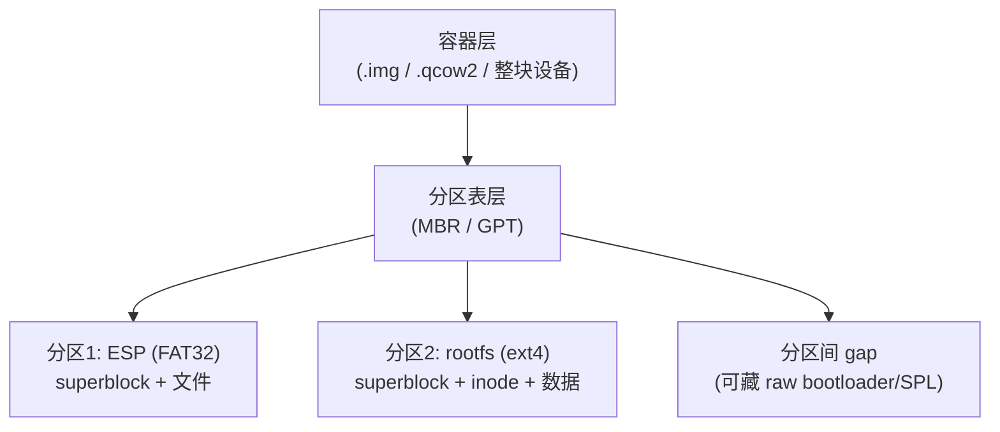
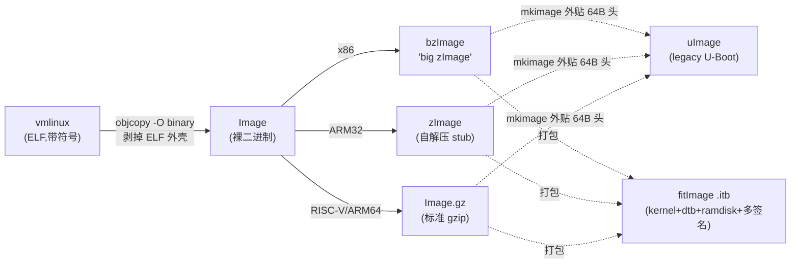

<!-- more -->

> 这篇从"一个 `.img` 文件到底是什么"开始，一路走到"它怎么变成能让板子启动的 SD 卡"。**以 RISC-V/Linux 为主线**，x86/ARM/Windows/macOS 的对应物随手科普+知识面完善。

## 0. 先破一个执念：「二进制」≠「无结构」

很多人（包括我）一开始以为：纯二进制 = `*.bin` = 一堆没有结构的 data。**错。**

> **「二进制」只是「不是文本」**——指这些字节不打算被当字符读，**和"有没有内部结构"毫无关系**。

「文本 ↔ 二进制」是一组对立（能不能当字符读）；「有结构 ↔ 无结构」是**另一个正交维度**。`.bin` 只是个约定后缀，里面可以是纯 data，**也可以**是带可执行头的内核 `Image`、带分区表+多文件系统的磁盘镜像、带自定义格式的固件……绝大多数二进制格式都有**丰富的内部结构**，只是不给人眼读。

后面你会反复看到：`file` 命令对一个文件说 `data`，**不是"它没结构"，而是"我没认出它的结构"**（没匹配到魔数）。一旦魔数出现，它立刻就认出来了。

---

## 1. 文件的「大小」是怎么回事 —— 稀疏文件（sparse）

### 1.1 `touch` vs `truncate` vs `fallocate`

这三个常被混为一谈，其实管的是**不同维度**：

| 命令 | 管什么 | 结果 |
|---|---|---|
| `touch f` | **存在性 + 时间戳** | 建 0 字节文件；或仅更新 atime/mtime，不动内容 |
| `truncate -s N f` | **大小** | 把文件设成 N 大；变大补**空洞**（稀疏），变小**截断丢数据** |
| `fallocate -l N f` | **大小 + 真实分配** | 设成 N 大且**真占盘**（无洞） |

```bash
touch empty.bin                  # size=0  占用block=0      —— 只管"存在"
touch -d '2020-01-01' empty.bin  # 只改 mtime,不动内容       —— make 增量构建/缓存失效靠它
truncate -s 10M sized.bin        # 逻辑 10M, 但 du 真占盘=0  —— 变大=补空洞(稀疏)
```

> **Windows 对应**：`fsutil file createnew f 10485760`（建指定大小）；稀疏要 `fsutil sparse setflag f`。改时间戳：PowerShell `(Get-Item f).LastWriteTime = '2020-01-01'`。
> **macOS 对应**：`mkfile -n 10m sized.bin`（`-n` = 稀疏）；`touch` 同 Linux。

### 1.2 三个「大小」别搞混：`ls -l` / `du` / `df`

这是稀疏文件的核心。三条命令量的是**三件不同的事**：

| 命令 | 量的是 |
|---|---|
| `ls -l` | 文件的**逻辑大小**（声称多大）|
| `du` | 这个文件**此刻真正占了磁盘多少块** |
| `df`（对挂载点）| 文件系统的**总容量 / 已用 / 可用** |

（我建了个 256M 镜像，造 ext4，挂载）：

```text
truncate -s 256M sparse.img
  ls -l → 268435456 (256M 逻辑)        du → 0        (稀疏,没占盘)     file → data
mkfs.ext4 sparse.img
  du → 17M (ext4 元数据:superblock+inode表+journal 是真写的)          file → ext4 filesystem
mount 后  df → Size 224M  Used 24K     (256M 设备 - ext4 元数据/保留 ≈ 224M 可用)
```

`du`=17M 和 `df` Size=224M **根本不是一个轴**：前者是"宿主盘真掏了多少"，后者是"文件系统声称有多大"。它**以为**自己有 224M，但盘上**现在只真掏了 17M**——这个差额就是稀疏。

### 1.3 写时分配（allocate-on-write）

往里写 50M，看三个数怎么变：

```text
dd if=/dev/zero of=/mnt/spx/blob bs=1M count=50 conv=fsync
  du sparse.img : 17M → 67M   (+50M, 真盘涨了)
  df Used       : 24K → 51M   (+50M)
  df Size       : 224M → 224M  (不变!)
```

**写多少真盘涨多少，文件系统总容量纹丝不动**。这就是稀疏 = 写时才分配。

### 1.4 稀疏的代价：碎片、overcommit 与稀疏感知传输

稀疏省体积（逻辑大、占盘小、分发只传有效字节），但有三笔账：

**① 碎片化** —— 洞是写时才分配，块按"写那一刻"的空闲位置挑，可能散落各处。ext4 的 extents + 延迟分配会尽量凑连续，但跨时间跳着写仍会碎。看碎片：`filefrag -v img`（列出每段 extent 与 hole）。

**② overcommit / ENOSPC（最危险）** —— 逻辑大小会"撒谎"：

```bash
truncate -s 10G huge.img     # 在只剩 200M 的盘上也成功(只是一堆洞)
```

逻辑 10G、物理只剩 200M。等你往洞里写、写到把底层盘填满那刻 → `write: No space left on device`，而且常常**写到一半才爆**。VM 磁盘镜像（raw sparse / qcow2 thin）最常踩：guest 以为有 100G、host 盘满，guest 突发 I/O 错误甚至 fs 损坏。

**③「只传有效字节」要用稀疏感知工具** —— 裸 `cp`/`dd` 默认把洞展开成 0 字节（de-sparsify），10G 逻辑一拷变占 10G 物理。保稀疏要用：

```bash
cp --sparse=always    rsync -S    tar -S    qemu-img convert
```

**对策 `fallocate`** —— `fallocate -l N f` 立刻分配、连续、无洞：没有 ENOSPC 惊吓、不碎片，代价是当场吃满空间。**swap 文件必须用它**（内核不允许 swap 走稀疏洞）。

> 选择：要小体积 / 快分发 → `truncate` 稀疏（接受 overcommit 风险）；要可靠 / 可预测 / 高性能 → `fallocate` 预留。

---

## 2. 在镜像里造文件系统 —— `mkfs.*` 家族

`mkfs.<fs>` = 在**块设备或镜像文件**上"格式化"：写下 superblock + inode 表 + 位图 + 日志等元数据布局。（上面那 17M 就是它写的。）

**常见成员**：`ext2/3/4 · fat/vfat/msdos · minix · cramfs · bfs`（`mkfs.<Tab>` 列出的就是本机已装的；装 `btrfs-progs`/`xfsprogs`/`f2fs-tools`/`exfatprogs` 等即扩充）

```text
mkfs.vfat t.img → DOS/MBR boot sector, OEM-ID "mkfs.fat"   # FAT 引导扇区(也以 55AA 收尾,跟 MBR 同族)
mkfs.ext4 t.img → Linux rev 1.0 ext4 filesystem data       # file 从 superblock 魔数认出来
```

**选型速记：**

| 场景 | 选谁 |
|---|---|
| **EFI 系统分区(ESP)** | **必须 FAT32**：`mkfs.vfat -F 32`（UEFI 固件只认 FAT）|
| Linux rootfs | ext4（或 btrfs/xfs 科普）|
| 跨 Win/Linux/相机交换 | FAT32（<4G 文件）/ exFAT（大文件）|
| 只读嵌入式 | squashfs（`mksquashfs`）/ cramfs / erofs |
| **裸 NOR/NAND flash** | **不用 mkfs.\***！用 jffs2/ubifs/littlefs（走 mtd 设备，有磨损均衡/掉电保护）|

> **Windows 对应**：`format X: /FS:FAT32` 或图形化"格式化"；分区/卷管理用 `diskpart`。
> **macOS 对应**：`diskutil eraseDisk FAT32 NAME /dev/diskN`，或底层 `newfs_msdos` / `newfs_hfs`。

---

## 3. 让"文件"变成"设备" —— loop 设备（回环设备）

### 3.1 为什么需要它

`mount` 一个 ext4/FAT 这类**块设备文件系统**，内核要的是一个**块设备**（能按扇区偏移随机读写、好去固定位置读 superblock）。但 `sparse.img` 是个**普通文件**。

**loop 设备**就是内核的"伪装适配器"：把一个普通文件**包装成块设备**，代理对应的系统调用比如ioctl，write等 `/dev/loopN`。之后对 `/dev/loopN` 的任何**扇区读写**，被 loop 驱动**翻译成对那个文件相应偏移的 `pread/pwrite`**。

```bash
sudo losetup -f --show ./sparse.img   # 找空闲 loop 并绑定 → /dev/loop0
sudo mount /dev/loop0 /mnt/spx         # 现在能挂了
# 或一步到位(mount 自己偷偷 losetup):
sudo mount -o loop ./sparse.img /mnt/spx
# 带分区表的镜像要 -P,才会冒出 /dev/loop0p1 /dev/loop0p2:
sudo losetup -fP --show ./disk.img
```

### 3.2 一个真实的坑：`umount` ≠ `losetup -d`

loop 设备**不会因为 umount 就自动解绑**——除非它带 **autoclear** 标志。

这个"手动建的 / mount 建的"区别，记在**内核里每个 loop 设备的一个 flag 位**：`LO_FLAGS_AUTOCLEAR`（定义在内核 `include/uapi/linux/loop.h`，值=4，可通过 `LOOP_SET_STATUS`/`LOOP_CONFIGURE` ioctl 设置）。

- `mount -o loop` 建 loop 时**主动贴上 AUTOCLEAR**；手动 `losetup` **不贴**。
- 内核在"块设备最后一个使用者关闭"（umount 触发）时检查这个位：**贴了就自动解绑，没贴就赖着**。

（`losetup -l` 有 AUTOCLEAR 列，肉眼可见）：

```text
sudo losetup -f ./sparse.img            → AUTOCLEAR=0   (手动建,不自动走)
sudo mount -o loop ./sparse.img /mnt/spx → AUTOCLEAR=1   (mount 建,umount 自动消失)
```

> 另一个连带发现：如果某个 loop **已经绑了同一个文件**，`mount -o loop` 会**复用它**（不重复绑定），于是**继承**它的 flag——你手动建的是 0，复用后还是 0。要拿到 fresh 的 AUTOCLEAR=1，先 `sudo losetup -d /dev/loopN` 清干净。
>
> 排错口诀：`mount -o loop` 报 `failed to setup loop device` 时，**先查路径对不对**（文件不存在也报这个，误导性极强）。

> **Windows 对应**：挂载 `.vhd/.iso` 用 PowerShell `Mount-DiskImage -ImagePath x.vhd`（卸载 `Dismount-DiskImage`），或 `diskpart` 里 `select vdisk file=... ` + `attach vdisk`。原生不认 ext4（要 WSL2 或第三方驱动）。
> **macOS 对应**：`hdiutil attach disk.img`（挂载）/ `hdiutil detach /dev/diskN`（卸载）——它一步完成 loop+mount。

---

## 4. 烧录的真相 —— `dd`、page cache 与 `sync`

### 4.1 `dd` 不是"底层直写"，`dd` vs `cp` 到底差在哪

一个超常见的误解：以为 `dd` 逐字节直写硬件、有严格地址限制，而 `cp` 只能走文件系统。**真相**：

- `dd` 和 `cp` **都走 VFS 的 `open()/write()` 系统调用**，没有谁更"底层"。
- `bs=` 控制每次 `write()` 的块大小：`bs=4M` 一次写 4MB；`bs=1` 每字节一次系统调用 → **最慢**（上下文切换开销 ≫ 数据搬运），不是"最精确"。
- 对齐/地址是**块层和文件系统**的事，跟应用层 `write()` 无关。

**那为什么烧卡传统用 `dd`？** 真实原因是 `dd` 有 **`skip= / seek= / count= / conv= / oflag=`** 精细控制——尤其 `seek=` **偏移写**（把 SPL/bootloader 烧到卡的特定偏移，`cp` 根本做不到，把XXX精确搬到里面的(x: , y: , z: )和把东西丢到里面就行还是有区别的）。系统调用层面二者没区别。

> 补一刀（整盘 vs 分区）：`/dev/sdX`（如 `/dev/sda`）是**整块盘**——一整条裸扇区，开头放分区表、里面才切出分区，它本身不是 ext4/FAT。你 `mkfs` 格式化、`mount` 挂载的，是其中的**分区** `/dev/sdX1`（如 `/dev/sda1`）。所以 `dd … of=/dev/sdX` 是往**裸盘**直接灌字节（块层只搬运、不按文件系统规则解释），才能把一个**自带分区表 + 内部文件系统**的完整镜像整盘烧进去。

### 4.2 最毒的坑：dd 跑完 ≠ 落盘（page cache + sync）

你以为 `dd` 进度条满了数据就安全了？**没有。数据还在 page cache（脏页）里**，必须 `sync`（或 `dd conv=fsync` / `oflag=direct`）才落盘。看着完成了，拔卡即丢。

（`/proc/meminfo` 的 `Dirty` = 待写回的脏页量）：

```text
基线                          Dirty 很小
dd 200M (不 fsync)            Dirty 飙向 ~200M   ← 数据还没落盘!
sync                         Dirty 掉回近 0      ← 强制回写
dd 200M oflag=direct         Dirty 基本不涨      ← O_DIRECT 绕开 page cache 直接 DMA
```

能选择 `oflag=direct`"绕开"，恰恰证明默认是"经过"page cache 的。

> **为什么块存储走 cache，外设寄存器却不走？** 别把两类"外设"混了：
> - **块存储**（SD/U盘/NVMe，`/dev/sdX`）= **数据**，走 page cache（可重读、有局部性），所以要 `sync`；
> - **MMIO 外设寄存器**（UART/GPIO/控制器寄存器）= **控制**，`ioremap` 映射成 **uncached/device 内存**、`volatile` 直读写（读一次 RX 寄存器会消费一个字节、状态寄存器自己会变，缓存它就读到陈旧值）。
>
> `dd` 写 SD 卡，大块**数据**走 page cache → DMA → flash；存储控制器的寄存器（uncached）只被驱动用来**下达 DMA 命令**。两条道分开。
> （注：若 `/tmp` 是 tmpfs(RAM 盘)，dd 进去不产生磁盘脏页，做这实验要写到真盘路径。）

### 4.3 把镜像真正送上板子（跨平台 burn）

| 平台 | 命令 / 工具 |
|---|---|
| **Linux** | `sudo dd if=os.img of=/dev/sdX bs=4M conv=fsync status=progress` 然后 `sync`（务必确认 `/dev/sdX` 是目标盘，别写错盘！`lsblk` 先看）|
| **Windows** | 图形化最稳：**Win32 Disk Imager** / **Rufus** / **balenaEtcher** / **Raspberry Pi Imager**；命令行有 `dd for Windows`（`dd if=os.img of=\\.\PhysicalDriveN bs=4M`）。看盘号用 PowerShell `Get-Disk` / `wmic diskdrive list brief` |
| **macOS** | `diskutil list` 找盘 → `diskutil unmountDisk /dev/diskN` → `sudo dd if=os.img of=/dev/rdiskN bs=4m`（注意 `rdiskN` 裸设备更快）；图形化同样可用 balenaEtcher |
| **WSL2** | 见下一节 `usbipd-win` |

### 4.4 WSL2 怎么烧卡：`usbipd-win`（USB/IP 直通）

WSL2 默认**看不到** Windows 插着的 USB 块设备。[`usbipd-win`](https://github.com/dorssel/usbipd-win) 把 Windows 的 USB 设备通过 **USB/IP** 协议**直通进 WSL2**，之后在 WSL 里就能像本地块设备一样 `dd`：

```powershell
# —— 在 Windows PowerShell(管理员) ——
usbipd list                       # 列出 USB 设备,记下 BUSID(如 2-4)
usbipd bind   --busid 2-4         # 首次共享(只需一次)
usbipd attach --wsl --busid 2-4   # 直通进 WSL2
```
```bash
# —— 在 WSL2 里 ——
lsblk                                   # 现在能看到 /dev/sdX 了
sudo dd if=os.img of=/dev/sdX bs=4M conv=fsync status=progress && sync
```
```powershell
# 用完归还给 Windows:
usbipd detach --busid 2-4
```

> 不想折腾直通，就在 Windows 侧直接用 Win32 Disk Imager / Rufus 烧——殊途同归。

---

## 5. 镜像的分层结构 —— 为什么 `dd` 整盘能启动、`cp` 文件不能

### 5.1 三层抽象

一个可启动镜像不是"一个文件系统"，而是**三层套娃**：



`cp file /mnt/...` 只搬"某个**已挂载** fs 里的文件内容"；而 `dd` 整盘复制的是**裸字节布局**——下面这些 `cp` **永远碰不到**：

> ①分区表本身(MBR/GPT header/entries) ②分区间 gap(含 raw bootloader) ③superblock ④inode bitmap ⑤block bitmap ⑥journal 日志 ⑦MBR 446 字节引导代码 ⑧任何**按绝对块号寻址**的结构

### 5.2 LBA0 不是 GPT！是 Protective MBR（实验眼见为实）

经典误解：以为 GPT 分区表从 0x0 开始。**真相**：

```text
LBA0      → Protective MBR   (保护性 MBR,兼容老工具)
LBA1      → GPT Header       (魔数 "EFI PART")
LBA2–33   → GPT 分区表项      (每项 128 字节)
```

（造个 GPT 镜像，`xxd` 看）：

```text
parted -s disk.img mklabel gpt; parted -s disk.img mkpart primary ext4 1MiB 100%

xxd 看 LBA0:
  000001c0: 0200 eeff ffff 0100 0000 ...   ← 0x1c2 = EE  (protective MBR 分区类型!)
  000001f0: ...                      55aa   ← 0x1fe = 55 aa (引导扇区签名,沿用自 MBR)
xxd 看 LBA1 (offset 512):
  00000200: 4546 4920 5041 5254 ...         ← "EFI PART"  (GPT header 魔数!)
```

**同一份字节、两个读者、两个层**：

```text
file disk.img  → DOS/MBR boot sector; partition 1 : ID=0xee ...   ← file 读 MBR 层
fdisk -l       → Disklabel type: gpt; disk.img1 ...               ← fdisk 读 GPT 层
```

这正是 **Protective MBR 的全部用途**：让**只懂 MBR 的老工具**看到"一个 0xEE 分区占满全盘"（类型不认识 → 不敢动），**保护后面的真 GPT 不被当空盘覆盖**。

> **RISC-V SD 卡典型布局**：GPT + 分区放 U-Boot/SPL（raw 或在特定偏移）+ ext4 rootfs。各 SoC 的 SPL 偏移**无统一标准**（不像 ARM sunxi 固定 8KB），**必须查芯片手册**。

> **Windows 看分区**：PowerShell `Get-Disk` / `Get-Partition` / 图形化"磁盘管理"。看 hex：`Format-Hex -Path disk.img -Count 64`。
> **macOS 看分区**：`diskutil list` / `gpt -r show /dev/diskN`；hex 同样 `xxd`。

---

## 6. 文件的「身份证」—— 魔数与 `file` 命令

### 6.1 `file` 怎么判类型

`file` 三招：① **魔数**（已知偏移的签名字节）→ ② 不匹配则判是否文本（编码启发）→ ③ 都不是就吐 `data`。

| 类型 | 魔数 | 位置 |
|---|---|---|
| ELF | `7f 45 4c 46` (`\x7fELF`) | 0 |
| PE/EXE | `4d 5a` (`MZ`) | 0 |
| gzip | `1f 8b` | 0 |
| PNG | `89 50 4e 47` | 0 |
| 脚本 shebang | `23 21` (`#!`) | 0 |
| **uImage** | `27 05 19 56` | 0 |
| **ext2/3/4 superblock** | `53 ef` (=0xEF53) | **0x438** |
| **RISC-V Image** | `52 53 43 05` (`RSC\x05`) | 0x38 |

为什么当初 `file sparse.img` 说它 ext4：

```text
xxd -s 0x438 -l 2 sparse.img → 53 ef     # 这俩字节(0xEF53 小端)就是 ext4 superblock 魔数
```

### 6.2 想让 `file` 认你自己的格式？—— 别 PR 到 Linux！

`file`/libmagic **不是 Linux 内核的一部分**，是独立项目 [`github.com/file/file`](https://github.com/file/file)。魔数库在 `magic/Magdir/*`（按类别分文件，编译成 `magic.mgc`）。

- 上游收录 → PR 到 `file/file` 的 `magic/Magdir/<类别>`；
- 但通常**根本不用 PR**——本地加即可：`~/.magic`（个人）/ `file -m mymagic yourfile`（临时）/ `/etc/magic`（系统）：

```text
# magic DSL:  偏移  类型  值  描述
0     string  MYOS     MyOS image
>8    lelong  x        \b, version %d
```
> 比如你给自己的固件 / 镜像定个格式，写几行 `~/.magic` 就能让 `file` 认出 “MyOS image, version 3”。

---

## 7. 内核镜像家族 —— 穿越系统的主角

### 7.1 加工流水线（x86/ARM/RISC-V 三线，RV 为主）

**共同起点**：`vmlinux` = **ELF** 格式、未压缩、带调试符号的完整内核。**为什么不能直接烧/跳**？它是 ELF（有头/段表/符号表），bootloader 要的是"裸的、放到内存某地址就能跑的二进制"。所以：



| | **x86（科普）** | **ARM（科普）** | **RISC-V（主场）** |
|---|---|---|---|
| 裸二进制 | — | `Image`(ARM64) | `Image`（带内核自定义 64B 头，magic `RSC\x05`）|
| 压缩 | **`bzImage`** | `zImage`(ARM32) | `Image.gz` |
| 含义 | **bz="big zImage"（≠bzip2!）**，"big"=可>512K/高位加载，破 640K 实模式限制；压缩其实是 gzip | zlib 压缩 + **自解压 stub**（开机自己解压自己）| **标准 gzip**（distro 里 `vmlinuz-x.y.z` 常就是它）|
| 走不走 | x86 专有 | ARM32 专有 | **不走 zImage/bzImage 那套**（无 ARM 自解压、无 x86 实模式包袱）|

**最后两层通用封装：**

- **uImage** = `mkimage` 外贴的 **64 字节 U-Boot legacy 头**（magic `0x27051956` + load addr + entry + arch + OS type + CRC），给 legacy `bootm` 用。单内核、无 dtb、无多配置。
- **fitImage(.itb)** = FIT(Flattened Image Tree)，用 **DTB 二进制格式**描述，打包 **kernel + dtb + ramdisk + 多 configuration + 多 hash + 多签名(verified boot)**。U-Boot 现代主推，`mkimage -f x.its` 生成。

配套命令：`booti`（RV/ARM64，认 Image 头）｜`bootm`（legacy，认 uImage `0x27051956`，也能 boot FIT）｜`bootefi`（UEFI 路径）。

### 7.2 "裸二进制也有头部？"——实拆一个 RISC-V Image

`Image` 是"裸"（相对 ELF），但它**内嵌一个自己就可执行的 64 字节头**。拆开 buildroot 编出来的真 Image：

```text
偏移                                  解码
0x00  4d 5a ───────────────  "MZ"  ← 既是 PE 的 'MZ' 魔数,又是一条无害 RISC-V 压缩指令
0x02  6f 10 60 0d ─────────  一条 j(jal) 跳转 → 跳过这 64 字节头,去真正入口
0x08  00 00 20 00 .. ──────  text_offset = 0x20_0000 = 2 MiB  ← 0x8000_0000+0x20_0000=0x8020_0000 的由来!
0x10  00 80 a8 01 .. ──────  image_size ≈ 27.8 MB
0x20  02 00 .. ────────────  header version = 2
0x30  52 49 53 43 56 ──────  "RISCV\0\0\0"  (旧 magic)
0x38  52 53 43 05 ─────────  "RSC\x05"      (magic2)
0x3c  40 00 00 00 ─────────  = 0x40,指向 PE/COFF 头偏移

file Image → PE32+ executable (EFI application) RISC-V 64-bit ... for MS Windows
```

**一个 Linux 内核被 `file` 当成 Windows EFI 程序！** 因为这个头**同时是合法 PE/COFF 头**（MZ@0 + PE 偏移@0x3c），让 **UEFI 能把内核当 `.efi` 直接启动**（EFI stub）。

"从 offset 0 执行"和"前 64 字节是结构化头"**不冲突**——头的头几字节本身就是指令（MZ=无害指令，紧跟一条 `j` 跳过头部）。一份文件：`booti` 当裸内核跳、UEFI 当 PE 加载、`file` 当 Windows 程序认。**这就是"裸二进制的可执行头"。**

### 7.3 顺带订正几个 RISC-V 启动地址的说法

- `0x8000_0000` 是 **de facto 事实标准**（源自 SiFive FU540），**不是 ISA 规范强制**；换板子必须查 datasheet。
- reset vector `0x1000` 是 **QEMU virt**（及部分真硬件 ROM）的实现选择，**不是"大多数板卡通用标准"**——真实原因是“SoC 通常在低地址放 mask ROM”。
- 真硬件的 SPL 还跑在**片上 SRAM**（上电时 DRAM 控制器没初始化，要先做 DDR 训练 - UbootSPL）；QEMU 才简化成直接在 0x8000_0000 跑。
- 接力靠寄存器约定：SBI→OS 时 `a0=hartid`、`a1=DTB 物理地址`（所有 RISC-V 固件都遵守，违反则起不来）。

---

## 8. 速查表（跨平台命令对照）

| 操作 | Linux | Windows (PowerShell/工具) | macOS |
|---|---|---|---|
| 建定大小文件 | `truncate -s 1G f` / `fallocate -l 1G f` | `fsutil file createnew f 1073741824` | `mkfile -n 1g f` |
| 造文件系统 | `mkfs.ext4` / `mkfs.vfat -F32` | `format X: /FS:FAT32` / `diskpart` | `diskutil eraseDisk` / `newfs_msdos` |
| 文件当设备挂 | `losetup -fP` + `mount` / `mount -o loop` | `Mount-DiskImage` / `diskpart attach vdisk` | `hdiutil attach` |
| 卸载 | `umount` (+`losetup -d`) | `Dismount-DiskImage` | `hdiutil detach` |
| 烧录到卡 | `dd ... conv=fsync` + `sync` | **Win32 Disk Imager** / Rufus / balenaEtcher | `dd of=/dev/rdiskN` + balenaEtcher |
| 落盘同步 | `sync` | （工具自动）| `sync` |
| 看分区表 | `fdisk -l` / `parted print` | `Get-Disk` / `Get-Partition` / 磁盘管理 | `diskutil list` / `gpt -r show` |
| 看 hex | `xxd` | `Format-Hex` | `xxd` |
| 认文件类型 | `file` | （无原生，装 `file` for Win）| `file` |
| WSL2 拿 USB | `usbipd attach --wsl --busid X-Y`（Win 侧）→ 内 `dd` | `usbipd-win` | — |

## 8b. 格式化 / 分区 / 烧录 命令大全（2026 最新最常用）

> 经验法则（2026）：跨平台交换大文件首选 **exFAT**（Linux 内核 5.4+ 原生 + `exfatprogs`，Win/mac 原生）；EFI 启动分区必须 **FAT32**；Linux 根盘 **ext4**（保守）或 **btrfs/f2fs**（新）；只读固件镜像 **squashfs(zstd)**。

### Linux —— 分区 → 格式化 → 烧录 全流程

```bash
# ① 看 & 清旧签名（换盘重做前）
lsblk -f                          # 看现有分区+fs+UUID（最常用）
sudo wipefs -a /dev/sdX           # 抹掉旧的分区表/fs 魔数，避免残留误判

# ② 建分区表（三选一）
sudo fdisk /dev/sdX               # 交互式（经典）
sudo cfdisk /dev/sdX              # TUI 图形化（新手友好）
sudo parted -s /dev/sdX mklabel gpt \
     mkpart ESP   fat32 1MiB  513MiB \
     mkpart root  ext4  513MiB 100%  set 1 esp on
sudo sgdisk -n 1:0:+512M -t 1:ef00 -c 1:ESP \
            -n 2:0:0     -t 2:8300 -c 2:root /dev/sdX   # 脚本化首选

# ③ 格式化（mkfs 家族，2026 常用）
sudo mkfs.vfat -F 32 -n BOOT /dev/sdX1        # ESP/启动分区（UEFI 只认 FAT32）
sudo mkfs.ext4 -L root /dev/sdX2              # Linux 根盘主流
sudo mkfs.exfat -n DATA /dev/sdX2             # 跨平台大文件（exfatprogs）
sudo mkfs.btrfs -L data /dev/sdX2            # CoW/快照/压缩
sudo mkfs.xfs  -L data /dev/sdX2             # 大文件/高并发
sudo mkfs.f2fs -l flash /dev/sdX2            # SD/eMMC/UFS 闪存友好
sudo mkswap /dev/sdX3 && sudo swapon /dev/sdX3   # 交换分区
mksquashfs rootfs/ ro.img -comp zstd          # 只读压缩镜像（嵌入式/initramfs）
# 通用写法：sudo mkfs -t ext4 /dev/sdX2

# ④ 烧整盘镜像
sudo dd if=os.img of=/dev/sdX bs=4M conv=fsync status=progress && sync
sudo bmaptool copy os.img.gz /dev/sdX         # 2026 快烧：只写有效块(Yocto/RPi 用)，比 dd 快数倍
```
> 现代图形/封装：GNOME **Disks**（`gnome-disks`）、`udisksctl`、systemd 的 `systemd-repart`（声明式分区）。

### Windows —— 2026 推荐 PowerShell Storage 模块（diskpart 仍可用）

```powershell
# —— PowerShell（管理员，现代首选）——
Get-Disk                                              # 看磁盘号
Clear-Disk -Number 2 -RemoveData -Confirm:$false      # 清空整盘（会抹掉全部数据）
Initialize-Disk -Number 2 -PartitionStyle GPT
New-Partition -DiskNumber 2 -UseMaximumSize -AssignDriveLetter |
  Format-Volume -FileSystem FAT32 -NewFileSystemLabel BOOT   # 也可 exFAT / NTFS
```
```bat
:: —— diskpart（经典交互，老脚本仍在用）——
diskpart
  list disk
  select disk 2
  clean
  convert gpt
  create partition primary size=512
  format fs=fat32 quick label=BOOT
  assign
:: —— cmd 单卷快速格式化 ——
format X: /FS:exFAT /Q /V:DATA
```
> 烧录镜像工具（2026 最常用，图形化最稳）：**Raspberry Pi Imager** / **balenaEtcher** / **Rufus** / **Win32 Disk Imager**；命令行 `dd for Windows`（`of=\\.\PhysicalDriveN`）。图形磁盘管理：`diskmgmt.msc`。


### macOS —— `diskutil`（2026 默认 APFS）

```bash
diskutil list                                         # 看 /dev/diskN
diskutil eraseDisk APFS  MyName        /dev/disk4      # 整盘 APFS（mac 原生默认）
diskutil eraseDisk MS-DOS BOOT MBR     /dev/disk4      # 整盘 FAT32（MS-DOS=FAT）
diskutil eraseDisk ExFAT  DATA  GPT    /dev/disk4      # 跨平台大文件
diskutil partitionDisk /dev/disk4 GPT \
         FAT32 BOOT 512MB  APFS ROOT R                 # 一条命令分区+格式化
# 底层：newfs_msdos / newfs_apfs / newfs_hfs；烧录 dd of=/dev/rdiskN 或 balenaEtcher
```

### 文件系统选型矩阵（跨平台支持）

| 文件系统 | Linux | Windows | macOS | 典型用途 |
|---|---|---|---|---|
| **FAT32** | √ | √ | √ | **EFI 系统分区(ESP)**、小卡、最大兼容（单文件<4G）|
| **exFAT** | √(5.4+) | √ | √ | 跨平台**大文件**交换（SD/U盘 2026 首选）|
| **NTFS** | √(读写 ntfs3) | √原生 | !只读 | Windows 系统盘 |
| **ext4** | √原生 | ×(需驱动/WSL) | × | Linux 根盘主流 |
| **btrfs/xfs/f2fs** | √ | × | × | CoW快照 / 大并发 / 闪存 |
| **APFS** | × | × | √原生 | macOS 系统盘 |
| **squashfs** | √只读 | × | × | 只读压缩固件/initramfs |

---

## 9. 常见坑清单（血泪）

1. **`dd` 跑完没 `sync` 就拔卡 → 数据丢**（还在 page cache）。
2. **`of=` 写错盘 → 抹掉系统盘**。烧前 `lsblk` 三确认，`/dev/sdX` 不是 `/dev/sdX1`。
3. **`umount` 后 loop 没解绑**（手动 `losetup` 无 autoclear）→ loop 设备泄漏，`losetup -a` 查、`-d` 清。
4. **`mount -o loop failed to setup loop device` → 先查文件路径**（不存在也报这个）。
5. **bzImage 的 `bz` 当 bzip2** → 是 "big zImage"。
6. **以为 LBA0 是 GPT** → 是 Protective MBR，GPT header 在 LBA1。
7. **拿 `mkfs.ext4` 往裸 NAND flash 上招呼** → 裸 flash 用 ubifs/jffs2（mtd），不是块 fs。
8. **ESP 用了 ext4** → UEFI 只认 FAT32。
9. **`/tmp` 是 tmpfs 时做 Dirty 实验失真** → 写真盘路径。

## 10. 思考题

1. 为什么 `truncate -s 0 f && truncate -s 1G f` 之后 `du f` 是 0，而 `cp f g` 之后 `du g` 也可能是 0（提示：cp 默认会不会保留空洞）？
2. 把一个 1KB 的 `hello.txt` `cp` 进已挂载的 ext4 镜像，再 `xxd` 整个镜像文件——你能在裸字节里找到 "hello" 吗？它在哪个绝对偏移？为什么 `cp` 改了镜像文件内容，却"碰不到"分区表？
3. 一个 RISC-V `Image` 既能被 `booti` 跳、又能被 UEFI 当 `.efi`——如果我把它前 2 字节的 `MZ` 改掉，分别会发生什么？
4. 为什么烧 SD 卡用 `dd` 而不用 `cp`，但烧完后校验却可以用 `cmp`/`sha256sum` 直接读 `/dev/sdX`？

---

> **小结**：穿越系统之前，先把"镜像 = 裸字节布局（容器→分区表→文件系统三层）"、"loop = 文件伪装块设备"、"dd 走 page cache 必须 sync"、"内核镜像家族是一条 vmlinux→Image→封装的加工流水线"这四件事吃透，后面上板子、调 bootloader、做 rootfs 就都有地基了。下一篇《穿越系统之前》接着讲 BIOS/SPL/SBI/Bootloader 怎么把这些镜像接力送进内核。
