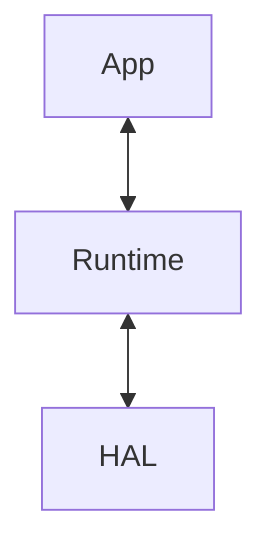
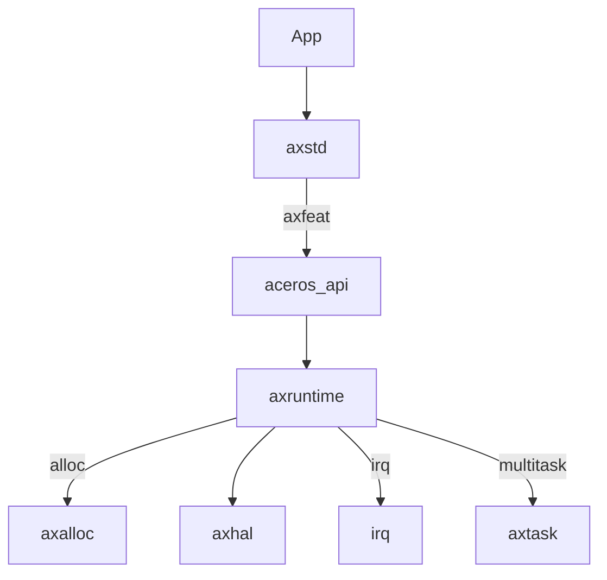

## Day-1

## Component Kernel

Based on experiment, we will construct kernel in increment by demand.

- **UniKernel**: Single S-Level, App is within kernel.

Each kernel instance can be considered as a construction based on unikernel.

- **MacroKernel**: Manage U-Level with support on multiple apps, process management etc...
- **Hypervisor**: Virtual state with restricted communication between U-level and S-level.

## Aceros Design

The design of Aceros is simple, first **HAL**(`axhal`) is the abstraction of hardware to initiation trap, stack, MMU, registers based on various architectures. Then **Runtime**(`ax*`) will be classified as many components to support various environments, like net, task, fs etc...

Each arrow is reversible, in boot, it will be from bottom to top to initiate App. Then when App call something, it will be from top to bottom to evoke functionality.

In real situation, we choose thing based on *features*. 

