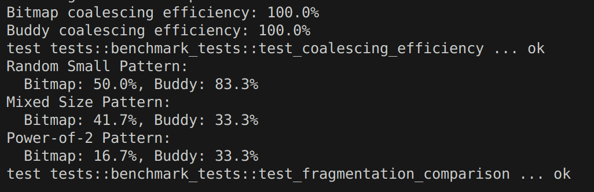

# 序言

非常高兴能参加今年的操作系统训练营，经过这四个阶段的学习，对操作系统的理解逐渐加深。在此过程中，对陈渝老师和郑友捷老师的耐心指导表示衷心感谢。

在第四阶段的学习中，我主要做了以下工作：

1. ## starry-next支持新特性：大页分配

   1. ### 后端映射实现

      1. 修改后端数据结构，为`Linear`和`Alloc`这两种映射方式增加对齐参数`align`，该参数的类型为`PageSize`。根据对齐方式，分配相应的内存块。
      2. 修改物理页帧的分配方法`alloc_frame`，以4KB为单位，根据对齐参数大小，计算页面数量`num_pages`，调用全局分配器，分配`num_pages`个连续的物理页面，将这段连续内存的地址返回并映射到页表中，作为一整个页面。
      3. 修改释放方法`dealloc_frame`，基于以上`alloc_frame`，物理页帧的释放同理，根据对齐参数，以4KB为单位，计算需要释放的物理页帧数量，并调用全局分配器，释放这一段连续的物理内存。
      4. 修改空闲内存查找方法`find_free_area`，为适配不同的对齐要求，该函数首先对建议的起始地址`hint`进行对齐，然后执行两轮扫描，第一轮扫描处理`hint`之前的区域，以确定起始搜索位置，第二轮扫描检查各内存区域之间的空隙，跳过重叠和已占用的区域，检查满足对齐要求和大小的区域，最后检查末尾区域，验证并返回找到的地址。
      5. 修改`unmap`方法，考虑取消映射的内存区域可能存在不同对齐的情况，对`unmap`方法进行改进。首先验证起始地址和大小是否满足4K对齐，然后查找定位取消映射的内存块，根据每个内存块的对齐要求，验证对齐，最后执行取消映射。
      6. 增加一个`page_iter_wraper.rs`文件，包装`PageIter4K`，`PageIter2M`，`PageIter1G`为一个`PageIterWrapper`，方便遍历。
      7. 对线性映射，文件读写，DMA和懒分配的支持，在相关函数如`new_linear`，`process_area_data`，`handle_page_fault`中增加对齐参数支持不同页面的对齐要求。

   2. ### 内存扩展

      1. 为测试大页尤其是1G大页的分配，读写和回收等情况，需要扩展平台内存以运行测例。
         1. 修改`aarch64`架构配置文件，修改其物理内存大小为4G
         2. 修改`riscv64`架构配置文件，修改其物理内存大小为4G
         3. 修改`loongarch64`架构的配置文件，扩展其物理内存，并修改其物理基址和内核基址以避免内存重叠
         4. 修改`x86_64`架构的配置文件，扩展其物理内存，在`mmio-regions`新增高地址支持，修改`modules/axhal/src/mem.rs`文件，新增free_memory_region，扩展`x86_pc`中的`multiboot.S`支持高位地址空间
      2. 扩展内存之后在所有架构下测试
      3. 将以上所做的修改工作落实成文档提交

2. ## 分析和改进axalloc

   1. 分析axalloc代码逻辑，撰写[文档](https://github.com/Ticonderoga2017/arceos_blog )
   2. 改进axalloc
      1. 新增[buddy_page.rs](https://github.com/Ticonderoga2017/arceos/blob/buddy_page/modules/axalloc/src/buddy_page.rs)，基于buddy算法，实现了一个页分配器，并添加相关的测试模块。实现思路如下：
         1. **初始化过程：**将起始地址和结束地址对齐到页边界，内存基址对齐到1G边界（与arceos的`BitmapPageAllocator`保持一致），将整个内存区域分解为最大可能的2的幂次个块。
         2. **分配算法：**检查需要分配的页面数量和页面大小，验证其是否与`PAGE_SIZE`对齐，根据所需页面数量和对齐，计算所需阶数，查找可用块，将大块分割到所需大小，将多余部分加入对应的空闲链表，标记页面为已分配，更新使用统计。
         3. **释放与合并算法：**首先标记当前块为空闲，然后递归检查伙伴块是否空闲，如果是则合并，将最终合并的块加入到对应阶数的空闲链表。
      2. 新增[tests.rs](https://github.com/Ticonderoga2017/arceos/blob/buddy_page/modules/axalloc/src/tests.rs)，提供一个基准测试模块，用于比较`BitmapPageAllocator`和`BuddyPageAllocator`两种页分配器的性能表现。该测试模块包含两个主要测试函数，用于评估不同分配器在碎片化和内存合并方面的表现 ，测试结果如下：
         1. **合并效率测试结果：**两个分配器都显示了 100% 的合并效率，这意味着它们都能完美地将释放的单页重新合并成大的连续内存块
         2. **碎片化测试结果分析：**
            - **Random Small Pattern（随机小块分配）:**
              - Bitmap: 50.0% 碎片化率
              - Buddy: 83.3% 碎片化率
              - **BitmapPageAllocator 表现更好**
            - **Mixed Size Pattern（混合大小分配）:**
              - Bitmap: 41.7% 碎片化率
              - Buddy: 33.3% 碎片化率
              - **BuddyPageAllocator 表现更好**
            - **Power-of-2 Pattern（2的幂次分配）:**
              - Bitmap: 16.7% 碎片化率
              - Buddy: 33.3% 碎片化率
              - **BitmapPageAllocator 表现更好**
