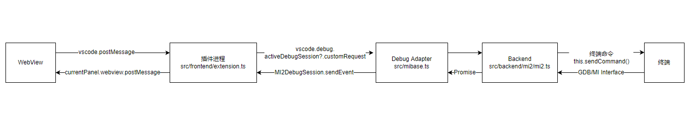
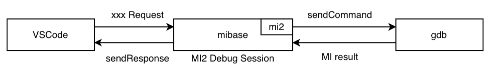
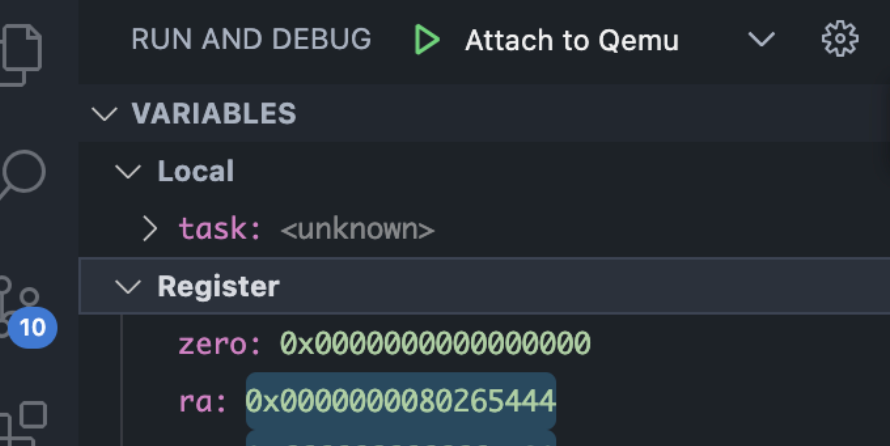
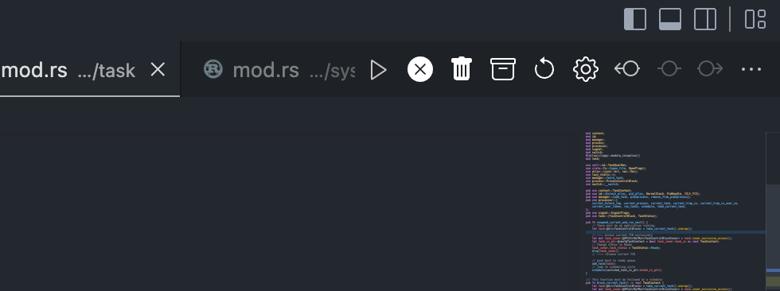

# 第二阶段报告

## 背景与已有工作
仓库地址： https://github.com/chenzhiy2001/code-debug

### VSCode Debugger Extension

VSCode 为了方便图形化地调试（而不是在终端里手输命令去获取信息），提供了一套对 Debugger 的 UI 支持，但是不同的语言有不同的调试器，无法直接让 UI 去调用相应调试器，因此 VSCode 提出了 Debug Adapter 作为 UI 与 Debugger 的连接桥梁，一个调试器插件就是一个实现了这样一套接口的对象，其协议叫做 Debug Adapter Protocol。

<!-- more -->


需要注意的是：上图三个部分都是单独的进程，因此之间的通信其实都是进程间通信。

比如说这个 DA 对象里有一个 variablesRequest 的方法，当调试器暂停时，VSCode 就会自动调用插件开发者实现的 variablesRequest 方法，来获得变量的值，而这个插件开发者在这个方法里实现的内容就是，从对应语言的调试器里获取某些变量的值，然后返回给 VSCode，从而显现我们平时调试时左上角见到的变量值。

虽然语言不同，但是我们使用 VSCode 进行 Debug 的流程是不变，也就是变量展示、step in、step over 等等这些都应该有。

所以一个 Debug Adapter 其实就是要实现下面这些方法，那么就能流畅地 debug 了（其实也可以不用全部实现，按需即可）

```js
    protected sendErrorResponse(response: DebugProtocol.Response, codeOrMessage: number | DebugProtocol.Message, format?: string, variables?: any, dest?: ErrorDestination): void;
    runInTerminalRequest(args: DebugProtocol.RunInTerminalRequestArguments, timeout: number, cb: (response: DebugProtocol.RunInTerminalResponse) => void): void;
    protected dispatchRequest(request: DebugProtocol.Request): void;
    protected initializeRequest(response: DebugProtocol.InitializeResponse, args: DebugProtocol.InitializeRequestArguments): void;
    protected disconnectRequest(response: DebugProtocol.DisconnectResponse, args: DebugProtocol.DisconnectArguments, request?: DebugProtocol.Request): void;
    protected launchRequest(response: DebugProtocol.LaunchResponse, args: DebugProtocol.LaunchRequestArguments, request?: DebugProtocol.Request): void;
    protected attachRequest(response: DebugProtocol.AttachResponse, args: DebugProtocol.AttachRequestArguments, request?: DebugProtocol.Request): void;
    protected terminateRequest(response: DebugProtocol.TerminateResponse, args: DebugProtocol.TerminateArguments, request?: DebugProtocol.Request): void;
    protected restartRequest(response: DebugProtocol.RestartResponse, args: DebugProtocol.RestartArguments, request?: DebugProtocol.Request): void;
    protected setBreakPointsRequest(response: DebugProtocol.SetBreakpointsResponse, args: DebugProtocol.SetBreakpointsArguments, request?: DebugProtocol.Request): void;
    protected setFunctionBreakPointsRequest(response: DebugProtocol.SetFunctionBreakpointsResponse, args: DebugProtocol.SetFunctionBreakpointsArguments, request?: DebugProtocol.Request): void;
    protected setExceptionBreakPointsRequest(response: DebugProtocol.SetExceptionBreakpointsResponse, args: DebugProtocol.SetExceptionBreakpointsArguments, request?: DebugProtocol.Request): void;
    protected configurationDoneRequest(response: DebugProtocol.ConfigurationDoneResponse, args: DebugProtocol.ConfigurationDoneArguments, request?: DebugProtocol.Request): void;
    protected continueRequest(response: DebugProtocol.ContinueResponse, args: DebugProtocol.ContinueArguments, request?: DebugProtocol.Request): void;
    protected nextRequest(response: DebugProtocol.NextResponse, args: DebugProtocol.NextArguments, request?: DebugProtocol.Request): void;
    protected stepInRequest(response: DebugProtocol.StepInResponse, args: DebugProtocol.StepInArguments, request?: DebugProtocol.Request): void;
    protected stepOutRequest(response: DebugProtocol.StepOutResponse, args: DebugProtocol.StepOutArguments, request?: DebugProtocol.Request): void;
    protected stepBackRequest(response: DebugProtocol.StepBackResponse, args: DebugProtocol.StepBackArguments, request?: DebugProtocol.Request): void;
    protected reverseContinueRequest(response: DebugProtocol.ReverseContinueResponse, args: DebugProtocol.ReverseContinueArguments, request?: DebugProtocol.Request): void;
    protected restartFrameRequest(response: DebugProtocol.RestartFrameResponse, args: DebugProtocol.RestartFrameArguments, request?: DebugProtocol.Request): void;
    protected gotoRequest(response: DebugProtocol.GotoResponse, args: DebugProtocol.GotoArguments, request?: DebugProtocol.Request): void;
    protected pauseRequest(response: DebugProtocol.PauseResponse, args: DebugProtocol.PauseArguments, request?: DebugProtocol.Request): void;
    protected sourceRequest(response: DebugProtocol.SourceResponse, args: DebugProtocol.SourceArguments, request?: DebugProtocol.Request): void;
    protected threadsRequest(response: DebugProtocol.ThreadsResponse, request?: DebugProtocol.Request): void;
    protected terminateThreadsRequest(response: DebugProtocol.TerminateThreadsResponse, args: DebugProtocol.TerminateThreadsArguments, request?: DebugProtocol.Request): void;
    protected stackTraceRequest(response: DebugProtocol.StackTraceResponse, args: DebugProtocol.StackTraceArguments, request?: DebugProtocol.Request): void;
    protected scopesRequest(response: DebugProtocol.ScopesResponse, args: DebugProtocol.ScopesArguments, request?: DebugProtocol.Request): void;
    protected variablesRequest(response: DebugProtocol.VariablesResponse, args: DebugProtocol.VariablesArguments, request?: DebugProtocol.Request): void;
    protected setVariableRequest(response: DebugProtocol.SetVariableResponse, args: DebugProtocol.SetVariableArguments, request?: DebugProtocol.Request): void;
    protected setExpressionRequest(response: DebugProtocol.SetExpressionResponse, args: DebugProtocol.SetExpressionArguments, request?: DebugProtocol.Request): void;
    protected evaluateRequest(response: DebugProtocol.EvaluateResponse, args: DebugProtocol.EvaluateArguments, request?: DebugProtocol.Request): void;
    protected stepInTargetsRequest(response: DebugProtocol.StepInTargetsResponse, args: DebugProtocol.StepInTargetsArguments, request?: DebugProtocol.Request): void;
    protected gotoTargetsRequest(response: DebugProtocol.GotoTargetsResponse, args: DebugProtocol.GotoTargetsArguments, request?: DebugProtocol.Request): void;
    protected completionsRequest(response: DebugProtocol.CompletionsResponse, args: DebugProtocol.CompletionsArguments, request?: DebugProtocol.Request): void;
    protected exceptionInfoRequest(response: DebugProtocol.ExceptionInfoResponse, args: DebugProtocol.ExceptionInfoArguments, request?: DebugProtocol.Request): void;
    protected loadedSourcesRequest(response: DebugProtocol.LoadedSourcesResponse, args: DebugProtocol.LoadedSourcesArguments, request?: DebugProtocol.Request): void;
    protected dataBreakpointInfoRequest(response: DebugProtocol.DataBreakpointInfoResponse, args: DebugProtocol.DataBreakpointInfoArguments, request?: DebugProtocol.Request): void;
    protected setDataBreakpointsRequest(response: DebugProtocol.SetDataBreakpointsResponse, args: DebugProtocol.SetDataBreakpointsArguments, request?: DebugProtocol.Request): void;
    protected readMemoryRequest(response: DebugProtocol.ReadMemoryResponse, args: DebugProtocol.ReadMemoryArguments, request?: DebugProtocol.Request): void;
    protected writeMemoryRequest(response: DebugProtocol.WriteMemoryResponse, args: DebugProtocol.WriteMemoryArguments, request?: DebugProtocol.Request): void;
    protected disassembleRequest(response: DebugProtocol.DisassembleResponse, args: DebugProtocol.DisassembleArguments, request?: DebugProtocol.Request): void;
    protected cancelRequest(response: DebugProtocol.CancelResponse, args: DebugProtocol.CancelArguments, request?: DebugProtocol.Request): void;
    protected breakpointLocationsRequest(response: DebugProtocol.BreakpointLocationsResponse, args: DebugProtocol.BreakpointLocationsArguments, request?: DebugProtocol.Request): void;
    protected setInstructionBreakpointsRequest(response: DebugProtocol.SetInstructionBreakpointsResponse, args: DebugProtocol.SetInstructionBreakpointsArguments, request?: DebugProtocol.Request): void;
 
```

### code-debug

这个项目 fork 自一个针对 gdb debugger 的实现，使用 GDB/MI 协议与 dgb server 进行通信。

重要的文件（需要关注的）结构如下：
```
src/
├── backend
│   ├── backend.ts
│   ├── gdb_expansion.ts
│   ├── mi2
│   │   └── mi2.ts
│   └── mi_parse.ts
├── frontend
│   ├── consts.ts
│   └── extension.ts
├── gdb.ts
├── mibase.ts
```

其中 mibase 是整个 Debug Adapter 的实现，后端的 mi2 负责直接对 gdb 进行通信，是 DA 的一个成员，而 frontend 是 VSCode 前端的实现，负责 VSCode 跟 DA 进行的通信。

### 原有工作

详见 https://github.com/chenzhiy2001/code-debug



使用一个 WebView 来展示信息（如寄存器、内存、断点）、提供命令按钮（清除断点、在用户态/内核态出入口设断点）

要将数据展示给用户，需要创建一层 WebView 的视图，通过

1. WebView 向 VSCode 发送信息
2. VSCode 向调试器（Debug Adapter，在 code-debug 里作为一个 DebugSession 存在）发送请求，即 sendRequest
3. DA 向 gdb 发送命令，即 sendCommand
4. dgb 向 DA 返回 MI 格式的命令
5. DA 向 VSCode 发送响应，即 sendResponse
6. VSCode 向 WebView 发送消息
7. WebView 通过事件监听获得消息并渲染数据

## 第二阶段实现工作
### 仓库规范化
原本仓库没有统一的 lint 与 formatter，使得大家开发的时候无法遵循统一的代码规范，有两个缺点：

1. 随着开发，代码可读性会下降（如有些换行有些不换行）
2. 开发者自己格式化的时候使用默认 formatter 会误伤别人代码，导致 commit 不清

因此有个规范对于开源项目而言应当是重要的，我模仿原有仓库的风格，定制了一个格式化文件，保证与原来保持较大的相同

```json
{
  "proseWrap": "always",
  "tabWidth": 2,
  "useTabs": true,
  "semi": true,
  "arrowParens": "always",
  "singleQuote": false,
  "endOfLine": "lf",
  "printWidth": 100
}
```

### WebView 到 TreeView 的迁移

原有 WebView 来实现信息的传递有比较高的自由度，忽略了 VSCode 本身就有 debugger 界面的支持， 因此最外层 WebView 与 VSCode 的交互会显得比较冗余，因此优化方案是使用 TreeView 来完全取代 WebView 的 功能，使其更像一个 debugger，提高用户体验。



修改后架构如上，主要改动是砍掉了 WebView 的内容，将其功能直接适配 VSCode ，这个改动包括输入和输出部分。

#### 输出

原本的输出包括三部分：寄存器、内存、断点

输出解决的是 VSCode 如何把 gdb 的数据展示给用户的问题，原本使用 WebView 就是显示在内嵌的网页上，将其迁移至 TreeView 就是显示在左边变量栏上。

这点 VSCode 是通过 variablesRequest 实现的，在任意 debugger 暂停时， VSCode 都会自动向插件开发者实现的 Debug Adapter 发送 variablesRequest 请求，然后由这个函数去获取变量相关信息并返回给 VSCode，那么我们要输出寄存器的值，就只修改 variableRequest 实现，使其能获取寄存器的值并直接返回给 VSCode 而不是给 WebView 就行了。

核心代码：

```js
if (variableHandle.name === "Register") {
	const regValues = await this.miDebugger.getRegistersValue();
	const regs = regValues.map((item) => {
		// item[0] is ['name', 'xxx']
		const nameIdx = parseInt(item[0][1]);
		if (isNaN(nameIdx)) {
			this.sendErrorResponse(response, 1, `Could not expandvariable: ${item[0][1]}`);
			return;
		}
		return {
			name: RISCV_REG_NAMES[nameIdx],
			value: item[1][1], // item[1] is ['value', 'xxx']
			variablesReference: 0, // not a object, cannot beexpended
		};
	});
	response.body = {
		variables: regs,
	};
	this.sendResponse(response);
	return;
}
```

其中 variableHandle 表示请求的这个 Scope 是谁，如下图，Local 和 Register 都是一个 Scope，在请求 variablesRequest 时，参数会附上请求的 Scope 的信息，因为是可以折叠的，所以处于闭合状态的 Scope 不会被申请到。

对于申请寄存器相关数据，逻辑与原来差不多，申请后将 response 发送给 VSCode 即可（还记得 VSCode 跟 DA 是两个进程吗？所以使用 send 的方式，而不是函数返回，因为这是进程间的通信）



内存的展示部分由 @myrfy 实现了，借助一个内存查看的插件工具 HexEdit 做到查看内存。而断点的有 VSCode 原生支持，因此主要就只做了寄存器的。

#### 输入

前面讲的是输出方面的，这节介绍输入的变动，WebView 的另一个功能是实现命令按钮，比如点一下
删除全部断点等等，如何直接做到 VSCode 里？

原本提供了五个用户界面功能按钮：

| 名称 	| 功能 	|  	|  	|  	|
|---	|---	|---	|---	|---	|
| removeDebugFile 	| 去除调试信息文件 	|  	|  	|  	|
| setKernelInOutBreakpoints 	| 设置内核态到用户态，用户态到内核态的边界处的断点 	|  	|  	|  	|
| removeAllCliBreakpoints 	| 重置按钮。清空编辑器，Debug Adapter, GDB中所有断点信息 	|  	|  	|  	|
| disableCurrentSpaceBreakpoints 	| 令GDB清除当前设置的断点且不更改Debug Adapter中的断点信息 	|  	|  	|  	|
| updateAllSpacesBreakpointsInfo 	| 手动更新断点信息表格 	|  	|  	|  	|

将其迁移至文件右上的 navigation 中




每个文件打开时右上角常常可以看到按钮，这些也是可自定义编辑的


点击按钮理应产生一个命令，我们往 package.json 的 contributes.commands 中注册命令，即可

```json
{
	"commands": [
		{
			"command": "code-debug.removeAllCliBreakpoints",
			"title": "Remove All Cli Breakpoints",
			"icon": {
				"dark": "images/remove-all-cli-breakpoints-dark.svg",
				"light": "images/remove-all-cli-breakpoints-light.svg"
			}
		}
	]
}
```

之后注册按钮，按钮在 package.json 的 contributes.menus 中注册，不同区域位于不同的 menu 中，其中右上
角所在的位置为 editor/title，当 group 为 navigation 时会显示在右上，否则折叠起来在最右上角的 `···`
中

```json
{
	"menus": [
		"editor/title": [
			{
				"when": "resourceLangId == rust",
				"command": "code-debug.removeAllCliBreakpoints",
				"group": "navigation"
			}
		]
	]
}
```

## 尚未完成

- 对于变量的数据展示

  - 现在都是使用 \<unknown\> 占位

- watchpoint 支持
- 通过代码为 VSCode 视图加断点
  - 研究了很多文档与问答，发现 VSCode 确实无法支持此功能，没有提供 API

## 感想
- 第一次参加开源社区的活动
- 需要读很多的代码，找出改进点
- Debug Adapter 的设计很妙，扩展性极强，对以后写代码很有指导意义
- 不足：工作局限在前端，跟 VSCode 关系更大，反而跟 OS 没什么关系

## 参考
- https://code.visualstudio.com/api/extension-guides/debugger-extension Debugger 的官方文档，带着做一个 Markdown 调试器，很不错的文档
- https://sourceware.org/gdb/onlinedocs/gdb/GDB_002fMI.html GDB/MI 协议的文档，推荐下载一个离线版的，方便翻
